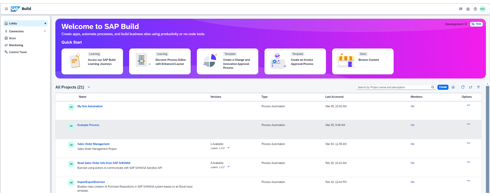

# 🌸 2 [CREATING THE PROCESS PROJECT](https://learning.sap.com/learning-journeys/create-processes-and-automations-with-sap-build-process-automation/creating-the-process-project_a3990392-d0e3-473d-9608-64b6629ed311)

> 🌺 Objectifs
>
> - [ ] Create the process project

## 🌸 THE PROCESS PROJECT

`SAP Build Process Automation` est un service `SAP BTP` qui vous permet de **créer**, d'**exécuter**, d'**automatiser** et de **surveiller** vos processus métier sur une seule interface grâce à des fonctionnalités **low-code/no-code**.

Après vous être abonné à `SAP Build Process Automation`, vous pouvez créer et gérer des projets dans le **lobby**.

> Ce lobby inclut les projets que vous avez créés, ceux partagés avec vous ou ceux que vous avez importés depuis des sources externes ou la boutique.

Avec un abonnement `SAP Build Process Automation`, vous pouvez créer et gérer deux types de projets :

#### 💮 Business Process Project :

**Créez**, **déployez**, **automatisez** et **exécutez** des **processus métier** digitaux en configurant des **artefacts** de processus.

Exemples de projets de processus métier :

- demandes d'investissement,

- approbations de factures,

- approbations de commandes clients.

#### 💮 Actions Project :

Intégrez des compétences et des capacités externes à vos projets de **processus métier** en téléchargeant un **fichier de spécification d'API** ouvert au format .**json**.

Les projets d'actions permettent aux systèmes et solutions externes de communiquer avec `SAP Build Process Automation`.

Dans cette leçon, vous apprendrez à créer un projet de processus et à créer des formulaires interactifs pour collecter et partager des informations pendant l'exécution d'un processus. Les formulaires peuvent ensuite servir de déclencheur pour un processus et être ajoutés comme étapes supplémentaires à ce même processus.

## 🌸 CREATE A PROCESS PROJECT

### BUSINESS SCENARIO

Maintenant que vous êtes familiarisé avec le produit, il est temps de commencer à créer votre premier projet `SAP Build Process Automation` en configurant le projet de processus dans l'outil. Utilisez les projets de processus comme conteneur pour regrouper les artefacts associés, tels que les processus, les formulaires, les automatisations, les décisions, etc. Il existe généralement trois types de projets de processus que vous pouvez créer à ce niveau :

- Projet de **processus métier** : pour créer, déployer et exécuter des processus ;

- Projet d'actions : pour communiquer avec des systèmes externes ;

- Automatisation des tâches : pour créer et exécuter des robots.

Dans cet exercice, vous allez créer un projet de **processus métier**. Une fois cette première étape terminée, vous serez prêt à travailler avec les formulaires, les conditions, les décisions, etc.

### EXERCISE OPTIONS

Pour démarrer l'exercice, sélectionnez « Démarrer l'exercice » dans la figure ci-dessous.

Une fenêtre contextuelle s'ouvre. Vous disposez des options suivantes :

- Choisir « Démarrer » : la simulation démarre. Suivez la simulation pour apprendre à activer le contenu d'automatisation des processus.

- Choisir « Ouvrir un document PDF » : un PDF s'ouvre. En suivant les étapes décrites dans ce document, vous pouvez réaliser l'exercice dans votre environnement système.

[Exercise](https://learnsap.enable-now.cloud.sap/pub/mmcp/index.html?show=project!PR_930102AB0420098D:uebung)

[PDF](./assets/hands_on.pdf)
