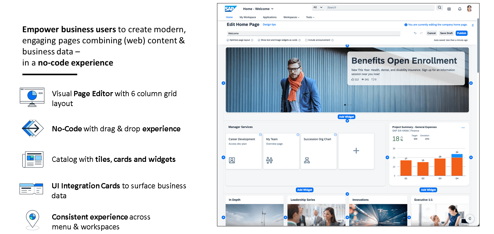
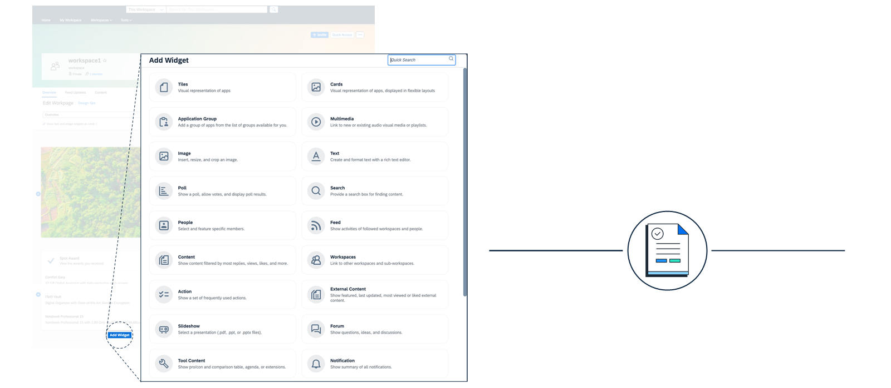
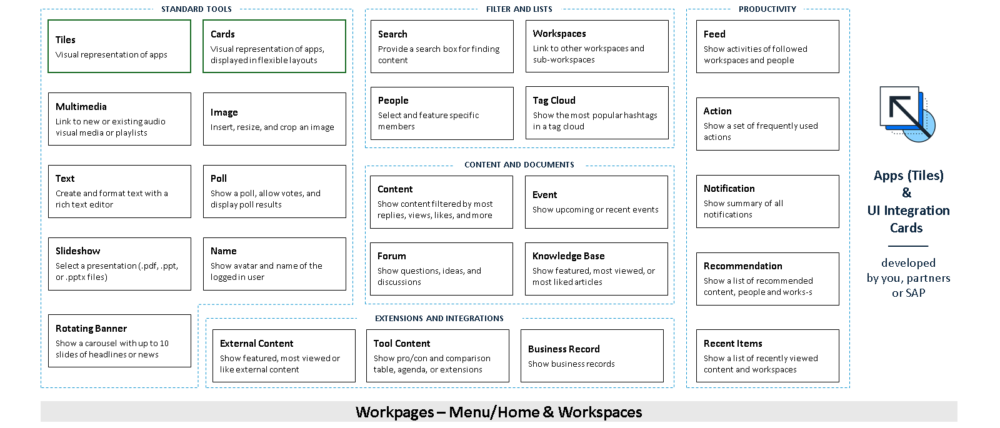
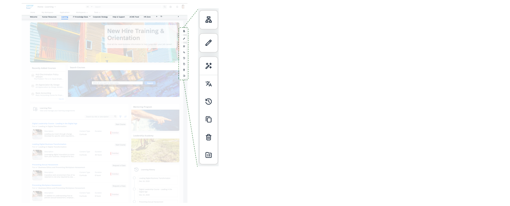

# 🌸 3 [MANAGING WORSPACE](https://learning.sap.com/learning-journeys/designing-sap-build-work-zone/managing-**workpages**)

> 🌺 Objectifs
>
> - [ ] Créez, personnalisez et gérez des **WorkPages** pour fournir aux utilisateurs des pages interactives adaptées à leurs besoins.
>
> - [ ] Utilisez les **WorkPages** pour héberger une variété de contenus, notamment des applications, des widgets et des cartes d'interface utilisateur, améliorant ainsi l'efficacité de l'espace de travail numérique.

## 🌸 WORKPAGES

Les **WorkPages** sont des **pages** hautement **personnalisables** qui constituent des environnements **dynamiques** permettant aux utilisateurs d'**interagir** avec diverses **applications**, **informations** et **outils**.

Conçues pour offrir une expérience utilisateur personnalisée, elles permettent l'**intégration de contenus** variés via des **widgets** et des **cartes**. Accessibles directement depuis le **menu du site** ou les **WorkSpaces**, les **WorkPages** offrent une **interface flexible et interactive** permettant aux utilisateurs d'effectuer leurs tâches efficacement.

## 🌸 KEY FEATURES OF **WORKPAGES**

- **Customizable Layout** : Les créateurs peuvent concevoir la mise en page de leurs **WorkPages** et choisir la meilleure organisation du contenu pour répondre aux besoins de leurs utilisateurs. Les **WorkPages** sont présentées sous forme de grille, composée de sections, chacune pouvant comporter jusqu'à six colonnes pour ajouter du contenu.

- **Integration of Widgets and Cards** : Les **WorkPages** peuvent héberger divers widgets et cartes d'intégration d'interface utilisateur, permettant l'affichage de contenu riche et interactif.

## 🌸 CONTENT OF **WORKPAGES**

Informations sur le catalogue de widgets :

- Utilisez des **tuiles**, des **cartes** et des **widgets** pour organiser la **mise en page** de vos pages, quel que soit l'objectif et la complexité : page d'accueil de l'entreprise, pages d'informations sur les services (par exemple, informatique, RH, installations), campagnes marketing, espaces de collaboration d'équipe, etc.

- Profitez de divers widgets et cartes **standard** et **prêts à l'emploi** : pages wiki, sondages, contenu multimédia, texte simple, tâches, flux, événements.

## 🌸 CREATING AND MANAGING **WORKPAGES**

Créer une **page de travail** implique de sélectionner une mise en page de base, de nommer la page, puis d'ajouter et de configurer des widgets et des cartes pour enrichir la page. Les administrateurs peuvent définir des autorisations pour contrôler l'accès à chaque page de travail, garantissant ainsi que seuls les utilisateurs concernés peuvent consulter ou modifier le contenu.

L'éditeur de **WorkPages** vous permet de :

- **Créez** et **modifiez** des **pages** grâce à un **éditeur intégré** riche et visuel, simple d'utilisation grâce au glisser-déposer.

- Config**u**rez des **traductions**, **suivez** les modifications et les **versions**, et modifiez la mise en page en ajoutant des tuiles, des cartes et des widgets.

- Modifiez et visualisez le résultat immédiatement, **sans compétences en développement**.
