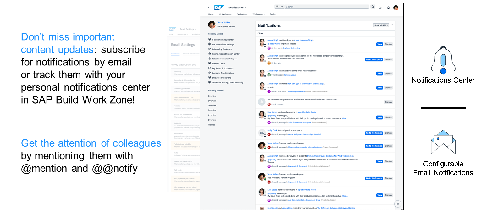

# 🌸 6 [NAVIGATION USER SETTINGS AND FEATURES IN THE `SAP BUILD WORK ZONE` HEADER BAR](https://learning.sap.com/learning-journeys/designing-sap-build-work-zone/navigating-user-settings-and-features-in-the-sap-build-work-zone-header-bar)

> 🌺 Objectifs
>
> - [ ] Configure user settings from the `SAP Build Work Zone` header bar, including theme or display settings and language and formatting preferences.
>
> - [ ] Utilize features available in the header bar, such as notifications and search functionality, to enhance the user experience

## 🌸 USER SETTINGS CONFIGURATIONS

La barre d'en-tête de `SAP Build Work Zone` sert de point central pour accéder aux différents paramètres et fonctionnalités utilisateur. Elle offre une interface simplifiée et intuitive permettant aux utilisateurs de personnaliser leur expérience et de gérer les paramètres de leur compte. Elle se situe au-dessus du **Site Menu**, abordé dans une leçon précédente de cette unité.

> Cette leçon explore les fonctionnalités disponibles dans la barre d'en-tête, en se concentrant sur les privilèges utilisateur, les paramètres et la façon d'adapter l'environnement `SAP Build Work Zone` à leurs besoins spécifiques.

### USER PRIVILEGES AND SETTINGS

`SAP Build Work Zone` s'adapte à un large éventail d'utilisateurs, y compris des personnes internes et externes, chacune disposant de privilèges d'accès spécifiques :

#### 💮 **Internal Users** :

- **Administrators** : Disposent de privilèges complets pour ajouter du contenu, créer des **WorkSpaces**, gérer les utilisateurs et configurer la plateforme.

- **Key Users** : Désignés pour ajouter du contenu, créer des **WorkSpaces** et avoir plus de responsabilités que les utilisateurs finaux.

- **External Users** : Utilisent `SAP Build Work Zone` pour leurs tâches quotidiennes, en accédant uniquement aux **WorkSpaces** auxquels ils ont été invités.

#### 💮 **External Users** :

Les utilisateurs externes, non employés par l'entreprise, peuvent rejoindre des **WorkSpaces** spécifiques sur invitation et accéder aux éléments de menu externes ou à leurs profils d'utilisateur.

> Les utilisateurs internes bénéficient de privilèges d'accès plus étendus, notamment la possibilité de gérer les **WorkSpaces**, de rechercher et d'inviter des membres, et d'accéder à des zones spéciales comme le panneau d'administration du menu du site. Les utilisateurs internes et externes peuvent accéder aux **WorkSpaces** avec certaines restrictions, gérer leurs profils et recevoir des notifications et des mises à jour.

Regardez la vidéo suivante sur les privilèges et les paramètres utilisateur :

[Référence - Link Video](https://learning.sap.com/learning-journeys/designing-sap-build-work-zone/navigating-user-settings-and-features-in-the-sap-build-work-zone-header-bar)

### ACCESSING YOUR ACCOUNT SETTINGS

Configurer votre environnement `SAP Build Work Zone` est simple et personnalisé. Pour accéder aux paramètres de votre compte :

- **Ouvrir le menu « Actions utilisateur »** : Cliquez sur votre avatar en haut à droite de la barre de menu supérieure pour afficher le menu « Actions utilisateur ».

- **Accéder aux paramètres** : Sélectionnez « Paramètres » dans le menu déroulant pour accéder aux paramètres de votre compte.

## 🌸 FEATURES IN THE HEADER BAR

Paramètres configurables :

- **Theme or Display Settings** : Personnalisez l'apparence visuelle de votre espace de travail pour une expérience personnalisée.

- **Application(s)** : Définissez vos applications préférées dans les catalogues de l'écran « Applications » pour un accès rapide.

- **Language and Formatting Preferences** : Choisissez parmi une liste de langues, de formats de date et d'heure préférés en fonction de vos préférences régionales.

- **Advanced Features** : Ajustez la fréquence des notifications de l'espace de travail, personnalisez le filtrage des flux, définissez les préférences de calendrier, configurez les alertes d'absence et bien plus encore pour optimiser votre environnement de travail.

### FEATURES AVAILABLE IN THE HEADER BAR

La barre d'en-tête de `SAP Build Work Zone` ne sert pas uniquement à accéder aux paramètres utilisateur ; elle offre un accès rapide à plusieurs fonctionnalités clés :

Notifications : Restez informé grâce aux alertes en temps réel sur les mises à jour, les invitations et autres activités pertinentes dans `SAP Build Work Zone`, ainsi qu'aux notifications par e-mail.

Alternativement, ces notifications natives peuvent être désactivées et remplacées par une intégration au service de notifications central. Ce point sera abordé plus en détail plus tard dans la formation.

- **Fonctionnalité de recherche** : Trouvez rapidement des **WorkSpaces**, du contenu et des applications grâce à la fonction de recherche intégrée.

- **Accès à l'application mobile** : Les utilisateurs internes et externes peuvent utiliser l'application mobile `SAP Build Work Zone` pour un accès mobile, garantissant ainsi une productivité optimale.

La barre d'en-tête et les paramètres utilisateur de `SAP Build Work Zone` offrent un accès à un espace de travail numérique hautement personnalisable et performant. En comprenant et en utilisant les fonctionnalités et paramètres disponibles, les utilisateurs peuvent personnaliser leur expérience en fonction de leur style de travail et de leurs préférences, améliorant ainsi leur productivité et leur satisfaction au sein de la plateforme.
