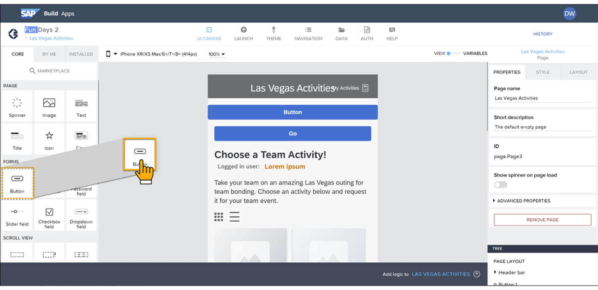

# 🌸 1 [EXPLAINING `SAP BUILD APPS`](https://learning.sap.com/learning-journeys/develop-apps-with-sap-build-apps-using-drag-and-drop-simplicity/explaining-sap-build-apps-_a111bd77-7cbd-49fc-a412-63f6b8d9b8b6)

> 🌺 Objectifs
>
> - [ ] Discutez des utilisations des applications SAP Build.
>
> - [ ] Décrivez les principales fonctionnalités de `SAP Build Apps`.

## 🌸 USES OF SAP BUILD APPS

`SAP Build Apps` (anciennement` SAP AppGyver`) est une **visual development solution** permettant de créer des applications d'entreprise sans code. Elle vous permet de :

- Créer des applications by **dragging and dropping pre-built components**, puis de les **configurer** selon vos besoins ;

- Se connecter à toutes les formes de **back-end data**, telles que les **REST** et **OData services**, y compris les **SAP systems**, via un **simple form**, puis afficher ou utiliser les données pour des calculs ;

- Créer une **application logic** by **dragging and dropping flow functions** et leur configuration. La logique vous permet d'indiquer à l'application ce qu'elle doit faire en réponse aux **user** ou aux **app events**.

## 🌸 KEY FEATURES OF SAP BUILD APPS

En plus des principales fonctionnalités de création d'applications, il existe de nombreuses fonctionnalités qui facilitent la création d'extensions SAP et d'autres applications liées à SAP :

#### 💮 **SAP BTP Authentication** :

Vous pouvez rendre mandatory l'authentification des utilisateurs auprès de SAP BTP avant d'utiliser l'application. Cette authentification est requise pour de nombreuses autres fonctionnalités, comme le référencement des **destinations SAP BTP**.

#### 💮 **Destinations** :

Les **destinations** sont des connexions aux systèmes back-end, souvent des systèmes SAP, définies dans **SAP BTP** pour être utilisées par les **services SAP BTP**. **`SAP Build Apps`** connaît les destinations définies dans **SAP BTP cockpit** et peut créer des ressources de données (c'est-à-dire des connexions aux systèmes back-end) basées sur ces destinations. [SAP Systems](https://help.sap.com/docs/build-apps/service-guide/sap-systems) décrit comment configurer des destinations pour **`SAP Build Apps`**.

#### 💮 **Déploiement sur SAP BTP** :

**`SAP Build Apps`** vous permet de déployer votre application sur **SAP BTP**. **`SAP Build Apps`** vous permet de créer votre projet dans un **fichier MTAR**, un fichier d'application reconnu par l'environnement [SAP BTP Cloud Foundry](../☼%20UNIT%200%20-%20Lexicon/♠%20Cloud%20Foundry.md), puis de l'envoyer pour déploiement dans SAP BTP.

### MORE ADVANCES FEATURES

**`SAP Build Apps`** dispose également de fonctionnalités plus sophistiquées permettant aux utilisateurs professionnels et aux développeurs plus avancés de tirer le meilleur parti de la plateforme.

[Référence - Link Video](https://learning.sap.com/learning-journeys/develop-apps-with-sap-build-apps-using-drag-and-drop-simplicity/explaining-sap-build-apps-_a111bd77-7cbd-49fc-a412-63f6b8d9b8b6)
