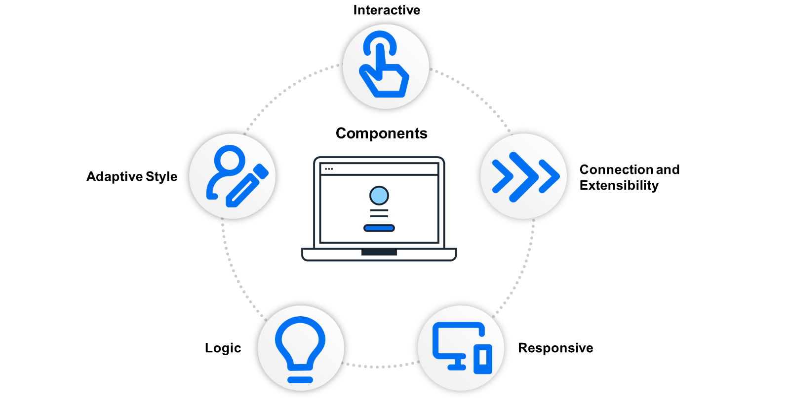
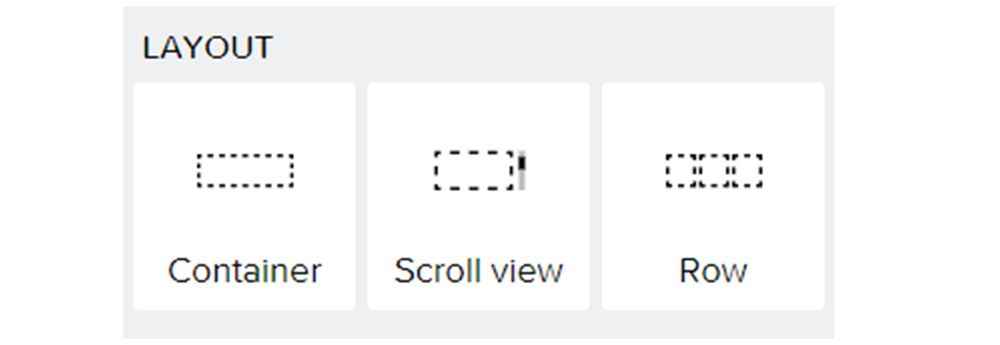

# 🌸 1 [EXPLORING FUNDAMENTALS OF COMPONENTS](https://learning.sap.com/learning-journeys/develop-apps-with-sap-build-apps-using-drag-and-drop-simplicity/exploring-fundamentals-of-**components**_efef4fe8-6489-4a23-a0be-643f09f7c024)

> 🌺 Objectifs
>
> - [ ] Définir les composants.
>
> - [ ] Classer différents groupes de composants.
>
> - [ ] Expliquez l’utilisation des composants de mise en page.

## 🌸 DEFINE COMPONENTS

Quel est le rôle de l'interface utilisateur (UI) dans une application ?

L'UI définit ce que vous verrez et pourrez faire dans l'application. Elle définit non seulement les éléments visibles, mais aussi certaines interactions de base. Les environnements de développement No-Code sont généralement équipés d'un ensemble d'outils pour créer une UI.

Dans **SAP Build Apps**, les **Components** sont essentiels pour créer facilement et rapidement des applications qui répondent aux besoins les plus variés des entreprises et **enrich work processes**. En termes simples, les **Components** sont des **prefabricated code pieces** pouvant servir de blocs de construction avec des **pre-defined functions** pour concevoir l'UI et permettre au **bridge** d'utiliser la logique.

Les **Components** peuvent être intégrés à tout type d'élément, comme des _buttons_, des _input fields_, _text areas_ ou des _images_. Il n'existe aucune limite quant à leur taille. Les plus petits **Components** peuvent être une _individual icon_ ou une _divider line_. Les plus grands **Components** peuvent être une _map component_ pour la géolocalisation ou un _lecteur vidéo_. Leur préfabrication favorise une expérience intuitive dans le champ visuel du développement et, grâce aux fonctionnalités fournies, offre de nombreuses possibilités de développement. Cependant, si des exigences spécifiques sont requises, les **Components** peuvent également être adaptés et construits en fonction de leur apparence et de leurs fonctionnalités.

## 🌸 IMAGE AND FORM COMPONENTS

Les **Components** de **SAP Build Apps** sont divisés en plusieurs sections sur la gauche. En haut, vous trouverez les **Components d'image** qui permettent d'ajouter les éléments de base d'une application. Les **Components** de titre et de texte sont toujours présents et combinés dans différents styles pour une présentation optimale des informations. Le composant de carte combine texte et titre et est mis en valeur par son format.

Grâce au style, les **Components d'image et d'icône** permettent de concevoir une application conviviale ou plus ciblée. Les **Components de bouton** sont destinés à stimuler les interactions et à lancer des processus logiques. Avec les **Components de formulaire**, l'exemple d'application présenté dans l'exercice suivant illustre également que la plupart des **Components** sont fréquents et, combinés les uns aux autres, constituent souvent la base d'une interface utilisateur intuitive et dynamique.

Les **Components de formulaire** permettent d'insérer des formes utiles dans l'application. Ils sont particulièrement utiles pour exploiter les informations utilisateur et permettre des interactions. Ils permettent à l'utilisateur de déclencher des actions simples ou plus complexes. Le composant le plus fréquemment utilisé est le _bouton_, prédestiné à déclencher une action en le sélectionnant, même si d'autres **Components**, connectés à la logique, peuvent également déclencher des actions en le sélectionnant.

Les _champs de saisie_ et de _mot de passe_ sont essentiels pour que les utilisateurs puissent saisir des informations qui peuvent être traitées ultérieurement, par exemple pour stocker et afficher un utilisateur ou l'authentifier.

De plus, les _cases à cocher_, les _listes déroulantes_ et les _curseurs_ offrent un moyen rapide et intuitif de sélectionner des valeurs prédéfinies dans ces **Components**. Ces informations peuvent ensuite être traitées ultérieurement par l'application.

## 🌸 LIST COMPONENTS

Créer des listes à l'aide de **Components** est une approche importante et fréquemment utilisée dans **SAP Build Apps**. Pour afficher certaines informations à l'aide de _listes_, les **Components** sont généralement connectés à une _base de données_ (_source_) où sont stockées les données.

Il est possible de lister des informations temporaires provenant de l'application, combinées à des saisies utilisateur ou à de nouvelles informations issues de fonctions et de formulaires.

Il est également possible de se connecter via des interfaces à des données/informations provenant d'Internet ou d'autres solutions SAP ou tierces.

Le type d'affichage des **Components** est varié : certains utilisent des _listes classiques_ auxquelles plusieurs informations sont connectées, d'autres affichent également des _images_ et des _icônes_. Pour les _listes_, en particulier, il est important d'utiliser le **Component de propriétés**, expliqué plus en détail dans la leçon suivante, pour un affichage dynamique ou ciblé.

## 🌸 LAYOUT COMPONENTS

Par défaut, **SAP Build Apps** propose trois **Components de mise en page** qui vous permettent de concevoir des options supplémentaires pour la mise en page de l'interface utilisateur et de structurer les éléments. Vous pouvez simplement regrouper des **Components** ou effectuer des actions plus complexes, comme rendre les **Components d'un groupe** invisibles ou visibles après un déclenchement, comme une seule section à la fois. Ainsi, les **Components de mise en page** offrent des avantages supplémentaires pour la conception d'applications, tels que :

- Plus de clarté, notamment grâce à l'arborescence de mise en page ;

- Affichage des sections de contenu côte à côte ;

- Proportionnement et regroupement faciles du contenu et des **Components** ;

- Saisie simultanée de plusieurs **Components** sous forme de groupe ;

- Affichage intuitif possible par défilement dans la zone définie, etc.

## 🌸 LAYOUT TREE

Lisez la vidéo pour obtenir un aperçu de l'arborescence de mise en page et découvrez comment utiliser l'offre d'arborescence de mise en page des applications SAP Build.

[Référence - Link Video](https://learning.sap.com/learning-journeys/develop-apps-with-sap-build-apps-using-drag-and-drop-simplicity/exploring-fundamentals-of-**components**_efef4fe8-6489-4a23-a0be-643f09f7c024)

Les **Components de mise en page** sont utiles non seulement pour créer une structure claire, mais aussi, en combinaison avec eux, l'arborescence, située en bas à droite, qui offre une vue d'ensemble claire.

Dans l'arborescence, les conteneurs utilisés sont classés par ordre d'affichage de la mise en page. Il est ainsi avantageux de sélectionner des **Components** directement dans l'arborescence, car les noms des **Components** qui peuvent leur être attribués y sont également affichés.

Une autre méthode utile consiste à déplacer et restructurer les **Components** par glisser-déposer, grâce à une ligne d'aide qui apparaît.

Si un **Component de mise en page** est utilisé, il s'affiche également dans l'arborescence. Cependant, il présente l'avantage de pouvoir utiliser d'autres **Components subordonnés** au **Component de mise en page** et de pouvoir les développer et les réduire dans la vue.

## 🌸 ADD COMPONENTS TO YOUR UI

### BUSINESS SCENARIO

Créez la base de l'interface utilisateur en ajoutant divers **Components** sur les pages précédemment créées.

### EXERCISE OPTIONS

Pour démarrer l'exercice, sélectionnez « Démarrer l'exercice » dans la figure ci-dessous.

Une fenêtre contextuelle s'ouvre. Vous disposez des options suivantes :

- Démarrer : la simulation démarre. Suivez la simulation pour apprendre à ajouter des **Components** à votre interface utilisateur.

- Ouvrir le document PDF : un PDF s'ouvre. En suivant les étapes décrites dans ce document, vous pouvez réaliser les exercices dans votre environnement système.

[Référence - Link Exercise](https://learning.sap.com/learning-journeys/develop-apps-with-sap-build-apps-using-drag-and-drop-simplicity/using-properties_b8b8a508-77a7-4db8-b379-fb3435a0565b)

[PDF](./assets/standard_001.pdf)
