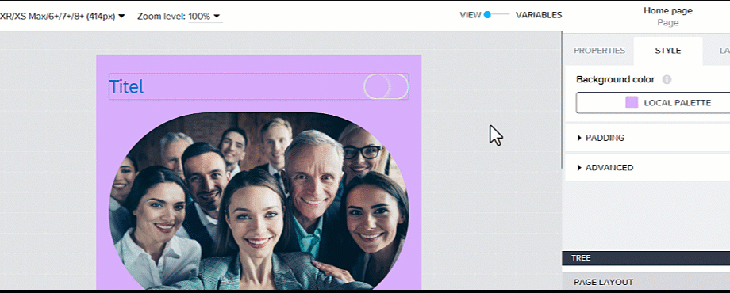
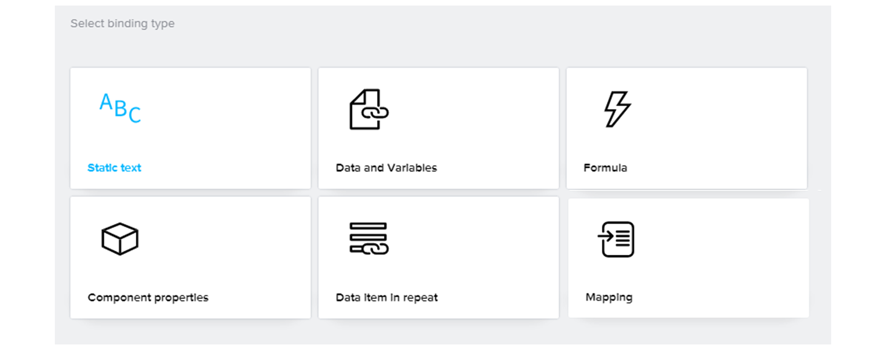
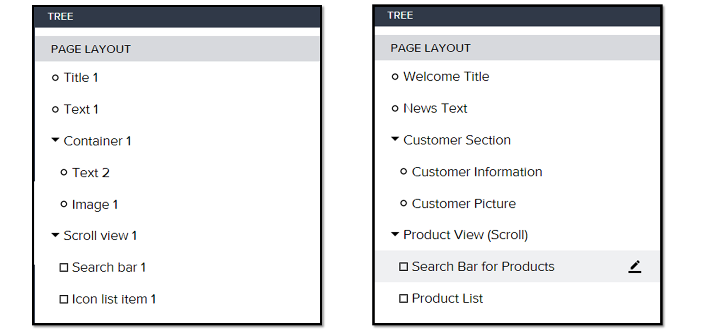

# 🌸 2 [USING PROPERTIES](https://learning.sap.com/learning-journeys/develop-apps-with-sap-build-apps-using-drag-and-drop-simplicity/using-**properties**_b8b8a508-77a7-4db8-b379-fb3435a0565b)

> 🌺 Objectifs
>
> - [ ] Décrire les propriétés fondamentales et les liaisons.
>
> - [ ] Expliquez les propriétés avancées.
>
> - [ ] Expliquez la fonction des composants répétitifs.

## 🌸 PROPERTIES

Pour garantir que l'interface utilisateur d'une application soit adaptée à ses exigences en termes de contexte, d'apparence dynamique et de fonctionnalités, les **Components Properties** sont particulièrement avantageuses. Les paramètres des **Properties** varient selon le **Component** choisi et permettent un ajustement facile des **Components** de l'interface utilisateur.

Les **Properties** des **Components** actuellement sélectionnés s'affichent dans le panneau **Properties** à droite. La **Property** par défaut est définie en fonction du **Component**. Pour les valeurs de **Properties statiques**, vous pouvez également les ajouter directement dans le panneau **Properties**. Les **Properties** des **Components** peuvent être liées à l'aide de la liaison placée devant la valeur d'une **Property**.

## 🌸 BINDINGS

Les **Components** possèdent des **Properties** qui peuvent être liées à des valeurs statiques, des variables, des formules et d'autres **Properties**. Cela permet d'utiliser un même **Component** de différentes manières et de l'adapter à vos besoins. Par exemple, si un **Component** texte est sélectionné, il suffit de lui attribuer un nom statique, ce qui sera la méthode par défaut. Vous pouvez également **Binder** une variable de données à un **Component** d'interface utilisateur pour afficher les données.

Cependant, il existe de nombreuses autres façons de rendre le contenu dynamique. Dans ce cas, une connexion peut être utilisée, par exemple, pour afficher un texte ou un nom adapté à l'utilisateur à partir d'une variable qui lui est attribuée, ou encore l'heure et la date, etc. Les possibilités sont illimitées et sont rendues possibles par les différents types de liaisons sélectionnables dans les **Properties** de chaque **Component**.

## 🌸 ADVANCED PROPERTIES

Dans les **Properties avancées**, vous trouverez un champ pour le nom d'affichage du **Component**, ce qui vous permet de personnaliser le nom du **Component** dans le canevas et l'arborescence. Donner des noms personnalisés aux **Components** peut s'avérer très utile pour travailler avec des mises en page plus complexes et un plus grand nombre de **Components**.

Le paramètre de **Properties** « Visible » est également très utile pour contrôler dynamiquement la visibilité des **Components** et du contenu dont les utilisateurs ont besoin. La **Property** « Visible » peut être liée à l'aide de la liaison, ce qui permet un contrôle dynamique de la visibilité des **Components**.

> Note
>
> Si vous définissez la visibilité par défaut sur faux, vous devez utiliser l'arborescence pour sélectionner à nouveau le Component.

## 🌸 REPEATING COMPONENTS

Une option importante et utile pour **SAP Build Apps** est la **Repeat with function** dans les **Properties** pour créer des **Components** automatiquement et dynamiquement avec un **Binding** simple.

Pour cela, vous avez besoin d'une source pour une liste d'objets. Le **Component** sera ensuite répété pour chaque élément de la liste. Cette fonction est fréquemment utilisée pour les **Components** de liste en particulier. Cependant, ce paramètre de **Property** peut être appliqué à tous les **Components** disponibles.

## 🌸 SET THE PROPERTIES OF THE COMPONENTS

### BUSINESS SCENARIO

Ajustez les **Properties** des **Components** et des pages une fois les **Components** intégrés.

### EXERCISE OPTIONS

Pour démarrer l'exercice, sélectionnez « Démarrer l'exercice » dans la figure ci-dessous.

Une fenêtre contextuelle s'ouvre. Vous disposez des options suivantes :

- Démarrer : la simulation démarre. Suivez la simulation pour apprendre à définir les **Properties** des **Components**.

- Ouvrir le document PDF : un PDF s'ouvre. En suivant les étapes décrites dans ce document, vous pouvez réaliser les exercices dans votre propre environnement système.

[Référence - Link Exercise](https://learnsap.enable-now.cloud.sap/pub/mmcp/index.html?show=project!PR_548133F0C06E96A3:uebung)

[PDF](./assets/standard_002.pdf)
