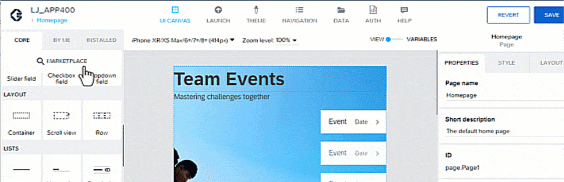
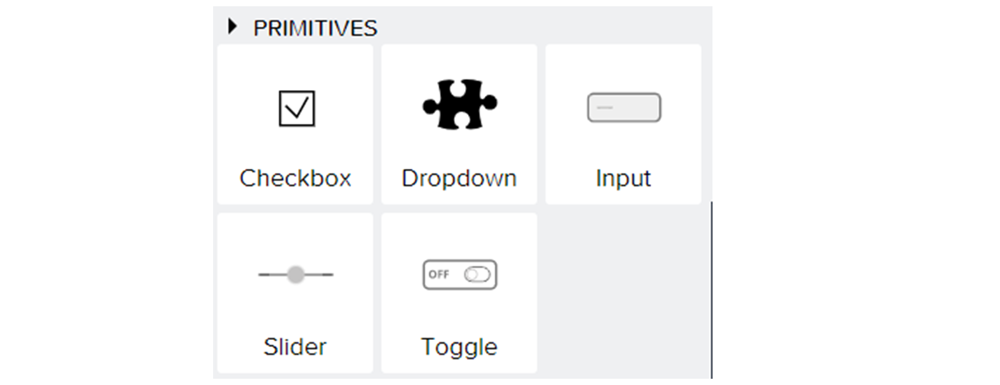

# 🌸 4 [USING MARKETPLACE AND OWN COMPONENTS](https://learning.sap.com/learning-journeys/develop-apps-with-sap-build-apps-using-drag-and-drop-simplicity/using-**marketplace**-and-own-**components**-_a0e9e75f-85d5-4a70-b377-bb088dba7bc4)

> 🌺 Objectifs
>
> - [ ] Analyser le marché des composants.
>
> - [ ] Créez vos propres composants.

## 🌸 COMPONENT MARKETPLACE

Nous avons examiné de nombreux **Components** inclus par défaut dans **SAP Build Apps**. Ces **Components** couvrent la plupart des cas d'utilisation. Cependant, si vous souhaitez développer une application plus personnalisée et ajouter des **Components spécifiques**, vous pouvez utiliser la **Component Marketplace**. **SAP Build Apps**, en tant que **Component Marketplace**, propose plus de 500 **Components** glisser-déposer prédéfinis, que vous pouvez installer et utiliser rapidement, avec ou sans _personnalisation_.

La **Component Marketplace** se trouve dans l'onglet **Components** principaux, en haut à gauche, au-dessus de la Bibliothèque de **Components**. Elle contient non seulement de nouveaux **Components** constamment mis à jour, mais aussi des sections, par exemple pour les fonctions de flux et la logique abordée plus loin dans ce parcours d'apprentissage.

Les **Components** principaux sont également répertoriés dans la **Marketplace** des **Components**. C'est pourquoi il est judicieux d'utiliser le filtre disponible pour les exclure lors de l'exploration de nouveaux **Components** et obtenir une meilleure vue d'ensemble. Dans les paramètres de filtre, vous pouvez définir les options suivantes :

- Tous les **Components** disponibles ;

- Uniquement les **Components** déjà installés ;

- **Components** non installés ;

- **Components** propres.

La fonction de recherche optimise la recherche de nouveaux **Components** nécessaires à une approche de solution spécifique.

L'un des avantages de la **Marketplace** des **Components** est que vous recevez des informations décentralisées sur chaque **Component**. Cela s'applique à ceux qui ne sont pas installés, à ceux que vous avez déjà installés ou qui sont présents par défaut.

Pour sélectionner ou installer un nouveau **Component**, ou pour consulter des informations, il suffit de le sélectionner. Une boîte de dialogue s'affiche, contenant diverses informations telles que sa description, ses données de création et de mise à jour, le nom du mainteneur, le jeton et un exemple d'affichage.

Pour rendre le **Component** souhaité disponible :

- Sélectionnez-le simplement.

- Puis sélectionnez « Instal ».

- Le nouveau **Component** s'affiche alors sous l'onglet « Instal » de la bibliothèque de **Components**.

## 🌸 USE COMPONENTS FROM THE MARKETPLACE

### BUSINESS SCENARIO

Explorez la **Marketplace** et installez un **Component** pour évaluer la fonction de suivi.

### EXERCISE OPTIONS

Pour démarrer l'exercice, sélectionnez « Démarrer l'exercice » dans la figure ci-dessous.

Une fenêtre contextuelle s'ouvre. Vous disposez des options suivantes :

- Démarrer : la simulation démarre. Suivez-la pour apprendre à utiliser les **Components** de la **Marketplace**.

- Ouvrir le document PDF : un PDF s'ouvre. En suivant les étapes décrites dans ce document, vous pouvez réaliser les exercices dans votre propre environnement système.

[Référence - Link Exercise](https://learnsap.enable-now.cloud.sap/pub/mmcp/index.html?show=project!PR_D1791F8097826A88:uebung)

[PDF](./assets/standard_006.pdf)

## 🌸 CUSTOM COMPONENTS

Les dernières leçons détaillent les **Components**, leurs propriétés et leurs paramètres de style, ainsi que divers autres **Components** ajoutés régulièrement sur la **Marketplace**. Dans cette section, nous allons plus loin en combinant les connaissances précédentes et en vous montrant comment créer vos propres **Components**. Grâce au **component template editor**, vous pouvez personnaliser les **Components** en profondeur pour les adapter aux besoins de votre application. Vous pouvez les modifier et les combiner pour en créer de nouveaux.

**SAP Build Apps** offre une fonctionnalité intéressante : combiner les **Components** de base pour créer des **Components** plus sophistiqués. L'assemblage est également simple. Par exemple, vous pouvez combiner un **Component image de base** et un **Component liste** de la bibliothèque de **Components** pour créer un **Component liste d'images** réutilisable ultérieurement.

Ceci n'est qu'un aperçu des possibilités offertes par **SAP Build Apps**. Des éléments de **Components** individuels sont disponibles dans la bibliothèque de **Components** pour vous permettre de créer vos propres **Components** personnalisés.

## 🌸 CREATE YOUR OWN COMPONENT

### BUSINESS SCENARIO

Après avoir utilisé les **Components** principaux et un **Component** de la **Marketplace**, vous allez créer un **Component** personnalisé qui mappe les données de l'historique du tracker. Une page dédiée sera utilisée à cet effet.

### EXERCISE OPTIONS

Pour démarrer l'exercice, sélectionnez « Démarrer l'exercice » dans la figure ci-dessous.

Une fenêtre contextuelle s'ouvre. Vous disposez des options suivantes :

- Démarrer : la simulation démarre. Suivez-la pour apprendre à créer vos propres **Components**.

- Ouvrir le document PDF : un PDF s'ouvre. En suivant les étapes décrites dans ce document, vous pouvez réaliser les exercices dans votre propre environnement système.

[Référence - Link Exercise](https://learnsap.enable-now.cloud.sap/pub/mmcp/index.html?show=project!PR_B210E762F383559B:uebung)

[PDF](./assets/standard_007.pdf)
