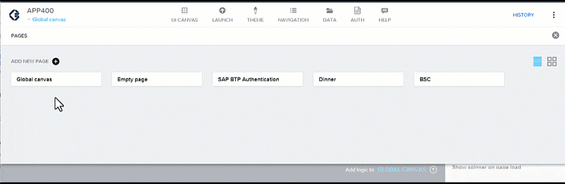
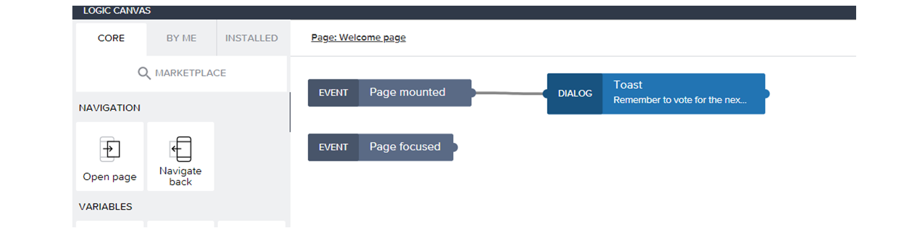
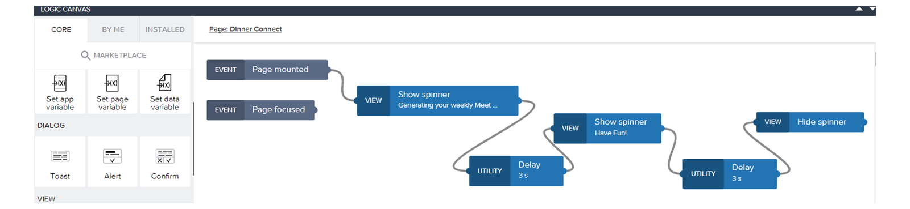
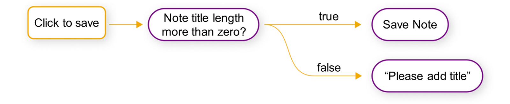
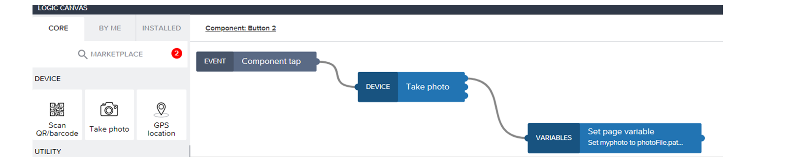

# 🌸 2 [DESCRIBING FLOW FUNCTIONS](https://learning.sap.com/learning-journeys/develop-apps-with-sap-build-apps-using-drag-and-drop-simplicity/describing-flow-functions-_d0181f8f-c084-4959-9bbe-8fb288a76249)

> 🌺 Objectifs
>
> - [ ] Décrivez le Logic Canvas.
>
> - [ ] Créez des flux logiques et des fonctions.

## 🌸 LOGIC CANVAS

À partir d'un événement, plusieurs flux logiques peuvent être combinés pour exécuter n'importe quelle fonction ou action selon les besoins. Ces flux logiques sont intégrés au canevas logique et deviennent visibles en sélectionnant la barre inférieure du canevas de l'interface utilisateur. Vous pouvez les développer en faisant glisser la barre.

Voici les trois différents types de Logic Canvas :

#### 💮 **Global Logic Canvas** :

Le Global Logic Canvas est accessible dans la collection de pages.

#### 💮 **Page Logic Canvas** :

Dans le canevas Page Logic, vous pouvez voir des spinners de page intégrés qui sont définis dans la fonction de telle manière qu'ils disparaissent lorsqu'une page est chargée.

#### 💮 **Component Logic Canvas** :

Différentes logiques sont disponibles par défaut dans le canevas de logique des composants, selon le composant sélectionné. Par exemple, davantage de logiques peuvent être affichées si un composant possède également plusieurs sous-composants et accès.

> La vaste sélection d'éléments logiques est disponible, triée par catégorie, à gauche de chaque canevas logique.

Comme pour les composants, un tronc principal couvre les cas d'utilisation les plus courants et permet d'ajouter des fonctions de flux supplémentaires depuis la Marketplace. Celles-ci sont ensuite disponibles dans la section Logique et peuvent être constamment développées. Elles sont également disponibles sous l'onglet Installé. Les fonctions de flux par défaut de l'onglet Noyau et les fonctions supplémentaires de la Marketplace fournissent ainsi les outils nécessaires pour optimiser la logique de l'application et les fonctions associées.

Dans les sections suivantes, les fonctions de flux sont présentées par ordre croissant de complexité avec divers exemples de catégories dans l'onglet Noyau du Logic Canvas.

## 🌸 SIMPLE AND MULTIPLE LOGIC FLOWS

### SIMPLE LOGIC FLOW

Les flux logiques peuvent être très simples et ne comporter qu'une seule fonction. Cela suffit notamment pour naviguer entre les pages de l'application ou accéder à une URL. Il est essentiel de toujours avoir au moins un événement. Par exemple, vous pouvez glisser-déposer la logique « Ouvrir la page » depuis la catégorie Navigation et la connecter à un bouton comme événement. Ce bouton permet alors d'accéder à la page souhaitée et de déclencher l'action.

### MULTIPLE LOGIC FLOW

L'application logique utilise généralement plusieurs composants logiques et les concatène. Il est même possible de copier des éléments logiques individuels ou des brins entiers. Si un flux logique contient plusieurs événements, l'application devient plus dynamique et, selon le projet, des logiques simples ou complexes peuvent être exécutées. Ceci est généralement nécessaire pour interroger ou modifier des variables et des données, par exemple lors de la consultation ou de la mise à jour d'une liste de participants. Plus important encore, les résultats peuvent également être transmis par concaténation, ce qui permet une utilisation ultérieure. Ils permettent ainsi de personnaliser tout type de comportement dans une application.

## 🌸 ENRICH THE NAVIGATION WITH SIMPLE FLOW FUNCTIONS

### BUSINESS SCENARIO

La logique de l'application est implémentée pour la première fois. Ensuite, la logique de navigation doit être créée avec une logique simple basée sur une ou plusieurs fonctions de flux chaînées.

### EXERCISE OPTIONS

Pour démarrer l'exercice, sélectionnez « Démarrer l'exercice » dans la figure ci-dessous.

Une fenêtre contextuelle s'ouvre. Vous disposez des options suivantes :

- Démarrer : la simulation démarre. Suivez-la pour apprendre à enrichir la navigation avec des fonctions de flux simples.

- Ouvrir le document PDF : un PDF s'ouvre. En suivant les étapes décrites dans ce document, vous pouvez réaliser les exercices dans votre propre environnement système.

[Référence - Link Exercise](https://learnsap.enable-now.cloud.sap/pub/mmcp/index.html?show=project!PR_D738164396FFDD8A:uebung)

## 🌸 MULTIPLE OUTPUTS AND CONDITIONS

Les fonctions de flux reçoivent toujours une entrée. Cependant, le résultat peut avoir plusieurs sorties pour certains éléments logiques. C'est notamment le cas si l'utilisateur est confronté à une interaction et doit saisir des données ou choisir une option. Cependant, d'autres sorties alternatives peuvent également avoir entraîné l'interruption d'une interaction ou une erreur. Ainsi, selon la sortie comportant plusieurs branches, différents flux logiques peuvent être poursuivis, ce qui permet d'intégrer une complexité accrue pour traiter les différents événements. Malgré cette complexité, l'avantage réside dans la clarté visuelle des flux logiques, leur restructuration rapide et la suppression des connexions.

## 🌸 IMPLEMENT LOGIC FOR THE DARK MODE SWITCH

### BUSINESS SCENARIO

Avec la fonction If Condition Flow et la possibilité de sorties multiples, la logique du bouton bascule sera implémentée pour changer la couleur d'arrière-plan de l'application en mode sombre.

### EXERCISE OPTIONS

Pour démarrer l'exercice, sélectionnez « Démarrer l'exercice » dans la figure ci-dessous.

Une fenêtre contextuelle s'ouvre. Vous disposez des options suivantes :

- Démarrer : la simulation démarre. Suivez-la pour apprendre à enrichir la navigation avec des fonctions de flux simples.

- Ouvrir le document PDF : un PDF s'ouvre. En suivant les étapes décrites dans ce document, vous pouvez réaliser les exercices dans votre propre environnement système.

[Référence - Link Exercise](https://learnsap.enable-now.cloud.sap/pub/mmcp/index.html?show=project!PR_A0FAEC421BCA0EB3:uebung)

## 🌸 USE OF DEVICES FUNCTIONALITIES

Grâce à la multiplateforme SAP Build Apps, les applications fonctionnent aussi bien sur le web que sur différents appareils. Pour les appareils mobiles comme les smartphones, il est conseillé d'utiliser des fonctionnalités supplémentaires. Par exemple, l'appareil photo peut être utilisé pour prendre des photos, des vidéos ou scanner un code. Le résultat peut ensuite être traité ultérieurement.

Vous pouvez voir ici un exemple de la manière dont la logique de l'appareil peut être utilisée pour créer une application de scanner : [Création d'une application de scanner avec SAP Build Apps](https://learning.sap.com/learning-journeys/compose-and-automate-with-sap-build-the-no-code-way/creating-a-first-application-with-sap-build-apps_ed25092c-550f-4375-b82b-74a44ca4467f)
