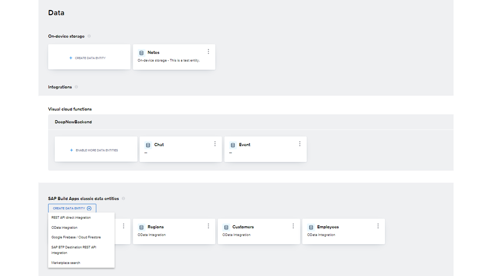

# 🌸 1 [DESCRIBING DATA RESSOURCES](https://learning.sap.com/learning-journeys/develop-apps-with-sap-build-apps-using-drag-and-drop-simplicity/describing-data-resources_f7af41b3-ec19-4a68-b6d1-1ca321feaccc)

> 🌺 Objectifs
>
> - [ ] Décrivez l’objectif d’une ressource de données.
>
> - [ ] Discutez des types de ressources de données.

## 🌸 DATA RESSOURCES

Les applications dépendent de leurs données, et sans elles, une application ne serait pas capable de faire grand-chose.

Certaines données sont temporaires et stockées pendant l'exécution de l'application, par exemple :

- Les données saisies par l'utilisateur.

- Les données relatives à l'état de l'application ; par exemple, lorsqu'un utilisateur joue, l'application doit enregistrer son score, son nom et l'état actuel du plateau (pour les jeux de société) ou sa localisation (pour les jeux d'aventure).

Certaines données sont stockées dans des magasins de données ou des bases de données pour être utilisées par d'autres utilisateurs, par exemple :

- Les données commerciales, telles que les factures et les bons de commande.

- Les données sportives, telles que les équipes et les joueurs, ainsi que leurs statistiques.

- Les données géologiques, telles que les tremblements de terre, leur magnitude et leur localisation.

Les exemples sont nombreux. Les données doivent être stockées dans un emplacement central et vous devez savoir comment vous y connecter.

Une ressource de données dans une application SAP Build Apps définit tous les détails nécessaires à la connexion aux données. En général, il s’agit d’un service REST ou OData et nécessite une URL et certains paramètres pour spécifier les données à renvoyer.

## 🌸 TYPES OF DATA RESSOURCES

Il existe différents types de systèmes back-end permettant de récupérer des données.

SAP Build Apps vous permet de vous connecter aux éléments suivants :

- Intégration OData

- Intégration directe d'API REST

- Stockage sur appareil

- Ressources de données de la marketplace

#### 💮 **OData Integration** :

Ce type de ressource de données vous permet de vous connecter aux services OData. Accessibles via une URL, les services OData sont conçus pour fournir des données métier. Ils respectent un ensemble de règles strictes définissant le format des URL et des données renvoyées.

Ce type de ressource de données est important car SAP expose une grande partie de ses données métier via les services OData.

#### 💮 **REST API Direct Integration** :

Ce type de ressource de données vous permet de vous connecter à des services REST. Ces services ne sont pas soumis aux mêmes règles strictes que les services OData en matière d'URL et de réponses. Leur compréhension et leur configuration dans SAP Build Apps peuvent donc s'avérer plus complexes.

Il existe cependant de très nombreux services REST (pour consulter la météo, les statistiques sportives, jouer à des jeux, et même certains services métier SAP). Vous aurez donc probablement besoin de créer une ressource de données REST à terme.

#### 💮 **On-Device Storage** :

Cette ressource de données crée un magasin de données sur l'appareil de l'utilisateur, contrairement aux ressources REST et OData, qui se connectent aux magasins de données existants. Ces données sont stockées uniquement sur l'appareil de l'utilisateur actuel ; elles sont donc utilisées uniquement pour les données dont il a besoin et qui ne doivent pas être partagées.

Ce type de ressource de données peut être utilisé pour les préférences utilisateur ou pour enregistrer l'état actuel de l'application pour l'utilisateur actuel.

#### 💮 **Marketplace Data Resources** :

Les ressources de données de la Marketplace peuvent être de tout type. Il s'agit de ressources de données définies et stockées sur la Marketplace, et qui peuvent être rapidement installées depuis celle-ci. Vous pouvez utiliser les quelques ressources de données prédéfinies, ou créer une ressource de données et la réutiliser rapidement dans plusieurs projets.

Nous aborderons plus en détail les types de ressources de données ci-dessus dans la suite de cette unité.

D'autres types de ressources de données importants, notamment pour la connexion aux back-ends SAP, nécessitent l'authentification des utilisateurs via SAP BTP. Nous les aborderons dans une unité ultérieure.

#### 💮 **Visual Cloud Functions Integration** :

Visual Cloud Functions vous permet de créer facilement votre propre base de données, au lieu de vous connecter à une base existante. Vous pouvez y accéder à plusieurs applications et partager les données entre plusieurs utilisateurs.

Pour créer Visual Cloud Functions, créez un projet back-end SAP Build Apps (depuis le lobby). Dans ce projet back-end, vous créez des entités de données (pour stocker les données) et des fonctions (pour effectuer des calculs et des manipulations sur ces données). Une fois le projet back-end déployé, vous pouvez créer une ressource de données pour vous connecter aux entités de données afin d'en récupérer les données ou utiliser des fonctions de flux pour exécuter les fonctions serveur.

#### 💮 **OData Integration with BTP Destination** :

OData avec une destination BTP est identique à celui sans, sauf que l'URL et l'authentification sont définies par une destination SAP BTP.

#### 💮 **REST Integration with BTP Destinations** :

REST avec une destination BTP est le même que sans, sauf que l'URL et l'authentification sont définies par une destination SAP BTP.
