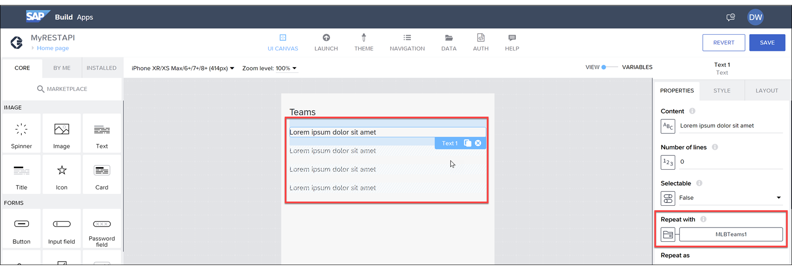

# 🌸 3 [CREATING REST RESOURCES](https://learning.sap.com/learning-journeys/develop-apps-with-sap-build-apps-using-drag-and-drop-simplicity/creating-rest-resources_d32e6b64-099c-4630-859e-d57715280ff9)

> 🌺 Objectifs
>
> - [ ] Créez une ressource de données sur une API REST.
>
> - [ ] Accédez à la ressource de données REST depuis votre application.

## 🌸 REST RESOURCE

Une ressource REST est une connexion à une source de données conforme au protocole REST. Il s'agit d'un type de service de données plus généralisé qu'OData. Les services REST ne sont pas tenus de fournir des métadonnées. Par conséquent, lors de leur configuration dans SAP Build Apps, vous devrez peut-être fournir des informations de configuration supplémentaires.

Deux éléments principaux doivent être définis :

Schéma des données, qui fournit une vue structurée des informations
Types de requêtes HTTP pouvant être exécutées sur la ressource de données
Il existe des milliers de services REST, certains gratuits, d'autres payants, permettant d'obtenir toutes sortes d'informations, telles que :

- Bulletins météo

- Informations sportives

- Blagues

- Informations géologiques

- Informations gouvernementales et bien d'autres

## 🌸 TO CREATE A REST RESOURCE

### BUSINESS SCENARIO

Lisez la vidéo pour découvrir comment créer une ressource de données basée sur un service REST et accéder aux données.

[Référence - Link Video](https://learning.sap.com/learning-journeys/develop-apps-with-sap-build-apps-using-drag-and-drop-simplicity/creating-rest-resources_d32e6b64-099c-4630-859e-d57715280ff9)

## 🌸 ACCESS DATA FROM THE REST RESOURCE

### BUSINESS SCENARIO

Cette procédure décrit les étapes requises pour accéder aux données.

### STEP

1. Accédez aux données.

2. Cliquez à nouveau sur l'onglet Données pour revenir à la zone de travail de l'interface utilisateur. Un titre et un texte devraient apparaître.

3. Choisissez le titre et, dans le panneau Propriétés, définissez le contenu sur Équipes.

4. Choisissez Variables. Nous allons maintenant créer une variable de données qui stockera les données du back-end et contiendra la logique permettant de les récupérer.

5. Choisissez Variables de données, puis Ajouter une variable de données.

6. Choisissez MLBTeams comme ressource de données sur laquelle baser la variable de données.

7. Choisissez Affichage pour revenir à la zone de travail de l'interface utilisateur.

8. Choisissez le composant texte et configurez-le pour afficher les noms des clients. Dans le panneau Propriétés, cliquez sur l'icône sous Répéter avec, puis sélectionnez Données et variables, puis Variable de données. Sélectionnez MLBTeams1 et cliquez sur Enregistrer.

   Le composant texte s'affichera désormais 4 fois pour indiquer qu'il est répété (ce chiffre n'indique pas la quantité de données ; il sera toujours 4 fois).

9. Dans le volet Propriétés, choisissez « ABC » sous le champ « Contenu », puis sélectionnez « Élément de données en répétition ». Sélectionnez « Actuel », puis « Nom ».

10. Cliquez sur « Enregistrer ».

Effectuez un test.

> Exécutez l'application et vous verrez la liste des équipes récupérées depuis le back-end.
