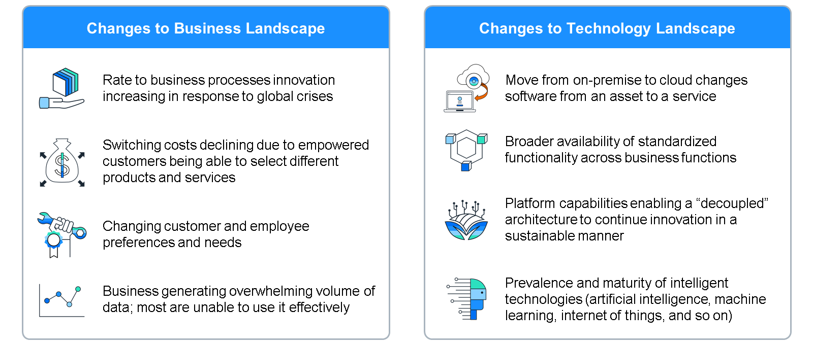
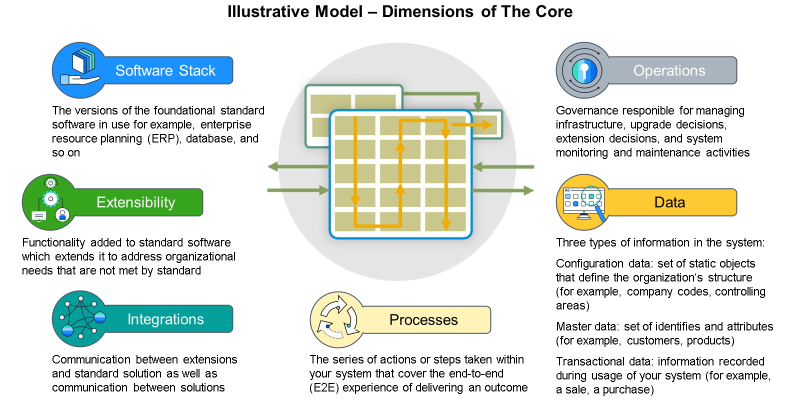
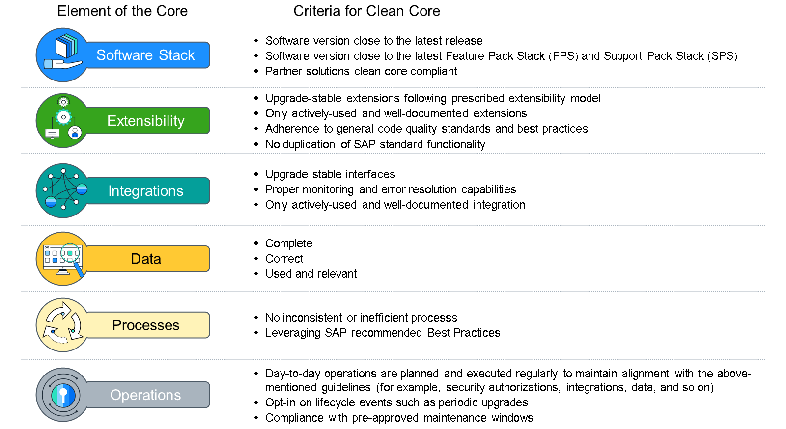
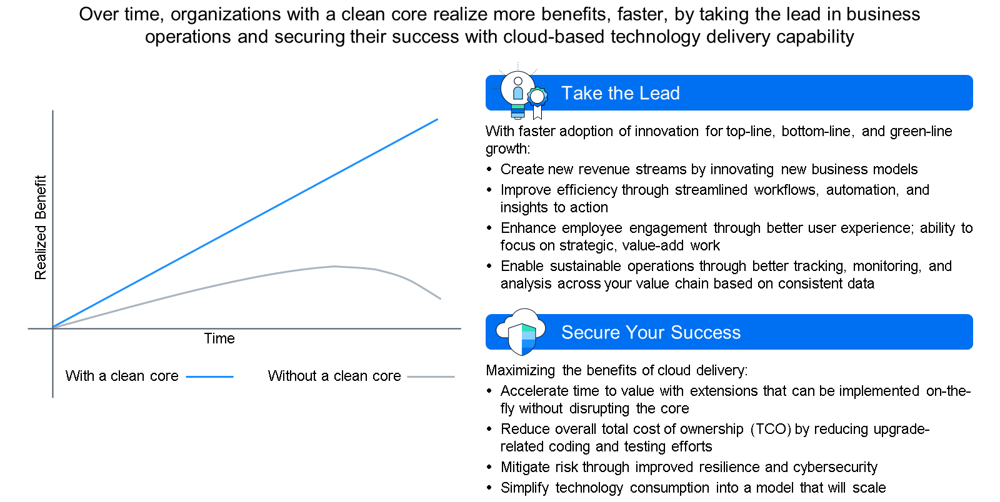
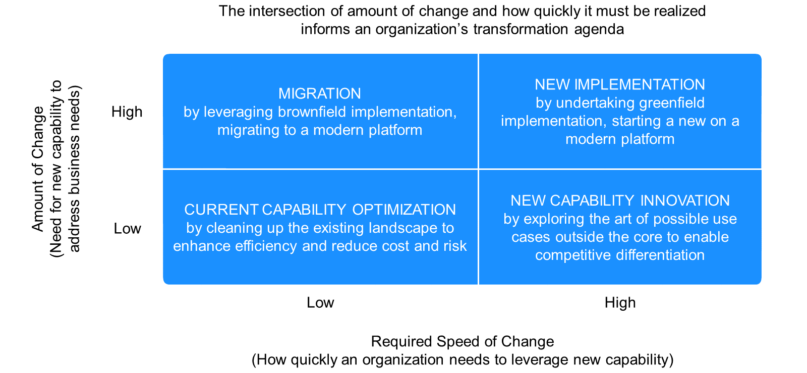
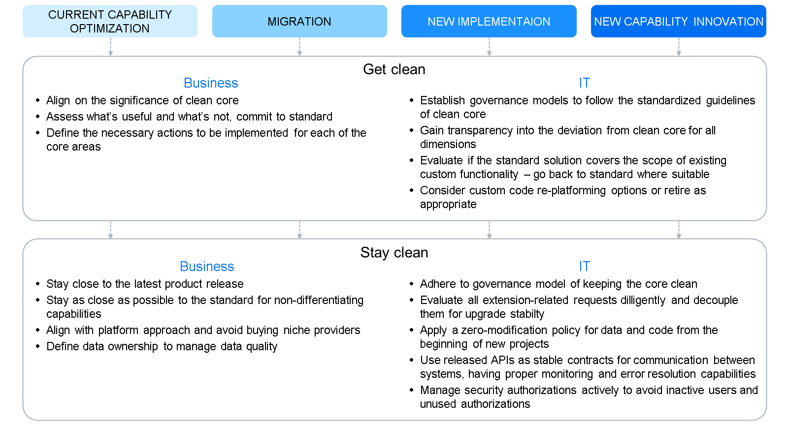
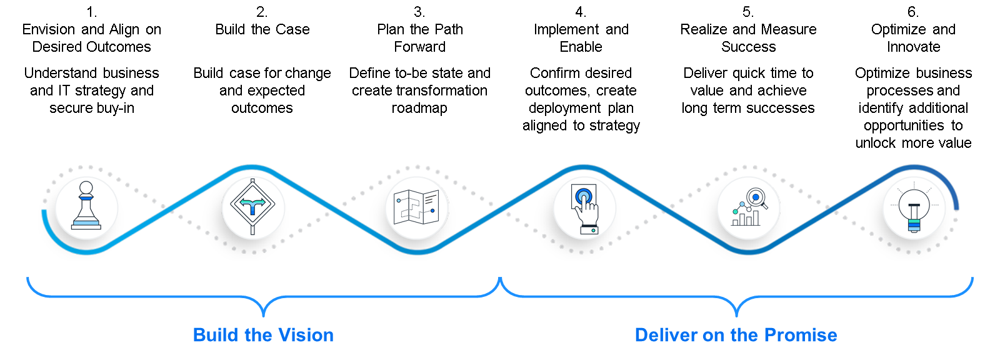
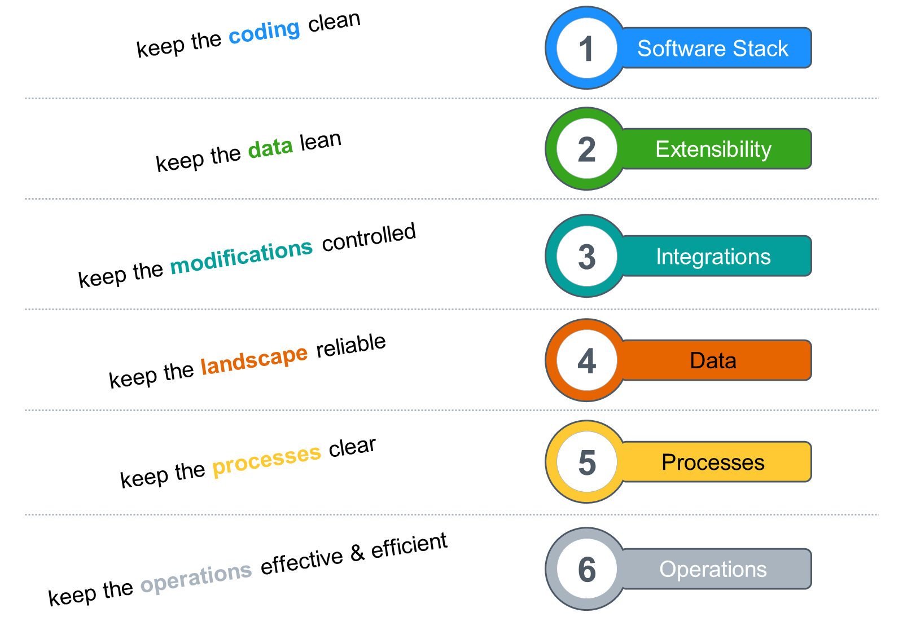

# 🌸 3 [EXPLAINING THE CLEAN CORE APPROACH](https://learning.sap.com/learning-journeys/developing-with-sap-integration-suite/explaining-the-clean-core-approach)

> 🌺 Objectifs
>
> - [ ] Explain the [clean core](../☼%20UNIT%200%20-%20Lexicon/♠%20Clean%20Core.md) Approach

## 🌸 CLEAN CORE CONCEPT

Pour prospérer à l’ère du numérique, les organisations doivent s’adapter à des environnements commerciaux changeants et adopter de nouvelles capacités.

Les organisations dépendent de l'informatique pour fournir les capacités qui pilotent leurs initiatives stratégiques. La Flexibility et la vitesse pour soutenir les changements stratégiques ou favoriser l’innovation sont cruciales. Cependant, les legacy systems (systèmes existants) lourdement chargés d’une _technical debt_[^1] importante peuvent nuire à l’agilité organisationnelle.

Les logiciels de planification des assets d'entreprise (ERP) modernes servent désormais de plate-forme dynamique et évolutive, offrant des fonctionnalités étendues telles que des **built-in insights** (informations intégrées), l'**automatisation**, des **workflows**, des **standard integrations** et une easy **extensibility**. Ces fonctionnalités offrent des avantages distinctifs sans l’encombrement d’une _technical debt_[^1]. Pour appliquer ces nouvelles technologies et permettre l'évolution de l'entreprise, les organisations doivent faire face à la complexité de leurs systèmes existants.

### ORGANIZATIONS DEPEND ON IT TO DELIVER THE CAPABILITIES THAT DRIVE THEIR STRATEGY

L’IT doit fournir des fonctionnalités essentielles tout en conservant l’agilité organisationnelle. L’objectif principal de l’IT est d’améliorer le competitive edge (l’avantage concurrentiel) d’une organisation en la dotant des capacités technologiques appropriées.

Historiquement, cela a conduit à des variations au sein des systèmes ERP, telles que des modifications des data, des processes, des integrations, des extensions et du code. Dans certains cas, ces changements ont été cruciaux pour fournir des business-critical capabilities (fonctionnalités critiques) à l'entreprise ou pour intégrer des disparate systems. Toutefois, certains changements n’ont pas donné de résultats intéressants. Quelle que soit leur nécessité, les méthodes utilisées pour étendre les fonctionnalités standards introduisent souvent une _technical debt_[^1], exigeant des efforts de maintenance importants.

Les changements dans le business and technology landscapes obligent les organisations à résoudre les **legacy complexities** (complexités héritées). Les perturbations des supply chains mondiales, l'évolution des préférences des clients et l'évolution de la dynamique des employés obligent les entreprises à s'adapter rapidement aux nouvelles demandes. Les progrès technologiques offrent de nouvelles capacités à un rythme accéléré. Cependant, une _technical debt_[^1] importante entrave l’adoption de ces nouvelles technologies, 10 à 20 % du budget technologique destiné aux nouveaux produits étant détourné pour résoudre les problèmes liés à la _technical debt_[^1]. Ce détournement limite la capacité de répondre efficacement aux exigences commerciales émergentes.

### A "CORE" SERVES AS THE FOUNDATION OF IT'S ABILITY TO SUPPORT AND ENABLE THE STRATEGY

Il concerne les dimensions utilisées pour fournir des capacités via un système ERP. Nous considérons **six dimensions** lorsque nous discutons de l'organization's core. Ces aspects techniques et procéduraux fonctionnent ensemble pour doter votre entreprise des capacités nécessaires pour atteindre les résultats souhaités.

- _Software Stack_

- _Extensibility_

- _Integrations_

- _Processes_

- _Operations_

- _Data_

> #### 🍧 [clean core approach](../☼%20UNIT%200%20-%20Lexicon/♠%20Clean%20Core.md)
>
> L’approche [clean core approach](../☼%20UNIT%200%20-%20Lexicon/♠%20Clean%20Core.md) vise à créer des ERP modernes, flexibles et compatibles avec le cloud. Parvenir à un [clean core](../☼%20UNIT%200%20-%20Lexicon/♠%20Clean%20Core.md) implique d'intégrer et d'étendre un système pour garantir qu'il est conforme aux normes de conformité du cloud, tout en maintenant une gouvernance efficace des données de référence et des processes métier.

Une idée fausse courante est qu’un [clean core](../☼%20UNIT%200%20-%20Lexicon/♠%20Clean%20Core.md) signifie un système exempt de core customization. En réalité, un core véritablement « clean » adhère à des directives standardisées pour tous ses éléments. Cette adhésion garantit que lorsque des mises à niveau du système sont nécessaires, les modifications peuvent être mises en œuvre avec un minimum d'effort manuel pour tester et adapter les structures existantes.

Les organisations peuvent avoir du mal à obtenir un core parfaitement clean. Cependant, plus ils peuvent intégrer ces éléments dans leur environnement, plus ils bénéficieront d’avantages en termes de performances commerciales et de **cloud delivery**.

### ELEMENTS AND CRITERIA FOR CLEAN CORE

#### 💮 **Software Stack** :

- Software version close to the latest release

- Software version close to the latest Feature Pack Stack (FPS) and Support Pack Stacj (SPS)

- Partner solutions clean core compliant

#### 💮 **Extensibility** :

- Upgrade-stable extensions following prescribed extensibility model

- Only actively-used and well-documented extensions

- Adherence to general code quality standards and best practices

- No duplication of SAP standard functionality

#### 💮 **Integrations** :

- Upgrade stable intefaces

- Proper monitoring and error resolution capabilities

- Only activaly-used and well-documented integration

#### 💮 **Processes** :

- Complete

- Correct

- Used and relevant

#### 💮 **Operations** :

- No inconsistent or inefficient process

- Leveraging SAP recommended Best Practices

#### 💮 **Data** :

- Day-to-day operations are planned and executed regularly to maintain alignment with rh aboce mentioned guidelines (ie. security authorizations, integrations, data...)

- Opt-in on lifecycle events such as periodic upgrades

- Compliance with pre-approved maintenance windows

### A CLEAN CORE ENHANCES CURRENT OPERATIONS AND ESTABLISHED A SOLID FOUNDATION FOR THE FUTURE

Le respect des directives standard en matière d'innovation permet de créer un competitive edge (avantage concurrentiel) tout en évitant la _technical debt_[^1]. L’introduction de nouvelles capacités dans l’organisation génère souvent des avantages à la fois en termes de chiffre d’affaires et de résultat net. Les organisations opérant dans des environnements standard peuvent adopter rapidement et à moindre coût de nouvelles fonctionnalités par rapport à celles qui s'écartent des standard practices. Les avantages projetés grâce aux nouvelles capacités se concrétisent plus rapidement et plus largement lorsque le core est clean. L'établissement d'un [clean core](../☼%20UNIT%200%20-%20Lexicon/♠%20Clean%20Core.md), que ce soit en préparation pour la transition vers le cloud ou déjà au sein de celui-ci, optimise les avantages de le **cloud delivery**.

### TRANSITIONING TO A CLEAN CORE NECESSITATE AN OVERARCHING STRATEGIC DIRECTION

Les organisations doivent commencer par comprendre l’étendue des changements nécessaires et l’urgence avec laquelle ils doivent être mis en œuvre.

#### 💮 **Amount of Change** :

les organisations ayant une demande importante de nouvelles fonctionnalités pour répondre aux exigences commerciales peuvent envisager un projet de transition vers un système ERP moderne. À l’inverse, ceux qui disposent déjà de capacités adéquates privilégient l’optimisation ou l’innovation au sein de l’environnement existant.

#### 💮 **Required Speed of Change** :

les organisations qui ont besoin d'une innovation rapide pour s'adapter aux market dynamics doivent passer à des plates-formes modernes pour des capacités améliorées. À l’inverse, ceux qui sont confrontés à un besoin de changement moins urgent cherchent à améliorer l’accès aux capacités existantes. Ces considérations déterminent si l’accent peut être mis sur l’optimisation du core actuel, la migration vers un paysage moins complexe, le lancement d’une transformation complète avec un nouveau système ou l’innovation de capacités différenciatrices au-delà du core. Comprendre cette orientation stratégique globale guidera les actions précises nécessaires pour améliorer l’agilité dans un avenir proche et préparer l’organisation aux initiatives à venir comme la transition vers le cloud. Étant donné que chaque organisation varie dans son niveau de standardization, nous vous conseillons de collaborer avec SAP pour identifier l'approche de transformation la plus adaptée à vos besoins spécifiques.

### ONCE THE STRATIEGIC DIRECTION IS DEFINED, ORGANIZATIONS NEED TO INITIATE ACTION

Certaines organisations parviennent à la cleanliness (propreté) grâce à la transformation de la migration, tandis que d'autres y parviennent grâce à de nouvelles implémentations. Quelle que soit l’approche adoptée, le maintien de la cleanliness nécessite la mise en place d’une robust governance. La transition vers et le maintien d’un [clean core](../☼%20UNIT%200%20-%20Lexicon/♠%20Clean%20Core.md) exigent un dévouement de la part des secteurs commercial et informatique.

### RECOGNIZING THE POTENTIAL VALUE WILL BOLSTER INVESTMENT IN THIS INITIATIVE

Grâce à la collaboration entre le business, l'IT et les partners, il devient possible d'obtenir un [clean core](../☼%20UNIT%200%20-%20Lexicon/♠%20Clean%20Core.md). SAP fournit une méthodologie éprouvée pour aider les organisations à comprendre les impératifs commerciaux et technologiques, ainsi que l'ensemble des avantages de la transformation. Nos processes consiste à comparer les **benchmarking business Key Performance Indicators** (indicateurs de performance clés - KPI) de l'entreprise par rapport à ses pairs du secteur et à évaluer la **digital maturity** par rapport aux normes du secteur afin de proposer des recommandations sur les domaines à prioriser, ainsi que les **enabling capabilities** (capacités habilitantes) nécessaires. Nous travaillons avec vous pour articuler les avantages qualitatifs et quantitatifs de la résolution des lacunes identifiées.

### TACKLING THE CLEAN CORE IS A CONTINUOUS STRATEGIC ENDEAVOR

Conclusion : le [clean core](../☼%20UNIT%200%20-%20Lexicon/♠%20Clean%20Core.md) est une méthode visant à atteindre et à préserver la cleanliness des **organization's core enterprise management systems** (systèmes de gestion d'entreprise) de base d'une organisation afin d'améliorer la **« maintainability »** et de réduire le **total cost of ownership** (coût total de possession - **TCO**). Cela englobe les activités liées aux **softwares**, aux **data**, aux **interfaces**, aux **processes** et aux **operations**.

---

[^1]: fait référence à l'accumulation de solutions ou de décisions techniques sous-optimales qui, à court terme, permettent d'atteindre des objectifs, mais qui à long terme peuvent compliquer la maintenance, l'évolutivité et la performance du système d'intégration.
