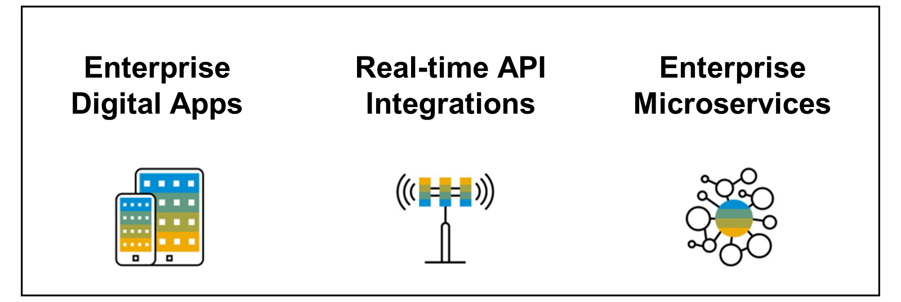

# 🌸 1 [INTRODUCTION SAP API MANAGEMENT](https://learning.sap.com/learning-journeys/developing-with-sap-integration-suite/introducing-sap-api-management_dd668e10-08ab-4763-9342-3e6cc7e74c18)

> 🌺 Objectifs
>
> - [ ] Describe the key features of SAP API Management

## 🌸 WHAT IS SAP API MANAGEMENT?

**SAP API Management** est une solution qui **maps** l'ensemble du **life cycle** d'une [API](../☼%20UNIT%200%20-%20Lexicon/♠%20API.md).

Il offre notamment les fonctionnalités suivantes :

#### 💮 **Building APIs** :

L'**API portal** est une application qui fournit une **common platform** permettant aux **API designers** de **définir** et de **publier** des [API](../☼%20UNIT%200%20-%20Lexicon/♠%20API.md). Chaque **API Management customer** dispose de sa propre application de **API portal** dans le cloud. L'**API portal** offre des fonctionnalités pour :

- _configurer des systèmes_

- _créer et publier des API_

- _analyser et tester des API_

#### 💮 **Publishing APIs** :

> #### 🍧 Product
>
> Un **Product** est un ensemble d'[API](../☼%20UNIT%200%20-%20Lexicon/♠%20API.md). Il contient des **metadata** spécifiques à votre entreprise à des fins de **monitoring** ou d'**analyse**.
>
> Par exemple, toutes les [API](../☼%20UNIT%200%20-%20Lexicon/♠%20API.md) liées au **CRM**[^1] peuvent être regroupées en un seul **Product CRM**[^1]. Au lieu de publier les [API](../☼%20UNIT%200%20-%20Lexicon/♠%20API.md) individuellement, il est plus facile de regrouper les [API](../☼%20UNIT%200%20-%20Lexicon/♠%20API.md) associées en tant que **Product** et de les **publier**. Après avoir inclus les [API](../☼%20UNIT%200%20-%20Lexicon/♠%20API.md) requises dans un **Product**, le **Product** est publié dans le **Catalog**, où le **Product** est disponible pour les développeurs d'applications.

#### 💮 **Analyzing APIs** :

**SAP API Management** fournit des **fonctionnalités d’analyse complètes** pour comprendre les **différents modèles de consommation** des [API](../☼%20UNIT%200%20-%20Lexicon/♠%20API.md). Le **serveur API Analytics** utilise les **données d'exécution des API**[^2] pour **analyser** les informations. Les **données d'exécution**[^2] sont **collectées**, **analysées** et **affichées** sous forme de **graphiques**, d'**en-têtes** et **key performance indicators** (KPI).

#### 💮 **Consuming APIs** :

**SAP API Business Hub Enterprise** est une application qui fournit une **plate-forme commune** permettant aux développeurs d'applications d'utiliser des [API](../☼%20UNIT%200%20-%20Lexicon/♠%20API.md). Chaque **API Management customer** dispose de sa propre **application API Business Hub Enterprise** dans le **cloud**. L'**API Business Hub Enterprise** offre des fonctionnalités permettant d'**intégrer des développeurs d'applications**, d'**explorer** et de **tester** des [API](../☼%20UNIT%200%20-%20Lexicon/♠%20API.md), de **créer** et de s'**abonner** à des applications.

#### 💮 **Monetizing APIs** :

**SAP API Management** fournit une fonctionnalité de monétisation à tous les [API providers](../☼%20UNIT%200%20-%20Lexicon/♠%20API%20Provider.md) (fournisseurs d'API) pour générer des revenus sur l'utilisation des [API](../☼%20UNIT%200%20-%20Lexicon/♠%20API.md). En tant qu'**API admin**, vous pouvez créer un **rate plan** (plan tarifaire), attacher un **rate plan** (plan tarifaire) à un **Product** dans l'**API Portal** et **publier** le **Product** dans l'**API Business Hub Enterprise**.

Vous pouvez également afficher les détails de la bill (facture) de chaque développeur dans l'API Portal. En tant que développeur d'applications, dans l'API Business Hub Enterprise, vous pouvez créer une application et ajouter des **Product** à l'application. En fonction de l'utilisation du **Product**, vous pouvez afficher les **détails** de la **bill** correspondante.

#### 💮 **Discover API Packages** :

Dans **SAP API Management**, vous pouvez découvrir les **API Management platform supported API packages** (packages API pris en charge par la plateforme de gestion des API) disponibles dans **SAP Business Accelerator Hub** sur l'**API Portal**.

#### 💮 **API Designer** :

**Modélisez** les [API](../☼%20UNIT%200%20-%20Lexicon/♠%20API.md) à l’aide ds l'**API designer** (concepteur d’API). L'**API designer** est basé sur la **norme OpenAPI Spécification** (OAS), qui est un **projet collaboratif open source**. L'**API designer** vous permet de **créer** et de **modifier** des [API](../☼%20UNIT%200%20-%20Lexicon/♠%20API.md) de manière **transparente**, et d'afficher la **documentation** correspondante dans un seul cadre de fenêtre. Il possède de riches fonctionnalités intégrées, qui ne peuvent se limiter à la conversion d'API d'un format à un autre (par exemple, de **RAML** en **YAML**, **JSON** en **YAML** et vice versa), à générer des **stubs**[^3] de serveur et de client, à télécharger des **spécifications** d'[API](../☼%20UNIT%200%20-%20Lexicon/♠%20API.md), etc. . L'**OpenAPI Specification** (OAS) , créée par l'**API designer**, peut être publiée en tant qu'[API](../☼%20UNIT%200%20-%20Lexicon/♠%20API.md) sur **SAP Business Accelerator Hub**.

## 🌸 TYPICAL USE CASES

#### 💮 **Enterprise Digital Apps** :

Créez des **Enterprise Digital Apps** pour les employés (**Field Sales/Services/Support**), les **customers** et les **partners**.

#### 💮 **Real-time API Integrations** :

Partagez les **enterprise data** depuis les **data lakes**[^4] (lacs de données) et des **business systems** avec les **suppliers**, les **partners** et les **customers**. Exposez les **transactions** et les **processus** de l'entreprise sous forme d'[API](../☼%20UNIT%200%20-%20Lexicon/♠%20API.md) pour les **suppliers** et les **customers**.

#### 💮 **Enterprise Microservices** :

**Créez** et **gérez** des **API-first microservices** axés sur l'[API](../☼%20UNIT%200%20-%20Lexicon/♠%20API.md). Activez le **DevOps**[^5] des **microservices**[^6].

### USER ROLES

Pour tous les travaux ultérieurs dans **SAP API Management**, vous avez besoin de la **collection de rôles** **APIPortal.Administrator**. Un aperçu du total des rôles disponibles peut être trouvé dans le deuxième lien sous Ressources.

### RESOURCES

Les ressources suivantes sont disponibles sur le portail d'aide SAP :

- [Page de présentation Gestion des API SAP](https://help.sap.com/docs/SAP_CLOUD_PLATFORM_API_MANAGEMENT?version=Cloud&locale=en-US)

- [Attribution des rôles d'utilisateur](https://help.sap.com/docs/SAP_CLOUD_PLATFORM_API_MANAGEMENT/66d066d903c2473f81ec33acfe2ccdb4/911ca5a620e94ab581fa159d76b3b108.html?locale=en-US)

### SUMMARY

> Avec **SAP API Management**, l’intégralité du **cycle de vie** d’une [API](../☼%20UNIT%200%20-%20Lexicon/♠%20API.md) peut être **mapped**. Cela commence par la **création**, la **publication** et la **maintenance** sur toute la durée. Dans une **architecture API first**, la **gestion** des API est l’**élément central** et est utilisée dans chaque **cas d’utilisation** spécifique d’un client.

---

[^1]: Un CRM (Customer Relationship Management, ou gestion de la relation client en français) est un système ou une stratégie utilisée par les entreprises pour gérer et optimiser leurs interactions avec leurs clients et prospects.
[^2]: Les données d'exécution font référence aux informations générées ou collectées pendant l'exécution d'un processus, d'une application ou d'un système. Ces données sont essentielles pour suivre et analyser les activités, comprendre le comportement du système, résoudre les problèmes et améliorer les performances.
[^3]: un client stub fait généralement référence à une implémentation simulée ou simplifiée d'un client, utilisée pour imiter le comportement d'un système ou d'un service externe avec lequel une intégration est censée interagir. Les stubs permettent de tester les flux d'intégration sans avoir besoin de connecter réellement le système cible ou de dépendre de sa disponibilité. Dans SAP CPI, un client stub peut être implémenté de plusieurs manières : Scripts Groovy : Un script peut être utilisé pour créer des réponses statiques ou dynamiques simulant le comportement du système cible. Endpoint mock : Vous pouvez créer un endpoint fictif ou un service dans CPI pour renvoyer des données prédéfinies (souvent via des configurations dans l'artefact de flux d'intégration). Systèmes de test tiers : Parfois, des outils externes comme Postman ou Mock Server sont utilisés en conjonction avec CPI pour jouer le rôle du stub
[^4]: Un data lake (lac de données) est un système de stockage centralisé où une grande quantité de données brutes, structurées, semi-structurées et non structurées peuvent être stockées et analysées. Contrairement aux bases de données traditionnelles ou aux entrepôts de données, un data lake permet de stocker des données dans leur forme native sans avoir besoin de les structurer au préalable.
[^5]: DevOps est une approche qui combine les pratiques de développement logiciel (Dev) et les opérations informatiques (Ops) dans le but de faciliter la collaboration, accélérer les cycles de développement et améliorer la qualité des logiciels. L'objectif principal des DevOps est de permettre une livraison continue de logiciels de manière plus rapide, fiable et avec une meilleure qualité.
[^6]: Les microservices sont une approche de l'architecture logicielle qui consiste à décomposer une application en plusieurs services indépendants et autonomes, chacun responsable d'une fonctionnalité ou d'un domaine métier spécifique. Contrairement à une architecture monolithique, où toutes les fonctionnalités sont regroupées dans une seule application, les microservices offrent plus de flexibilité, de scalabilité et de résilience.
