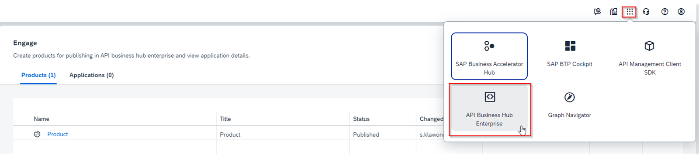
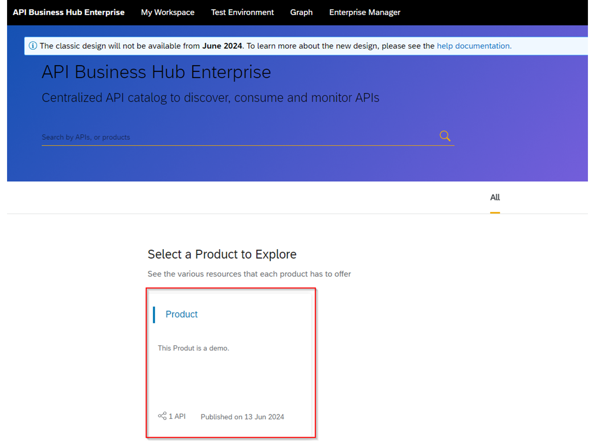
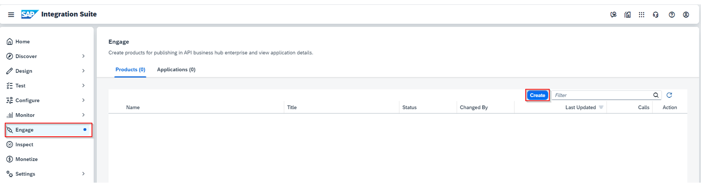
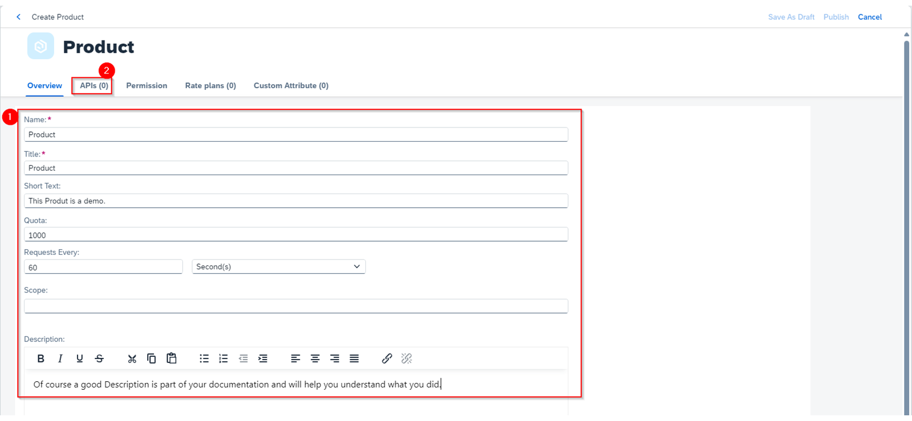
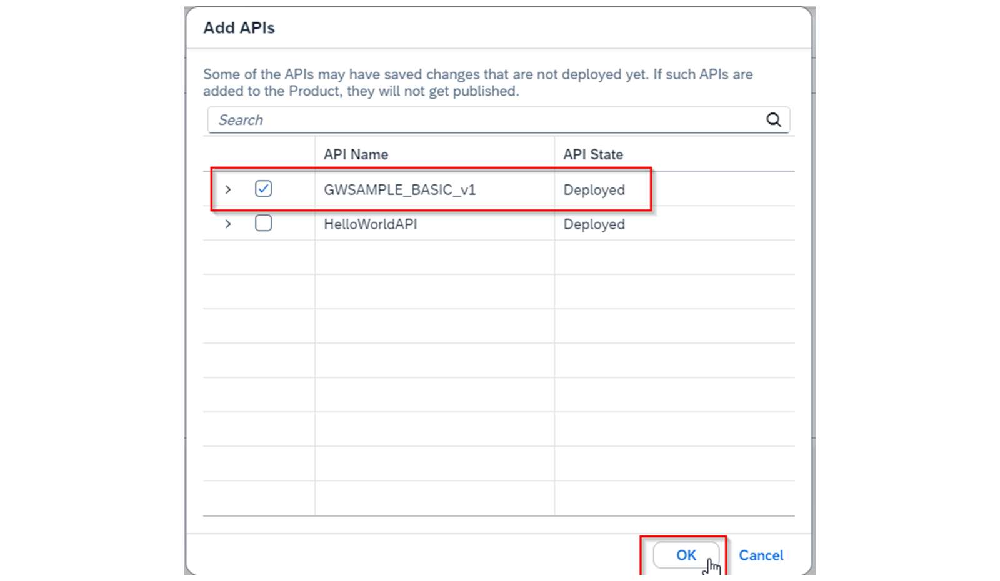
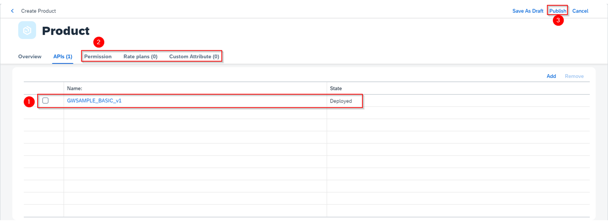
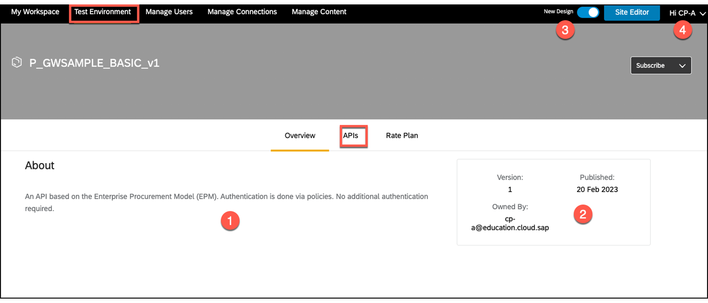
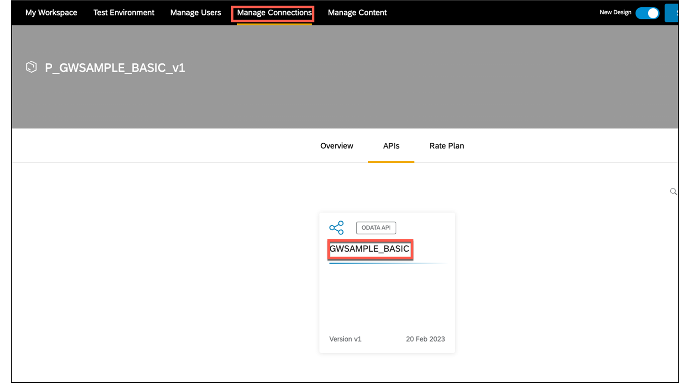
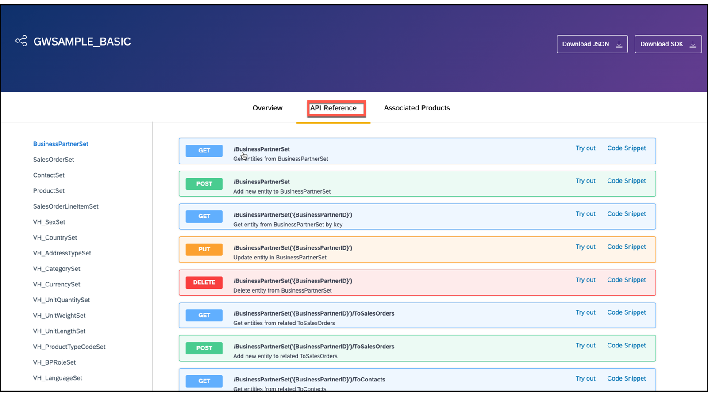
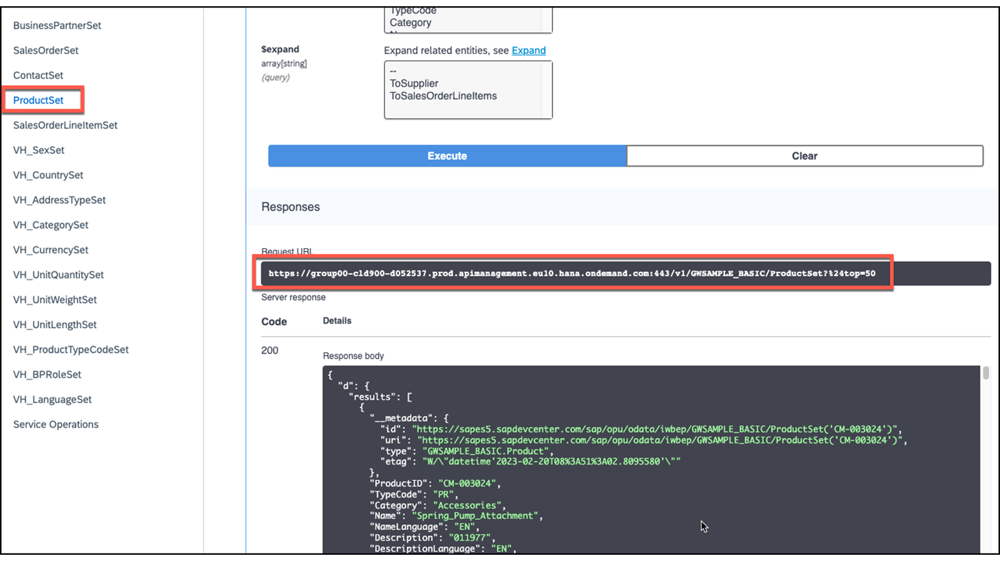

# 🌸 7 [CREATING A PRODUCT](https://learning.sap.com/learning-journeys/developing-with-sap-integration-suite/creating-a-product_fc942de6-ff7b-4263-bd2b-f33fe481bc3d)

> 🌺 Objectifs
>
> - [ ] Create a product

## 🌸 PRODUCT CREATION

### WHAT ARE PRODUCTS IN THE CONTEXT OF SAP API MANAGEMENT?

Les **Products** sont des [artefacts](../☼%20UNIT%200%20-%20Lexicon/♠%20Artefacts.md) qui apparaissent sur le **SAP API Business Hub Enterprise portal**.
Le **SAP API Business Hub Enterprise portal** est accessible à l'aide de sa propre URL. Il est accessible dans le **SAP Integration Suite cockpit** via la navigation dans le coin supérieur droit de l'interface.

Après avoir ouvert l'API **Business Hub Enterprise portal**, les **Products** sont affichés sous forme de [tiles]. L'[API](../☼%20UNIT%200%20-%20Lexicon/♠%20API.md) utilisée sous un **product** correspond à l'_URLduproxy API_ de l'[API](../☼%20UNIT%200%20-%20Lexicon/♠%20API.md) correspondante.

### NEEDED ROLES (ROLE COLLECTION) TO USE TGE API BUSINESS HUB ENTERPRISE

Pour ouvrir l'**API Business Hub Enterprise portal**, l'un des groupes de rôles suivants est requis :

- _AuthGroup.API.Admin_

- _AuthGroup.API.ApplicationDeveloper_

Nous avons déjà attribué les deux groupes de rôles à l'utilisateur lors du _provisionnement des fonctionnalités_ de **SAP Integration Suite**.

Si vous venez via _learning.sap.com_, vous devez alors attribuer votre compte utilisateur aux _collections de rôles_ mentionnées.

### OPEN AN API BUSINESS HUB ENTERPRISE PORTAL WITH PUBLISHED PRODUCTS AS A SAMPLE

Dans cette capture d'écran, vous pouvez voir un **product** déjà créé nommé _Product_ basé sur l'_API GWSAMPLE_BASIC_v1_.

Cette page est vide, si vous n'avez pas encore créé de **product**.

Les **products** peuvent ensuite être **recherchés**, **trouvés** et **consommés** par les développeurs.

### PROCEDURE FOR CREATING A PRODUCT

> 🍧 Note:
>
> You perform in step in the SAP Integration Suite Cockpit

Les étapes suivantes doivent être effectuées dans l'ordre suivant :

1. _Créez un Product_ à l'aide du bouton [Create]

2. _Ajoutez les entries_ sous l'onglet [Overview]

3. _Ajouter une API_ sous l'onglet [API]

4. Choisissez le bouton [Publier]

5. _Ouvrez_ l'**API Business Hub Enterprise portal**

6. _Découvrez_ votre **product**

### CREATE AND PUBLISH A PRODUCT

Une condition préalable à la création d’un **product** est une [API](../☼%20UNIT%200%20-%20Lexicon/♠%20API.md) fonctionnelle. La création est lancée à l'aide d'[Engage]. Ensuite, accédez à l'onglet [Product].

Choisissez le bouton [Create] pour démarrer la procédure.

Au moins les entrées suivantes doivent être effectuées :

#### 💮 **TAB : Overview** :

Le **Name** et les **tiles** doivent être les mêmes. Le **Title** est l'_en-tête_ de la **Tile**. La **description** est également affichée sur les **Tiles** et vise à donner à l'utilisateur les informations les plus importantes sur l'[API](../☼%20UNIT%200%20-%20Lexicon/♠%20API.md).

Exemple

     Nom : P_GWSAMPLE_BASIC_v1
     Titre : P_GWSAMPLE_BASIC_v1
     Description : Une API basée sur le modèle d'approvisionnement d'entreprise (EPM).

L'**Authentication** se fait à l'aide de policies. Aucune **Authentication** supplémentaire n'est requise. Les autres entrées comme [Quota], [Requests Every] et [Scope] sont **optionnelles** et doivent être définies via les **policies**.

Un exemple de paramètre est disponible ici : Créer un [Product](https://help.sap.com/docs/SAP_INTEGRATION_SUITE/51ab953548be4459bfe8539ecaeee98d/d7696221f36947a481b154335b89010d.html)

#### 💮 **TAB: APIs** :

Ici, vous pouvez choisir votre [proxy API](../☼%20UNIT%200%20-%20Lexicon/♠%20API%20Proxy.md) précédemment créé, que vous pouvez ajouter à votre **API product**. Lorsque vous sélectionnez le bouton [Add], toutes les [API](../☼%20UNIT%200%20-%20Lexicon/♠%20API.md) disponibles sont affichées. Vous pouvez **attribuer** n'importe quelle combinaison d'[API](../☼%20UNIT%200%20-%20Lexicon/♠%20API.md) affichées. Il est également possible de **combiner** des **ressources individuelles**.

Dans le cas suivant, l'intégralité (toutes les ressources) de l'_API GWSAMPLE_BASIC_v1_ est ajoutée.

Les entrées sous les onglets [Permissions], [Rate plans] (Plans tarifaires) et [Custom Attributes] (Attributs personnalisés) sont **facultatives**.

Un exemple de paramètre d'attributs personnalisés est décrit ici : [Attributs personnalisés](https://help.sap.com/docs/SAP_INTEGRATION_SUITE/51ab953548be4459bfe8539ecaeee98d/90a5a6d2a75f4426964ec85c49faef88.html)

#### 💮 Publish Your Product

Une fois le **product** configuré, la **product implementation** doit être **published** sur l'**API Business Hub Enterprise portal**.

#### 💮 Show Products at API Business Hub Enterprise Portal

L'**API Business Hub Enterprise portal** est sa propre application. Cela a été fourni avec **SAP management**.

L'**API Business Hub Enterprise portal** est **connecté** à **API Management** via sa **propre URL**. Ceux-ci peuvent être vérifiés sous [Settings] → [API] si des problèmes surviennent.

Après avoir ouvert le **API Business Hub Enterprise portal**, comme décrit précédemment, tous les **products** publiés s'affichent sous forme de [Tiles].

### NAVIGATE TO YOUR PRODUCT

Pour le moment, vous avez encore la possibilité de choisir entre **deux représentations**. Nous utilisons le nouveau design.

Accédez à la [Tile] et vous êtes redirigé vers l'onglet [Test Environment].

Explications :

- _N°1_ : Voici votre _description_ du **product**

- _N°2_ : Voici les _métadonnées_ du **product**
- _N°3_ : La _décision_ de conception
- _N°4_ : L'_utilisateur_ connecté

Pour tester l'[API](../☼%20UNIT%200%20-%20Lexicon/♠%20API.md), accédez à l'onglet [API].

Ici, vous pouvez maintenant voir le _titre_ de l'[API](../☼%20UNIT%200%20-%20Lexicon/♠%20API.md) attribuée. Dans ce cas, il s'agit de _GWSAMPLE_BASIC_.

- L'**API name** est _GWSAMPLE_BASIC_v1_

- Le **product name** est _P_GWSAMPLE_BASIC_v1_.

### NAVIGATE TO YOUR API

Lorsque vous sélectionnez la [Tile] avec le titre de l'[API](../☼%20UNIT%200%20-%20Lexicon/♠%20API.md) associée, vous êtes dans l'[API](../☼%20UNIT%200%20-%20Lexicon/♠%20API.md).

Sous l'onglet [API Reference], vous trouverez le **Swagger UI** pour appeler les ressources attribuées.

Si vous testez avec succès une ressource sélectionnée, ici _GET/ProductSet_, vous verrez l'**URL proxy** bien connue de **SAP API Management** en tant que **Request URL**.

### API BUSINESS HUB ENTERPRISE PORTAL AT GLANCE

L'**API Business Hub Enterprise portal** offre une plateforme pour déployer des **product** avec vos **API associées**, de manière **centralisée** dans votre entreprise. C'est le seul endroit où les développeurs **recherchent**, **trouvent** et **testent** les [API](../☼%20UNIT%200%20-%20Lexicon/♠%20API.md), et utilisent finalement l'**URL proxy** correspondante dans leurs propres processus. A cet effet, l'**API Business Hub Enterprise portal** propose les éléments suivants :

- _Your own user management_

- _A role-based access to the products_

- _An additional authentication Layer with its own API key_

- _A self-registration Unknown developer_

### RESOURCES

Des ressources sont disponibles dans l'aide SAP : [SAP Help Portal](https://help.sap.com/docs/SAP_CLOUD_PLATFORM_API_MANAGEMENT/66d066d903c2473f81ec33acfe2ccdb4/7d8514b4ab46455e8416723003b414d7.html?locale=en-US)

Des ressources sont également disponibles sur les blogs : [Protégez votre proxy API en ajoutant la vérification des clés d'application | Tutoriels pour les développeurs SAP](https://developers.sap.com/tutorials/hcp-apim-verify-api.html)

### SUMMARY

> Un produit dans le contexte de SAP API Management est son propre artefact qui encapsule les [API](../☼%20UNIT%200%20-%20Lexicon/♠%20API.md) créées ou des parties d'entre elles (ressources). Le product est configuré et déployé (publié) sur l'API Business Hub Enterprise portal. Le product peut être testé sur l'API Business Hub Enterprise portal. L'accès aux produits est restreint par les rôles.

## 🌸 CREATE A PRODUCT BASED ON YOUR CREATED API

[Exercices](https://learning.sap.com/learning-journeys/developing-with-sap-integration-suite/creating-a-product_fc942de6-ff7b-4263-bd2b-f33fe481bc3d)
