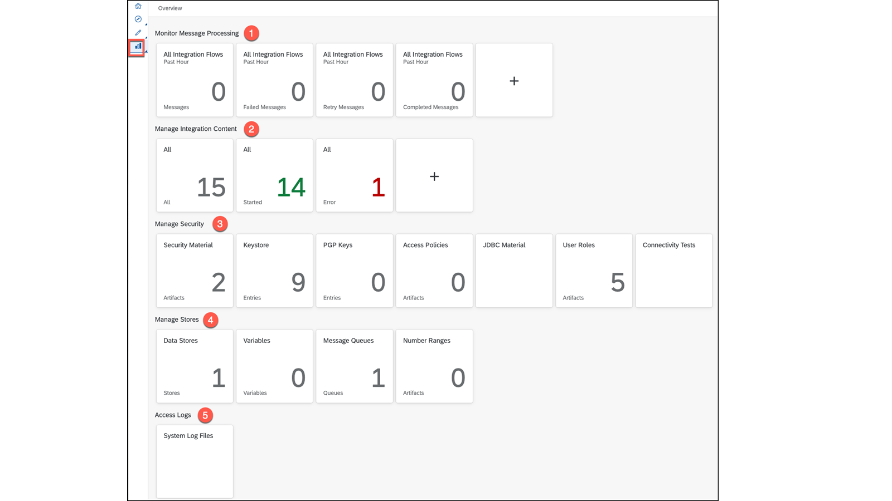
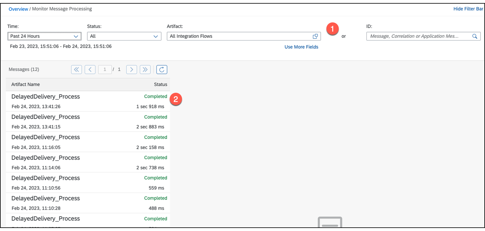
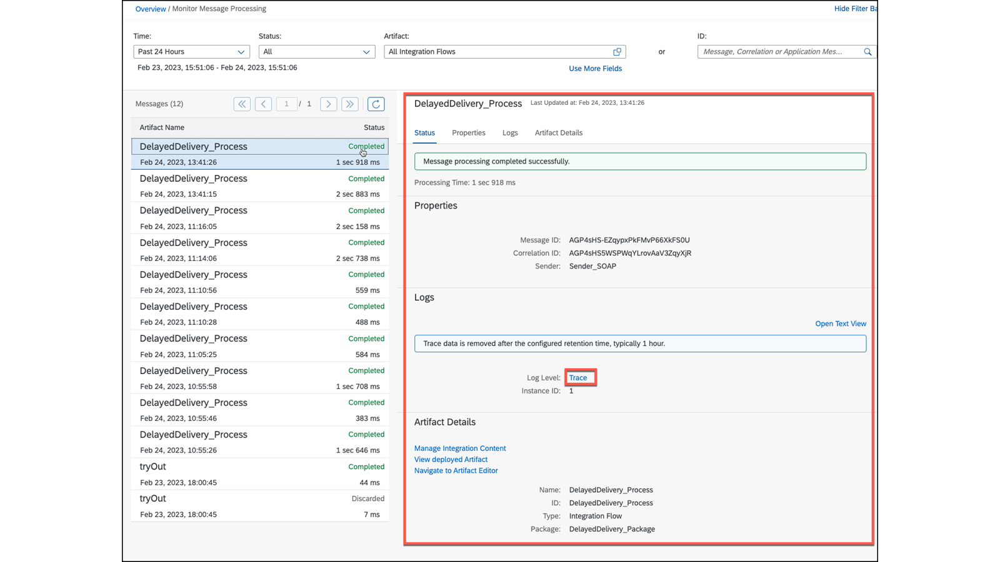
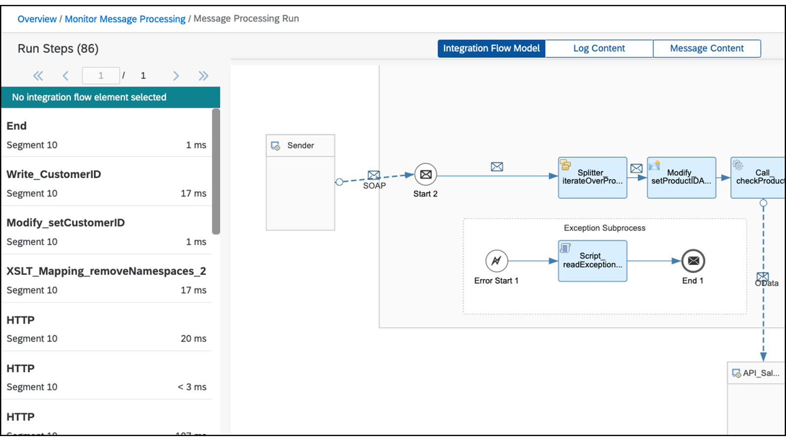
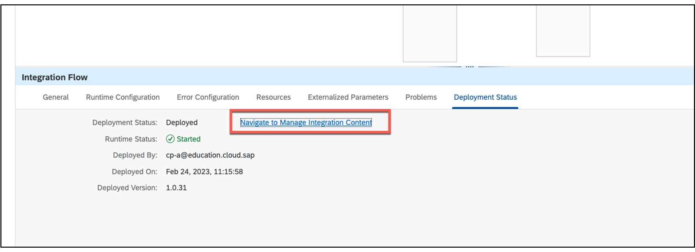
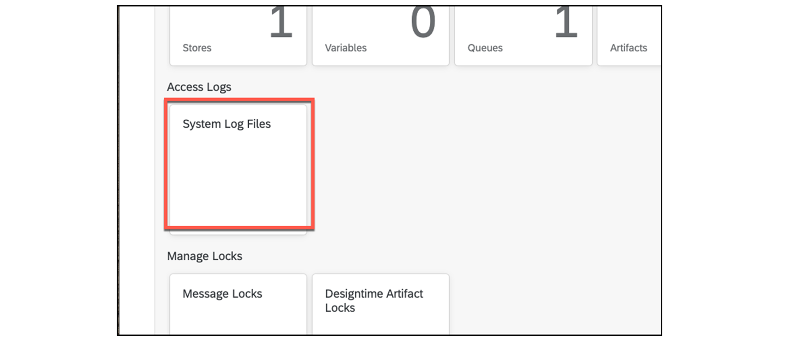
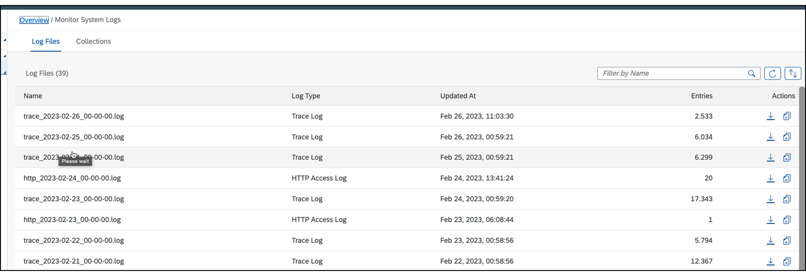
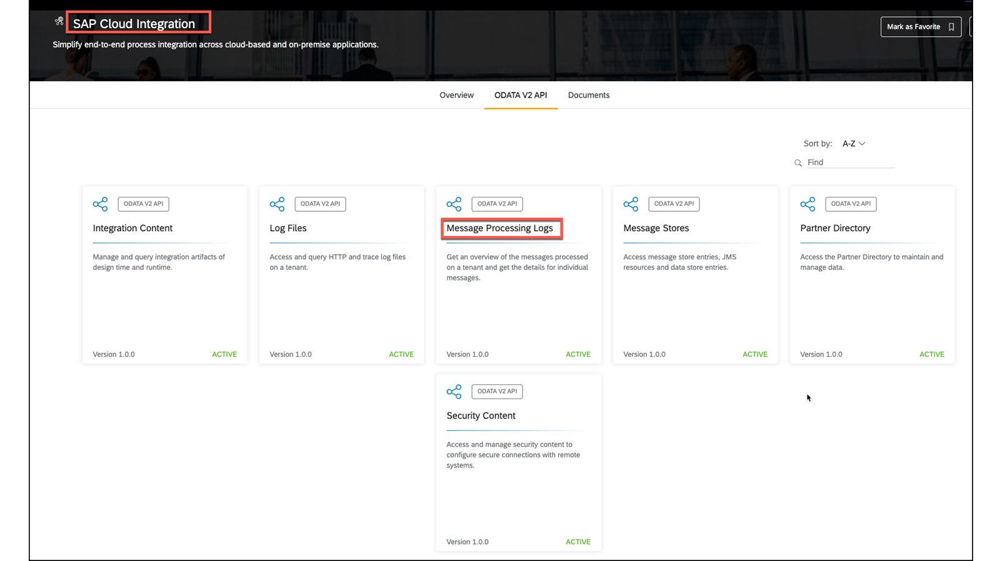
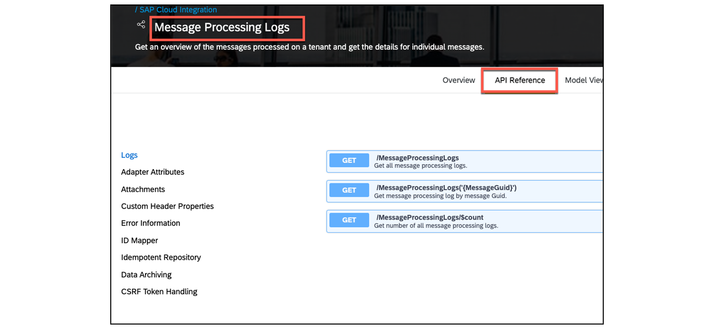
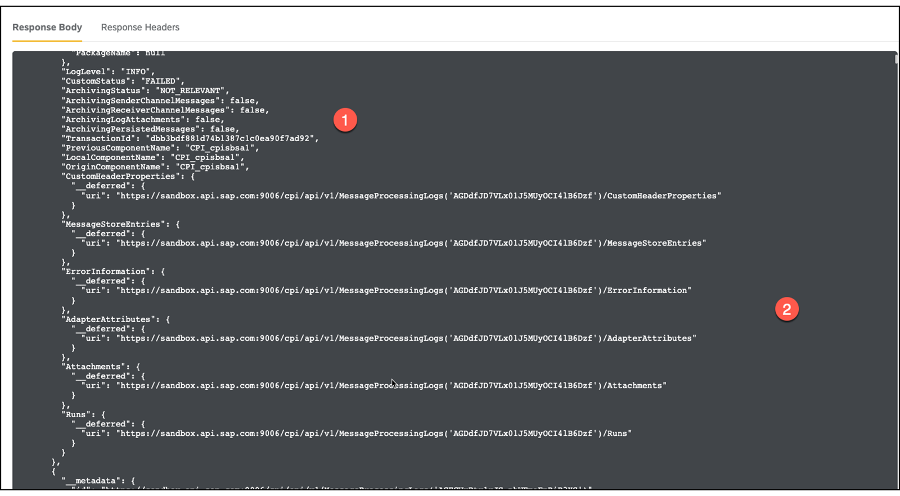

# 🌸 3 [USING MESSAGE MONITORING AND LOGGING](https://learning.sap.com/learning-journeys/developing-with-sap-integration-suite/using-message-monitoring-and-logging_cbf56a9f-63f2-4fe2-af39-43cc48b490c8)

> 🌺 Objectifs
>
> - [ ] Use message monitoring and loggin

## 🌸 USING MESSAGE MONITORING AND LOGGING

### TYPES OF MONITORING

En plus du **standard built-in monitor** (moniteur intégré standard), divers **outils** peuvent être utilisés avec **Cloud Integration Monitoring**.

Il propose différentes catégories, notamment la **message monitoring**, le **content management** et l'**alert management**.

Dans cette discussion, nous nous concentrons sur le **message monitoring** à l'aide du **built-in monitor** pour les _messages_ et du **SAP Cloud Integration API** pour le **Message Processing Logs API**.

Il existe une section de présentation utile qui met en évidence les points forts de chaque outil.

- _SAP Cloud ALM_

- _SAP Solution Manager_

- _SAP Focused Run SAP Analytics Cloud_

- _SAP Application Interface Framework_

- _Cloud Integration OData APIs_

### BUILD-IN MONITOR FOR MESSAGE MONITORING

La leçon s'applique à la **collection de rôles PI_Integration_Developer**, tandis que les exercices utilisent la **collection de rôles PI_Administrator**, ce qui peut entraîner des différences dans la présentation. Lors de la connexion via le [monitor menu], le desktop suivant vous est présenté, où n'importe quelle view peut être configurée individuellement en cliquant sur le [plus sign].

- N° 1 : _Monitor Message Processing_

- N° 2 : _Manage Integration Content_

- N° 3 : _Manage Security - Admin Place_

- N° 4 : _Manage Stores_

- N° 5 : _Access Log_

Ici, nous nous intéressons uniquement au passage au **message monitoring** (n°1) et aà l'**Access Log** (n°5). Tous les autres domaines concernent principalement les **administrateurs d'intégration**.

### MONITOR MESSAGE PROCESSING AREA

L'**overview** affiche tous les **messages traités** dans tous les **integration flows déployés** et peut être **filtrée**. Il permet également un **accès direct au message traité**.

### THE MESSAGE AT THE STATUS COLUMN CAN HAVE DIFFERENT VALUES

- _Completed_

- _Processing_

- _Retry_

- _Escalated_

- _Failed_

- _Canceled_

- _Discarded_

- _Abandoned_

### SAMPLE WITH MESSAGE STATUS COMPLETED

1. Ouvrir [Monitor Artifacts] → [Overview] → [Manage Integration Content]

   

   - No. 1: the [filter bar]

   - No. 2: a message with status [complete].

2. Choisissez le message avec le statut [complete] :

   

   Sur le côté droit de la fenêtre se trouve une autre section qui fournit une multitude d'informations sur le **message processing**. Lorsque le **log level** est défini sur [info], cette section sert de **primary monitor**.

   Cependant, si le **log level** est défini sur [trace], vous pouvez accéder au **debugging mode** du **process flow**, que nous avons déjà rencontré dans l'exercice.

   

### JUMP IN DIRECTLY FROM YOUR INTEGRATION FLOW

Une version plus concise pourrait être : "Vous pouvez naviguer de l'integration flows à la section des [artefacts](../☼%20UNIT%200%20-%20Lexicon/♠%20Artefacts.md) du **moniteur** à l'aide du lien [Navigate to Manage Integration Content], qui ouvre le **moniteur** dans un nouvel onglet pour une navigation plus facile." Celui-ci est utilisé dans les exercices, et permet d'accéder à toutes les informations sur le traitement via différents onglets.

Cette approche est utilisée dans les exercices de cette formation. Toutes les informations sur le traitement sont accessibles via les différents onglets.

### SYSTEM LOG FILES

L'**Access Logs section** du **Build-In Monitor** (moniteur intégré) fournit un accès direct aux **System Log files** (fichiers journaux système) via la **System Log Files tile**. Ces fichiers incluent l'**accès** et la **trace HTTP** et sont conservés pendant **30 jours**.

Après avoir ouvert la [tile], vous avez accès aux **system logs** (journaux système).

### SAP CLOUD INTEGRATION API FOR MESSAGE PROCESSING LOGS

Le **moniteur** lui-même est basé sur une **API d'intégration cloud**. Pour l'examiner, accédez à : [api.sap.com](https://api.sap.com/) et recherchez l'**API SAP Cloud Integration**.

Retrouvez les API ici : [API.SAP.com](https://api.sap.com/).

Ouvrez la [tile] [Message Processing Logs] → [API Reference]. Nous pouvons maintenant examiner l'API avec le **Swagger UI** (interface utilisateur Swagger).

Essayez _GET /MessageProcessingLogs_.

- Au (n°1), vous retrouvez les _métadonnées_ de ce message.

- Au (n°2), la _navigation_ se fait à gauche pour examiner des _informations spécifiques_.

### CONFIGURE THE API ACCESS

Si un **utilisateur** se voit attribuer la **Role Collection PI_Administrator** ou **PI_Integration_Developer**, il peut accéder directement à l'[API](../☼%20UNIT%200%20-%20Lexicon/♠%20API.md) à l'aide de ses informations d'identification.

- L'_URL Scheme_ est :

  https://{{hôte}}/api/v1/

- Exemple de _fichiers Resource LogFiles_

  Appelez l'URL suivante avec votre propre **subdomain** et **région **: https://..hana.ondemand.com:443/api/v1/LogFiles

### EXTERNAL LOGGING

Pour être **indépendant** de la taille de la **SAP Cloud Integration database** et gérer un grand nombre de **log files**, les clients peuvent utiliser la fonctionnalité de **logging externe** pour envoyer les **message processing logs** à un **système externe**. Cette section fournit des instructions sur la façon d'activer cette fonctionnalité sur votre locataire.

### RESOURCES

En savoir plus:

#### 💮 **Types of Monitoring** :

Lisez l'intégralité de l'histoire : [Outils de surveillance pour la capacité d'intégration cloud de SAP Integration Suite | Blogues SAP](https://blogs.sap.com/2021/10/28/monitoring-tools-for-cloud-integration-capability-of-sap-integration-suite/)

#### 💮 **Build-In Monitor for Message Monitoring** :

Voici un aperçu des sections de la page de démarrage du moniteur : [Surveillance](https://help.sap.com/docs/CLOUD_INTEGRATION/368c481cd6954bdfa5d0435479fd4eaf/05446d0616d44e1daf821c273b69fcc6.html?locale=en-US&q=Camel)

#### 💮 **Message Status** :

Trouvez un aperçu complet et une description sur : [Statut du message](https://help.sap.com/docs/CLOUD_INTEGRATION/368c481cd6954bdfa5d0435479fd4eaf/733a57b10f504ac9b2b5aa7fda664dc5.html?locale=en-US&q=Camel)

#### 💮 **External Logging** :

[Journalisation externe](https://help.sap.com/docs/CLOUD_INTEGRATION/368c481cd6954bdfa5d0435479fd4eaf/ad719c1c2ecb48b6ba275d2b0ee2ba7a.html?locale=en-US)

### SUMMARY

> SAP propose divers produits pour prendre en charge la support message monitoring (surveillance des messages), tels que SAP Cloud ALM, SAP Solution Manager, SAP Focused Run, SAP Analytics Cloud, etc. De plus, SAP Cloud Integration fournit son propre graphical monitor, qui offre une vue complète du processing des messages. Le moniteur permet aux utilisateurs de lire les system log files (fichiers journaux du système) et repose sur une [API](../☼%20UNIT%200%20-%20Lexicon/♠%20API.md), qui peut être directement appelée. Cette [API](../☼%20UNIT%200%20-%20Lexicon/♠%20API.md) permet aux utilisateurs de créer leur propre moniteur personnalisé.

## 🌸 CREATE A TIMER IN PLACE OF THE MESSAGE START EVENT

[Exercices](https://learning.sap.com/learning-journeys/developing-with-sap-integration-suite/using-message-monitoring-and-logging_cbf56a9f-63f2-4fe2-af39-43cc48b490c8)
