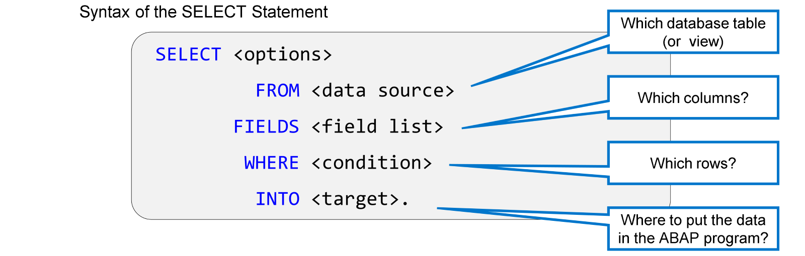

# 🌸 18 [BASIC SELECT](https://learning.sap.com/learning-journeys/acquire-core-abap-skills/implementing-basic-select-statements_a6d4effa-f6b0-4ef8-96c8-b79baa2da157)

## 🌸 TASK: BASIC SELECT



```
CLASS zcl_fgi_hello_world DEFINITION

  PUBLIC
  FINAL
  CREATE PUBLIC .

  PUBLIC SECTION.

    INTERFACES if_oo_adt_classrun .

  PROTECTED SECTION.
  PRIVATE SECTION.

ENDCLASS.


CLASS zcl_fgi_hello_world IMPLEMENTATION.

  METHOD if_oo_adt_classrun~main.

    " 1. BASIC SELECT -> lcl_basic_select
    DATA: article  TYPE REF TO lcl_basic_select,
          articles TYPE TABLE OF REF TO lcl_basic_select,
          lv_matnr TYPE matnr.

* First Instance
**********************************************************************
    TRY.
        article = NEW #(
                            i_matnr = 'TG12'
                          ).

        APPEND article TO articles.

      CATCH cx_abap_invalid_value.
        out->write( `Method call failed` ).
    ENDTRY.

* Second instance
**********************************************************************
    TRY.
        article = NEW #(
                            i_matnr = 'EWMS4-03'
                          ).

        APPEND article TO articles.

      CATCH cx_abap_invalid_value.
        out->write( `Method call failed` ).
    ENDTRY.

* Third instance
**********************************************************************
    TRY.
        article = NEW #(
                            i_matnr = 'AAAAGJHGSJH'
                          ).

        APPEND article TO articles.

      CATCH cx_abap_invalid_value.
        out->write( `Method call failed` ).
    ENDTRY.

* Output
**********************************************************************
    LOOP AT articles INTO article.
      out->write( article->get_article_description( ) ).
    ENDLOOP.

  ENDMETHOD.

ENDCLASS.
```

```
CLASS lcl_basic_select DEFINITION.

  PUBLIC SECTION.

    DATA: lv_matnr TYPE matnr,
          lv_ersda TYPE ersda,
          lv_aenam TYPE aenam.

    CLASS-DATA lv_article_counter TYPE i READ-ONLY.


    METHODS constructor
      IMPORTING
        i_matnr TYPE matnr
      RAISING
        cx_abap_invalid_value.


    METHODS get_article_description
      RETURNING
        VALUE(r_output) TYPE string_table.


  PROTECTED SECTION.
  PRIVATE SECTION.

ENDCLASS.


CLASS lcl_basic_select IMPLEMENTATION.


  METHOD constructor.

    IF i_matnr IS INITIAL.
      RAISE EXCEPTION TYPE cx_abap_invalid_value.
    ENDIF.

    me->lv_matnr = i_matnr.

    lv_article_counter = lv_article_counter + 1.

  ENDMETHOD.


  METHOD get_article_description.

    SELECT SINGLE
      FROM mara
      FIELDS aenam, ersda
      WHERE matnr = @lv_matnr
      INTO ( @lv_aenam, @lv_ersda ).
    IF sy-subrc = 0.

      APPEND |-----------------------------------| TO r_output.
      APPEND |Counter:     { lv_article_counter }| TO r_output.
      APPEND |Article:     { lv_matnr           }| TO r_output.
      APPEND |Modifié par: { lv_aenam           }| TO r_output.
      APPEND |Créé le:     { lv_ersda           }| TO r_output.

    ENDIF.


  ENDMETHOD.

ENDCLASS.
```
