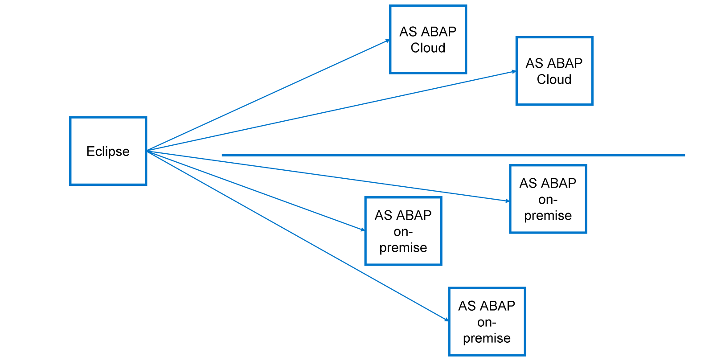
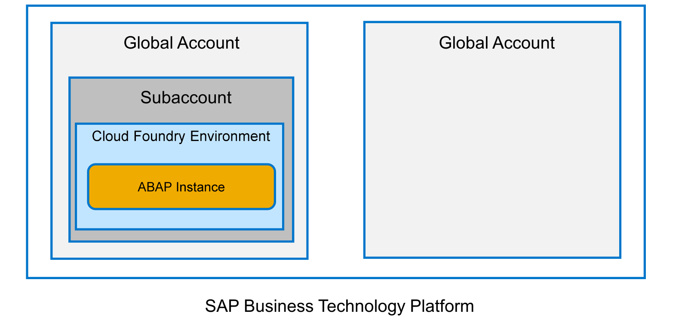

# 🌸 1 [PREPARING THE DEVELOPMENT ENVIRONMENT](https://learning.sap.com/learning-journeys/acquire-core-abap-skills/preparing-the-development-environment_bc84941b-b4e6-4a6a-9b71-bb5b80e4a4ce)

> 🌺 Objectifs
>
> - [ ] Vous pourrez créer un projet ABAP Cloud

## 🌸 ABAP CLOUD PROJECT

Pour développer des applications ABAP pour SAP BTP, vous devez d'abord installer et préparer l'environnement de développement Eclipse. Regardez cette vidéo pour savoir comment procéder.

[Référence - Link Vidéo](https://learning.sap.com/learning-journeys/acquire-core-abap-skills/preparing-the-development-environment_bc84941b-b4e6-4a6a-9b71-bb5b80e4a4ce)

Eclipse, en tant qu'environnement de développement, n'est pas intégré au système ABAP. Vous devez donc vous connecter à chaque système ABAP sur lequel vous souhaitez travailler, et chaque connexion est représentée dans Eclipse par un **Project**. Il existe deux types de **Projects** dans ADT : les **ABAP Projects**, qui permettent de se connecter à un système ABAP sur site, et les **ABAP Cloud Projects**, qui permettent de se connecter soit à **SAP BTP ABAP**, soit à **SAP S/4HANA Cloud**.

> #### 🍧 Note
>
> Dans ce qui suit, nous allons uniquement discuter de la manière d’accéder à un système cloud.

### LOCATING THE ABAP ENVIRONMENT

**SAP Business Technology Platform** est la plateforme SAP en tant que service (**PAAS**). Pour y accéder, vous devez créer un **global account**. Différents **subscription models** (modèles d'abonnement) sont disponibles, selon que vous ayez besoin d'exécuter des environnements productifs à grande échelle ou simplement d'un environnement mono-utilisateur pour votre propre développement professionnel continu.

Un **global account** comprend un ou plusieurs **subaccounts**. Chaque **subaccount** peut être configuré différemment, de sorte qu'une entreprise peut exécuter plusieurs plateformes différentes tout en gérant son abonnement via un seul **global account**. Dans ce **subaccount**, vous déployez un environnement d'exécution tel que **Cloud Foundry** ou **Kyma**. Une fois cette opération effectuée, vous pouvez déployer une **instance ABAP**.

> #### 🍧 Note
>
> Dans ce cours, nous utilisons une instance ABAP déployée sur SAP Business Technology Platform (SAP BTP). Cependant, ce cours est également pertinent pour d'autres déploiements ABAP, tels qu'un système SAP S/4HANA sur site ou un système SAP S/4HANA Cloud.
