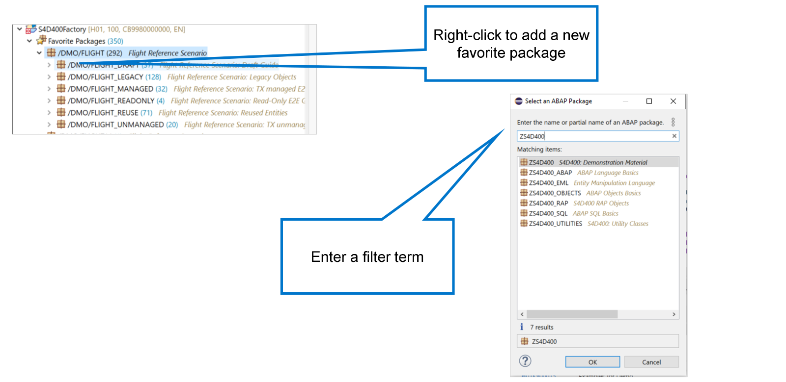
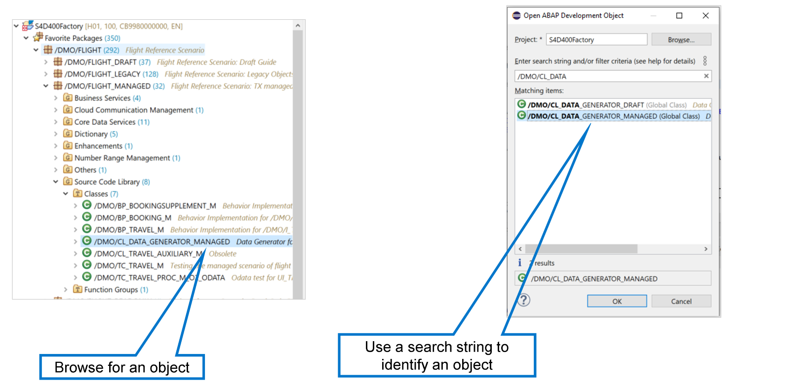
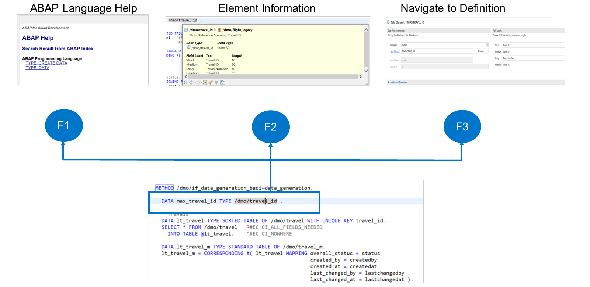

# 🌸 2 [TAKING A FIRST LOOK AT ABAP](https://learning.sap.com/learning-journeys/acquire-core-abap-skills/taking-a-first-look-at-abap_deb518e7-5030-48b9-9389-6507b48cf524)

> 🌺 Objectifs
>
> - [ ] Vous serez capable de travailler avec un objet de développement

## 🌸 INVESTIGATING OF ABAP CODE

### WORKING IN THE PROJECT EXPLORER

Pour travailler avec des objets de développement ABAP, vous affichez généralement le contenu d'un **Package** dans l'explorateur de projets. Les **Package**s sont des conteneurs d'objets de développement logiquement liés.

Pour ajouter un **Package** à vos favoris, faites un clic droit sur le nœud **Favorite Package** dans l'explorateur de projets et sélectionnez **Add Package...** ». Une boîte de dialogue apparaît, vous permettant de saisir un terme de filtrage. Le système affiche alors uniquement les **Packages** contenant ce terme. Double-cliquez sur le **Package** à ajouter à vos favoris.

### OPENING DEVELOPMENT OBJECTS

Il existe deux manières d’ouvrir un objet de développement dans ADT.

La première méthode consiste à localiser le nom de l'objet dans l'explorateur de projets et à double-cliquer dessus. L'autre méthode consiste à utiliser le raccourci clavier [Ctrl] + [Maj] + [A]d. Une boîte de dialogue s'ouvre alors pour saisir une partie du nom de l'objet.

## 🌸 INVESTIGATING A DEVELOPMENT OBJECT

Lorsque vous travaillez avec du code ABAP, certaines touches de fonction d'ADT peuvent vous être utiles.

Examinons ces touches de fonction.

| Shortcut |                                                                                                                                                                                                     |
| -------- | --------------------------------------------------------------------------------------------------------------------------------------------------------------------------------------------------- |
| F1       | The F1 key displays the ABAP language help for the current statement. A statement is the name for a command in ABAP.                                                                                |
| F2       | The F2 key displays information about the element on which the cursor is placed.                                                                                                                    |
| F3       | The F3 key navigates to the definition of the object on which the cursor is placed. You can return from there to the original object using the key combination, ALT + LEFT ARROW, on your keyboard. |
