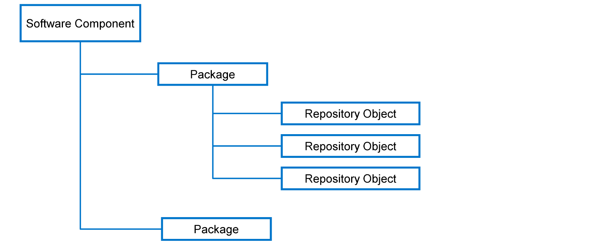
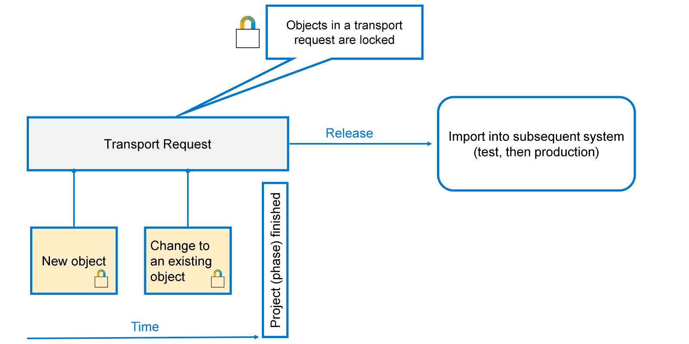

# 🌸 3 [UNDERSTANDING SOFTWARE STRUCTURE AND LOGISTICS](https://learning.sap.com/learning-journeys/acquire-core-abap-skills/understanding-software-structure-and-logistics_e97e5b6e-74f5-45d5-aabb-79c94fe0617c)

> 🌺 Objectifs
>
> - [ ] Vous pourrez créer un **package** ABAP

## 🌸 ABAP **PACKAGE**

### ORGINIZING DEVELOPMENT

d

Lorsque vous créez un objet de développement dans l'environnement ABAP, vous devez l'affecter à un **package**. Les **packages** servent de conteneurs pour tous les objets de développement qui appartiennent logiquement ensemble. Chaque **package** est également affecté à un **software component**. L'ensemble des objets de développement du système est appelé **ABAP Repository**. Par conséquent, les objets de développement sont souvent appelés **repository objects**.

Vous développez vos applications dans un environnement de développement, mais vous devez ensuite vous assurer qu'elles peuvent être testées dans un environnement de test approprié avant de les transférer vers l'environnement de production. En général, vous disposez d'un **global account** unique et d'un **subaccount** pour chacun des environnements de développement, de test et de production. Les composants logiciels vous permettent de transporter vos objets.

### TRANSPORT REQUEST

Lorsque vous créez un nouvel objet de développement ou modifiez un objet existant, vous devez l'affecter à une **transport request**. Les **transport requests** garantissent que tous les objets de développement logiquement liés sont transportés ensemble vers le système de **Dev**, puis vers le système de **Prod**.

Chaque **transport request** a un propriétaire, qui peut lui affecter d'autres utilisateurs. Ainsi, les **transport requests** soutiennent le développement en équipe.

Lorsqu'un objet est inclus dans une **transport request**, il est verrouillé. Cela signifie qu'il ne peut être modifié que par un utilisateur affecté à la même requête.

Une fois le travail sur tous les objets de la requête terminé, tous les développeurs affectés doivent **release** leur travail. Ensuite, le propriétaire de la requête peut **release** l'intégralité de la requête. Si la **transport request** appartient à un **software component transportable** (**transportable software component**), l'administrateur système peut l'importer dans le système de test pour le tester.

Lorsque vous libérez une **transport request**, le système **release** les verrous des objets de la requête, permettant ainsi à tout développeur d'y accéder à nouveau.

#### 💮 **Pour les méthodes** :

> #### 🍧 [Definition]()
>
> Le terme Workbench désigne l'environnement de développement bureautique d'Eclipse. Il permet de modifier des objets, de gérer des **views** et d'organiser l'espace de travail du développeur.

> #### 🍧 Note

[Référence - Link Vidéo](link)

[Exercices](./assets/hands_on.pdf)
