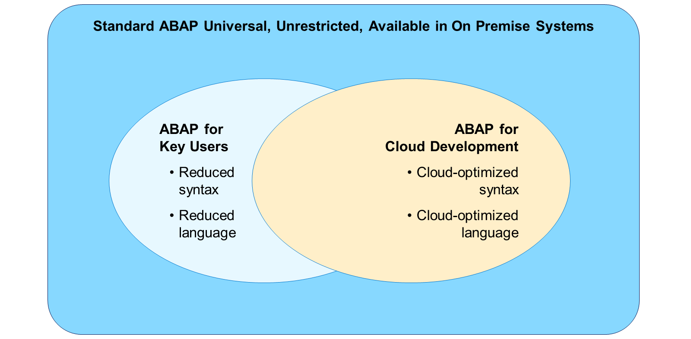
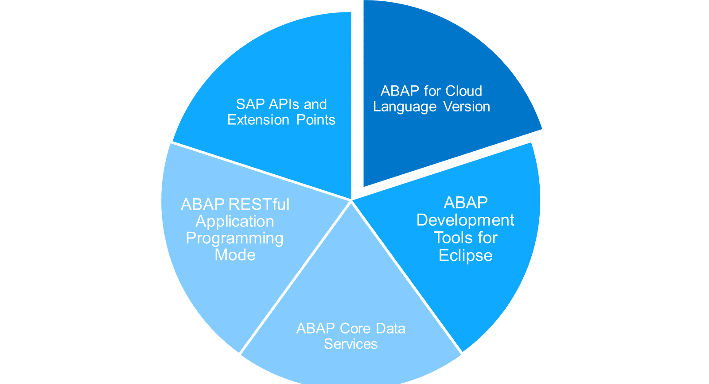
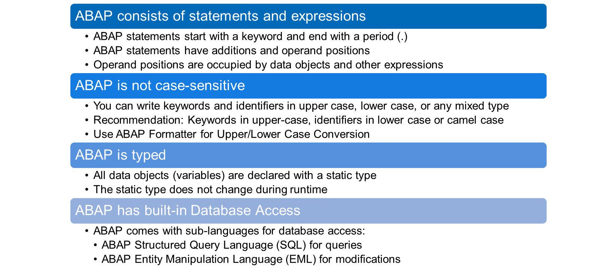

# 🌸 1 [UNDERSTANDING THE BASICS OF ABAP](http://learning.sap.com/learning-journeys/acquire-core-abap-skills/understanding-the-basics-of-abap_c0e5346f-a136-4b9f-a167-9031eca12932)

> 🌺 Objectifs
>
> - [ ] Décrire l'évolution d'ABAP
>
> - [ ] Décrire les bases de la syntaxe ABAP

## 🌸 ABAP THEN AND NOW

### ORIGIN AND EVOLUTION OF ABAP

[Référence - Link Vidéo](https://learning.sap.com/learning-journeys/acquire-core-abap-skills/understanding-the-basics-of-abap_c0e5346f-a136-4b9f-a167-9031eca12932)

### ABAP LANGUAGE VERSIONS

Chaque programme ABAP possède l'attribut « Version du langage ABAP », défini en interne par un **version ID**. La version d'un programme détermine les éléments de langage et les **repository objects** utilisables, ainsi que les règles de syntaxe applicables. Les versions suivantes sont actuellement disponibles :

#### 💮 **Standard ABAP** :

Cette version d'ABAP est la version de base universelle. Il s'agit d'une version du langage ABAP sans restriction, couvrant l'intégralité du périmètre du langage ABAP et utilisable dans les systèmes Unicode. Outre le concept de package statique, l'accès à tous les autres **repository objects** est autorisé. La vérification de la syntaxe pour ABAP Standard est effectuée comme une vérification Unicode, ce qui constitue la configuration minimale requise pour un système Unicode.

#### 💮 **ABAP for Key Users** :

Cette version d'ABAP est destinée à la mise en œuvre sécurisée des améliorations par les utilisateurs clés dans le cadre des options d'amélioration fournies par SAP. ABAP pour les utilisateurs clés est une version du langage ABAP restreinte où les règles générales d'ABAP Standard s'appliquent, mais où seul un ensemble très restreint d'éléments de langage est pris en charge et où l'accès aux **repository objects** est restreint.

#### 💮 **ABAP for Cloud Development** :

Cette version d'ABAP est destinée aux développements dans les environnements **ABAP SAP BTP** et **S/4HANA Cloud**. ABAP pour le développement cloud est une version à langage ABAP restreint où les règles générales d'ABAP standard s'appliquent, mais seul un ensemble restreint d'éléments de langage est pris en charge et l'accès aux **repository objects** est restreint.

> #### 🍧 Note
>
> Ce cours offre une introduction universelle au développement ABAP. Il se limite aux éléments de syntaxe et aux fonctionnalités du langage disponibles dans les trois versions. L'introduction au modèle de programmation d'applications RESTful ABAP, qui ne fait pas partie d'ABAP pour les utilisateurs clés, constitue une exception.

### **ABAP CLOUD**

Le langage ABAP pour le développement cloud est un élément clé d'**ABAP Cloud**. Le cœur technologique d'**ABAP Cloud** définit l'architecture de conception et d'exécution de l'ensemble des extensions, services et applications. Les principaux éléments d'**ABAP Cloud** sont :

- **ABAP for Cloud Development**, langage ABAP optimisé pour le cloud et dédié à la logique métier ;

- **ABAP Development Tools** pour Eclipse, environnement de développement intégré ABAP ;

- **ABAP Core Data Services (CDS)** pour le modèle de données et l'analyse intégrée ;

- **ABAP RESTful Application Programming Model** pour la création d'applications et de services ;

- **Mandatory public SAP APIs and extension points** pour l'automatisation des opérations cloud et une extensibilité stable tout au long du cycle de vie.

L'utilisation d'**ABAP Cloud** est obligatoire sur **SAP Business Technology Platform** et **SAP S/4HANA Cloud** (édition publique). Il n'est pas obligatoire, mais fortement recommandé, de suivre les principes d'**ABAP Cloud** sur **SAP S/4HANA** (édition privée) et sur les systèmes sur site. En implémentant vos développements personnalisés avec **ABAP Cloud**, vos développements sont prêts pour le cloud par défaut et vous ne modifiez pas la composition du système central, ce qui est un principe important pour la maintenance du système dans un environnement cloud (approche Clean Core).

## 🌸 THE BASICS OF THE ABAP SYNTAX

### SOME BASIC FEATURES OF THE ABAP LANGUAGE

[Référence - Link Vidéo](https://learning.sap.com/learning-journeys/acquire-core-abap-skills/understanding-the-basics-of-abap_c0e5346f-a136-4b9f-a167-9031eca12932)

### COMMENTS IN ABAP

[Référence - Link Vidéo](https://learning.sap.com/learning-journeys/acquire-core-abap-skills/understanding-the-basics-of-abap_c0e5346f-a136-4b9f-a167-9031eca12932)
