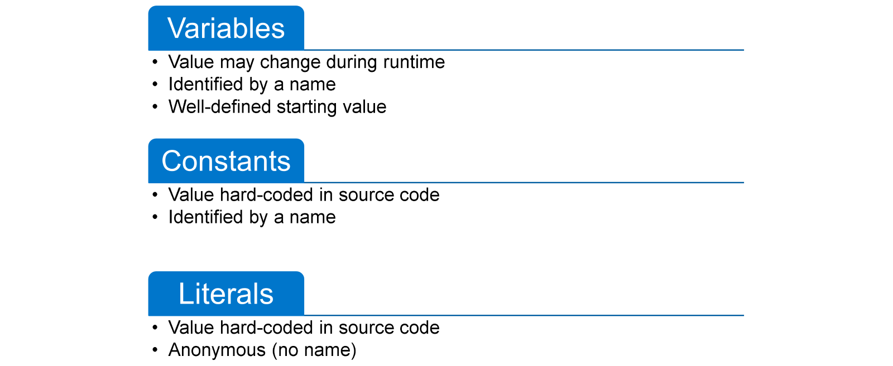
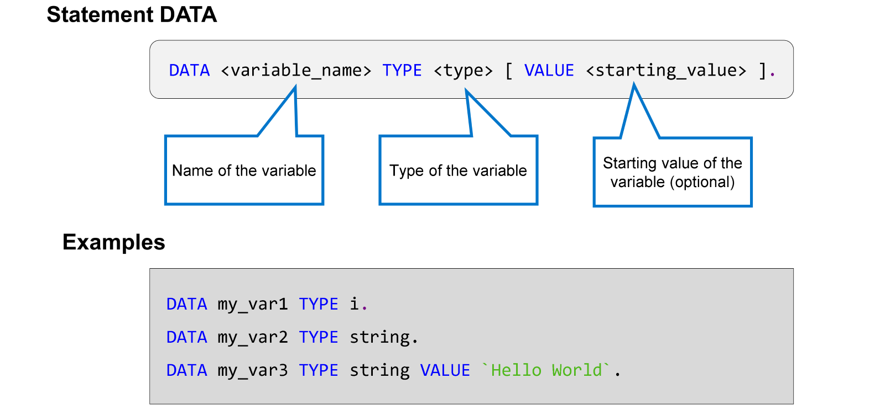
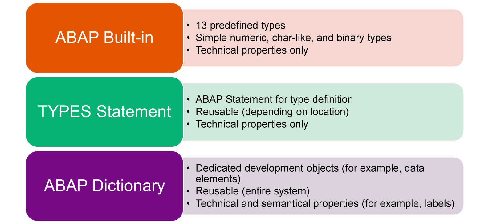
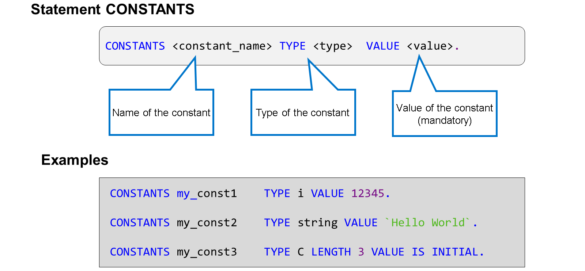
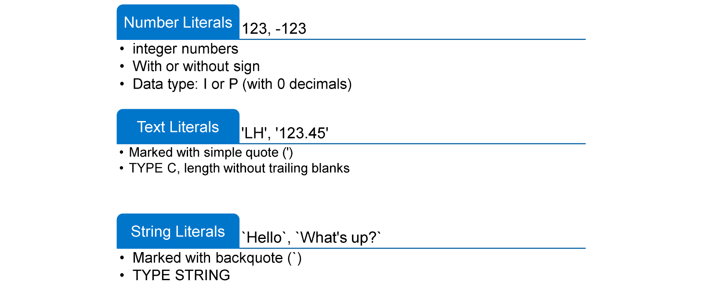
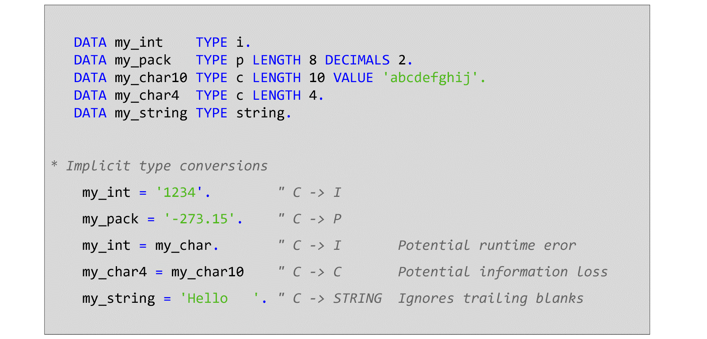
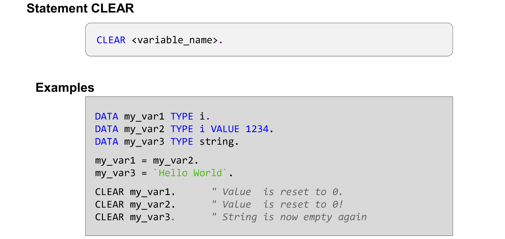

# 🌸 2 [WORKING WITH BASIC DATA OBJECTS AND DATA TYPES](https://learning.sap.com/learning-journeys/acquire-core-abap-skills/working-with-basic-data-objects-and-data-types_cf92dee2-85ec-4b9f-a778-1a7cfef70dad)

> 🌺 Objectifs
>
> - [ ] Déclarer des objets de données
>
> - [ ] Attribuer des valeurs

## 🌸 DATA OBJECTS IN ABAP

Dans un programme ABAP, un objet de données représente une section réservée de la mémoire du programme.

ABAP connaît trois types d'objets de données : les variables, les constantes et les littéraux.

#### 💮 **Variables** :

Une variable est un objet de données dont le contenu peut changer pendant l'exécution. Une variable est identifiée par un nom. Ce nom sert également à adresser l'objet de données à l'exécution. La valeur initiale d'une variable ABAP est toujours bien définie.

#### 💮 **Constants** :

Les constantes sont similaires aux variables. Cependant, contrairement aux variables, leur valeur est codée en dur dans le code source et ne doit pas changer pendant l'exécution. Comme les variables, les constantes ont un nom qui permet de les réutiliser.

#### 💮 **Literals** :

La valeur des littéraux est également codée en dur dans le code source. Contrairement aux constantes, les littéraux n'ont pas de nom. De ce fait, ils ne peuvent pas être réutilisés. Utilisez des littéraux uniquement pour spécifier les valeurs des constantes et les valeurs initiales des variables.

Les objets de données ABAP sont toujours typés : chaque objet de données est basé sur un type de données qui détermine le type d'informations qu'il peut contenir. Le type de données d'un objet de données ABAP reste le même tout au long de l'exécution du programme.

### DECLARATION OF VARIABLES

#### 💮 **DATA** :

Le mot-clé `DATA` est suivi du nom de la variable. Ce nom peut comporter jusqu'à 30 caractères. Il peut contenir les lettres de A à Z, les chiffres de 0 à 9 et le trait de soulignement. Le nom doit commencer par une lettre ou un trait de soulignement.

#### 💮 **TYPE** :

Le type de la variable est spécifié après l'ajout `TYPE`. Dans l'exemple, les types intégrés i (pour les nombres entiers) et chaîne (chaîne de caractères de longueur variable) sont utilisés.

#### 💮 **VALUE** :

L'ajout `VALUE` est facultatif et permet de spécifier une valeur initiale pour la variable. Si `VALUE` est manquant, la variable est créée avec une valeur initiale qui dépend de son type technique.

### SOURCE OF ABAP DATA TYPES

ABAP propose les sources de types de données suivantes :

#### 💮 **ABAP Built-in** :

ABAP propose un ensemble de 13 types de données prédéfinis pour les objets de données numériques, de type caractère et binaires simples.

#### 💮 **TYPES Statement** :

L'instruction `TYPES` vous permet de définir des types de données et de les réutiliser à différents endroits, selon l'emplacement de la définition.

#### 💮 **ABAP Dictionary** :

Le dictionnaire ABAP fait partie du référentiel ABAP. Il gère, entre autres, les types de données globaux disponibles dans tout le système. Les types du dictionnaire ABAP ne se contentent pas de définir des propriétés techniques, ils ajoutent également des informations sémantiques, par exemple des étiquettes. Les types du dictionnaire ABAP sont particulièrement utiles pour l'implémentation d'interfaces utilisateur.

## 🌸 CONSTANTS AND LITERALS

### CONSTANTS

Une constante est un objet de données dont la valeur est codée en dur et ne doit pas être modifiée pendant l'exécution. Tout accès en écriture à une constante entraîne une erreur de syntaxe.

En ABAP, une constante est déclarée à l'aide du mot-clé `CONSTANTS`. Une instruction `CONSTANT` est composée des mêmes éléments qu'une instruction DATA. La seule différence réside dans l'ajout obligatoire de `VALUE`.

Vous pouvez utiliser l'ajout de `VALUE` sous la forme spéciale `VALUE IS INITAL` si la valeur de la constante doit être la valeur initiale spécifique au type.

### LITERALS IN ABAP

Les littéraux sont des objets de données anonymes dont la valeur est codée en dur. Ils sont souvent utilisés pour définir des valeurs non initiales pour les constantes et des valeurs de départ non initiales pour les variables.

Techniquement, vous pouvez utiliser des littéraux n'importe où dans votre code. Pour des raisons de lisibilité et de maintenabilité, il est recommandé de définir et d'utiliser des constantes.

ABAP connaît trois types de littéraux :

- Les littéraux numériques sont des nombres entiers avec ou sans signe. Les littéraux numériques sont généralement de type `I`. Le type `P` est utilisé, avec une longueur suffisante et sans décimales, uniquement si la valeur est trop grande pour le type `I`.

- Les littéraux texte sont des chaînes de caractères entre guillemets simples. Les littéraux texte sont de type `C`. La longueur est dérivée du contenu entre guillemets. Les espaces de fin sont ignorés.

- Les littéraux chaîne sont des chaînes de caractères entre guillemets inverses `` (`) ``. Les littéraux chaîne sont de type STRING. Ils doivent être utilisés pour fournir des valeurs aux objets de données de type chaîne.

## 🌸 VALUE ASSIGNMENTS TO DARA OBJECTS

[Référence - Link Vidéo](https://learning.sap.com/learning-journeys/acquire-core-abap-skills/working-with-basic-data-objects-and-data-types_cf92dee2-85ec-4b9f-a778-1a7cfef70dad)

### IMPLICIT TYPE CONVERSIONS

Comme le montre la figure, évitez autant que possible les conversions de type pour les raisons suivantes :

- Consommation d'exécution supplémentaire : Les valeurs avec conversion de type nécessitent plus de temps d'exécution que les affectations de valeurs de types identiques.

- Erreurs d'exécution potentielles : Certaines combinaisons de type source et de type cible peuvent entraîner des erreurs d'exécution. Si, par exemple, la variable cible est de type numérique l et que l'expression source est de type caractère, l'exécution génère une erreur si elle ne parvient pas à traduire le texte en nombre.

- Perte d'informations potentielle : Certaines combinaisons de type source et de type cible ne provoquent pas d'erreurs d'exécution, mais peuvent entraîner une perte de données. Si, par exemple, la source et la cible sont toutes deux de type C, mais que le type de la variable cible est plus court, l'exécution tronque simplement la valeur de la source.

### RESETTING VARIABLES

### INLINE DECLARATIONS IN VALUE ASSIGNMENTS

[Référence - Link Vidéo](https://learning.sap.com/learning-journeys/acquire-core-abap-skills/working-with-basic-data-objects-and-data-types_cf92dee2-85ec-4b9f-a778-1a7cfef70dad)
