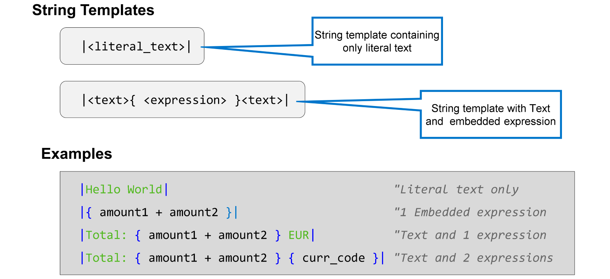
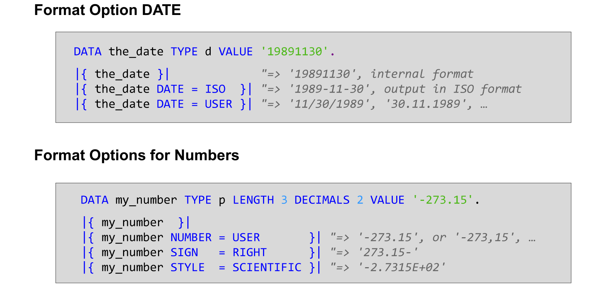
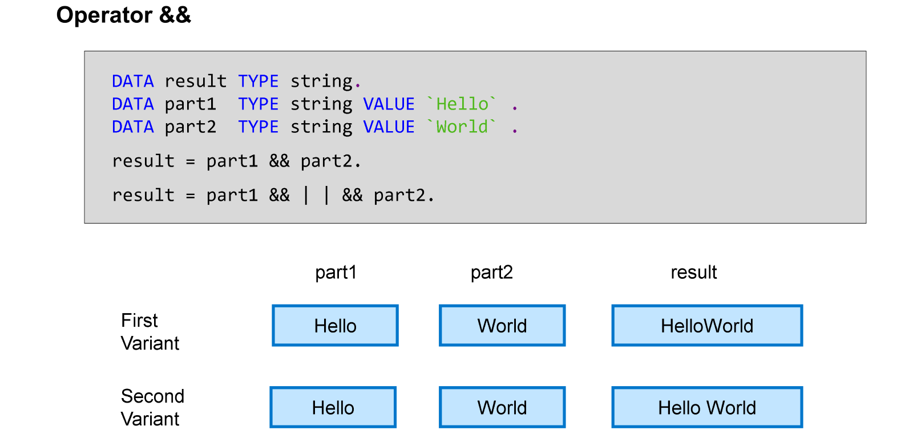

# 🌸 3 [PROCESSING DATA](https://learning.sap.com/learning-journeys/acquire-core-abap-skills/processing-data_b025c9e3-697d-423f-977a-43b9051a7c15)

> 🌺 Objectifs
>
> - [ ] Effectuer des calculs arithmétiques
>
> - [ ] Appliquer le traitement des chaînes

## 🌸 ARITHMETIC CALCULATIONS

Les expressions arithmétiques sont des expressions ABAP combinant valeurs, opérateurs et fonctions que le système d'exécution traite pour calculer un résultat. Le type de résultat des expressions arithmétiques dépend du type des opérandes utilisés en entrée.

Vous pouvez utiliser une expression arithmétique à n'importe quelle position d'opérande de lecture, par exemple à droite d'une affectation de valeur.

La vidéo suivante illustre les bases des expressions arithmétiques.

[Référence - Link Vidéo](https://learning.sap.com/learning-journeys/acquire-core-abap-skills/processing-data_b025c9e3-697d-423f-977a-43b9051a7c15)

## 🌸 STRING PROCESSING

Les modèles de chaîne sont des expressions ABAP de type chaîne de résultat. Vous pouvez utiliser des modèles de chaîne à n'importe quelle position d'opérande de lecture, par exemple à droite d'une affectation de valeur.

Un modèle de chaîne commence et se termine par une barre verticale `|`. Le modèle de chaîne le plus simple ne contient que du texte littéral. Sous cette forme, un modèle de chaîne ne diffère pas vraiment d'une chaîne littérale.

Ce qui distingue un modèle de chaîne d'une chaîne littérale est la possibilité d'incorporer des expressions. Une expression incorporée est une expression ABAP entourée d'accolades (`{` et `}`). À l'exécution, ABAP évalue l'expression incorporée et traduit le résultat en chaîne. Dans le résultat final, cette chaîne remplace l'expression incorporée (avec les accolades qui l'entourent).

> #### 🍧 Note
>
> La syntaxe ABAP nécessite au moins un espace après le crochet ouvrant et au moins un espace avant le crochet fermant.

Bien entendu, un modèle de chaîne peut contenir plusieurs expressions intégrées.

Vous pouvez placer n'importe quel type d'expression ABAP entre les accolades : des expressions arithmétiques, comme dans l'exemple ci-dessus, mais des variables simples ou même des littéraux peuvent également servir d'expressions intégrées.

Un cas d'utilisation important des modèles de chaîne est le contrôle du formatage des données de sortie.

Dans le premier exemple, la variable the_date est de type d et contient une date au format interne (brut) **AAAAMMJJ** (où AAAA représente l'année, MM le mois à deux chiffres et JJ la date à deux chiffres). Lorsque vous utilisez la variable the_date comme expression intégrée dans un modèle de chaîne, le résultat sera identique au format interne. Cependant, si vous ajoutez l'option de format `DATE = <date_format>` entre accolades, le système formatera la valeur comme une date. Si vous ajoutez `DATE = ISO`, le format de sortie sera **ISO**. Avec `DATE = USER`, le format de sortie dépend des paramètres utilisateur de l'utilisateur actuel.

Le deuxième exemple illustre certaines options de formatage des nombres. L'option `NUMBER` permet de contrôler le formatage général des nombres, par exemple l'utilisation d'un point décimal ou d'une virgule décimale. Avec `SIGN`, vous contrôlez la position du signe et l'affichage ou non du signe plus (+). Avec `STYLE`, vous pouvez choisir parmi plusieurs styles prédéfinis, comme un style scientifique ou un style d'ingénierie.

Vous pouvez joindre des champs à l'aide de l'opérateur de concaténation &&. Vous pouvez joindre n'importe quelle combinaison d'objets de données et d'expressions de chaîne.

Les éléments constitutifs de l'expression sont joints sans espace ni autre séparateur. Si vous avez besoin d'espaces ou d'un autre séparateur, n'oubliez pas de l'insérer vous-même dans l'expression, comme illustré dans le deuxième exemple.
