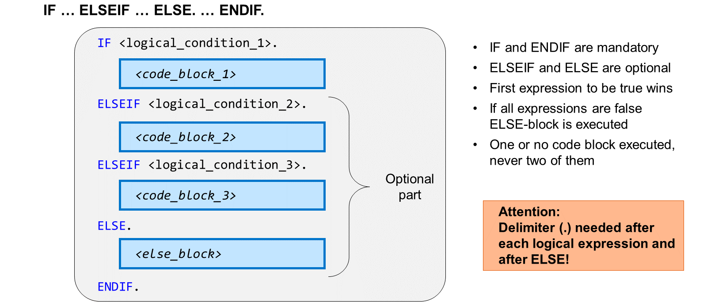
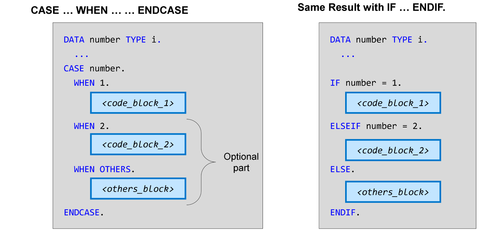
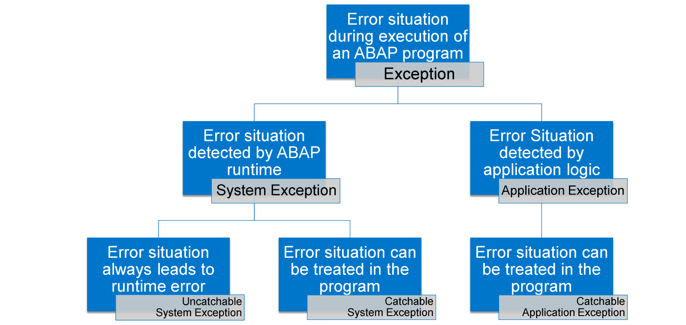
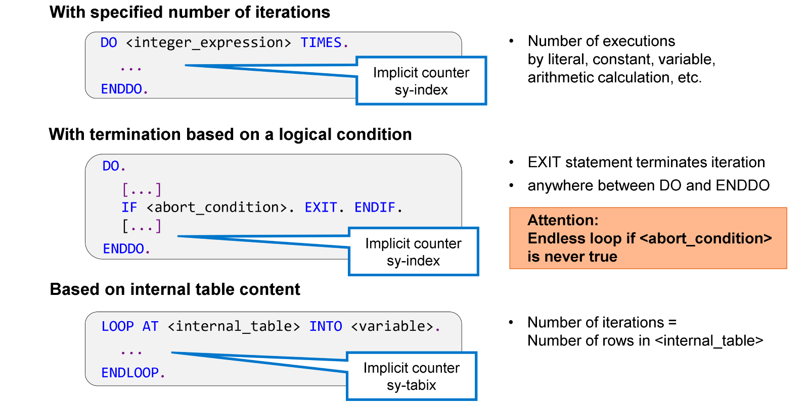

# 🌸 4 [USING CONTROL STRUCTURES IN ABAP](https://learning.sap.com/learning-journeys/acquire-core-abap-skills/using-control-structures-in-abap_a4d7803e-eac2-458e-acf9-8628289f3701)

> 🌺 Objectifs
>
> - [ ] Implémenter le branchement conditionnel
>
> - [ ] Gérer les exceptions
>
> - [ ] Implémenter les itérations

## 🌸 CONDITIONAL BRANCHING

Un branchement conditionnel est une structure de contrôle permettant de rendre l'exécution du code dépendante de conditions logiques.

Le branchement conditionnel le plus courant est constitué d'une paire de mots-clés `IF` et `ENDIF`. Le bloc de code entre `IF` et `ENDIF` n'est exécuté que si la condition suivant IF est remplie.

Vous pouvez ajouter des blocs de code en étendant la structure `IF … ENDIF` avec un maximum d'un mot-clé `ELSE` et un nombre arbitraire de mots-clés `ELSEIF`. L'ajout du mot-clé `ELSE` garantit l'exécution d'un seul bloc de code. Si `ELSE` est absent, aucun bloc de code ne peut être exécuté.

Le bloc de code à exécuter est déterminé comme suit :

- Tout d'abord, la condition `IF` est évaluée. Si elle est remplie, le bloc de code associé est exécuté et le programme continue après `ENDIF`.

- Ce n'est que si la condition `IF` n'est pas remplie que la condition suivant le premier `ELSEIF` est évaluée. Si elle est remplie, le bloc de code associé est exécuté et le programme continue après `ENDIF`.

- Cette opération est exécutée consécutivement pour toutes les conditions `ELSEIF`. Si aucune condition n'est remplie et que la structure contient `ELSE`, le bloc de code suivant EL``SE est exécuté. Sinon, aucun bloc de code n'est exécuté.

> #### 🍧 Hint
>
> Contrairement à de nombreux autres langages de programmation, ABAP nécessite un délimiteur (.) après chacune des conditions logiques et même après le mot-clé ELSE.

Les conditions logiques sont une combinaison de comparaisons, d'opérations logiques, d'expressions et de fonctions que le système d'exécution évalue pour déterminer si la condition est vraie ou fausse.

Le cas d'utilisation le plus courant des conditions logiques se situe après les mots-clés `IF` ou `ELSEIF` dans une structure `IF ... ENDIF`.

Le premier exemple est une comparaison simple : la condition est vraie si les deux objets de données x et y ont la même valeur.

Le deuxième exemple est un peu plus sophistiqué : soit la valeur de x est supérieure ou égale à y et inférieure à deux fois la valeur de y, soit elle est inférieure ou égale à y et supérieure à deux fois la valeur de y.

Le troisième exemple utilise la fonction arithmétique `abs( )` et l'expression logique `BETWEEN <expression1> AND <expression2>`. La condition est vraie si la valeur absolue de x est comprise entre la valeur absolue de y et la valeur absolue de deux fois y.

Pour des comparaisons de valeurs simples, vous pouvez utiliser les opérateurs `=`, `<>`, `>`, `<`, `>=` et `<=`. Vous pouvez non seulement comparer les valeurs des objets de données, mais également les valeurs de nombreuses autres expressions, comme l'expression arithmétique 2 \* y dans l'exemple.

> #### 🍧 Note
>
> ABAP utilise le même symbole (=) pour les affectations et les comparaisons de valeurs. La distinction se fait selon la position.

Vous pouvez utiliser les opérateurs `AND` et `OR` pour combiner des expressions logiques, et `NOT` pour nier une expression. Sans crochets, `NOT` est plus fort que `AND` et `AND` que `OR`.

ABAP connaît des expressions logiques spéciales :

- <objet de données> IS INITIAL est vrai si <objet de données> contient sa valeur initiale spécifique au type.

- <objet de données> IS NOT INITIAL est vrai si <objet de données> contient une valeur différente de la valeur initiale spécifique au type.

- <objet de données> BETWEEN <expression1> AND <expression2>

Certaines fonctions ABAP spéciales sont des fonctions de prédicat. Cela signifie qu'elles sont elles-mêmes des conditions logiques. `Contains()` est une fonction qui compare des valeurs de type caractère et `line_exists()` effectue une vérification d'existence pour une ligne dans une table interne.

Une deuxième technique de branchement conditionnel est la structure de contrôle `CASE … WHEN .. ENDCASE`.

Le branchement conditionnel avec `CASE … ENDCASE` est un cas particulier du branchement plus général avec `IF … ENDIF`. Vous pouvez utiliser `CASE` lorsque le branchement dépend de la valeur d'un seul objet de données, que vous comparez consécutivement à un ensemble de valeurs possibles, en utilisant une comparaison d'égalité à chaque fois.

Dans l'exemple, la valeur de l'objet de données numéro est comparée aux valeurs 1 et 2. Si la valeur est égale à 1, `<code_block_1>` est exécuté et si la valeur est égale à 2, `<code_blocl_2>` est exécuté à la place. Pour toute autre valeur, le bloc de code suivant `WHEN OTHERS` est exécuté.

Tout branchement conditionnel avec `CASE … ENDCASE` peut également être implémenté avec une structure `IF … ENDIF`. Ceci est illustré par l'exemple de droite.

## 🌸 EXCEPTION HANDLING

### EXCEPTIONS

En ABAP, une exception est une situation d'erreur lors de l'exécution d'un programme ABAP. Une exception est levée par le code qui la détecte.

Selon l'auteur de l'exception, on distingue les exceptions système des exceptions applicatives.

Sans autre mesure, les exceptions entraînent des erreurs d'exécution. Une erreur d'exécution termine le programme et est documentée par défaut dans un court dump.

Vous pouvez éviter l'erreur d'exécution si l'exception en question est capturable. Une exception capturable peut être traitée dans le programme à l'aide des instructions `TRY … CATCH … ENDTRY`.

Toutes les exceptions applicatives et de nombreuses exceptions système sont capturables. Plus loin dans ce cours, vous apprendrez à lever des exceptions applicatives. Nous nous concentrerons ici sur la gestion des exceptions système capturables.

La vidéo suivante présente quelques exemples d'erreurs d'exécution.

[Référence - Link Vidéo](https://learning.sap.com/learning-journeys/acquire-core-abap-skills/using-control-structures-in-abap_a4d7803e-eac2-458e-acf9-8628289f3701)

### EXCEPTION HANDLING

Pour empêcher l'arrêt d'un programme à cause d'une exception capturable, vous devez entourer le code d'origine de l'exception avec les instructions `TRY` et `ENDTRY`. Ce faisant, le code est intégré au bloc `TRY` de la structure `TRY … ENDTRY`.

Avant l'instruction `ENDTRY`, vous devez ajouter une instruction `CATCH` suivie de l'ID de l'exception à gérer. Vous pouvez également ajouter plusieurs instructions `CATCH` pour gérer plusieurs exceptions différentes. Chaque instruction `CATCH` doit être suivie du code permettant de gérer cette exception. Ce code est appelé bloc `CATCH`.

Lorsque l'exécution du programme atteint l'instruction `TRY`, elle continue avec le code du bloc `TRY`. Trois situations peuvent alors se produire :

1. Si aucune exception n'est levée pendant le bloc `TRY`, les blocs `CATCH` sont ignorés. L'exécution continue après l'instruction ENDTRY.

2. Si une exception est levée pendant le bloc `TRY`, pour laquelle un `CATCH` correspondant existe, l'exécution du bloc `TRY` est interrompue et le bloc `CATCH` correspondant à cette exception est exécuté. L'exécution continue ensuite après l'instruction `ENDTRY`.

3. Si une exception est levée pendant le bloc `TRY` sans `CATCH` correspondant, le programme se termine avec une erreur d'exécution.

Maintenant que vous avez découvert les exceptions, voyons comment les gérer.

[Référence - Link Vidéo](https://learning.sap.com/learning-journeys/acquire-core-abap-skills/using-control-structures-in-abap_a4d7803e-eac2-458e-acf9-8628289f3701)

## 🌸 ITERATIONS

Les itérations sont des structures de contrôle qui définissent un bloc de code exécuté plusieurs fois.

La forme la plus simple d'itération consiste en un bloc de code entouré des instructions DO et `ENDDO`. Sans autre mesure, cela crée une boucle sans fin, qu'il faut éviter en appliquant l'une des solutions suivantes :

#### 💮 **Specified number of iterations** :

En étendant l'instruction `DO` avec une expression entière suivie du mot-clé `TIMES`, vous pouvez spécifier explicitement la fréquence d'itération du bloc de code. L'expression entière peut être aussi simple qu'un littéral numérique, mais des calculs arithmétiques sont également possibles. Si la valeur de l'expression est égale à 0, le bloc de code entre `DO` et `ENDDO` n'est pas exécuté et le programme continue immédiatement avec le code suivant `ENDDO`.

#### 💮 **Abort based on a logical condition** :

Vous pouvez interrompre une itération à tout moment avec l'instruction `EXIT`. Le programme continue alors avec le code suivant `ENDDO`. Notez qu'en dehors des itérations, `EXIT` a un effet différent. Il interrompt alors le traitement du bloc de traitement en cours, par exemple la méthode courante.

En général, `EXIT` est entouré de `IF` et `ENDIF` pour terminer l'itération en fonction d'une condition d'abandon. Sachez que de telles itérations peuvent se transformer en boucles sans fin si la condition d'abandon n'est jamais vérifiée.

Il est bien sûr possible de combiner les deux techniques, c'est-à-dire de spécifier explicitement le nombre d'itérations, puis de quitter l'itération avec `EXIT`. Le nombre d'itérations devient alors un nombre maximal qui pourrait ne pas être atteint à l'exécution.

#### 💮 **Based on an internal table** :

Un troisième type d'itération est la structure `LOOP … ENDLOOP`, utilisée pour lire consécutivement les lignes d'une table interne. Dans ce cas, le nombre d'itérations est déterminé par le nombre de lignes de la table interne.

Dans le bloc de code entre `DO` et `ENDDO`, vous pouvez implémenter des accès en lecture à l'objet de données intégré ABAP sy-index. Cette variable entière sert de compteur d'itérations ; l'environnement d'exécution ABAP l'incrémente de un au début de chaque nouvelle itération.

Contrairement à ce que vous pourriez avoir l'habitude de faire avec d'autres langages de programmation, sy-index commence à 1 lors de la première itération.

La variable intégrée ABAP `sy-tabix` peut remplir une fonction similaire pour les itérations avec `LOOP`. Cependant, sachez que `sy-tabix` n'est pas à proprement parler un compteur, mais qu'elle identifie la position de la ligne de table traitée dans l'itération en cours. Nous verrons plus loin la différence lorsque toutes les lignes d'une table interne ne sont pas traitées dans une structure `LOOP … ENDLOOP`.
