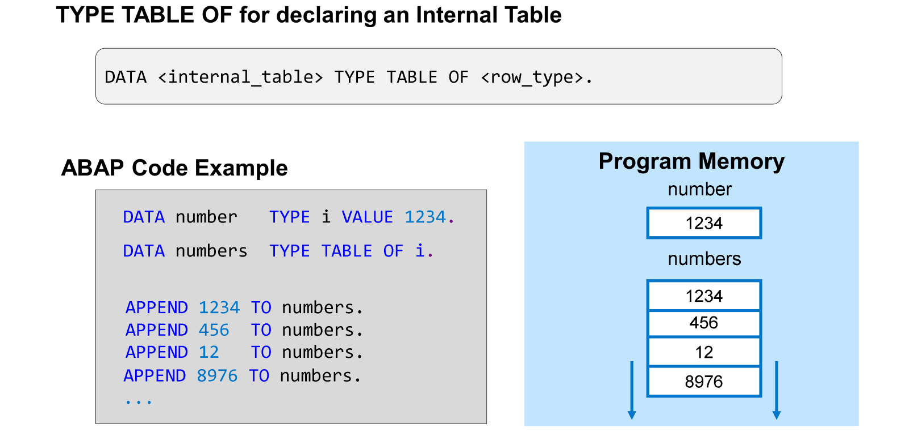
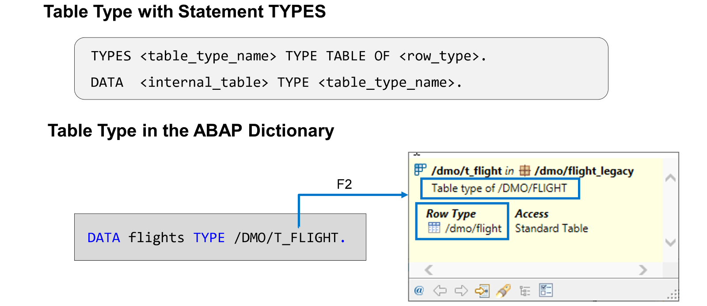
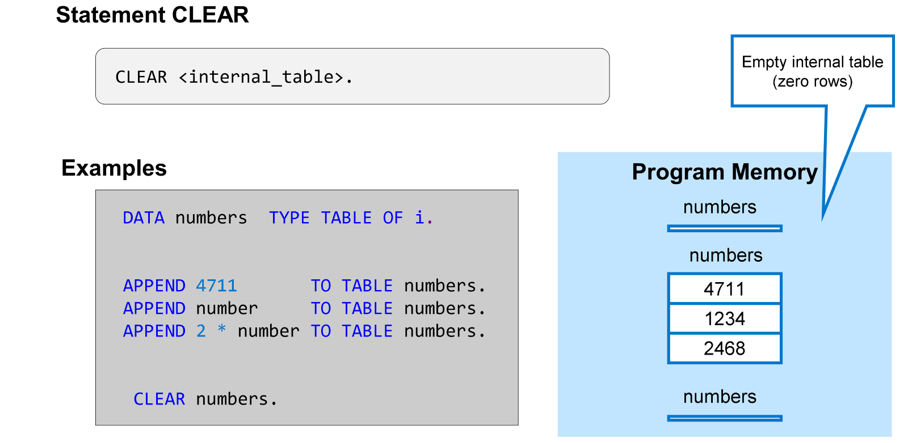
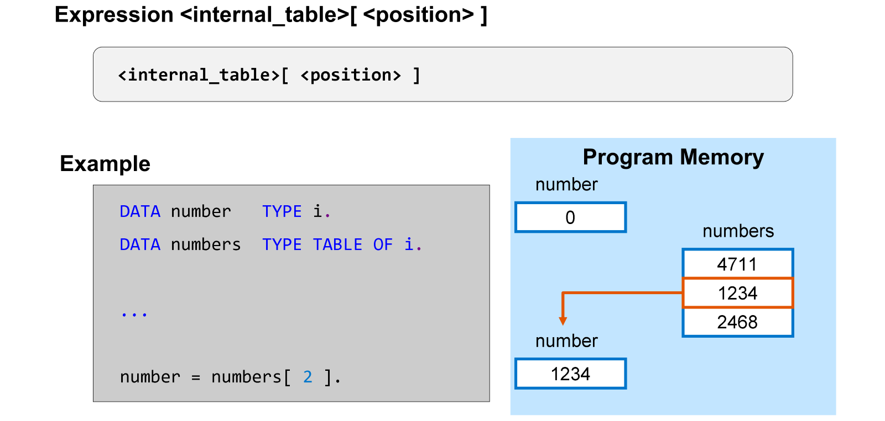
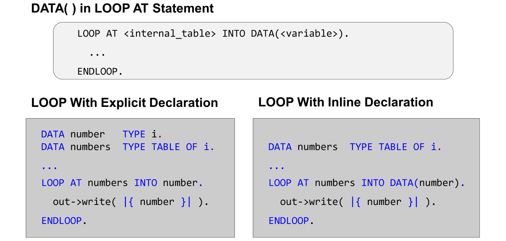

# 🌸 5 [WORKING WITH SIMPLE INTERNAL TABLES](https://learning.sap.com/learning-journeys/acquire-core-abap-skills/working-with-simple-internal-tables_a4beb937-0c7b-45b9-92be-ff26a5159fad)

> 🌺 Objectifs
>
> - [ ] Définir des tables internes simples
>
> - [ ] Traiter les données à l'aide de tables internes simples

## 🌸 DEFINITION OF SIMPLE INTERNAL TABLES

### INTERNAL TABLES

Les tables internes sont des objets de données variables dans lesquels vous pouvez stocker plusieurs valeurs de même type. Ce type doit être spécifié dans la déclaration et est appelé type de ligne de la table interne.

Chaque valeur occupe une ligne de la table interne. Le nombre de lignes n'est pas limité. En théorie, vous pouvez stocker autant de valeurs que vous le souhaitez dans une table interne. Les limitations proviennent uniquement de contraintes techniques, comme la mémoire disponible ou la configuration système.

La valeur initiale d'une table interne est une table vide, autrement dit, une table contenant 0 ligne. Il existe différentes techniques pour remplir une table interne. L'exemple utilise l'instruction `APPEND` pour ajouter une nouvelle ligne à la fin de la table interne et la remplir avec une valeur.

### TABLE TYPES

Le type d'une table interne est appelé type de table.

Dans l'exemple précédent, nous avons utilisé `TYPE TABLE OF` directement dans l'instruction DATA. Le type de table était lié à la variable déclarée.

Vous pouvez également utiliser `TYPE TABLE OF` dans une instruction `TYPES` pour définir un type de table avec un nom. Vous pouvez ensuite utiliser ce type de table, par exemple, dans une instruction DATA. La visibilité de ces types dépend de la position de l'instruction `TYPES`.

Le dictionnaire ABAP contient également des types de tables. Ces types sont gérés par un éditeur dédié. On les appelle types de tables globaux car ils sont visibles partout dans le système.

## 🌸 DATA PROCESSING WITH SIMPLE INTERNAL TABLES

[Référence - Link Vidéo](https://learning.sap.com/learning-journeys/acquire-core-abap-skills/working-with-simple-internal-tables_a4beb937-0c7b-45b9-92be-ff26a5159fad)

La valeur initiale d'une table interne est une table vide, c'est-à-dire une table interne ne contenant aucune ligne.

Vous avez déjà appris qu'avec l'instruction `CLEAR`, vous pouvez réinitialiser une variable ABAP à sa valeur initiale spécifique au type.

Lorsque vous utilisez `CLEAR` pour une table interne, vous supprimez tout son contenu et définissez le nombre de lignes à zéro.

Il existe plusieurs façons de récupérer des données d'une table interne. Cet exemple récupère le contenu d'une seule ligne à l'aide d'une expression de table interne. Dans cette expression, le nom de la table interne est immédiatement suivi de crochets. Une expression entière entre crochets spécifie la position de la ligne à lire.

> #### 🍧 Note
>
> Une syntaxe correcte nécessite au moins un espace après le crochet ouvrant et avant le crochet fermant.

### READING FROM AN INTERNAL TABLE IN A LOOP

[Référence - Link Vidéo](https://learning.sap.com/learning-journeys/acquire-core-abap-skills/working-with-simple-internal-tables_a4beb937-0c7b-45b9-92be-ff26a5159fad)

Lorsque vous implémentez une boucle sur une table interne, vous pouvez utiliser une déclaration en ligne après l'ajout de `INTO` au lieu de déclarer explicitement la **work area** avec une instruction `DATA`.

Ce faisant, vous réduisez non seulement la quantité de code à saisir, mais vous garantissez également que le type de la **work area** correspond au type de ligne de la table interne, car le type de l'objet de données déclaré en ligne est dérivé du contexte, qui, dans ce cas, est la table interne.
