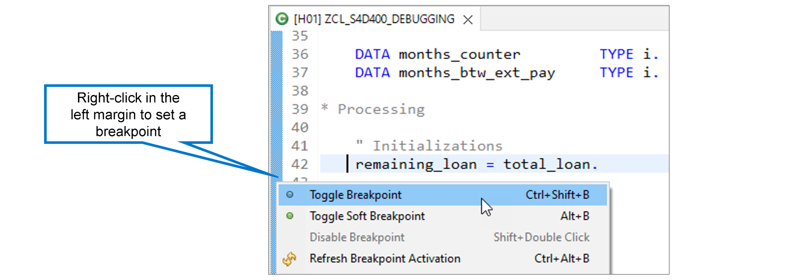
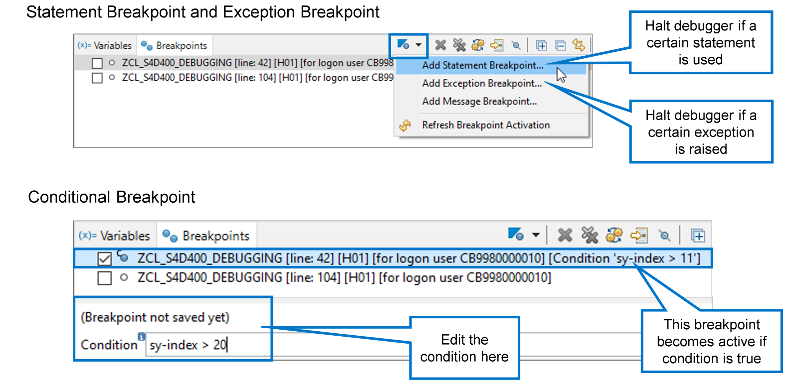
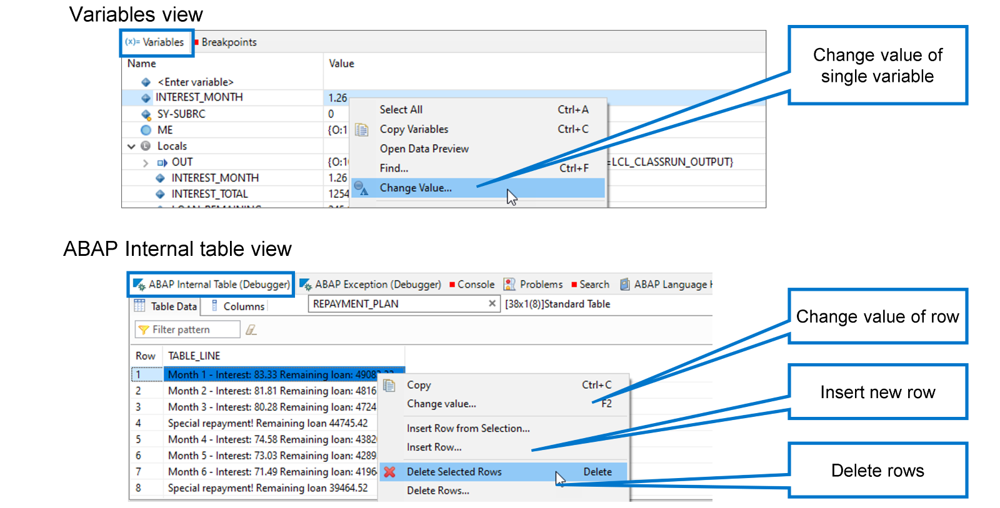

# 🌸 6 [DEBUGGING AN ABAP PROGRAM](https://learning.sap.com/learning-journeys/acquire-core-abap-skills/debugging-an-abap-program_d070e545-efd5-4d87-8b75-20f18d7b7d3b)

> 🌺 Objectifs
>
> - [ ] Passer en mode débogage
>
> - [ ] Contrôler l'exécution du code
>
> - [ ] Analyser le contenu des objets de données

## 🌸 THE DEBUGGING MODE

### STARTING THE DEBUGGER

Pour déboguer un programme ABAP, définissez un point d'arrêt, puis exécutez le programme normalement. Lorsque le programme atteint le point d'arrêt, le système l'interrompt et ouvre la perspective Débogage ABAP dans ADT. Vous pouvez ensuite exécuter chaque instruction suivante individuellement pour en évaluer l'effet sur le programme. Vous pouvez également inspecter le contenu de toutes les variables du programme afin de détecter toute valeur inattendue.

Pour définir ou supprimer un point d'arrêt, faites un clic droit sur la marge gauche de l'éditeur et choisissez « Activer/Désactiver le point d'arrêt ». Vous pouvez également double-cliquer sur la marge gauche. Notez que le programme doit être activé avant de pouvoir définir des points d'arrêt.

Les points d'arrêt sont spécifiques à l'utilisateur et sont persistants : ils restent actifs même après votre déconnexion d'ADT, puis votre reconnexion. Pour empêcher le débogueur de démarrer à un point d'arrêt, vous devez soit supprimer le point d'arrêt (à l'aide de la fonction « Activer/Désactiver le point d'arrêt »), soit le désactiver via la fonction correspondante du menu contextuel.

> #### 🍧 Note
>
> Selon vos paramètres de personnalisation, ADT demandera d'abord confirmation avant d'ouvrir automatiquement la perspective de débogage.

### THE DEBUG PERSPECTIVE IN ADT

Lorsque vous déboguez un programme ABAP à l'aide des outils de développement ABAP, vous utilisez la perspective Débogage. Il s'agit d'une version personnalisée de la perspective Débogage standard d'Eclipse, qui contient des vues et des fonctions particulièrement importantes pour le débogage.

Examinons quelques éléments importants de la perspective Débogage.

[Référence - Link Vidéo](https://learning.sap.com/learning-journeys/acquire-core-abap-skills/debugging-an-abap-program_d070e545-efd5-4d87-8b75-20f18d7b7d3b)

## 🌸 CONTROL OF CODE EXECUTION

### SOME NAVIGATION FUNCTIONS

Une fois le débogage lancé, utilisez les fonctions de navigation pour contrôler l'exécution du code.

Voici quelques fonctions de navigation importantes :

#### 💮 **Step Into (F5)** :

Choisissez « Pas à pas » ou appuyez sur F5 pour exécuter une seule étape. Utilisez cette fonction pour une analyse étape par étape. Par exemple, si vous souhaitez voir quel bloc de code d'une structure de contrôle est réellement exécuté.

#### 💮 **Resume (F8)** :

Choisissez « Reprendre » ou appuyez sur F8 pour exécuter le programme jusqu'au point d'arrêt suivant. Si le débogueur ne rencontre plus de point d'arrêt, le programme est exécuté jusqu'à la fin et la session de débogage se termine.

#### 💮 **Run to Line (Shift+F8)** :

Choisissez « Exécuter jusqu'à la ligne » ou appuyez sur Maj+F8 pour exécuter le programme jusqu'à la position actuelle du curseur. Cliquer sur une ligne de code et sélectionner cette fonction est une alternative pratique à la définition d'un point d'arrêt, puis à la sélection de « Reprendre » et à sa suppression.

#### 💮 **Jump to Line (Shift+F12)** :

Choisissez « Accéder à la ligne » ou appuyez sur « Maj+F12 » pour sauter des lignes de code ou revenir à du code déjà exécuté. Cette fonction peut être utile pour simuler ce qui se passerait si un morceau de code était supprimé ou pour recommencer le débogage d'un morceau de code que vous avez manqué la première fois. Gardez à l'esprit qu'il s'agit d'un saut, et non d'une exécution de code. Lorsque vous revenez en arrière, les modifications apportées aux objets de données ne sont pas annulées !

#### 💮 **Terminate** :

Choisissez « Terminer » si vous avez terminé le débogage et que vous ne souhaitez pas exécuter le reste du programme. La session de débogage se termine immédiatement.

### SPECIAL BREAKPOINTS

Vous avez appris que vous pouvez créer et gérer des points d'arrêt en cliquant sur la marge gauche de l'éditeur ABAP. Cela fonctionne également avec l'éditeur ABAP dans la perspective Débogage.

De plus, vous pouvez accéder à la vue Points d'arrêt et y gérer vos points d'arrêt.

Dans la vue Points d'arrêt, vous pouvez également créer des points d'arrêt spéciaux :

#### 💮 **Statement Breakpoint** :

Un point d'arrêt d'instruction n'est pas attaché à une ligne de code spécifique, mais à une instruction ABAP spécifique. Par exemple, un point d'arrêt sur l'instruction CLEAR provoque l'arrêt du programme dans le débogueur à chaque exécution d'une instruction CLEAR, quel que soit l'emplacement de cette instruction.

Pour créer un point d'arrêt d'instruction, ouvrez la liste déroulante de la barre d'outils de la vue Points d'arrêt et choisissez « Ajouter un point d'arrêt d'instruction »…

#### 💮 **Exception Breakpoint** :

Un point d'arrêt d'exception est attaché à une exception spécifique. Il provoque l'arrêt du programme dans le débogueur chaque fois que cette exception est levée, que cette exception soit gérée par le programme ou qu'elle provoque une erreur d'exécution. Pour créer un point d'arrêt d'exception, ouvrez la liste déroulante de la barre d'outils de la vue Points d'arrêt et choisissez « Ajouter un point d'arrêt d'exception »…

#### 💮 **Conditional Breakpoint** :

Vous transformez un point d'arrêt en point d'arrêt conditionnel en ajoutant une condition. Si l'exécution du programme atteint un point d'arrêt conditionnel, le programme ne s'arrête dans le débogueur que si la condition est remplie. Si, par exemple, un point d'arrêt est situé entre DO et ENDDO, le programme s'arrêtera dans le débogueur à chaque itération. En revanche, si vous ajoutez une condition sy-index > 20, le débogueur ignorera ce point d'arrêt pendant les 20 premières itérations et ne s'arrêtera qu'aux itérations suivantes.

Pour ajouter une condition à un point d'arrêt, sélectionnez-le dans la liste des points d'arrêt et saisissez-la dans le champ Condition. Appuyez sur Entrée pour enregistrer le point d'arrêt avec la condition.

### WATCHPOINTS

Si une valeur inattendue d'une variable vous cause des problèmes, vous pouvez suivre sa valeur au cours du programme à l'aide d'un point de surveillance.

[Référence - Link Vidéo](https://learning.sap.com/learning-journeys/acquire-core-abap-skills/debugging-an-abap-program_d070e545-efd5-4d87-8b75-20f18d7b7d3b)

## 🌸 ANALYSIS OF DATA OBJECTS

### DISPLAY CONTENT OF DATA OBJECTS

[Référence - Link Vidéo](https://learning.sap.com/learning-journeys/acquire-core-abap-skills/debugging-an-abap-program_d070e545-efd5-4d87-8b75-20f18d7b7d3b)

### DISPLAY CONTENT OF INTERNAL TABLES

[Référence - Link Vidéo](https://learning.sap.com/learning-journeys/acquire-core-abap-skills/debugging-an-abap-program_d070e545-efd5-4d87-8b75-20f18d7b7d3b)

### CHANGING THE VALUES OF VARIABLE

En fonction de vos autorisations, vous pouvez modifier la valeur des variables lors du débogage.

Pour les variables simples, localisez la variable dans la vue Variables, faites un clic droit dessus et choisissez « Modifier la valeur… ».

Pour modifier le contenu d'une table interne, il faut distinguer la modification de la valeur d'une ligne existante de l'ajout ou de la suppression de lignes.

Comme illustré dans la figure, les fonctions suivantes sont disponibles lorsque vous faites un clic droit dans la vue Table interne ABAP :

#### 💮 **Change Value …** :

Choisissez « Modifier la valeur… » pour modifier le contenu d'une ligne existante.

#### 💮 **Insert Row …** :

Choisissez « Insérer une ligne… » pour ajouter une nouvelle ligne. Vous pouvez choisir d'ajouter la nouvelle ligne ou de l'insérer à l'emplacement choisi.

#### 💮 **Delete Selected Rows …** :

Choisissez « Supprimer les lignes sélectionnées… » pour supprimer les lignes sélectionnées avant le clic droit. Pour sélectionner une ligne, faites un clic gauche dessus. Pour sélectionner plusieurs lignes, maintenez la touche Ctrl ou Maj enfoncée lorsque vous faites un clic gauche sur les lignes supplémentaires.

#### 💮 **Delete Rows …** :

Choisissez « Supprimer des lignes… » pour supprimer un plus grand nombre de lignes, voire toutes les lignes. On vous demande le numéro de la ligne de départ et de la ligne de fin que vous souhaitez supprimer.
