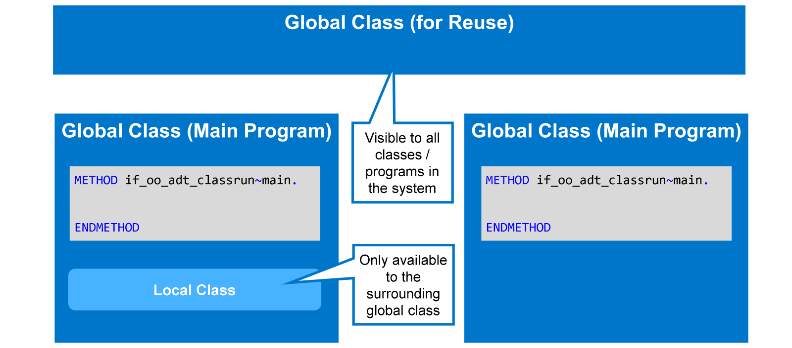
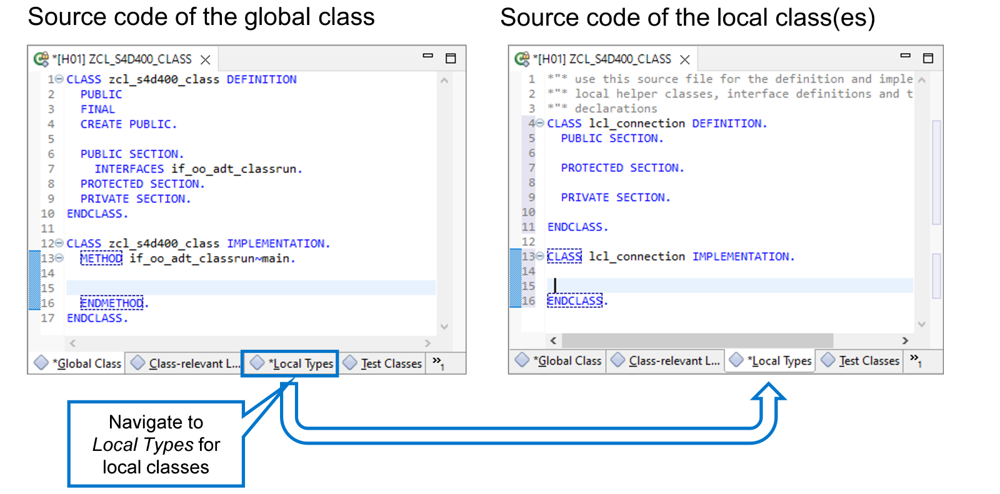
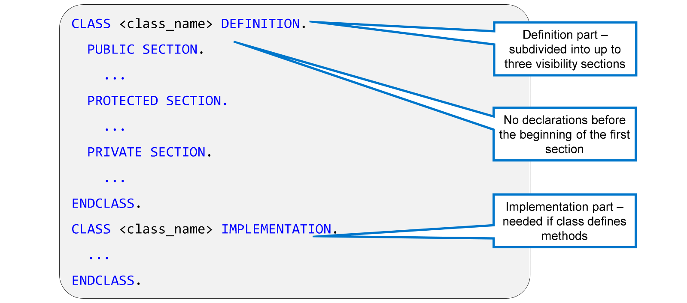
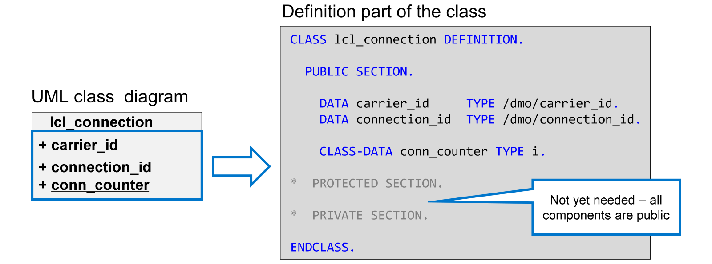

# 🌸 1 [DEFINING A LOCAL CLASS](https://learning.sap.com/learning-journeys/acquire-core-abap-skills/defining-a-local-class_d4f46591-157b-468f-b94a-8d484d5ddca9)

> 🌺 Objectifs
>
> - [ ] Vous pourrez définir une classe locale à l'intérieur d'une classe globale

## 🌸 LOCAL CLASS

### LOCAL AND GLOBAL CLASSES



Les classes globales sont stockées de manière centralisée et contenues dans leur propre objet référentiel, appelé pool de classes. Une classe globale peut servir de programme principal. Elle peut également contenir de la logique réutilisée par d'autres programmes ABAP, y compris d'autres classes globales.

Les classes locales sont définies comme faisant partie d'un programme ABAP, par exemple une classe globale. Vous ne pouvez les utiliser que dans le programme ou la classe dans lequel elles sont définies. Les classes locales sont utiles pour les entités ou les fonctions dont vous n'avez besoin que dans un seul programme.

La syntaxe ABAP des classes locales et globales est quasiment identique. Dans ce cours, vous travaillerez avec des classes locales dans votre classe globale. La classe globale avec la méthode `if_oo_adt_classrun~main` servira uniquement de programme principal.

### LOCAL CLASSES IN GLOBAL CLASSES

Comme le montre la figure ci-dessous, lorsque vous ouvrez une classe globale dans l'ADT, l'onglet « Classe globale » est d'abord sélectionné. Vous y trouverez le code source de la classe globale. Pour consulter ou saisir le code source des classes locales, accédez à l'onglet « Types locaux ».



ADT fournit un modèle de code source pour les classes locales. Pour utiliser ce modèle, procédez comme suit :

0. Aller dans [Local Types].

1. Dans l'éditeur ABAP, saisissez lcl et appuyez sur [Ctrl] + [Espace].

2. Dans la liste qui s'affiche, sélectionnez `lcl - Classe locale` et appuyez sur [Entrée].

3. Ajustez le nom de la nouvelle classe locale.

Pour les classes de ce cours, vous devez supprimer l'ajout `create private` de l'instruction `CLASS … DEFINITION`.

```
*"* use this source file for the definition and implementation of
*"* local helper classes, interface definitions and type
*"* declarations
class lcl_connection definition.

  "Ne rien mettre ici

  public section.

    "Public section process

  protected section.

    "protected section process

  private section.

    "private section process

endclass.

class lcl_connection implementation.

endclass.
```

## 🌸 ATTRIBUTES

### SOURCE CODE OF A CLASS IN ABAP



En ABAP, le code source d'une classe est composé de deux parties : la **Definition** et l'**Implementation**. La **Definition** est subdivisée en trois sections, appelées **visibility sections**.

#### 💮 **Definition** :

La partie **Definition** d'une classe contient la **Definition** et la **déclaration** de tous ses éléments, c'est-à-dire les types, les **constantes**, les **attributs** et les **méthodes**. Elle commence par `CLASS <nom_classe> DEFINITION` et se termine par `ENDCLASS`.

#### 💮 **Implementation** :

La partie **Implementation** d'une classe contient le code exécutable de la classe, c'est-à-dire l'**Implementation** de ses **méthodes**. Elle commence par `CLASS <nom_classe> IMPLEMENTATION` et se termine par `ENDCLASS`. L'**Implementation** d'une classe est facultative. Elle devient obligatoire dès que la **Definition** de la classe contient des **méthodes** exécutables.

#### 💮 **Visibility sections** :

Chaque **visibility section** d'une classe commence par l'une des instructions suivantes : `PUBLIC SECTION`, `PROTECTED SECTION` ou `PRIVATE SECTION` et se termine implicitement au début de la section suivante. La dernière section se termine par l'instruction `ENDCLASS`. Toutes les déclarations d'une classe doivent figurer dans l'une de ces sections. Autrement dit, aucune déclaration n'est autorisée entre le début de la **Definition** de la classe et le début de la première section.

La section dans laquelle se trouve une déclaration définit la visibilité de l'élément déclaré de la classe.

Les trois **visibility sections** d'une classe sont facultatives ; si vous n'avez pas besoin d'une section particulière, vous n'avez pas besoin de la déclarer. En revanche, si une **Definition** de classe comporte plusieurs sections, elles doivent suivre l'ordre suivant : `PUBLIC SECTION` - `PROTECTED SECTION` - `PRIVATE SECTION`.

### DEFINITION PART OF A CLASS

La vidéo suivante présente les différents types de composants que vous pouvez définir dans une classe. Vous pouvez définir chacun de ces composants dans n'importe quelle section de visibilité de la classe.

[Référence - Link Vidéo](https://learning.sap.com/learning-journeys/acquire-core-abap-skills/defining-a-local-class_d4f46591-157b-468f-b94a-8d484d5ddca9)

### EXAMPLE: ATTRIBUTES OF THE FLIGHT CONNECTION CLASS



Commençons par implémenter notre modèle UML en ABAP, en prenant d'abord les attributs de la classe de connexion. Pour déclarer un attribut, utilisez l'instruction DATA dans la section de visibilité appropriée.

L'attribut conn_counter est souligné, ce qui indique un attribut statique. Vous déclarez les attributs statiques à l'aide de l'instruction CLASS-DATA. La syntaxe de CLASS-DATA est identique à celle de DATA.

> #### 🍧 Note
>
> We begin with public attributes at this point. Later in the course, when we discuss encapsulation, we will turn them into private attributes.

[Exercices](https://learning.sap.com/learning-journeys/acquire-core-abap-skills/defining-a-local-class_d4f46591-157b-468f-b94a-8d484d5ddca9)
