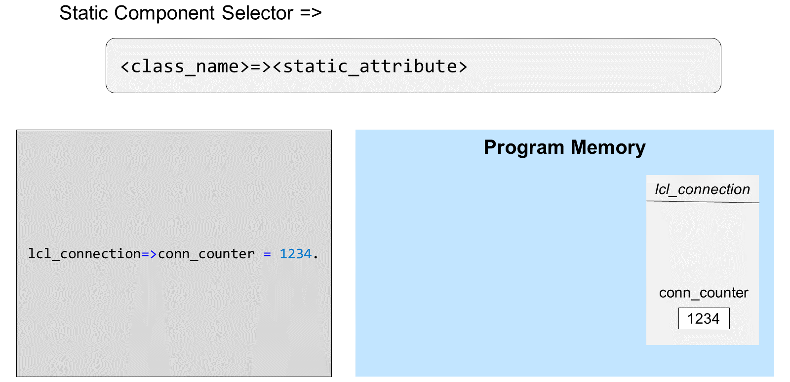
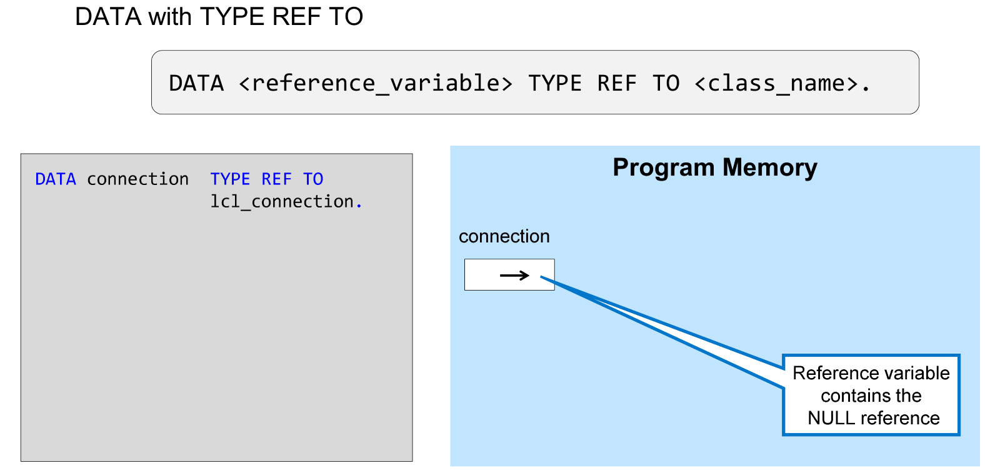
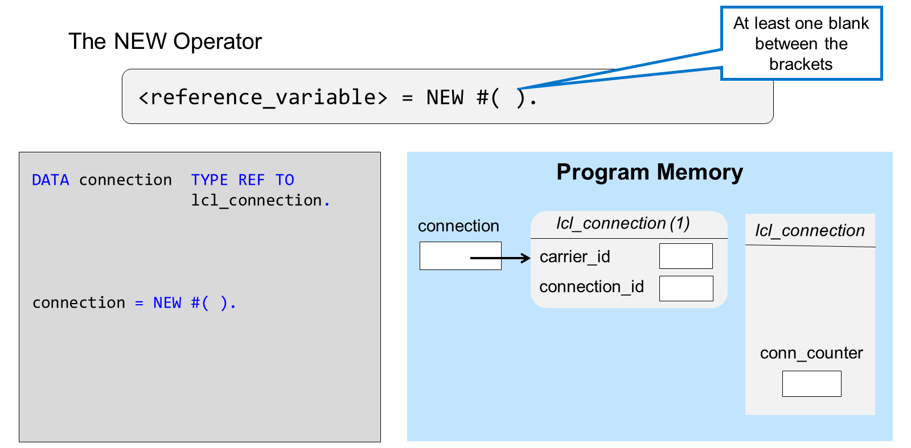
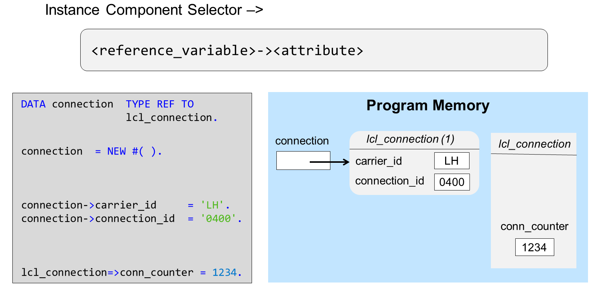
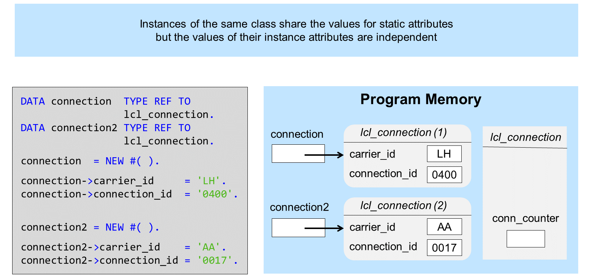
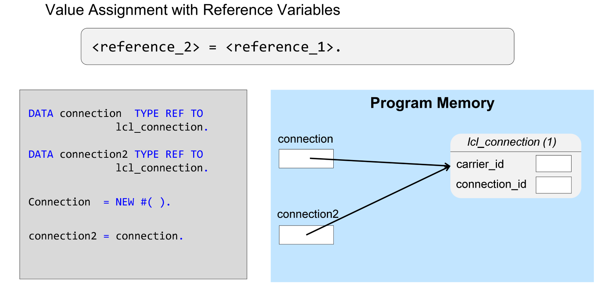
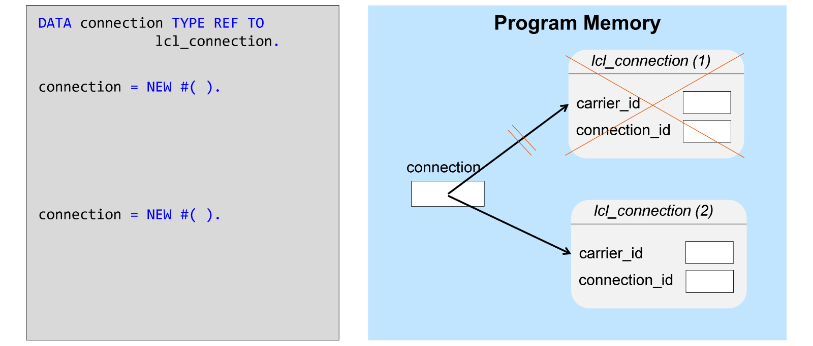
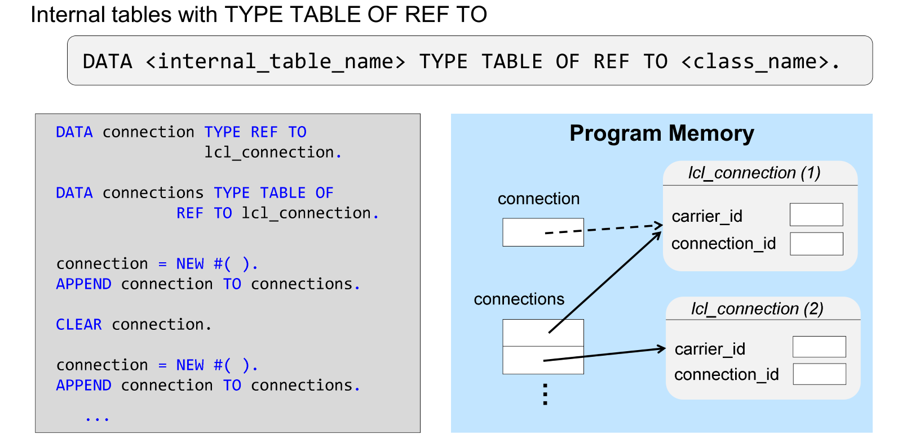

# 🌸 2 [CREATING INSTANCES OF A CLASS](https://learning.sap.com/learning-journeys/acquire-core-abap-skills/creating-instances-of-a-class_a2f2b690-4623-4523-aeb1-7f32b42a1a2e)

> 🌺 Objectifs
>
> - [ ] Vous pourrez créer des instances d'une classe ABAP

## 🌸 INSTANCE CREATION

Les attributs sont manipulés comme des variables normales de même type. Cependant, hors de la classe, le nom de l'attribut ne suffit pas à l'identifier sans ambiguïté. Pour adresser un attribut statique hors de la classe, saisissez d'abord le nom de la classe, puis le sélecteur de composant statique (`=>`), et enfin le nom de l'attribut. Le sélecteur de composant statique est une double flèche composée d'un signe égal et d'un signe supérieur à.

Pour les attributs d'instance, la situation est encore plus complexe : pour accéder à un composant d'instance, vous avez besoin d'une variable de référence.

Une variable de référence est un type particulier de variable permettant de créer, d'adresser et de gérer un objet. Elle permet de pointer vers l'instance d'une classe dans la mémoire du programme. Vous déclarez les variables de référence à l'aide de l'instruction `DATA`, en ajoutant `TYPE REF TO` suivi du nom de la classe.

La valeur initiale d'une variable de référence est appelée référence `NULL` ; la référence ne pointe pas encore nulle part.

Pour créer une nouvelle instance d'une classe, utilisez l'opérateur `NEW`. L'exemple ci-dessus utilise une expression `NEW #( )` à droite d'une affectation de valeur. Le résultat de l'expression est l'adresse mémoire de l'instance nouvellement créée. Cette référence est ensuite stockée dans la variable de référence à gauche de l'affectation.

Vous avez peut-être remarqué que le nom de la classe à instancier n'apparaît nulle part dans l'expression. Cependant, grâce à l'emplacement de l'expression `NEW #( )`, le système sait déjà que la variable cible connection est de `TYPE REF TO lcl_connection` et, par conséquent, qu'il doit créer une instance de la classe `lcl_connection`. Le signe `#` après l'opérateur `NEW` signifie « utiliser le type de la variable avant le signe égal ». (Dans des scénarios plus avancés, vous pouvez spécifier le nom de la classe à la place du signe `#`.)

> #### 🍧 Note
>
> Il doit y avoir au moins un espace entre les parenthèses.

Lorsque vous accédez à une classe pour la première fois (par exemple, en accédant à un composant statique ou en créant une instance de la classe), le système d'exécution charge également la **Définition** de la classe dans la mémoire du programme. Cette **Définition** contient tous les attributs statiques, qui n'existent qu'une seule fois dans la classe et non une fois par instance.

Les composants statiques sont adressés à l'aide du nom de la classe et du sélecteur de composant statique. Cela ne fonctionne pas pour les composants d'instance, car vous devez spécifier l'instance à laquelle vous souhaitez accéder.

Pour adresser un attribut d'instance hors de la classe, saisissez d'abord la variable de référence, puis le sélecteur de composant d'instance (`->`), et enfin le nom de l'attribut. Le sélecteur de composant d'instance est une flèche composée d'un tiret et du signe supérieur à.

> #### 🍧 Note
>
> Contrairement à de nombreux autres langages de programmation, ABAP utilise des caractères différents pour le sélecteur de composant d'instance et le sélecteur de composant statique.

L'une des principales caractéristiques de la programmation orientée objet est la possibilité de créer plusieurs instances d'une même classe. Chaque instance est créée à un emplacement différent de la mémoire programme et les valeurs des attributs d'une instance sont indépendantes de celles des autres instances. Cependant, comme l'illustre le graphique, les instances d'une même classe partagent la valeur des attributs statiques.

Si vous affectez une variable de référence à une autre, le système copie l'adresse de l'objet vers lequel pointe la première variable dans la seconde. Vous obtenez ainsi deux variables de référence pointant vers le même objet.

Vous pouvez utiliser la même variable de référence pour créer plusieurs instances d'une classe. Chaque fois que vous utilisez l'expression `NEW #( )`, le système crée une nouvelle instance de la classe et place l'adresse de cette nouvelle instance dans la variable de référence. Cependant, l'adresse de la nouvelle instance écrase l'adresse de l'instance précédente.

Dans l'exemple ci-dessus, l'adresse de `lcl_connection (2)` écrase celle de `lcl_connection (1)`. Par conséquent, il n'y a plus de variable de référence dans le programme pointant vers `lcl_connection (1)`. Lorsque cela se produit, une instance devient inaccessible depuis le programme.

Pour éviter que la mémoire du programme ne soit saturée d'objets inaccessibles et finisse par déborder, le système d'exécution dispose d'un composant appelé **garbage collector**. Le **garbage collector** est un programme qui s'exécute périodiquement pour rechercher et détruire les objets vers lesquels aucune référence ne pointe. Si, au cours d'un programme, vous supprimez la dernière référence à un objet en l'écrasant ou en utilisant l'instruction `CLEAR`, le **garbage collector** détruira l'objet lors de son prochain passage.

> #### 🍧 Note
>
> À la fin d'un programme, lorsque toutes les variables de référence sont libérées, le **garbage collector** détruit toutes les instances vers lesquelles elles pointaient. Vous n'avez pas à vous soucier de la gestion des ressources du programme.

## 🌸 HOW TO CREATE INSTANCES OF AN ABAP CLASS

[Exercices](https://learning.sap.com/learning-journeys/acquire-core-abap-skills/creating-instances-of-a-class_a2f2b690-4623-4523-aeb1-7f32b42a1a2e)

## 🌸 INSTANCE MANAGEMENT IN AN INTERNAL TABLE

Une façon de préserver la vie des objets est de placer les références dans une table interne. Cette technique peut s'avérer utile si vous créez une série complète d'objets. Elle permet d'utiliser une seule variable de référence pour créer de nombreux objets. Bien que la variable de référence soit écrasée par l'adresse de l'objet suivant, les objets existants sont protégés car la table interne contient une référence vers eux. Vous ne supprimez donc jamais la « dernière » référence aux objets.

## 🌸 HOW TO MANAGE INSTANCES IN AN INTERNAK TABLE

[Exercices](https://learning.sap.com/learning-journeys/acquire-core-abap-skills/creating-instances-of-a-class_a2f2b690-4623-4523-aeb1-7f32b42a1a2e)
