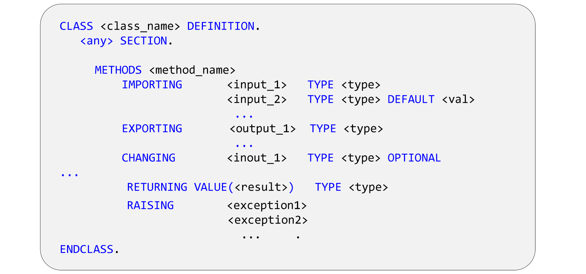
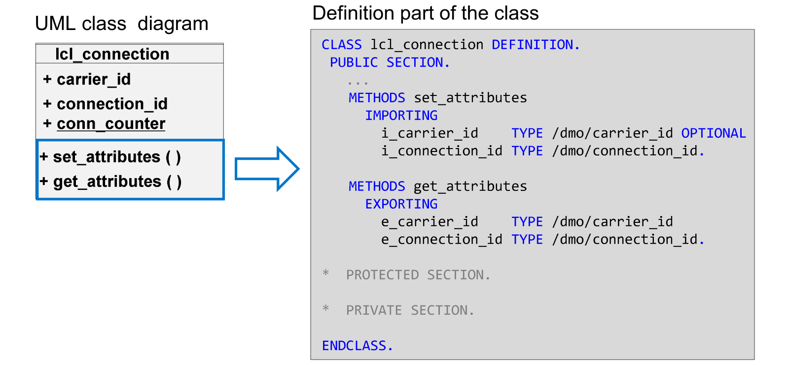
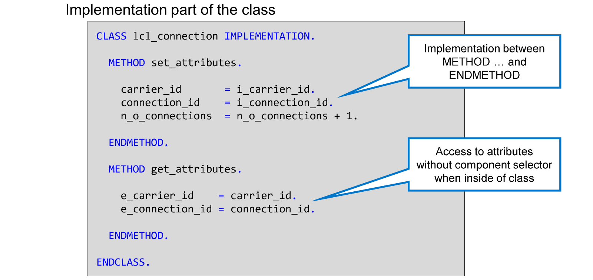
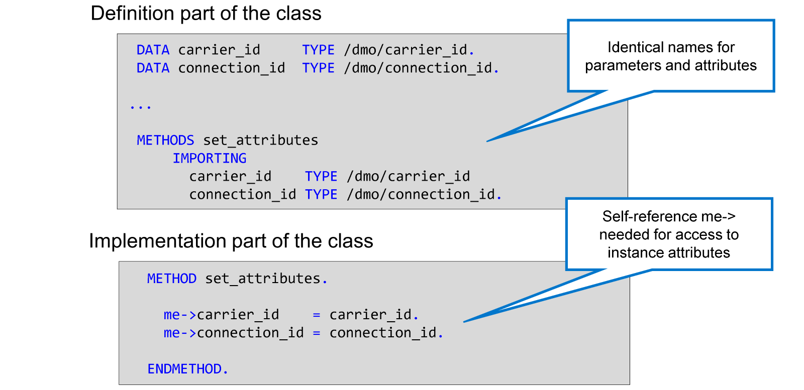
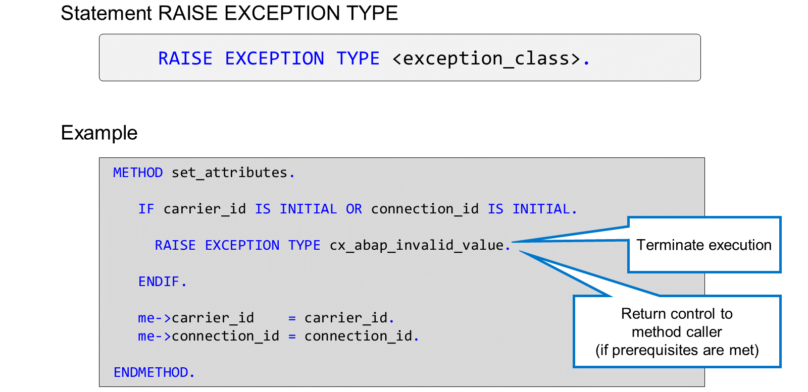
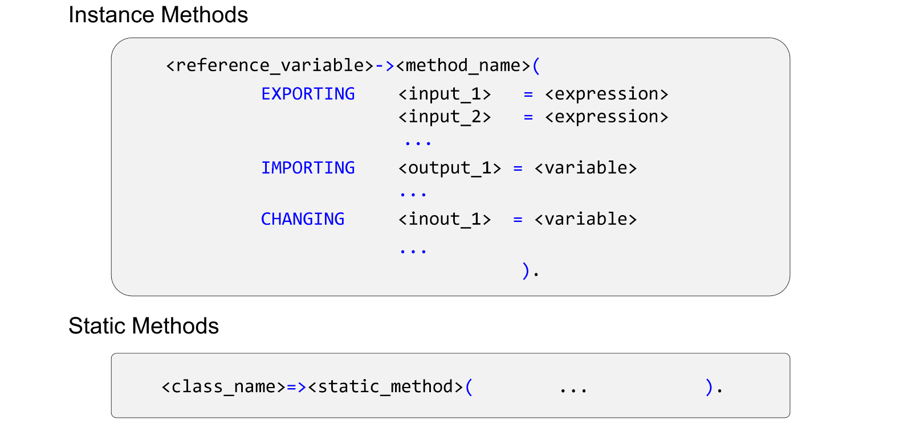
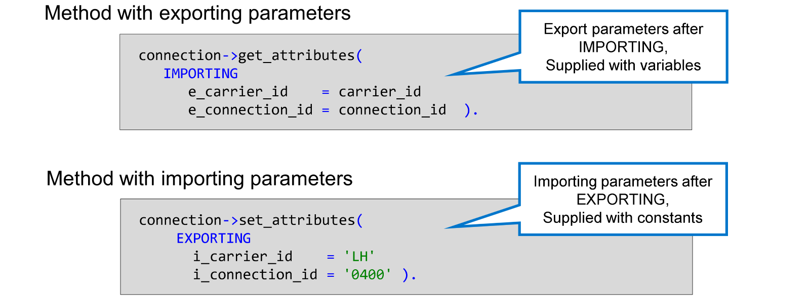
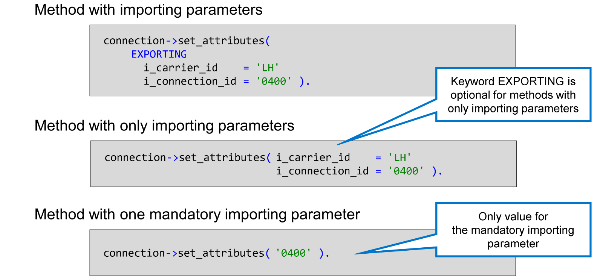
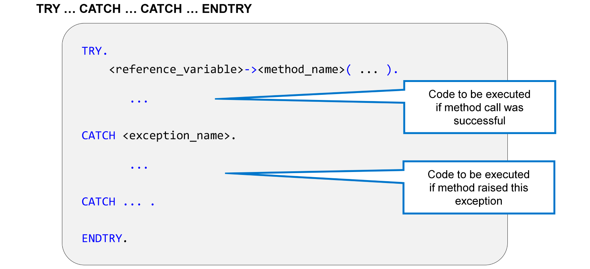

# 🌸 3 [DEFINING AND CALLING METHODS](x-lab/00-template.md)

> 🌺 Objectifs
>
> - [ ] Vous pourrez définir et appeler des méthodes

## 🌸 METHOD DEFINITION

Dans la partie définition d'une classe, vous utilisez `METHODS` pour définir une méthode d'instance et `CLASS-METHODS` pour définir une méthode statique. Le nom de la méthode est suivi de sa signature, c'est-à-dire l'ensemble des valeurs échangées par la méthode avec son appelant et les **Exceptions** qui peuvent survenir pendant l'exécution de la méthode.

La signature d'une méthode est composée de **Parameters** et d'**Exceptions**. Chaque paramètre possède un nom et un type.

ABAP reconnaît les types de **Parameters** suivants :

#### 💮 **Importing Parameters** :

Les **Importing Parameters** sont des valeurs que la méthode reçoit de l'appelant. Une méthode peut avoir un nombre illimité de **Importing Parameters**.

Par défaut, les **Importing Parameters** sont obligatoires, mais il existe deux façons de les rendre optionnels :

- Avec l'ajout `OPTIONAL`. Le paramètre est optionnel et sa valeur par défaut est la valeur initiale correspondant à son type.

- Avec l'ajout `DEFAULT <val>`. Le paramètre est optionnel et sa valeur par défaut est la valeur que vous avez spécifiée comme `<val>`.

Dans une méthode, vous ne pouvez pas modifier les **Importing Parameters**. Si vous essayez de le faire, vous provoquerez une erreur de syntaxe.

#### 💮 **Exporting Parameters** :

Les **Exporting Parameters** sont les résultats renvoyés par la méthode. Une méthode peut avoir un nombre illimité de **Exporting Parameters**. Tous ces paramètres sont facultatifs : un programme appelant n'utilise que les valeurs dont il a réellement besoin.

#### 💮 **Changing Parameters** :

Les **Changing Parameters** sont les valeurs que la méthode reçoit de l'appelant. Contrairement aux paramètres d'importation, la méthode peut modifier les valeurs de ces paramètres. Elles sont ensuite renvoyées à l'appelant sous le même nom. Une méthode peut avoir un nombre illimité de **Changing Parameters**. Les **Changing Parameters** sont obligatoires par défaut ; vous pouvez les rendre facultatifs de la même manière que les paramètres d'importation.

#### 💮 **Returning Parameters** :

Un **Returning Parameter** est un résultat de méthode directement utilisable dans une expression. Une méthode ne peut avoir qu'un seul **Returning Parameter**. Les **Returning Parameters** doivent utiliser une forme particulière de passage de paramètres, appelée passage par valeur. Cette forme de passage de paramètres est définie en entourant le nom du paramètre entre crochets (sans espaces !) et en le faisant précéder du mot clé VALUE.

#### 💮 **RAISING** :

Le mot-clé `RAISING` permet de lister les exceptions que la méthode peut lever pour signaler une erreur. Le programme appelant peut alors réagir à l'erreur.

Comme exemple, ajoutez deux méthodes à notre classe `lcl_connection`.

Une méthode `set_attributes( )` définit les valeurs des attributs `i_carrier_id` et `i_connection_id`, et une méthode `get_attributes( )` renvoie les valeurs de ces attributs. Alors que `set_attributes( )` nécessite deux paramètres d'importation, un pour chaque attribut, la méthode `get_attributes( )` nécessite deux paramètres d'exportation.

Pour chaque méthode définie, vous devez également créer une implémentation dans la partie implémentation de la classe. Tant que vous ne le faites pas, des erreurs de syntaxe apparaissent dans votre classe ; la vérification syntaxique indique que l'implémentation de la méthode est manquante.

> #### 🍧 Hint
>
> ADT propose un correctif rapide pour ajouter l'implémentation manquante. Pour l'utiliser, procédez comme suit :
>
> 1. Positionnez le curseur sur une instruction METHODS présentant une erreur et appuyez sur Ctrl + 1.
>
> 2. Dans la liste des correctifs rapides possibles, choisissez « Ajouter une implémentation pour… » et appuyez sur Entrée. Si l'implémentation est manquante pour plusieurs méthodes, le correctif rapide s'intitule « Ajouter… méthodes non implémentées ».

## 🌸 HOW TO DEFINE METHODS

[Démo](http://learning.sap.com/learning-journeys/acquire-core-abap-skills/defining-and-calling-methods_bc2d0d2a-d7f4-41bf-84f2-65de61c408ed)

## 🌸 METHOD IMPLEMENTATION

Vous devez implémenter chaque méthode que vous définissez. Pour ce faire, vous devez ajouter les instructions `METHOD <nom_méthode>` et `ENDMETHOD` à la partie implémentation de la classe.

L'implémentation de la méthode contient des instructions ABAP qui peuvent accéder aux paramètres de la méthode (vous n'êtes pas autorisé à modifier les paramètres d'importation) ainsi qu'à tous les types, attributs et constantes déclarés dans la classe, quelle que soit leur visibilité. Les méthodes d'instance peuvent accéder aux attributs d'instance et aux attributs statiques. Les méthodes statiques ne peuvent accéder qu'aux composants statiques.

Dans la partie implémentation d'une classe, vous pouvez accéder aux attributs de cette classe sans variable de référence et sans `->` (ou sans le nom de la classe et `=>`, dans le cas d'attributs statiques).

ABAP propose uniquement la variable intégrée `ME` pour l'implémentation des méthodes d'instance. `ME` est une variable de référence typée avec la classe courante et renseignée à l'exécution avec l'adresse de l'instance courante. L'utilisation de `ME` est facultative et doit être évitée, sauf si le nom d'un attribut entre en conflit avec le nom d'un autre objet de données, par exemple un nom de paramètre.

Dans l'exemple, les paramètres d'importation de la méthode `set_attributes( )` portent les mêmes noms que les attributs correspondants. Dans ce cas, le nom seul désigne le paramètre. Il suffit de placer `me->` devant pour indiquer clairement qu'il s'agit d'accéder à un attribut de l'instance courante.

Si une erreur survient lors de l'exécution d'une méthode, celle-ci peut déclencher une exception à l'aide de l'instruction RAISE EXCEPTION TYPE, suivie du nom de l'exception.

> #### 🍧 Note
>
> Techniquement, les noms d'exception sont ceux de classes ABAP spécifiques et l'instruction RAISE EXCEPTION TYPE crée une instance de la classe référencée. Cette instance est appelée objet exception et les classes ABAP spécifiques sont appelées classes d'exception.

Dès qu'une exception est levée, l'exécution de la méthode est interrompue.

Le contrôle est rendu au programme appelant si toutes les conditions préalables sont remplies. Sinon, le programme entier se termine avec une erreur d'exécution.

Les conditions préalables à la poursuite du programme sont les suivantes :

- L'exception levée est déclarée dans la clause `RAISING` de la signature de la méthode.

- L'appel de la méthode est entouré d'une structure de contrôle `TRY … ENDTRY`.

- La structure de contrôle `TRY … ENDTRY` contient un bloc `CATCH` pour l'exception.
  Remarque :

> #### 🍧 Note
>
> Pour certaines exceptions, l'éditeur ABAP affiche un avertissement de syntaxe avec une solution rapide lorsque vous générez une exception qui n'est pas encore déclarée dans la clause `RAISING` de la méthode.

## 🌸 HOW TO IMPLEMENT METHODS

[Démo](http://learning.sap.com/learning-journeys/acquire-core-abap-skills/defining-and-calling-methods_bc2d0d2a-d7f4-41bf-84f2-65de61c408ed)

## 🌸 METHOD CALLS

L'appel d'une méthode d'instance s'effectue à l'aide d'une variable de référence et du sélecteur de composant d'instance `->`. Le sélecteur de composant est suivi du nom de la méthode à appeler. Pour les méthodes statiques, utilisez le nom de la classe et le sélecteur de composant statique `=>`. Dans les deux cas, le passage des paramètres s'effectue entre parenthèses. Ces parenthèses sont obligatoires dans tous les cas. Elles restent vides si aucun paramètre n'est passé.

> #### 🍧 Note
>
> Aucun espace n'est autorisé entre le nom de la méthode et l'accolade ouvrante. En revanche, il faut au moins un espace après l'accolade ouvrante et avant l'accolade fermante.

L'appel d'une méthode d'instance s'effectue à l'aide d'une variable de référence et du sélecteur de composant d'instance `->`. Le sélecteur de composant est suivi du nom de la méthode à appeler. Pour les méthodes statiques, le nom de la classe et le sélecteur de composant statique `=>` sont utilisés. Dans les deux cas, le passage des paramètres s'effectue entre parenthèses. Ces parenthèses sont obligatoires dans tous les cas. Elles restent vides si aucun paramètre n'est passé.

> #### 🍧 Note
>
> Aucun espace n'est autorisé entre le nom de la méthode et le crochet ouvrant. En revanche, il faut au moins un espace après le crochet ouvrant et avant le crochet fermant.

Les paramètres d'importation sont listés après le mot-clé `EXPORTING`, car les valeurs importées par la méthode appelée sont exportées par le programme appelant. Les noms des paramètres sont listés à gauche d'un signe égal `=` et une expression à droite. Cette expression peut être aussi simple qu'un littéral, une constante ou une variable, mais toute autre expression est autorisée, à condition que son type corresponde à celui du paramètre.

Les paramètres d'exportation sont listés après le mot-clé `IMPORTING`. Notez que pour l'exportation d'un paramètre, le nom du paramètre est également listé à gauche du signe égal. La variable à droite doit être du même type que le paramètre.

Les paramètres modifiables sont listés après le mot-clé `CHANGING`. Le type de la variable à droite doit correspondre à celui du paramètre à gauche.

Cet exemple illustre l'appel des méthodes d'instance `set_attributes( )` et `get_attributes( )`. Les noms des paramètres sont toujours à gauche du signe égal `=`.

> #### 🍧 Hint
>
> Vous pouvez utiliser la saisie semi-automatique du code dans ADT pour générer l'appel de méthode, y compris le passage des paramètres. Pour ce faire, procédez comme suit :
>
> 1. Saisissez la variable de référence (ou le nom de la classe) et le sélecteur de composant.
>
> 2. Une fois le sélecteur de composant saisi, appuyez sur Ctrl + Espace pour afficher la liste des composants accessibles.
>
> 3. Si vous choisissez une méthode, appuyez sur Maj + Entrée pour insérer le nom de la méthode et sa signature complète dans votre code. Les paramètres facultatifs sont listés dans les lignes de commentaire.

Lors de l'appel d'une méthode, le mot-clé `IMPORTING` est toujours nécessaire pour recevoir la valeur des paramètres d'exportation. Cependant, le mot-clé `EXPORTING` devient facultatif si vous souhaitez uniquement fournir des paramètres d'importation.

Pour les méthodes ne comportant qu'un seul paramètre d'importation obligatoire, vous pouvez même omettre l'affectation explicite des paramètres. Dans l'exemple, le paramètre `i_carrier_id` est facultatif avec la valeur par défaut `LH`. Par conséquent, la valeur entre parenthèses est affectée au paramètre d'importation obligatoire restant, `i_connection_id`.

## 🌸 HOW TO CALL METHODS

[Démo](http://learning.sap.com/learning-journeys/acquire-core-abap-skills/defining-and-calling-methods_bc2d0d2a-d7f4-41bf-84f2-65de61c408ed)

## 🌸 EXCEPTION RAISING

Dans une section précédente de ce cours, vous avez appris à gérer les erreurs d'exécution avec les structures de contrôle `TRY … ENDTRY`.

Les exceptions déclarées dans la clause `RAISING` d'une définition de méthode sont gérées exactement de la même manière :

Placez l'appel de méthode dans le bloc `TRY` de la structure de contrôle `TRY … ENDTRY`.
Définissez un bloc `CATCH` portant le nom de l'exception à gérer.

> #### 🍧 Note
>
> Si vous souhaitez ignorer du code en cas d'échec de l'appel de méthode, vous pouvez le placer dans le bloc try, après l'appel de méthode.

## 🌸 METHOD CALLS AND EXCEPTION HANDLING

[Exercice](http://learning.sap.com/learning-journeys/acquire-core-abap-skills/defining-and-calling-methods_bc2d0d2a-d7f4-41bf-84f2-65de61c408ed)

## 🌸 FUNCTIONAL METHODS

Les méthodes possédant un **paramètre de retour** sont appelées **functional methods**. Il est impossible de définir plusieurs paramètres de retour pour une même méthode. Il est obligatoire de définir le **paramètre de retour** sous la forme `VALUE(<nom_paramètre>)`.

Outre le **paramètre de retour**, une méthode fonctionnelle peut avoir n'importe quelle combinaison d'autres paramètres. Cependant, il est plus courant d'ajouter uniquement des paramètres d'importation. En effet, l'exportation ou la modification de paramètres supplémentaires fait perdre le principal avantage des **functional methods** : la possibilité d'utiliser le résultat d'une méthode fonctionnelle directement dans d'autres expressions ABAP.

La figure présente deux exemples d'utilisation de **functional methods** dans des expressions ; le premier est un exemple simple où le **paramètre de retour** est affecté directement à une variable. Le second exemple montre comment l'appel de la méthode fonctionnelle est utilisé comme entrée pour une autre méthode. Le système exécute la méthode fonctionnelle, puis utilise la valeur du **paramètre de retour** comme entrée pour la méthode `write( )`.

[Exercice](http://learning.sap.com/learning-journeys/acquire-core-abap-skills/defining-and-calling-methods_bc2d0d2a-d7f4-41bf-84f2-65de61c408ed)
