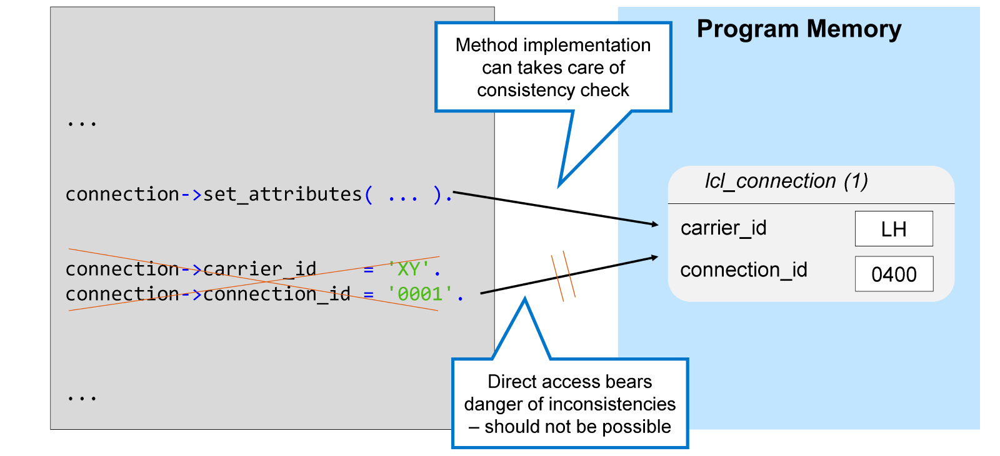
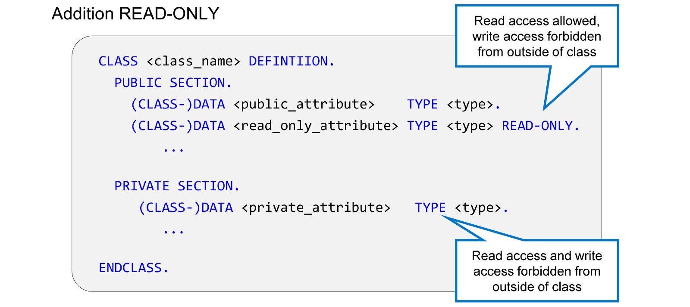
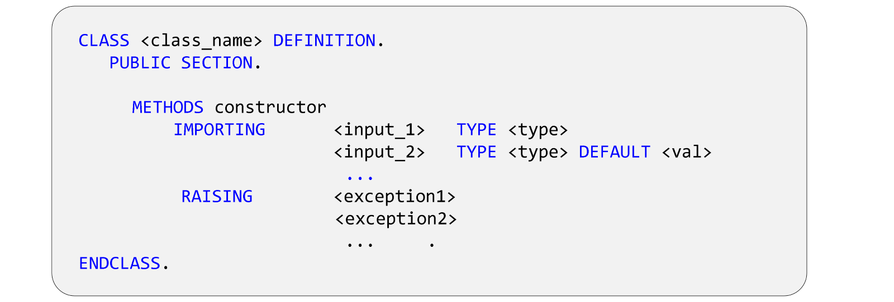
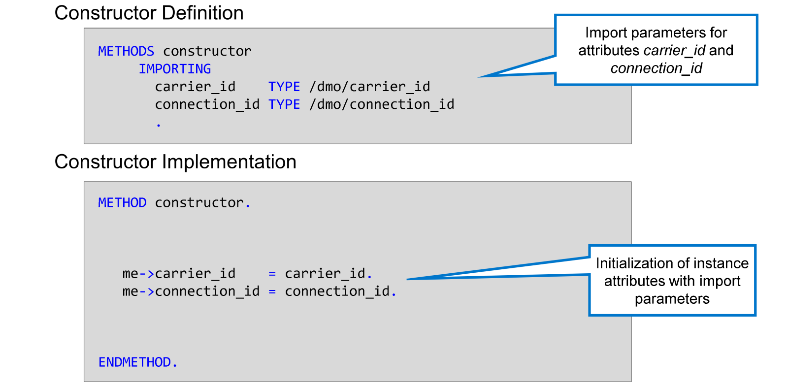
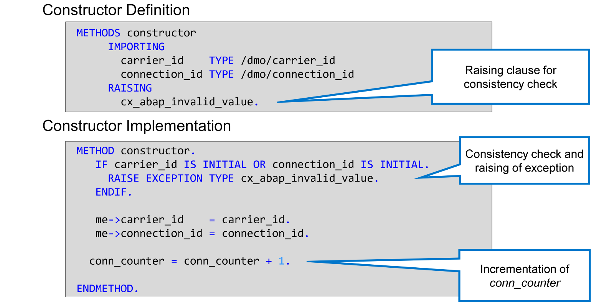
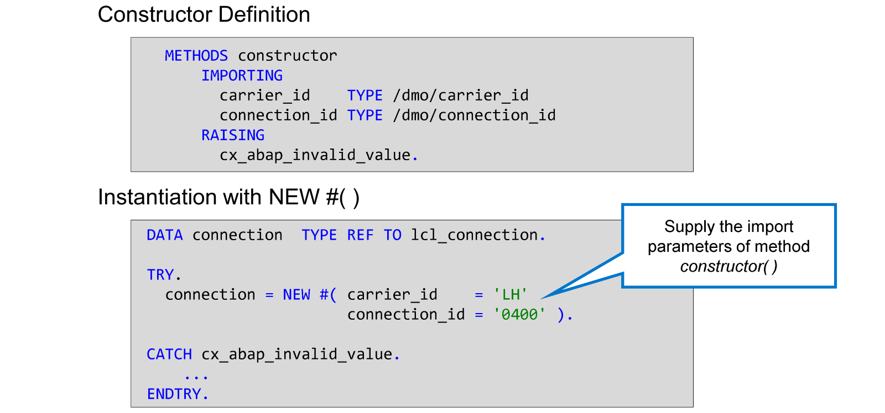
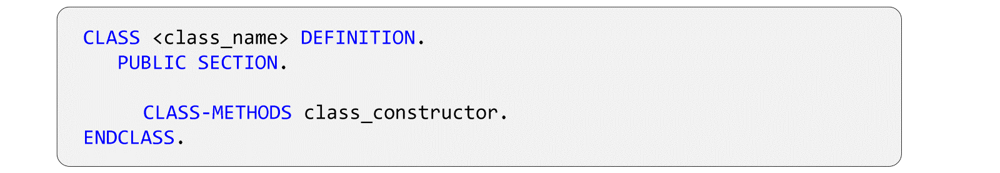

# 🌸 4 [USING ENCAPSULATION TO ENSURE CONSISTENCY](https://learning.sap.com/learning-journeys/acquire-core-abap-skills/using-encapsulation-to-ensure-consistency_e3780ce0-2ba3-4d03-a09f-15ac109b0c03)

> 🌺 Objectifs
>
> - [ ] Expliquer l'encapsulation
>
> - [ ] Définir et utiliser des **Constructor**s

## 🌸 DATA ENCAPSULATIION

En programmation orientée objet, un objet correspond à un objet réel, tel qu'un employé, un véhicule ou, dans notre cas, une correspondance aérienne. Il possède des attributs qui le décrivent : dans le cas d'une correspondance aérienne, il s'agit de l'identifiant du transporteur et du numéro de vol.

Examinons maintenant ce qui se passe lorsqu'un programme utilisant cet objet souhaite fournir des valeurs pour ces attributs. Il est évident que seules les combinaisons d'identifiant du transporteur et de numéro de vol correspondant à une correspondance aérienne réelle doivent être acceptées.

En orientation objet, le programme client ne devrait pas pouvoir modifier directement les valeurs des attributs. Il devrait plutôt appeler une méthode pour effectuer cette tâche. La méthode, fournie avec l'objet, peut alors vérifier si la combinaison d'identifiant du transporteur et de numéro de vol est valide et, si ce n'est pas le cas, rejeter la modification.

En tant que développeurs de la classe `lcl_connection`, nous pouvons garantir l'utilisation de la méthode `set_attributes()` en rendant les attributs `carrier_id` et `connection_id` privés, ou au moins en `READ ONLY`.

Ce concept est appelé **data encapsulation** ; Les informations relatives à la connexion de vol sont gérées par l'objet de connexion lui-même et ne peuvent être manipulées par personne d'autre. Ainsi, aucun autre élément du programme ne peut contourner la vérification de cohérence, consciemment ou non. C'est l'un des principaux avantages de l'orientation objet.

En programmation orientée objet, il est recommandé d'utiliser autant que possible la **data encapsulation** !

Grâce aux attributs `publics` définis, il était possible de lire et de modifier leurs valeurs partout, à l'intérieur comme à l'extérieur de la classe.

Pour restreindre l'accès aux attributs, deux options s'offrent à vous :

1. Conserver l'instruction `DATA` ou `CLASS-DATA` dans la `PUBLIC SECTION` et ajouter l'option `READ ONLY`. Ainsi, l'accès en écriture à l'attribut est interdit en dehors de la classe, mais l'accès en lecture reste possible.

   > #### 🍧 Note
   >
   > L'option `READ ONLY` est uniquement autorisée dans la `PUBLIC SECTION` d'une classe.

2. Déplacez l'instruction `DATA` ou `CLASS-DATA` de la `PUBLIC SECTION` vers une autre section de visibilité, par exemple la `PRIVATE SECTION`. Ainsi, l'accès en lecture et en écriture à l'attribut est interdit en dehors de la classe.

   > #### 🍧 Hint
   >
   > ADT propose une solution rapide pour modifier la visibilité d'un attribut. Pour l'utiliser, placez le curseur dans le nom de l'attribut, appuyez sur [Ctrl] + [1], puis choisissez [Make <attribute> private].

[Démo](https://learning.sap.com/learning-journeys/acquire-core-abap-skills/using-encapsulation-to-ensure-consistency_e3780ce0-2ba3-4d03-a09f-15ac109b0c03)

## 🌸 INSTANCE CONSTRUCTOR

En rendant vos attributs privés, ou au moins en lecture seule, vous pouvez garantir que le programme client utilise la méthode `set_attributes()` disponible pour définir les valeurs des attributs `carrier_id` et `connection_id`.

Cependant, des incohérences peuvent subsister :

- Vous ne pouvez pas forcer le programme à appeler `set_attributes()` pour chaque nouvelle instance. Par conséquent, certaines instances peuvent avoir des valeurs initiales pour `carrier_id` et `connection_id`.

- Le programme client peut appeler `set_attributes()` plusieurs fois pour la même instance. Cela ne devrait pas non plus être possible.

Il est nécessaire de disposer d'une technique permettant d'appliquer des valeurs non initiales lors de l'instanciation et d'empêcher toute modification ultérieure.

Pour résoudre ces problèmes, les langages de programmation orientés objet utilisent des **constructor methods**.

Le système d'exécution appelle automatiquement le **Constructor** lors de la création d'une nouvelle instance de la classe, mais vous ne pouvez pas l'appeler explicitement. Ainsi, le **Constructor** est assuré de s'exécuter une seule fois pour chaque instance créée.

D'un point de vue syntaxique, une méthode `constructor` possède les propriétés suivantes :

- Une méthode d'instance publique portant le nom réservé `constructor`

- peut avoir des paramètres d'importation, par exemple pour obtenir les valeurs initiales des attributs de la nouvelle instance

- peut générer des exceptions

> #### 🍧 Note
>
> En ABAP, il n'est pas possible de définir plusieurs méthodes `constructor` dans une même classe.

> #### 🍧 Hint
>
> En ADT, vous pouvez utiliser un correctif rapide pour générer une méthode `constructor`. Pour ce faire, procédez comme suit :
>
> 1. Dans la partie `DEFINITION` ou `IMPLEMENTATION`, placez le curseur sur le nom de la classe et appuyez sur [Ctrl] + [1].
>
> 2. Dans la liste des correctifs rapides disponibles, choisissez [Generate constructor].
>
> 3. Dans la boîte de dialogue qui s'affiche, sélectionnez les attributs à initialiser avec le `constructor` et choisissez [Finish].
>
> Une fois le constructeur généré, vous pouvez ajuster sa `DEFINITION` et son `IMPLEMENTATION` selon vos besoins.

L'exemple montre le `constructor` de la classe `lcl_connection`. La **DEFINITION** générée contient un paramètre d'importation pour chacun des attributs `carrier_id` et `connection_id`. Les paramètres générés portent les mêmes noms que les attributs associés.

La partie générée de l'implémentation contient une affectation de valeur pour chaque attribut, avec le paramètre d'importation associé à droite. L'auto-référencement `me->` est nécessaire pour distinguer les attributs des paramètres portant le même nom.

L'exemple présente quelques ajouts manuels au `constructor` généré de la classe `lcl_connection`.

Afin d'empêcher la création d'instances avec des valeurs initiales, une vérification de cohérence a été ajoutée à l'implémentation et une clause `RAISING` a été ajoutée à la **DEFINITION** du `constructor`.

Comme le `constructor` est exécuté une seule fois pour chaque nouvelle instance de la classe `lcl_connection`, son implémentation est idéale pour incrémenter l'attribut statique `conn_counter`.

Lorsque vous instanciez une classe possédant un `constructor`, le système appelle automatiquement la méthode `constructor`. Si le `constructor` possède des paramètres d'importation, vous les transmettez dans l'expression `NEW` exactement comme vous le feriez pour une méthode normale.

> #### 🍧 Note
>
> Un `constructor` ne peut avoir que des paramètres d'importation. Le mot-clé `EXPORTING` n'est ni nécessaire ni autorisé dans l'expression `NEW`.

Si le `constructor` comporte des `EXCEPTIONS`, vous devez vous assurer de les intercepter en enfermant l'instanciation dans un bloc `TRY… CATCH… ENDTRY`. Si un `constructor` lève une exception, le contrôle revient immédiatement au programme contenant l'expression `NEW`. Dans ce cas, vous ne recevez pas de nouvelle instance de la classe.

[Démo](https://learning.sap.com/learning-journeys/acquire-core-abap-skills/using-encapsulation-to-ensure-consistency_e3780ce0-2ba3-4d03-a09f-15ac109b0c03)

## 🌸 STATIC CONSTRUCTOR

Bien que le constructeur d'instance soit appelé une fois à la création de chaque instance d'une classe, il est parfois nécessaire d'effectuer des actions une seule fois pour l'ensemble de la classe. ABAP permet donc de définir un constructeur statique, également appelé `class constructor`.

Le système d'exécution appelle le constructeur statique une seule fois lors du premier appel à la classe lors de l'exécution d'un programme.

Le premier adressage d'une classe peut être l'un des suivants :

- Première instanciation de la classe

- Premier appel d'une méthode statique

- Premier accès à un attribut statique public

> #### 🍧 Note
>
> Cette liste n'est pas exhaustive. D'autres actions (liées à l'héritage) peuvent entraîner le premier appel d'une classe.

Un cas d'utilisation typique du constructeur statique est l'initialisation dynamique d'attributs statiques avec des valeurs non initiales. Il est donc important que le runtime appelle le constructeur statique avant de créer l'instance, d'appeler la méthode statique ou d'adresser l'attribut statique.

D'un point de vue syntaxique, une méthode constructeur possède les propriétés suivantes :

- Une méthode statique publique portant le nom réservé `class_constructor`

- Sans paramètres ni exceptions

> #### 🍧 Note
>
> Un constructeur statique ne doit pas avoir de signature, car il est impossible de savoir précisément quand une classe sera adressée pour la première fois.

> #### 🍧 Hint
>
> Dans ADT, vous pouvez utiliser un correctif rapide pour générer une méthode de constructeur de classe. Pour ce faire, procédez comme suit :
>
> 1. Dans la définition ou l'implémentation, placez le curseur sur le nom de la classe et appuyez sur [Ctrl] + [1].
>
> 2. Dans la liste des correctifs rapides disponibles, choisissez [Generate class constructor].

## 🌸 HOW TO DEBUG THE EXECUTION OF CONSTRUCTORS

[Démo](https://learning.sap.com/learning-journeys/acquire-core-abap-skills/using-encapsulation-to-ensure-consistency_e3780ce0-2ba3-4d03-a09f-15ac109b0c03)
