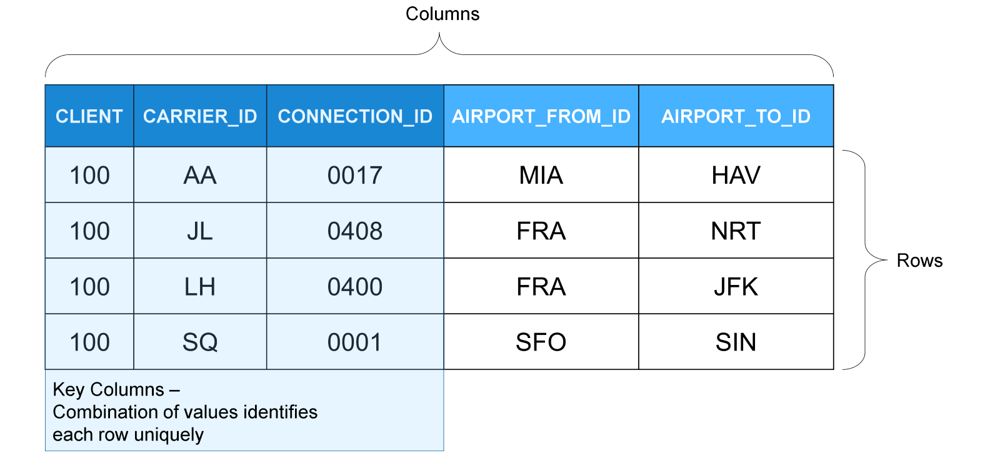

# 🌸 1 [INVESTIGATING A TABLE DEFINITION](https://learning.sap.com/learning-journeys/acquire-core-abap-skills/investigating-a-table-definition_f5b25669-42e0-437a-9cbc-90a655e746d8)

> 🌺 Objectifs
>
> - [ ] Vous pourrez étudier une **Definition** de table

## 🌸 DATABASE TABLE DEFINITIONS

Chaque système ABAP s'exécute sur un système de gestion de base de données relationnelle (SGBD). Initialement, ABAP prenait en charge différents systèmes de gestion de base de données de différents fournisseurs. Par conséquent, la **Definition** des objets de base de données, tels que les tables et les vues, s'effectue indépendamment de la base de données.

> #### 🍧 Note
>
> Les versions ABAP les plus récentes prennent uniquement en charge SAP HANA comme base de données. L'environnement ABAP sur SAP BTP s'exécute toujours sur SAP HANA.

Dans une base de données relationnelle, les informations sont stockées dans des tables bidimensionnelles, où chaque ligne représente un enregistrement de données dont le contenu est divisé en colonnes. La base de données est dite relationnelle, car il existe également des relations entre les tables. Par exemple, la table illustrée contient un code de compagnie aérienne. Dans cette table, il existe une relation avec une autre table contenant les informations suivantes : AA signifie American Airlines, JL Japanese Airline, LH Lufthansa, etc.

Une séquence de colonnes au début de chaque table de base de données constitue sa clé. Cette clé est une combinaison de valeurs qui garantit l'identification unique de chaque ligne de la table.

Dans les systèmes SAP, les **Definition**s de tables de base de données sont des objets de développement et, à ce titre, **cross-client**. Cependant, la grande majorité des tables contiennent des données métier **client-specific**. Afin de séparer les données, les tables **client-specific** ont un champ client (souvent nommé `CLIENT` ou `MANDT`) comme premier champ clé. La base de données SAP accède aux instructions via `ABAP SQL` afin de garantir qu'une instruction ne manipule que les données du client actuel.

### DATABASE TABLE DEFINITIONS

ADT fournit un éditeur dédié aux **Definition**s de tables de base de données.

Examinons les différentes parties de la **Definition** d'une table.

[Référence - Link Vidéo](https://learning.sap.com/learning-journeys/acquire-core-abap-skills/investigating-a-table-definition_f5b25669-42e0-437a-9cbc-90a655e746d8)

### DATA PREVIEW FOR DATABASE TABLES

Vous pouvez utiliser l'outil **Data Preview** pour afficher et analyser le contenu d'une table de base de données. Pour ouvrir le **Data Preview** d'une table donnée, faites un clic droit n'importe où dans la **Definition** de la table et choisissez **Open With** → **Data Preview**. Vous pouvez également placer le curseur n'importe où dans la **Definition** de la table et appuyer sur [F8].

L'outil affiche les données stockées dans la table de base de données. Regardez la vidéo pour découvrir certaines des fonctions les plus importantes.

[Référence - Link Vidéo](https://learning.sap.com/learning-journeys/acquire-core-abap-skills/investigating-a-table-definition_f5b25669-42e0-437a-9cbc-90a655e746d8)
