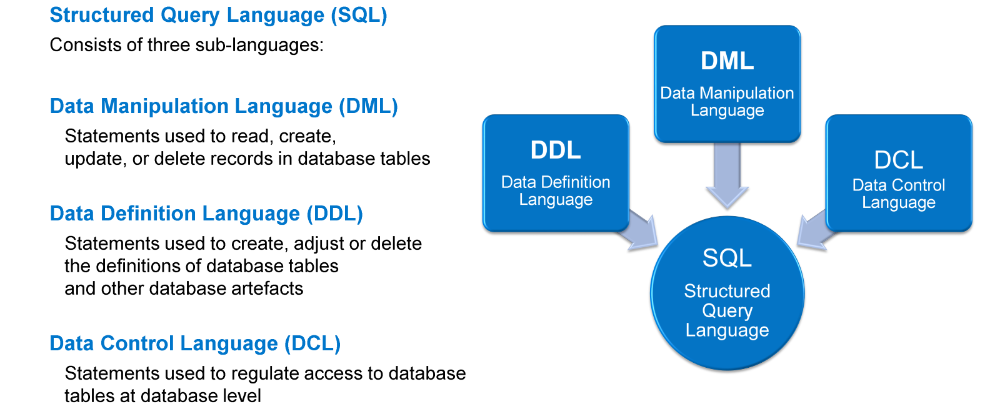
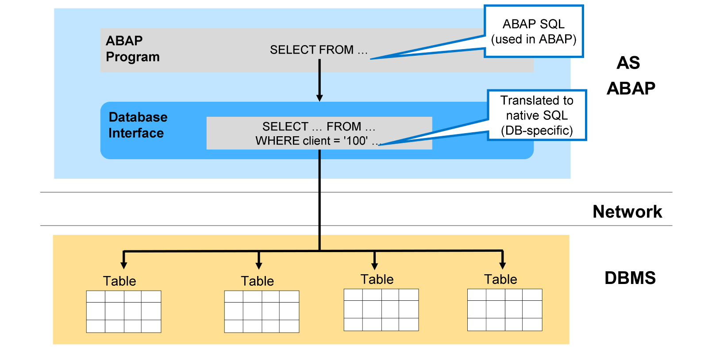
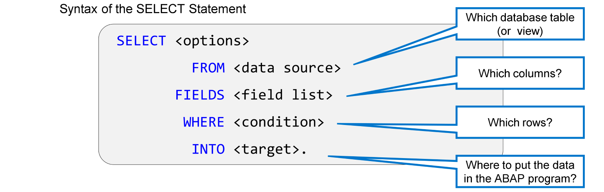
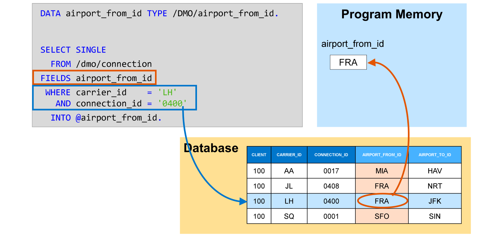
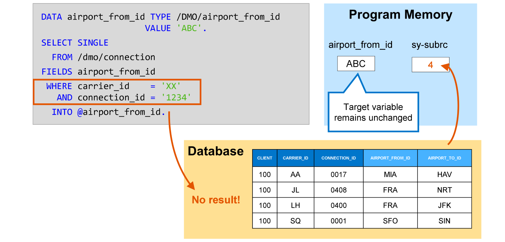
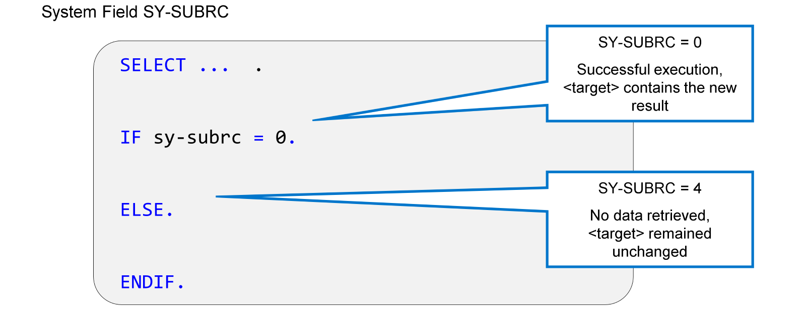

# 🌸 2 [IMPLMENTING BASIC `SELECT` STATEMENTS](https://learning.sap.com/learning-journeys/acquire-core-abap-skills/implementing-basic-````select````-statements_a6d4effa-f6b0-4ef8-96c8-b79baa2da157)

> 🌺 Objectifs
>
> - [ ] Décrire les fonctionnalités de base d'**ABAP SQL**
>
> - [ ] Lire des valeurs uniques dans la base de données

## 🌸 BASIC ABAP SQL SYNTAX

### STRUCTURED QUERY LANGUAGE (SQL)



Tous les systèmes de bases de données relationnelles utilisent une variante du langage SQL (Structured Query Language). Le SQL standard se compose de trois composants principaux :

#### 💮 **Data Manipulation Language (DML)** :

Le **DML** comprend les instructions nécessaires à l'utilisation des informations des tables de base de données : `INSERT` pour l'ajout de nouveaux enregistrements, `SELECT` pour la lecture des données, `UPDATE` pour la modification des enregistrements existants et `DELETE` pour la suppression du contenu des tables. Ces instructions sont reflétées dans ABAP sous la forme d'**ABAP SQL\***.

#### 💮 **Data Definition Language (DDL)** :

Le **DML** fournit des commandes permettant de créer et de supprimer des tables de base de données et d'autres artefacts de base de données tels que des schémas, des index de table et des vues. Dans un système SAP, ces tâches sont effectuées à l'aide d'éditeurs dédiés d'ADT, et non de programmes ABAP. L'éditeur de définitions de tables de base de données, vu précédemment, en est un exemple.

#### 💮 **Data Control Language (DCL)** :

Le **DML** est utilisé en SQL pour restreindre l'accès aux données de la base de données à un utilisateur spécifique. Ce protocole n'est pas utilisé sous sa forme classique dans ABAP, car les utilisateurs au niveau de la base de données ne correspondent pas de manière univoque aux utilisateurs finaux. Par conséquent, ABAP possède son propre concept d'autorisation.

### ABAP SQL ARCHITECTURE



Par le passé, les systèmes SAP devaient prendre en charge diverses plateformes de bases de données, chacune ayant une implémentation légèrement différente de la norme SQL. Cela signifiait que chaque plateforme nécessitait des commandes légèrement différentes pour réaliser une tâche particulière. Pour éviter que le code ABAP soit spécifique à une base de données, SAP a inventé **ABAP SQL**, ou **Open SQL** comme il s'appelait initialement.

> #### 🍧 Note
>
> Le changement de nom entre **Open SQL** et **ABAP SQL** illustre également qu'à partir de la version 7.53, ABAP ne prend en charge que SAP HANA comme SGBD.

**ABAP SQL** est un ensemble abstrait de commandes SQL implémentées au niveau ABAP et intégrées au langage ABAP. À l'exécution, **ABAP SQL** est traduit en une variante de SQL comprise par la base de données. Cette variante est appelée **SQL natif** pour la distinguer d'**ABAP SQL**, la variante SQL intégrée à ABAP. La traduction d'**ABAP SQL** en **SQL natif** s'effectue dans l'interface de base de données, un composant du système ABAP composé d'une partie générale et d'une bibliothèque spécifique à la base de données.

Bien que les versions ABAP les plus récentes ne prennent en charge que **SAP HANA** comme SGBD, SAP a conservé le concept d'**ABAP SQL** et d'interface de base de données. Ceci pour les raisons suivantes :

#### 💮 **Architecture compatibility** :

**ABAP SQL** et l'interface de base de données font partie intégrante de l'architecture du système.

#### 💮 **Code compatibility** :

Le codage **ABAP SQL** des produits SAP précédents (y compris le développement spécifique au client) devrait fonctionner sans effets secondaires dans les environnements ABAP modernes, exclusivement SAP-HANA.

#### 💮 **Tasks of the Database Interface** :

L'interface de base de données ne se contente pas de traduire des instructions ; il est également responsable des tâches spécifiques à ABAP comme, par exemple, la gestion automatique des clients.

## 🌸 SINGLE RECORD READING `FROM` THE DATABASE

### THE SELECT STATEMENT IN ABAP



Pour lire les données de la base de données, utilisez l'instruction `SELECT`.

Lorsque vous écrivez une instruction `SELECT` en ABAP SQL, la vérification syntaxique compare ce que vous avez écrit avec la définition des tables et des vues. Si vous essayez d'accéder à des tables, des vues ou des champs inexistants, une erreur de syntaxe se produit.

La syntaxe de base de l'instruction `SELECT` comprend plusieurs sections, appelées clauses, et suit toujours le modèle illustré dans la figure « L'instruction `SELECT` en ABAP ». Les clauses les plus importantes d'une instruction `SELECT` sont les suivantes :

#### 💮 **FROM** :

Dans la clause `FROM` de l'instruction `SELECT`, vous spécifiez la source de données à lire. Il peut s'agir d'une table de base de données ou d'une vue. Des techniques SQL spécifiques permettent de combiner des données provenant de plusieurs sources dans une même instruction `SELECT`.

#### 💮 **FIELDS** :

Dans la clause `FIELDS` de l'instruction `SELECT`, vous listez les colonnes de la table de base de données à lire. Les colonnes de la liste doivent être séparées par des virgules. Pour lire l'intégralité de la ligne de la table, vous pouvez spécifier `FIELDS *` au lieu d'une liste de colonnes. Attention, cependant, cela peut accroître considérablement la charge de travail de la base de données par rapport à la simple lecture des colonnes nécessaires.

#### 💮 **WHERE** :

Dans la clause `WHERE`, vous pouvez spécifier une condition décrivant les lignes de la table à lire. Par exemple, la condition `WHERE carrier_id = 'LH'` signifie que seules les lignes dont la colonne `CARRIER_D` contient la valeur LH seront lues.

La clause `WHERE` peut contenir plusieurs conditions liées aux opérateurs AND et OR. Par exemple, `WHERE carrier_id = 'LH'` et `connection_id = '0400'` renvoient les données de la correspondance `LH 0400`. Vous pouvez également inverser les conditions avec `NOT`. La clause `WHERE` est la seule clause facultative. Notez cependant que sans clause `WHERE`, vous lisez toutes les données de la table ou, si la table contient un champ client, toutes les données appartenant au client de connexion de l'utilisateur. Les `SELECT` sans clause `WHERE` peuvent entraîner de sérieux problèmes de performances et doivent être évités.

#### 💮 **INTO** :

La clause `INTO` spécifie la ou les variables du programme ABAP dans lesquelles les données doivent être placées. Il s'agit normalement d'une structure ou d'une table interne, et devrait idéalement avoir la même séquence de composants que la liste de colonnes dans la clause `FIELDS`.

> #### 🍧 Note
>
> Vous trouverez d'autres formes de syntaxe SQL dans ABAP. Celles-ci sont plus anciennes et ont été conservées pour garantir la compatibilité. Il est conseillé de vous habituer à utiliser la syntaxe moderne, car elle offre bien plus de fonctions et de fonctionnalités que l'ancienne.



La figure, Exemple 1 : Lecture d'un seul champ d'un seul enregistrement, illustre une instruction `SELECT` lisant une seule valeur dans la base de données. La clause FROM indique que l'instruction lit la table de base de données `/DMO/CONNECTION`. L'option `SINGLE`, après le mot clé `SELECT`, indique qu'une seule ligne (un seul enregistrement) est lue. Cette ligne est identifiée dans la clause `WHERE` en fournissant des valeurs de filtre de clé pour les champs clés carrier_id et connection_id. N'oubliez pas que l'interface de base de données ajoutera un filtre sur le champ clé restant client.

La clause `FIELDS` ne répertorie qu'une seule colonne de la table : la colonne `AIRPORT_FROM_ID`.

La clause `INTO` doit correspondre au reste de l'instruction. Dans notre exemple, la variable `airport_from_id` est spécifiée comme objet cible, un objet de données scalaire de même type que le champ de table `airport_from_id`.

> #### 🍧 Note
>
> Le signe @ identifie airport_from_id comme le nom d'un objet de données ABAP. Il est obligatoire pour toutes les variables et constantes utilisées dans une instruction SQL ABAP. Il est nécessaire pour éviter toute ambiguïté si, par exemple, un objet de données et un champ de table portent le même nom.


L'exemple 2 : Lecture de plusieurs champs d'un même enregistrement illustre une instruction `SELECT` lisant deux valeurs du même enregistrement de la base de données.

Cette fois, la clause `FIELDS` répertorie deux colonnes de la table : `AIRPORT_FROM_ID` et `AIRPORT_TO_ID`.

Pour correspondre à cela, la clause `INTO` spécifie les variables `airport_from_id` et `airport_to_id` comme objets cibles. Elles sont séparées par une virgule et entourées de crochets pour indiquer clairement qu'elles constituent ensemble la cible de l'instruction `SELECT`.



Lors de l'exécution d'une instruction `SELECT`, il faut toujours tenir compte du fait qu'aucun résultat ne peut être obtenu, soit parce que la table de base de données ne contient aucune donnée, soit parce qu'elle ne contient aucune ligne remplissant les conditions de la clause `WHERE`. Dans l'exemple de la figure ci-dessus, la table de base de données ne contient aucune ligne avec `carrier_id = 'XX'` et `connection_id = '1234'`.

ABAP SQL utilise le champ système `SY-SUBRC` pour indiquer la réussite ou l'échec de l'exécution d'une instruction. Ce champ système est de type entier. La valeur initiale 0 indique toujours une exécution réussie. Si, après une instruction SELECT, `SY-SUBRC` contient la valeur 4, cela indique que la base de données a renvoyé un résultat vide.

Si la base de données renvoie un résultat vide, ABAP SQL ne modifie pas la variable cible après `INTO` !

En particulier, la variable cible n'est pas initialisée en cas d'erreur.



Il est recommandé d'évaluer le contenu du champ système `sy-subrc` immédiatement après chaque instruction `SELECT`.
