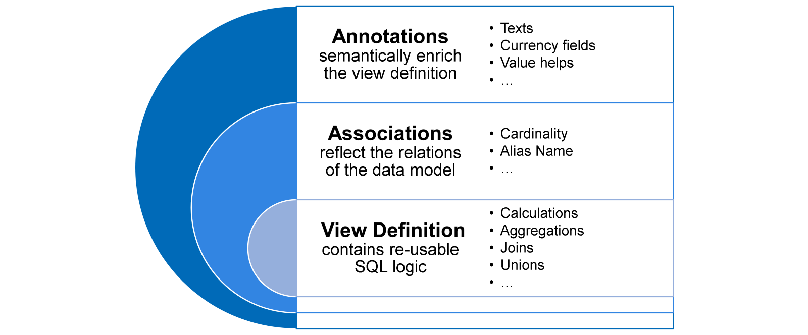
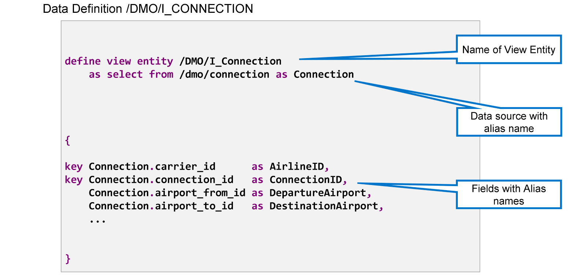
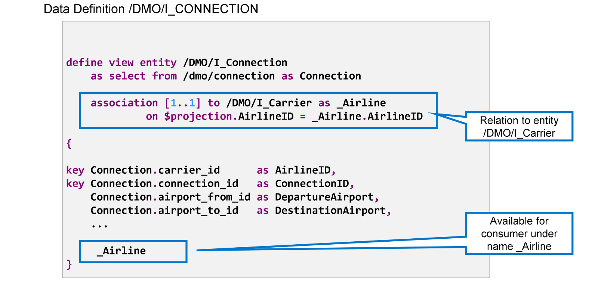
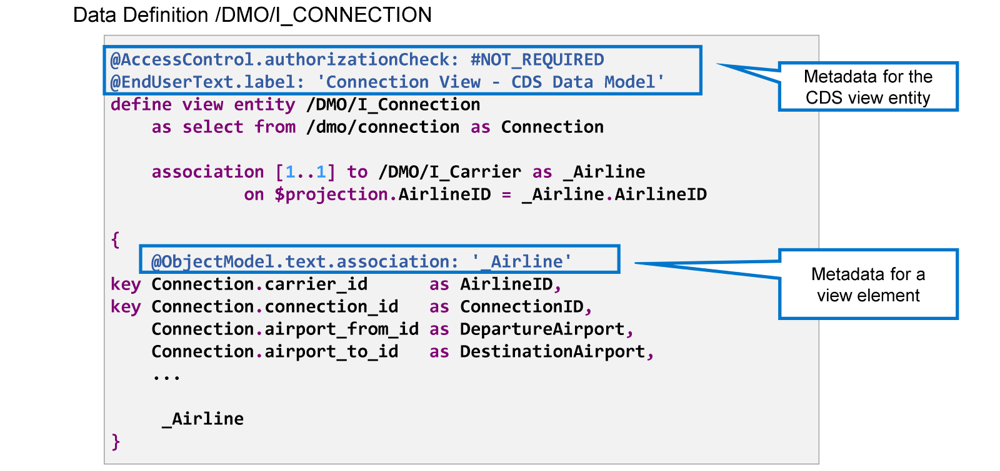
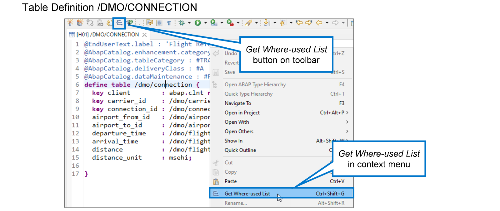
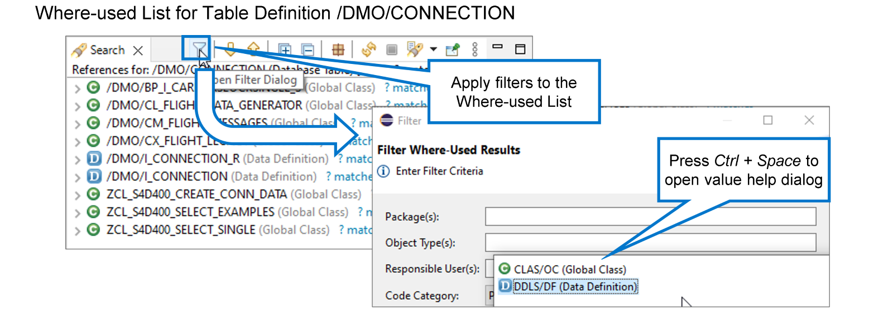
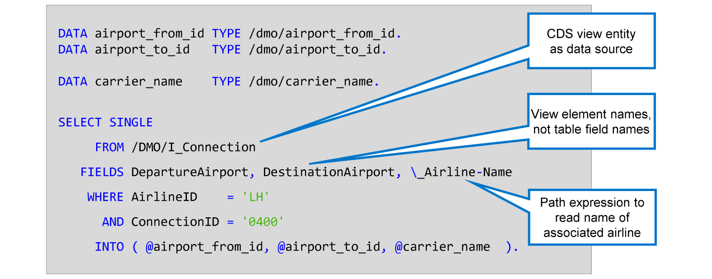

# 🌸 3 [WORKING WITH CDS VIEW](https://learning.sap.com/learning-journeys/acquire-core-abap-skills/working-with-cds-view_c289f74d-675e-4084-9d90-5635958ec604)

> 🌺 Objectifs
>
> - [ ] Analyser une définition de vue CDS
>
> - [ ] Lire des données à l'aide d'une vue CDS

## 🌸 CDS VIEWS

### VIEW DEFINITION IN ABAP CORE DATA SERVICES (ABAP CDS)

ABAP Core Data Services, ou ABAP CDS en abrégé, est une infrastructure permettant de définir et d'utiliser des modèles de données sémantiquement riches en ABAP. Ils utilisent un DDL CDS pour définir les entités CDS qui implémentent un modèle de données sémantique. Les entités de modélisation CDS les plus importantes sont les entités CDS View.

La définition de vue CDS contient une logique SQL réutilisable ; parfois aussi simple qu'une projection de champs de table, parfois plus sophistiquée avec des calculs, des agrégations, des jointures, des unions, etc.

Une définition de vue CDS peut contenir des **associations** reflétant les relations du modèle de données. Les utilisateurs de la vue peuvent utiliser ces **associations** pour récupérer des données associées.

Enfin, des **annotations** permettent d'enrichir sémantiquement la définition de vue. Ces **metadata** sont évaluées par des frameworks qui s'appuient sur les définitions de vue CDS. L'un de ces frameworks est le modèle de programmation d'applications ABAP RESTful, dont nous aborderons un exemple plus tard dans ce cours.

Examinons des exemples de définitions de vues CDS.

Les définitions de vues CDS sont contenues dans des **repository objects** de type **Data Definition**. Examinons maintenant le code source de la **Data Definition** `/DMO/I_CONNECTION`.

La partie principale est l'instruction `DEFINE VIEW ENTITY`. Elle contient le nom de l'entité Vue CDS et, après le mot-clé `FROM`, la source de données. Dans notre exemple, le nom de l'entité Vue est `/DMO/I_Connection` et la source de données est la table de base de données `/dmo/connection`. L'ajout facultatif `AS` définit un alias Connection pour adresser la source de données dans la définition de vue.

> #### 🍧 Note
>
> La source d'une entité Vue CDS peut également être une autre Vue CDS.

Une paire d'accolades contient la liste des éléments de la vue. Dans notre exemple, les éléments de la vue sont des champs de la table de base de données `/dmo/connection`. Le mot-clé `Key` placé devant les deux premiers éléments les définit comme champs clés de l'entité Vue CDS. L'ajout facultatif `AS` définit un alias pour chaque élément de la vue.

L'association d'ajout définit une relation avec une autre entité de vue CDS. Dans notre exemple, l'entité associée est l'entité de vue CDS `/DMO/I_Carrier` et le nom de l'association est `_Airline`.

Cette association devient accessible aux utilisateurs de la vue en l'ajoutant à la liste des éléments. On parle alors d'exposition de l'association.

Les **annotations** commencent par le signe `@` et servent à enrichir sémantiquement la définition de la vue pour les utilisateurs.

- Les **annotations** précédant la définition de la vue sont appelées **annotations d'entité**. Elles servent à définir les **metadata** de l'entité vue dans son ensemble.

- Les **annotations** entre accolades sont appelées **annotations d'élément**. Ces **annotations** servent à définir les **metadata** des différents éléments de la vue.

Vous avez déjà appris à utiliser l'outil **Data Preview** pour afficher et analyser le contenu d'une table de base de données. Cet outil est également disponible pour les entités de vue CDS.

Pour ouvrir le **Data Preview** d'une entité CDS donnée, faites un clic droit n'importe où dans la définition de données et choisissez [Open with] > [Data Preview]. Vous pouvez également placer le curseur n'importe où dans la définition de la table de base de données et appuyer sur [Ctrl] + [F8].

L'outil affiche les données renvoyées par l'entité CDS. Les mêmes fonctions sont disponibles pour trier ou filtrer les données et ajuster l'affichage.

Si la définition de vue contient une ou plusieurs **associations**, vous pouvez les utiliser pour afficher les données associées. Pour ce faire, procédez comme suit :

1. Cliquez avec le bouton droit sur une ligne de l'affichage.

2. Dans le menu contextuel, choisissez Suivre l'association.

3. Dans la liste des **associations** disponibles, choisissez celle qui vous intéresse.

Pour trouver toutes les vues CDS utilisant une table de base de données spécifique comme source, vous pouvez utiliser l'outil [Where-used List] d'ADT. Pour ce faire, procédez comme suit :

1. Ouvrez la définition de la table de base de données.

2. Faites un clic droit n'importe où dans le code source et choisissez **[Where-used List]** dans le menu contextuel. Vous pouvez également appuyer sur [Ctrl] + [Maj] + [G], ou choisir le bouton de la barre d'outils portant le même symbole.

3. La vue Search affiche la liste de tous les objets de développement utilisant directement la table de base de données.

Vous pouvez appliquer des filtres à la liste des cas d'emploi si, par exemple, vous ne souhaitez que les objets de certains packages ou d'un type d'objet spécifique. L'exemple illustre comment filtrer les vues CDS utilisant la table.

[Démo](https://learning.sap.com/learning-journeys/acquire-core-abap-skills/working-with-cds-view_c289f74d-675e-4084-9d90-5635958ec604)

## 🌸 CDS VIEWS IN ABAP SQL

Lorsque vous implémentez une instruction `SELECT` en ABAP, vous pouvez utiliser une entité de vue CDS comme source de données au lieu de lire directement la table de base de données. Cela présente plusieurs avantages.

- Réutilisation de la logique SQL contenue dans la vue CDS

- Lecture concise et lisible des données associées grâce aux associations

- Parfois, les noms des vues et des éléments de vue sont plus lisibles que les noms plus techniques des tables et des champs de table de base de données.

L'instruction `SELECT` de l'exemple utilise l'entité de vue CDS `/DMO/I_Connection` comme source de données.

> #### 🍧 Note
>
> Notez que les noms utilisés dans la clause FIELDS et les conditions WHERE sont les alias des éléments de vue.

Le troisième élément de la clause `FIELDS` utilise l'association exposée `_Airline`. Il lit le nom de l'élément à partir de l'entité de vue CDS associée `/DMO/I_Airline`. Ce type d'élément est appelé expression de chemin. La barre oblique inverse `\` est un préfixe obligatoire pour les noms d'association.
