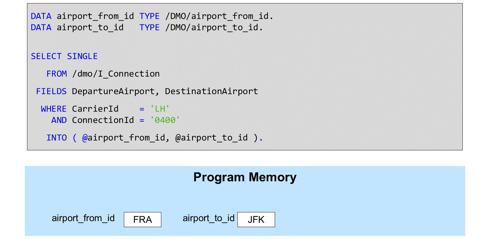
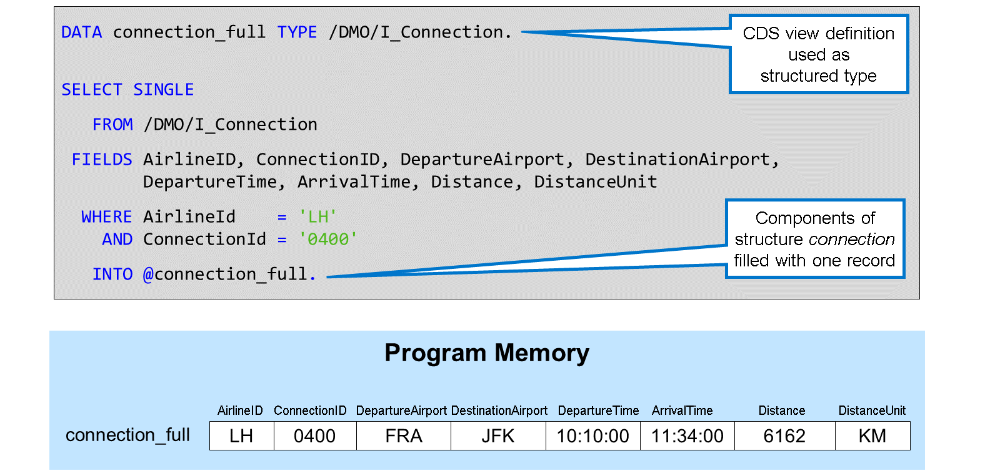
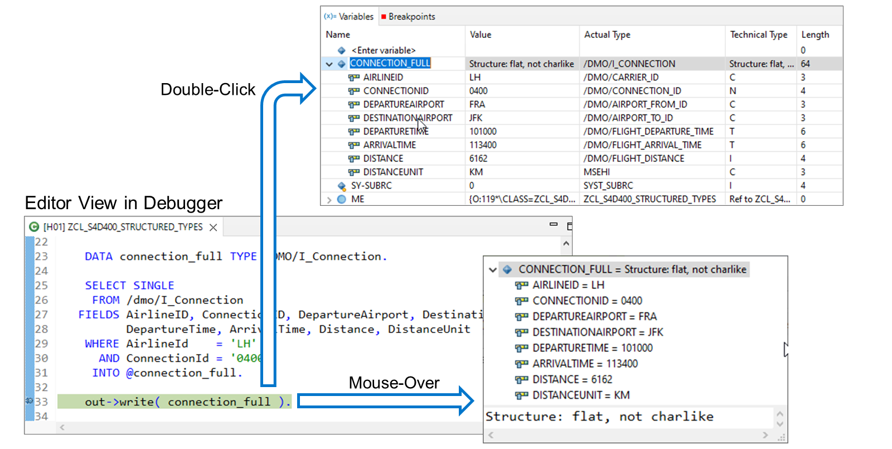
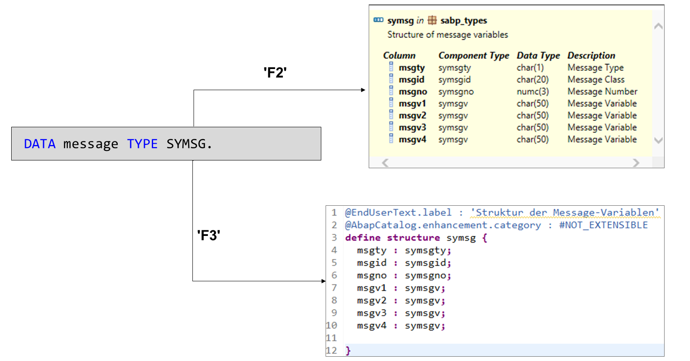
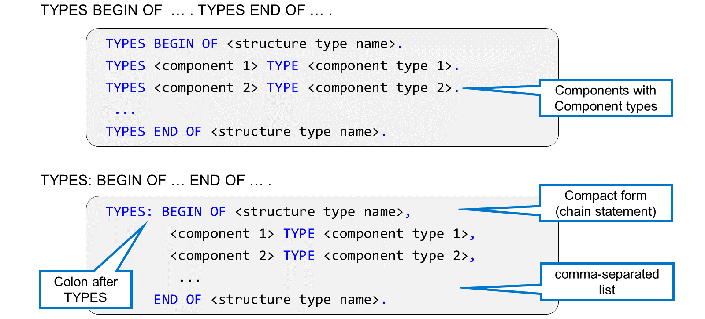
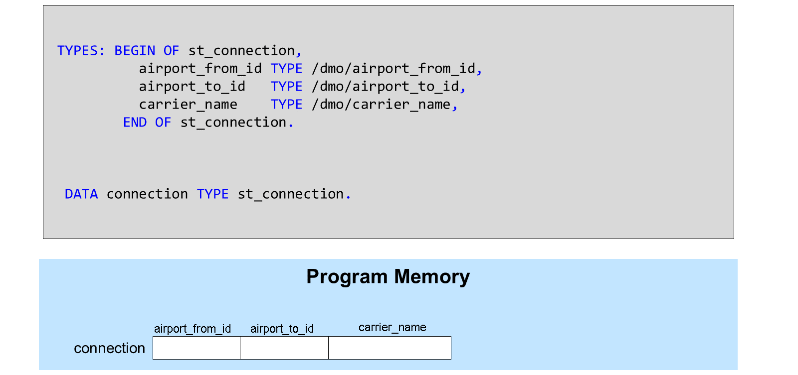
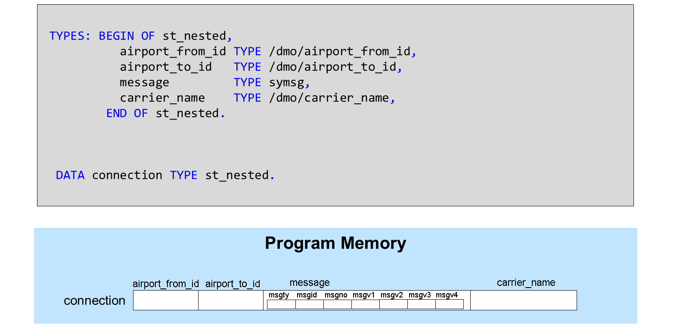
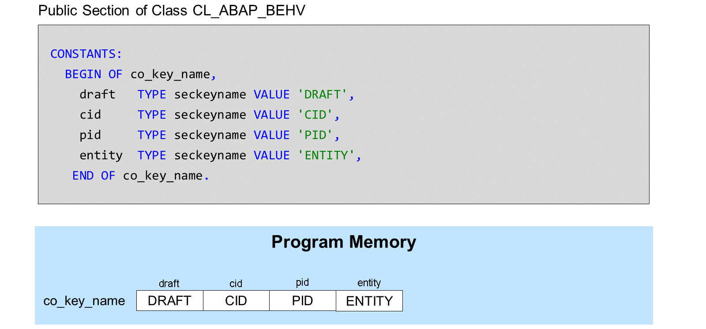

# 🌸 1 [DECLARING A STRUCTURED DATA OBJECT](https://learning.sap.com/learning-journeys/acquire-core-abap-skills/declaring-a-structured-data-object_cd245e79-eb25-4099-a5b4-9ad46b1659b6)

> 🌺 Objectifs
>
> - [ ] Vous pourrez déclarer un objet de données structurées

## 🌸 STRUCTURED DATA OBJECTS

Jusqu'à présent, vous avez utilisé des variables simples, chacune pouvant stocker une seule information. Ici, par exemple, il y a deux variables :

- l'une pour l'aéroport de départ

- l'autre pour l'aéroport d'arrivée.

Lorsque vous lisez un enregistrement de la base de données, vous devez conserver toutes ces informations ensemble. Les deux variables de l'exemple sont totalement indépendantes l'une de l'autre et ne conviennent donc pas au stockage d'informations différentes.

En ABAP, la solution consiste à utiliser une variable structurée, ou structure, en abrégé.

Une structure est un objet de données ABAP variable doté d'un nom et d'un type structuré.

Dans l'exemple, l'objet de données `connection_full` est une telle structure. Il est subdivisé en huit composants, chacun possédant un nom et un type. Vous pouvez gérer la structure dans son ensemble ou ses composants individuels. Il est important de noter que vous pouvez utiliser chaque composant exactement de la même manière qu'une variable simple autonome.

Il existe plusieurs façons de déclarer une structure. Vous pouvez définir des types structurés avec le mot-clé `TYPES` ou utiliser un objet référentiel de type Structure. Les **definition**s de vues et de tables de base de données peuvent également servir de types structurés. L'exemple utilise CDS View `/DMO/I_Connection` comme type structuré.

Dans la perspective du débogueur, il existe deux façons d'analyser la structure et le contenu d'une variable structurée :

#### 💮 **Variable Preview (Mouse Over)** :

Déplacez le curseur sur l'éditeur de code source et placez le pointeur sur le nom d'une variable. Après un instant, une boîte de dialogue s'ouvre avec des détails sur la structure et le contenu de l'objet de données.

#### 💮 **Display in the Variables View (Double-Click)** :

Pour afficher la variable dans la vue Variables, saisissez son nom sous `<saisir la variable>` ou double-cliquez dessus dans l'éditeur de code source. Développez le nœud portant le nom de la structure pour afficher la liste des composants.

## 🌸 HOW TO ANALYZE STRUCTURED DATA OBJECTS USING THE DEBUG PERSPECTIVE

[Démo](https://learning.sap.com/learning-journeys/acquire-core-abap-skills/declaring-a-structured-data-object_cd245e79-eb25-4099-a5b4-9ad46b1659b6)

## 🌸 STRUCTURED DATA TYPES

Un type de structure global est un objet de référentiel pouvant être utilisé comme type de données n'importe où dans le système. Dans l'exemple, le type structuré `SYMSG` est utilisé pour déclarer une variable message.

Lorsque vous appuyez sur la touche [F2] pour afficher les détails de ce type de données, vous constatez qu'il s'agit d'un type de structure composé de sept composants. Vous pouvez également consulter les noms, les types techniques et les descriptions des composants.

Lorsque vous appuyez sur la touche [F3] pour accéder à la **definition** du type, une nouvelle vue s'ouvre avec l'éditeur ADT pour les types structurés globaux.

La **definition** d'un type de structure global est très similaire à celle d'une table de base de données. La partie principale de la **definition** consiste en une instruction `DEFINE STRUCTURE` contenant le nom du type de structure. Elle est suivie de la liste des composants de la structure entre accolades `{,}`, chaque composant étant associé à un type de composant. Les types de composants sont souvent décrits par des éléments de données, mais il est également possible d'utiliser des types de structure comme types de composants. Les structures avec des composants structurés sont appelées structures imbriquées.

Des lignes de code supplémentaires avant l'instruction `DEFINE STRUCTURE` spécifient des propriétés supplémentaires du type de structure, parmi lesquelles une étiquette.

Vous pouvez également définir des types structurés dans un programme ABAP à l'aide de l'instruction `TYPES`. La définition de la structure commence par l'instruction `TYPES BEGIN OF <nom du type de structure>` et se termine par `TYPES END OF <nom du type de structure>`. Entre-temps, vous nommez chaque composant et spécifiez son type dans une instruction `TYPES` supplémentaire.

Une forme compacte utilise le mot-clé `TYPES` une seule fois, suivi de deux points `:`. L'ajout `BEGIN OF`, l'ajout `END OF` et les définitions des composants intermédiaires sont ensuite séparés par des virgules.

C'est ce qu'on appelle une instruction en chaîne.

> #### 🍧 Note
>
> Auparavant, les instructions en chaîne étaient très utilisées en ABAP. Aujourd'hui, elles ne sont recommandées que pour combiner des instructions étroitement liées.

Dans cet exemple, une instruction de chaîne `TYPES:` est utilisée pour définir le type structuré local `st_connection`, composé des trois composants `airport_from_id`, `airport_to_id` et `carrier_name`. Chaque composant est typé avec un élément de données commençant par `/dmo/`.

Le type structuré local `st_connection` est ensuite utilisé dans une instruction `DATA` pour typer la connexion de variable structurée.

Dans cet exemple, la connexion de variable possède un type structuré imbriqué. Le type `st_nested` définit quatre composants. Les trois premiers sont typés avec des éléments de données ; ce sont donc des composants simples. Le quatrième composant, message, possède un type structuré. Il s'agit donc d'un composant structuré. La connexion de variable possède donc une structure imbriquée.

ABAP prend en charge non seulement les variables structurées, mais aussi les constantes structurées. Pour définir une constante structurée, utilisez `BEGIN OF` et `END OF` dans une instruction `CONSTANTS`. L'exemple montre une constante structurée définie dans la section publique de la classe globale `CL_ABAP_BEHV`. Les quatre composants sont typés avec l'élément de données `SECKEYNAME`. N'oubliez pas que l'ajout de `VALUE` est obligatoire lors de la définition des constantes.
