# 🌸 2 [WORKING WITH STRUCTURED DATA OBJECTS](https://learning.sap.com/learning-journeys/acquire-core-abap-skills/working-with-structured-data-objects_ca4e0b14-57ad-4993-a83b-cca17980399c)

> 🌺 Objectifs
>
> - [ ] Utiliser des objets de données structurés
>
> - [ ] Utiliser des objets de données structurés dans ABAP SQL

## 🌸 STRUCTURED DATA OBJECTS

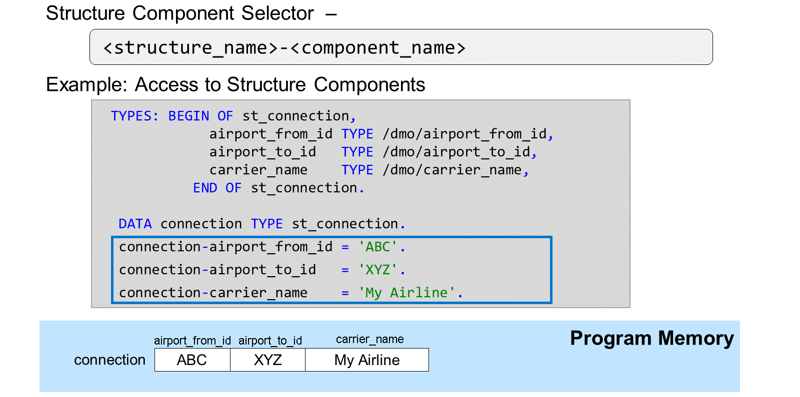

Pour accéder à un composant d'une structure, vous devez placer un signe moins `-` entre le nom de la structure et celui du composant.

> #### 🍧 Note
>
> Aucun espace n'est autorisé avant ou après le sélecteur de composant.

En accédant à un composant de structure de cette manière, vous pouvez l'utiliser à n'importe quelle position d'opérande où vous pouvez utiliser une variable du même type. Le composant `airport_from_id` de la connexion de structure dans l'exemple ci-dessus est de type ` /DMO/AIRPORT``_FROM_ID``. Par conséquent, vous pouvez utiliser ce composant à n'importe quelle position d'opérande où vous pourriez utiliser une variable simple de type  `/DMO/AIRPORT`_FROM_ID` ; non seulement à gauche d'une affectation de valeur comme dans l'exemple, mais aussi à droite, dans le passage de paramètres d'un appel de méthode, dans la clause `INTO` ou `WHERE` d'une instruction `SELECT`, etc.

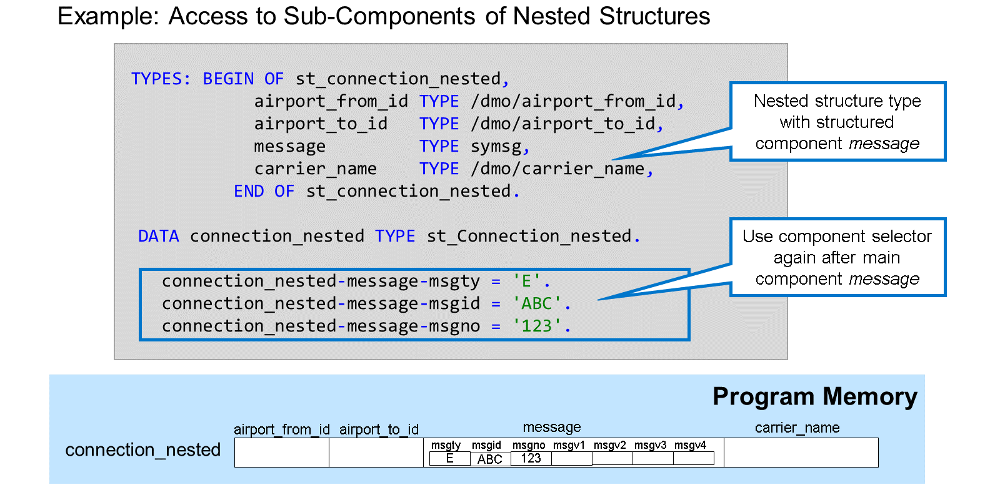

Si le composant d'une structure est lui-même une structure, accédez aux sous-composants en utilisant à nouveau le sélecteur de composants après le nom du composant principal. La première affectation de valeur dans l'exemple accède au composant `MSGTY` de `MESSAGE`, lui-même un composant de la structure imbriquée `CONNECTION_NESTED`.

> #### 🍧 Hint
>
> Vous pouvez utiliser la saisie semi-automatique du code pour implémenter l'accès aux composants de structure. Placez le curseur immédiatement après le sélecteur de composants de structure et appuyez sur [Ctrl] + [Espace] pour afficher la liste de tous les composants de structure disponibles.

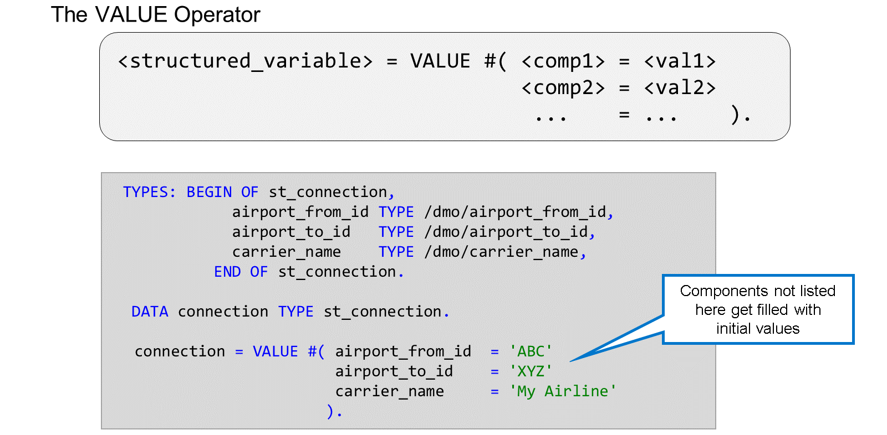

L'expression `VALUE #( )` est une manière élégante d'attribuer des valeurs à un objet de données structuré.

Si vous souhaitez remplir une structure entière, vous pouvez adresser chaque composant individuellement, comme indiqué dans l'exemple précédent.

Cependant, vous pouvez également utiliser une expression `VALUE #( )` pour remplir la structure. L'expression construit une structure, la remplit avec une valeur et l'affecte à une variable, dans ce cas, connection. Le signe dièse `#` indique à l'environnement d'exécution ABAP de construire une structure du même type que la variable cible connection. Entre parenthèses, vous listez les composants de la structure à remplir (il n'est pas nécessaire qu'ils soient tous) et leur attribuez une valeur. Cette valeur peut être un littéral ou le contenu d'une variable.

Lorsque vous remplissez une structure de cette manière, le système d'exécution supprime toutes les valeurs existantes de la structure avant de la remplir avec les valeurs de votre expression.

> #### 🍧 Note
>
> Une affectation de la forme connection = VALUE #( ). Avec un espace entre les crochets, remplit tous les composants de la structure avec la valeur initiale spécifique au type. Cela a le même effet que l'instruction CLEAR connection.

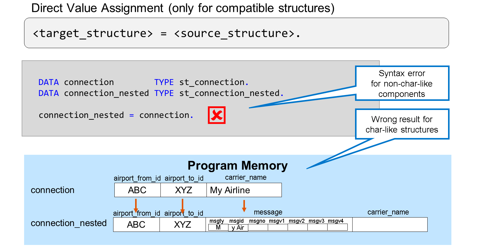

En ABAP, vous ne pouvez copier le contenu d'une structure directement dans une autre structure en utilisant la notation `<structure cible> = <structure source>` que si les deux types de structure sont compatibles. Ceci n'est généralement le cas que si les deux structures sont de même type. Si les structures sont de types différents, deux situations peuvent se produire :

- Si l'une des structures possède un composant non char à un emplacement où l'autre structure possède un composant char, l'affectation directe entraîne une erreur de syntaxe.

- Si les deux structures sont de type char, ou, en d'autres termes, si elles ne contiennent que des composants char, l'affectation directe est techniquement possible. Cependant, le résultat sera généralement erroné.

Dans l'exemple, les structures source et cible sont de type char. Par conséquent, l'affectation directe est techniquement possible. Cependant, leur incompatibilité entraîne un résultat erroné : le contenu du composant carrier_name est copié vers le composant message de la structure cible.

En l'absence d'erreur de syntaxe, il est nécessaire d'être particulièrement prudent lorsque l'on travaille avec des structures de type char non compatibles.

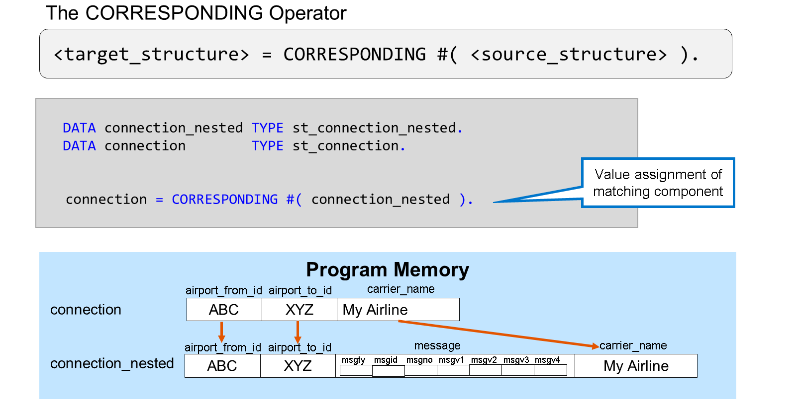

Lorsque vous copiez des données entre des structures, vous souhaitez généralement copier les informations d'un champ vers le champ correspondant de la structure cible : `airport_from_id` vers `airport_from_id`, `airport_to_id` vers `airport_to_id`, etc.

Pour ce faire en ABAP, utilisez l'expression `CORRESPONDING`. Celle-ci attribue les valeurs de `<source_structure>` aux composants correspondants, c'est-à-dire aux composants portant le même nom, de `<target_structure>`. Il est important de garder à l'esprit les points suivants :

- Les champs doivent avoir des noms identiques.

- Les composants ne doivent pas nécessairement être à la même position ou dans le même ordre dans les deux structures.

Si les champs sont de types différents, ABAP tente une conversion de type selon les règles prédéfinies.

> #### 🍧 Note
>
> La structure cible est initialisée avant d'être remplie à nouveau avec le résultat de l'expression.

## 🌸 STRUCTURED DATA OBJECTS IN ABAP SQL

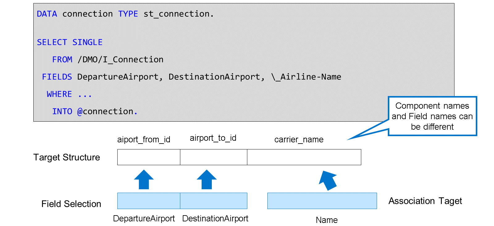

La clause `INTO` de l'instruction `SELECT` ne fonctionne correctement que si le nombre et les types des composants de la structure correspondent au nombre et aux types des colonnes spécifiées dans la clause `FIELDS`.

Dans l'exemple ci-dessus, l'instruction ne fonctionne que si la connexion à la structure cible comporte trois composants de même type et de même longueur que les colonnes `DepartureAirport`, `DestinationAirport` et `\_Airline-Name` répertoriées dans la clause `FIELDS`. Notez que, dans ce cas, les noms ne doivent pas nécessairement être identiques : le système remplit la structure cible de gauche à droite.

Si la liste de champs de la clause `FIELDS` ne correspond pas au type de structure ou de ligne de table de la clause `INTO`, une erreur d'exécution se produit.

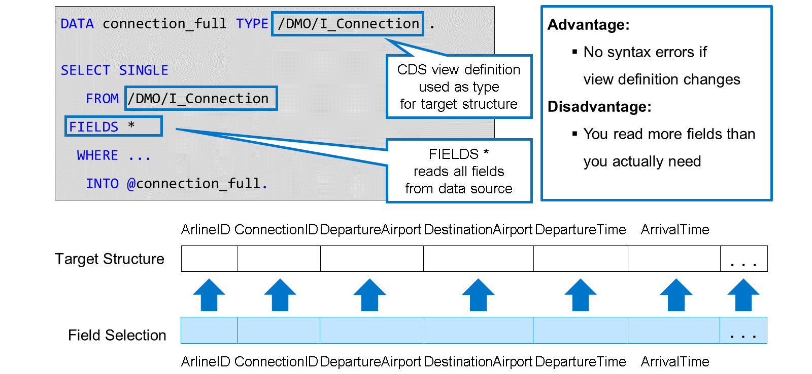

L'exemple illustre une technique simple permettant de garantir que la structure cible correspond à la sélection de champs :

- La structure cible est typée avec la vue CDS `/DMO/I_Connection`, qui est la source de données dans la clause `FROM`.

- L'astérisque `*` après le mot-clé `FIELDS` est une notation courte permettant de garantir que tous les champs de la vue font partie de la sélection de champs. Les **associations** exposées sont ignorées.

> #### 🍧 Note
>
> Cette technique est également disponible pour la lecture directe depuis une table de base de données. Tout comme les définitions de vue CDS, les définitions de table de base de données peuvent également servir de types de structure globale dans ABAP.

Le principal avantage de cette technique est que l'instruction `SELECT` conserve sa syntaxe intacte, même si vous ou quelqu'un d'autre apportez des modifications à la vue CDS ou à la table de base de données. L'inconvénient principal est que vous lisez systématiquement tous les champs de la base de données, qu'ils soient réellement nécessaires ou non.

> #### 🍧 Note
>
> N'utilisez cette technique que pour les vues et les tables comportant un petit nombre de champs et si vous en avez réellement besoin. La lecture inutile de données de la base de données est une cause majeure de problèmes de performances.

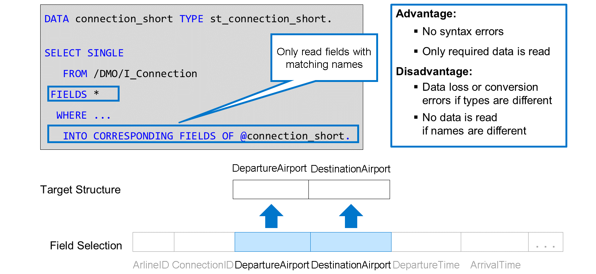

Une autre façon d'éviter les erreurs de syntaxe est d'utiliser la variante `INTO CORRESPONDING FIELDS`. Cette variante a le même effet que l'opérateur `CORRESPONDING #( )` que vous avez découvert précédemment. Elle garantit la copie des données entre composants portant le même nom. En définissant le type de structure selon vos besoins, vous garantissez que seules les données nécessaires sont lues.

Là encore, seuls les noms doivent être identiques. Pour éviter tout problème, assurez-vous que les composants portant le même nom ont des types compatibles. Sinon, le système tente de convertir le contenu du champ source dans le type du champ cible, ce qui peut entraîner une perte de données ou des erreurs d'exécution (capturables).

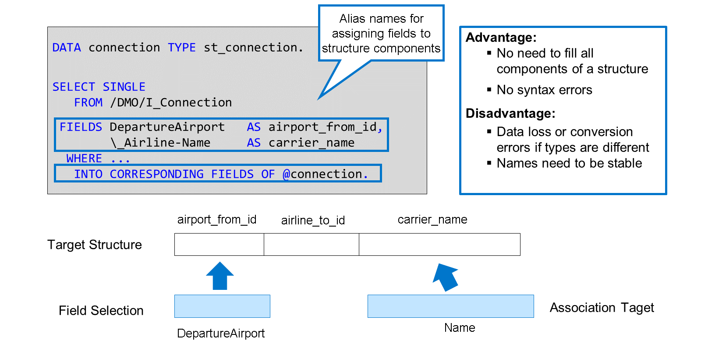

Si les noms de champ de la source de données et les noms de composant de la structure cible ne correspondent pas, la combinaison de `FIELDS *` et `INTO CORRESPONDING FIELDS OF` ne fonctionne pas.

Si vous souhaitez conserver la variante `INTO CORRESPONDING FIELDS OF`, vous pouvez définir des `alias` pour les champs sélectionnés dans la liste. Pour cela, ajoutez `AS` après le nom du champ, suivi de l'alias. Dans l'exemple, l'alias du champ de vue `DepartureAirport` est `airport_from_id` et celui de l'expression de chemin `\_Airline-Name` est `carrier_name`. En fonction de ces alias, `INTO CORRESPONDING FIELDS OF` identifie correctement le composant de structure dans lequel stocker les données récupérées.

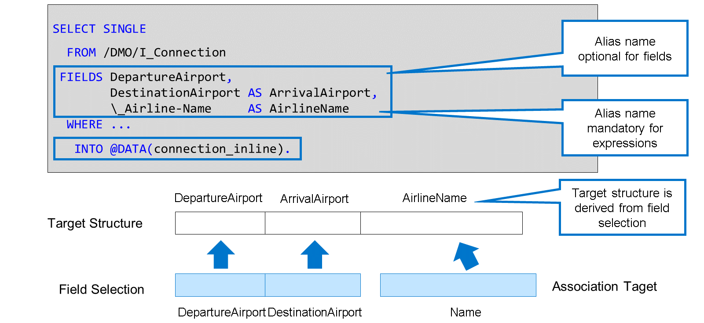

La technique la plus simple pour éviter les conflits entre la sélection de champ et la structure cible consiste à utiliser une déclaration en ligne dans la clause `INTO`. La séquence, le type et le nom de la structure déclarée en ligne sont dérivés de la clause `FIELD`. Par conséquent, la structure cible correspond toujours à la sélection de champ.

> #### 🍧 Note
>
> Les déclarations en ligne ne sont prises en charge qu'après INTO. Elles ne peuvent pas être utilisées après INTO CORRESPONDING FIELDS OF.

Si vous utilisez une déclaration en ligne dans la clause `INTO`, vous devez fournir un nom pour chaque élément de la clause `FIELDS`. Pour les champs de la source de données, il peut s'agir du nom du champ lui-même ou, éventuellement, d'un alias. Pour les expressions, l'alias est obligatoire.

Dans l'exemple, il n'existe pas d'alias pour le champ `DepartureAirport`. Le nom du champ est utilisé comme nom de composant dans la structure `connection_inline`. Le champ `DestinationAirport` possède un alias facultatif `ArrivalAirport`. Dans ce cas, l'alias est utilisé comme nom de composant. L'alias pour l'expression de chemin `\_Airline-Name` est obligatoire.

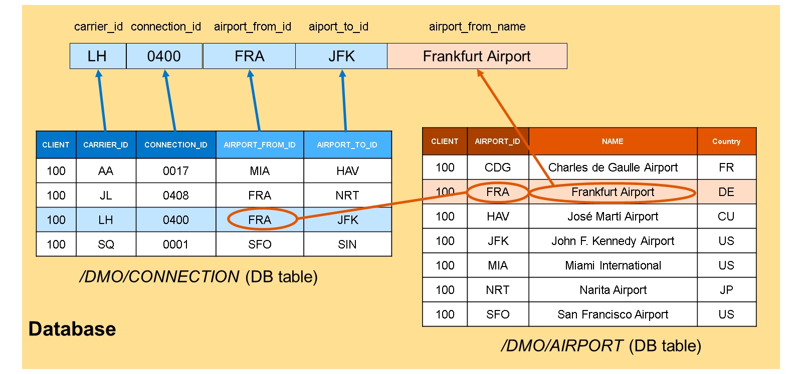

Lorsque vous travaillez avec une base de données relationnelle, vous êtes souvent confronté au problème de la lecture de données connexes provenant de différentes tables. Nous avons déjà vu que les **associations** dans les vues CDS constituent une solution élégante pour réaliser cette tâche.

Si aucune vue CDS avec des **associations** appropriées n'existe, vous pouvez implémenter des jointures SQL. L'exemple ci-dessus illustre le principe des jointures :

Nous nous intéressons aux correspondances aériennes et aux aéroports qui les relient. Nous trouvons les identifiants à trois lettres des aéroports dans la table de base de données `/DMO/CONNECTION`. Les noms complets des aéroports sont stockés dans la table de base de données `/DMO/AIRPORT`.

Pour récupérer une connexion avec le nom de l'aéroport de départ, une instruction `SELECT` permet de lire les données de connexion de la table de base de données `/DMO/CONNECTION` et de les joindre à la table de base de données `/DMO/AIRPORT`.

Une jointure se compose des éléments suivants :

#### 💮 **Data Sources** :

Tables et vues de la base de données à joindre. Une jointure unique combine toujours une source de données de gauche et une source de données de droite. Dans l'exemple ci-dessus, la table `/DMO/CONNECTION` est la source de données de gauche et la table `/DMO/AIRPORT` celle de droite. ABAP SQL prend également en charge les jointures de jointures (jointures imbriquées).

#### 💮 **Join Condition** :

La condition de jointure spécifie quels enregistrements de la source de données de droite appartiennent à un enregistrement de la source de données de gauche. Dans l'exemple ci-dessus, l'aéroport de départ associé est identifié par la valeur des colonnes `CLIENT` et `AIRPORT_ID`. La condition de jointure est la suivante :
`/DMO/CONNECTION~CLIENT = /DMO/AIRPORT~CLIENT`
`AND`
`/DMO/CONNECTION~AIRPORT_FROM_ID = /DMO/AIRPORT~AIRPORT_ID`

#### 💮 **Join Type** :

Le type de jointure influence le résultat si l'une des sources de données ne contient pas d'enregistrement correspondant. ABAP SQL prend actuellement en charge les jointures internes (`INNER JOIN`), externes gauche (`LEFT OUTER JOIN`) et droite (`RIGHT OUTER JOIN`). Le type de jointure le plus courant est la jointure externe gauche (`LEFT OUTER JOIN`).

La figure illustre la syntaxe ABAP SQL pour une jointure. Dans la clause `FROM`, le type de jointure est spécifié par le mot-clé `LEFT OUTER JOIN` entre la source de données de gauche `/dmo/connection` et la source de données de droite `/dmo/airport`. La syntaxe introduit les alias `c` et `f` pour les sources de données. Les alias des sources de données sont facultatifs, sauf si une source de données apparaît plusieurs fois dans la jointure.

La condition de jointure suit le mot-clé `ON`. Le séparateur entre la source de données ou son alias et le champ est le tilde `~`.

> #### 🍧 Note
>
> En ABAP SQL, il n'est pas nécessaire de mentionner les champs clients. Ils sont ajoutés à la condition de jointure par l'interface de base de données avant l'envoi de l'instruction à la base de données. Si la clause FROM définit une jointure, vous pouvez utiliser les champs des deux sources de données dans les clauses FIELDS et WHERE.

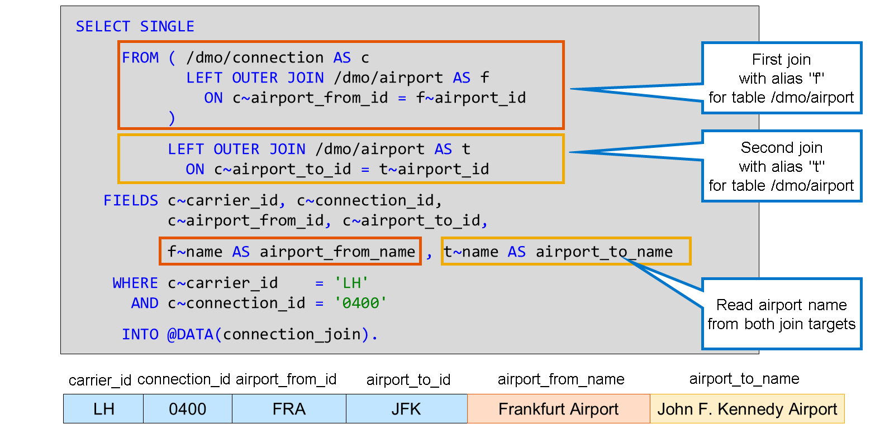

Dans cet exemple, l'instruction `SELECT` lit non seulement le nom de l'aéroport de départ, mais aussi celui de l'aéroport de destination. Pour ce faire, la clause `FROM` définit une jointure imbriquée :

La première jointure est une jointure externe gauche des tables `/dmo/connection` et `/dmo/airport`, introduisant l'alias `f` (comme « from ») pour la source de données de droite. Cette première jointure est ensuite utilisée comme source de données de gauche pour une seconde jointure externe gauche ayant la table `/dmo/airport` comme source de données de droite. Notez que, dans ce cas, l'alias `t` (pour « to ») est essentiel pour distinguer l'apparence de la table `/dmo/airport` de la précédente.

La clause `FIELDS` répertorie les noms des aéroports des deux sources de données, en introduisant les alias `airport_from_name` et `airport_to_name` pour les distinguer.

> #### 🍧 Hint
>
> Les crochets autour de la première jointure sont facultatifs. S'ils sont omis, les jointures de la clause from sont évaluées de gauche à droite.
