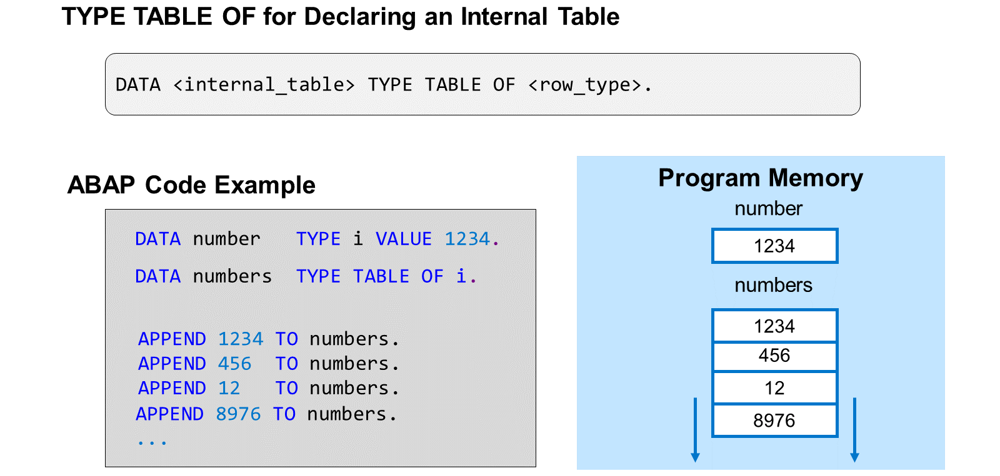
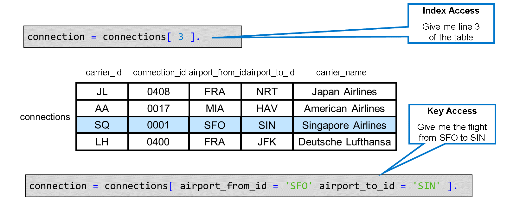
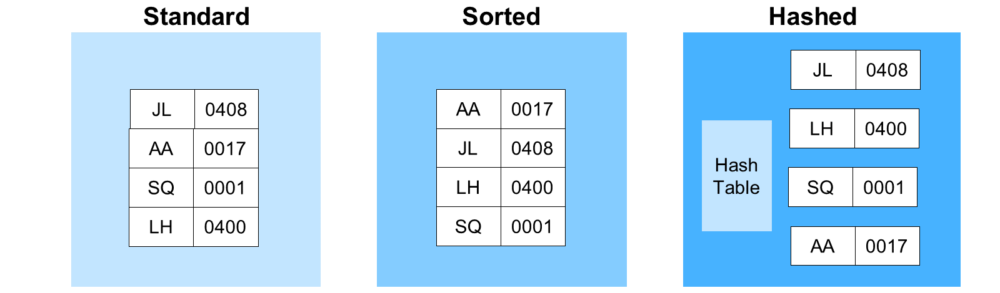
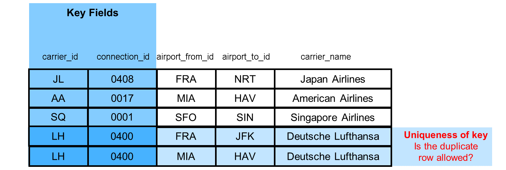
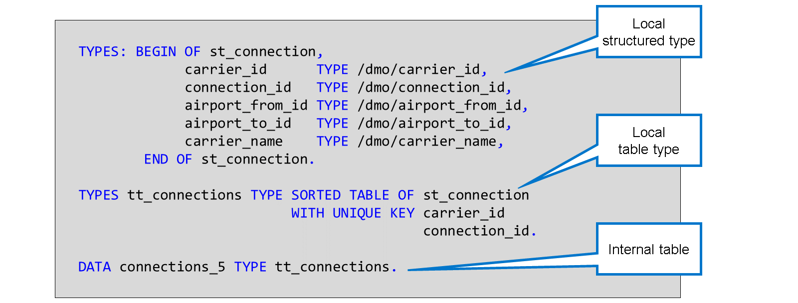

# 🌸 1 [DELCARING A COMPLEX INTERNAL TABLE](https://learning.sap.com/learning-journeys/acquire-core-abap-skills/declaring-a-complex-internal-table_e2463cb1-7806-46c5-8367-cff38681721f)

> 🌺 Objectifs
>
> - [ ] Vous pourrez déclarer une table interne complexe

## 🌸 PROPERTIES OF COMPLEX INTERNAL TABLES

Les tables internes que nous avons utilisées jusqu'à présent avaient un type de données scalaire comme type de ligne. Dans l'exemple illustré ici, le type de ligne des numéros de table interne est le type I intégré d'ABAP.

Nous appelons ces types de tables internes « tables internes simples ».

On parle de **table interne complexe** si le type de ligne est un type de données structuré.

Alors qu'une table interne simple ne comporte qu'une seule colonne sans nom, une **table interne complexe** est composée de plusieurs colonnes, chacune portant le nom et le type du composant correspondant du type de ligne structuré.

Dans l'exemple, le type de ligne de la connexion à la table interne est un type structuré à cinq composants : `carrier_id`, `connection_id`, `airport_from_id`, `airport_to_id` et `carrier_name`. Par conséquent, les connexions à la table interne comportent cinq colonnes portant ces noms.

> #### 🍧 Note
>
> Les colonnes des exemples des figures « Rappel : Tables internes simples » et « Tables internes avec type de ligne structuré » sont toutes de type scalaire. Plus généralement, une colonne d'une table interne peut également être de type structuré, voire de type table. Dans ce dernier cas, on parle de table interne imbriquée.

Jusqu'à présent, nous avons traité les lignes d'une table interne par leur position. C'est ce qu'on appelle un accès par index.

Avec les colonnes nommées d'une table interne complexe, l'accès par clé devient plus important. L'accès par clé consiste à adresser une ligne de la table interne en recherchant des valeurs particulières dans des colonnes spécifiques. Les colonnes recherchées peuvent être n'importe quelle colonne de la table interne.

L'accès par index à une table interne est toujours très rapide, même si celle-ci contient de nombreuses lignes. En revanche, l'accès par clé peut devenir très lent si la table contient beaucoup de lignes. Choisir le bon type d'accès pour la table interne peut améliorer les performances d'un accès par clé.

Chaque table interne possède trois types d'accès. Le type d'accès détermine le mode de stockage des données et, en conséquence, la manière dont le système les lit pour les récupérer.

Les différents types de tables sont les suivants :

#### 💮 **Standard Table** :

Dans une table standard, le contenu n'est pas stocké selon un ordre de tri particulier. Par défaut, les nouveaux enregistrements sont ajoutés à la fin de la table. Pour récupérer les données par clé, le système doit les lire séquentiellement, ce qui peut entraîner des temps de récupération longs si la table est très volumineuse. Les tables internes simples que nous avons utilisées jusqu'à présent étaient des tables standard.

#### 💮 **Sorted Table** :

Dans une table triée, le contenu est toujours trié selon les champs clés, par ordre croissant. Lorsqu'un nouvel enregistrement est inséré, le système s'assure qu'il est placé au bon endroit. Comme les données sont toujours triées, le système peut récupérer les enregistrements plus efficacement qu'avec une table standard (à condition de respecter certaines règles).

#### 💮 **Hashed Table** :

Les tables hachées sont gérées à l'aide d'un algorithme de hachage spécifique. Cela permet au système de récupérer très rapidement les enregistrements, même si la table est extrêmement volumineuse. Cependant, ce gain de performance n'est valable que dans des cas très particuliers.

Chaque table interne possède une clé. Dans les tables standard, la clé ne joue pas un rôle particulièrement important. Pour les tables triées et hachées, la clé est essentielle car elle détermine la gestion des données. Il est crucial de noter que les tables triées et hachées ne sont plus rapides que pour les accès aux clés qui traitent l'ensemble ou au moins un sous-ensemble des champs clés.

Un autre attribut de la clé de table est son unicité. Il est parfois souhaitable d'autoriser les doublons dans une table interne, et parfois de garantir l'unicité de la clé. Dans ce cas, les règles suivantes s'appliquent :

- Les doublons sont toujours autorisés dans les tables standard

- Les doublons ne sont jamais autorisés dans les tables hachées

- Pour une table triée, vous choisissez dans la définition si la clé doit être unique ou non.

> #### 🍧 Note
>
> Les tables internes peuvent également avoir des clés secondaires. Les clés secondaires permettent d'améliorer les performances des accès aux clés des tables internes utilisant différentes combinaisons de champs. Vous trouverez plus d'informations sur les clés secondaires dans la documentation sur la syntaxe ABAP.

## 🌸 COMPLEX TABLE TYPES

[Référence - Link Vidéo](https://learning.sap.com/learning-journeys/acquire-core-abap-skills/declaring-a-complex-internal-table_e2463cb1-7806-46c5-8367-cff38681721f)

De plus, il est judicieux de définir d'abord le type de données, puis de créer une variable qui y fait référence.

Au lieu de spécifier le type d'accès et la clé d'une table interne dans l'instruction `DATA`, utilisez un type de table nommé. Si vous avez besoin du type de table uniquement localement, dans une méthode ou en lien avec une classe donnée, vous pouvez le définir à l'aide de l'instruction TYPES.

L'exemple définit d'abord un type structuré st_connection. Ce type structuré étant utilisé comme type de ligne, il définit ensuite le type de table `tt_connections`. Enfin, la déclaration de la table interne `connections_5` fait référence au type de table.

Si vous avez besoin du type de table globalement, vous pouvez utiliser un type de table global.

Un type de table global est un objet de référentiel pouvant être utilisé comme type de données n'importe où dans le système. ADT fournit un éditeur dédié à ce type d'objet de référentiel. Cet outil se compose des cadres suivants :

La vidéo suivante montre comment définir des types de table localement.

[Référence - Link Vidéo](https://learning.sap.com/learning-journeys/acquire-core-abap-skills/declaring-a-complex-internal-table_e2463cb1-7806-46c5-8367-cff38681721f)
