# 🌸 2 [WORKING WITH COMPLEX INTERNAL TABLES](https://learning.sap.com/learning-journeys/acquire-core-abap-skills/working-with-complex-internal-tables_f8c923f3-6f95-4b47-960f-557001f13977)

> 🌺 Objectifs
>
> - [ ] Remplir des tables internes complexes avec des données
>
> - [ ] Accéder au contenu des tables internes complexes
>
> - [ ] Utiliser des tables internes complexes en ABAP SQL

## 🌸 COMPLEX INTERNAL TABLE FILLING

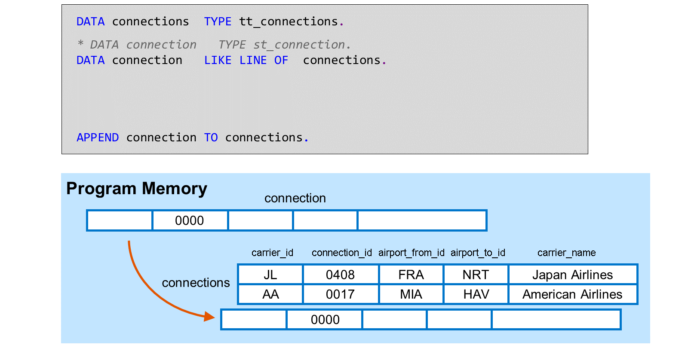

Comme vous l'avez déjà appris, la méthode la plus simple pour ajouter une ligne à une table interne est l'instruction `APPEND` avec un objet de données dont le type correspond au type de ligne de la table interne. Cet objet de données est parfois appelé **work area**.

Pour les tables internes simples, la **work area** utilisée dans `APPEND` peut être une variable scalaire, une constante ou un littéral. Pour les tables internes complexes, la **work area** doit être structurée.

Dans l'exemple, la variable structurée connection est utilisée pour remplir les connexions de table interne.

En principe, il existe deux façons de déclarer une connexion de **work area** :

- Référencer directement le type de ligne `st_connection`

- Référencer indirectement le type de ligne avec `LIKE LINE OF <internal_table>`.

Définir des **work areas** avec `LIKE LINE OF` présente deux avantages :

- Cela révèle la fonction de la variable structurée comme **work area** pour la table interne

- Cela garantit que la **work area** s'adapte à la table interne, même si sa définition change.

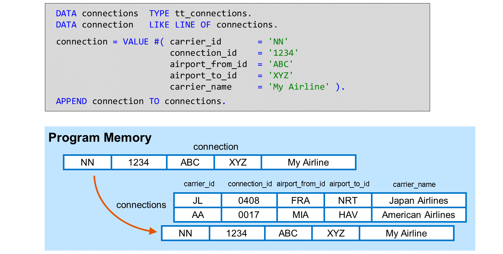

Si vous ne remplissez pas la **work area** avant l'instruction `APPEND`, la nouvelle ligne de la table interne sera remplie avec les valeurs initiales spécifiques au type.

> #### 🍧 Hint
>
> Vous obtenez le même résultat avec la variante spéciale APPEND INITIAL LINE TO <internal_table>. Cette variante ne nécessite même pas de work area.

Pour remplir la **work area** structurée, vous pouvez remplir les composants individuellement ou, comme illustré dans l'exemple, utiliser une expression `VALUE #( )`.

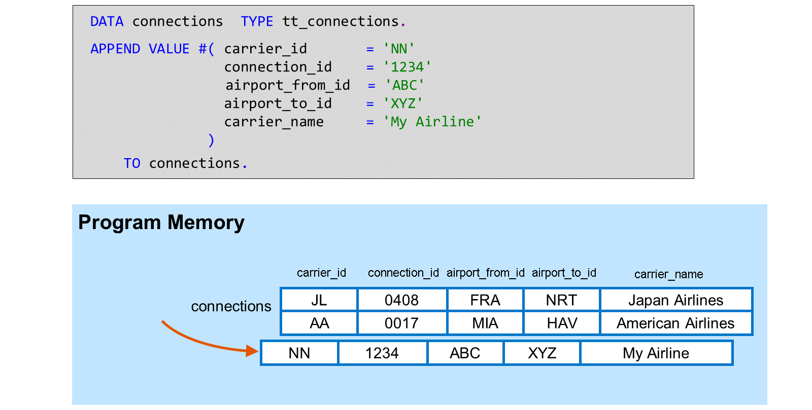

Comme le montre l'exemple, vous pouvez également utiliser une expression `VALUE #( )` directement dans l'instruction `APPEND`. Dans ce cas, vous n'avez pas besoin de **work area**.

> #### 🍧 Note
>
> Cela peut avoir un effet positif sur la consommation mémoire globale de votre programme.

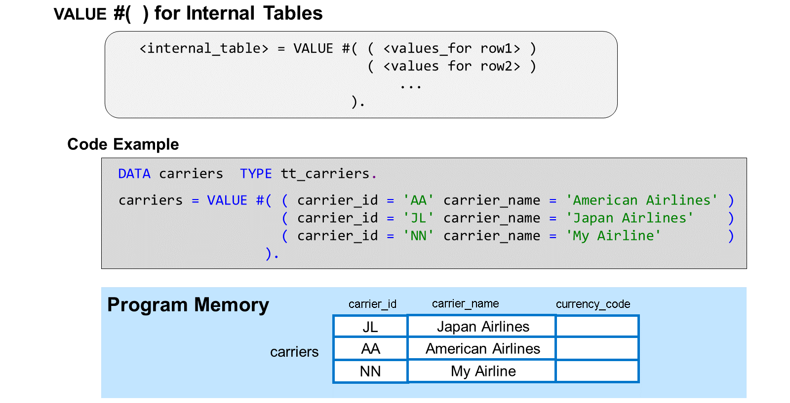

Il existe une variante de l'expression `VALUE #( )` que vous pouvez affecter directement à une table interne. Dans cette variante, des parenthèses supplémentaires sont utilisées pour séparer les lignes de la table.

L'exemple de code remplit la table interne `carriers` avec trois lignes, chacune avec une valeur différente pour `carrier_id` et `carrier_name`. Par conséquent, la colonne `currency_code` n'est pas mentionnée, mais renseignée avec la valeur initiale spécifique au type.

> #### 🍧 Note
>
> Avec l'affectation ci-dessus, toutes les lignes existantes de la table sont supprimées avant que la table ne soit remplie avec les nouvelles lignes.

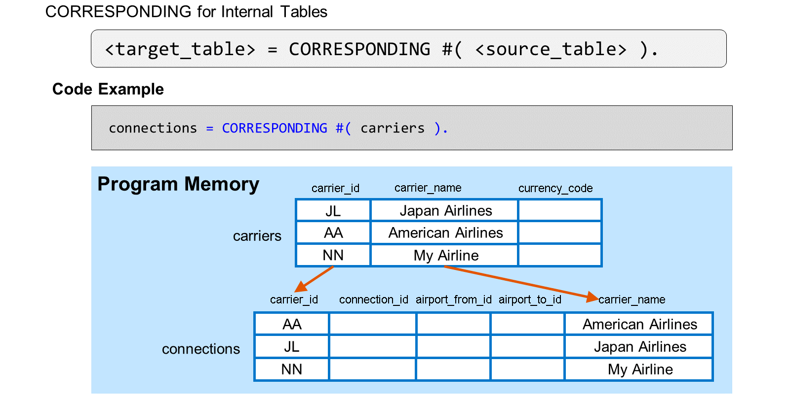

Pour copier des données entre des champs portant le même nom dans deux tables internes, utilisez l'opérateur `CORRESPONDING`. Son fonctionnement est similaire à celui de `CORRESPONDING` pour les structures : pour chaque ligne de la table interne source, le système crée une nouvelle ligne dans la table interne cible et copie les données entre les champs portant le même nom. Les champs source pour lesquels il n'existe aucun champ portant le même nom dans la table cible ne sont pas copiés. Les champs cible pour lesquels il n'existe aucun champ portant le même nom dans la source sont renseignés avec des valeurs initiales spécifiques au type.

Dans l'exemple, la table interne source `carriers` contient trois lignes. Par conséquent, après l'affectation des valeurs, la table interne cible `connexions` contient également trois lignes.

Les champs `carrier_id` et `carrier_name` existent dans les deux tables internes. Ils sont copiés de la source vers la cible. Le champ `currency_code` existe uniquement dans la source. Il n'est pas copié. Les champs `connection_id`, `airport_from_id` et `airport_to_id` existent uniquement dans la table cible. Ils sont renseignés avec des valeurs initiales.

> #### 🍧 Note
>
> Si la table interne cible contient des données avant l'affectation, le système les supprime.

## 🌸 ACCESS TO COMPLEX INTERNAL TABLES

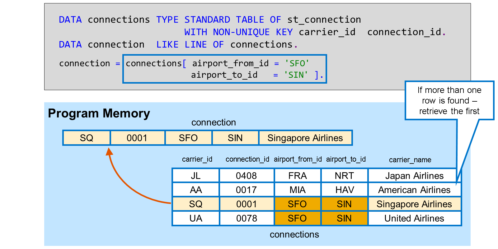

Plus tôt dans ce cours, vous avez appris à extraire une ligne d'une table interne simple à l'aide d'une expression de table interne. Auparavant, nous utilisions un accès par index, c'est-à-dire que nous identifiions la ligne par sa position dans la table interne. Cet accès par index fonctionne de la même manière pour les tables internes complexes. Cependant, pour ces tables, les expressions de table interne avec accès par clé deviennent importantes, car elles identifient la ligne par son contenu.

> #### 🍧 Note
>
> Même s'il s'agit d'un accès par clé, vous pouvez utiliser n'importe quel champ pour la sélection, et pas seulement les champs clés de la table interne. Si plusieurs lignes remplissent cette condition, la première ligne est renvoyée, c'est-à-dire celle avec l'index le plus bas.

L'exemple lit une seule ligne à partir des connexions de la table interne. La clé de cette table interne est composée des champs `carrier_id` et `connection_id`, mais l'accès par clé utilise `airport_from_id` et `airport_to_id` pour identifier la ligne. La table interne contient deux connexions entre l'aéroport `SFO` et `SIN` ; la première est donc renvoyée.

N'oubliez pas que l'exécution ABAP génère l'exception `CX_SY_ITAB_LINE_NOT_FOUND` si aucune ligne ne répond à l'exigence. Gérez cette exception dans une structure `TRY … CATCH … ENDTRY` pour éviter les erreurs d'exécution.

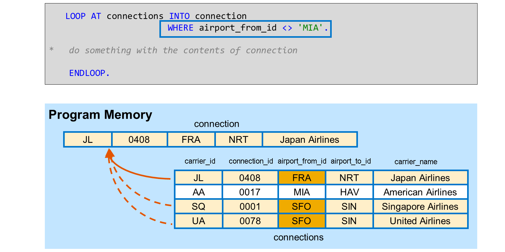

Pour traiter plusieurs lignes d'une table interne en spécifiant des champs, utilisez `LOOP AT <table interne> INTO <cible> WHERE <condition>`. La condition `WHERE` peut contenir un nombre quelconque d'expressions constitutives jointes par `AND` et `OR`. Dans ces expressions, vous pouvez utiliser non seulement l'opérateur égal `=`, mais aussi les opérateurs `>`, `>=`, `<`, `<=`, `<>` et `BETWEEN`.

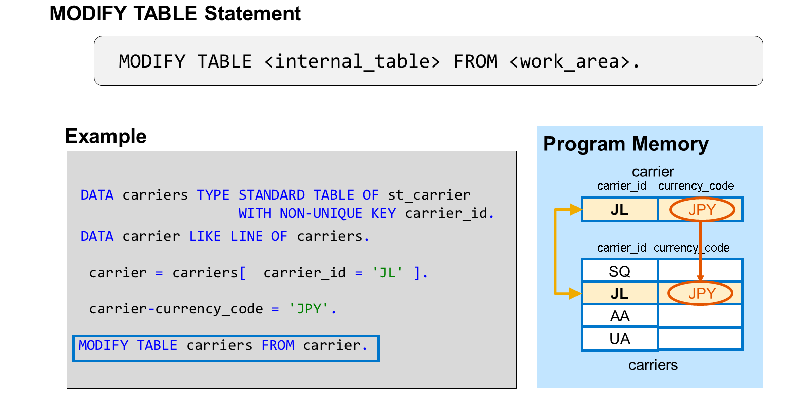

Après avoir lu le contenu d'une ligne de table dans une **work area**, il est parfois nécessaire de réécrire les modifications de cette zone dans la table interne. L'instruction `MODIFY TABLE` est une méthode pour ce faire.

Cette instruction est un accès clé, car le système utilise le contenu des champs clés de la **work area** pour identifier la ligne de table à modifier. Il écrase ensuite cette ligne avec le contenu de la **work area**.

Dans l'exemple, le transporteur de la **work area** contient la valeur `JL` dans le champ clé `carrier_id`. En fonction de cette valeur, le système identifie la deuxième ligne à mettre à jour. Cette ligne est ensuite mise à jour avec les valeurs de la **work area**.

> #### 🍧 Note
>
> Vous ne pouvez modifier que les champs non clés avec MODIFY TABLE. Cette instruction ne prend pas en charge la modification des champs clés.

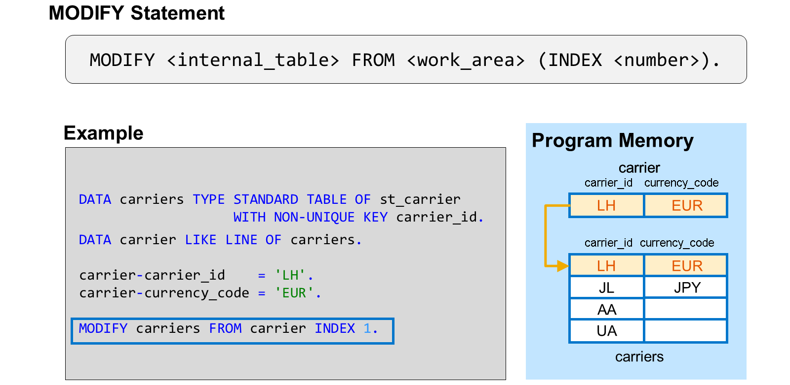

L'instruction `MODIFY` (sans le mot clé TABLE!) ne fait pas de distinction entre les champs clés et les champs non clés. Elle écrase la ligne entière de la table avec les nouvelles valeurs de la **work area**. Cette instruction est considérée comme un accès à l'`index`, car la ligne à mettre à jour est identifiée par sa position dans la table interne. Généralement, l'`index` est spécifié explicitement à l'aide de l'ajout `INDEX` suivi d'un argument entier (littéral, constante, variable, expression).

> #### 🍧 Note
>
> Il existe également une variante spéciale sans ajout INDEX. Nous l'aborderons plus loin.

Dans l'exemple, l'instruction `MODIFY` utilise l'ajout `INDEX` pour accéder à la première ligne de la table. Dans cette ligne, tous les champs sont écrasés par les valeurs de la **work area**, même le champ clé `carrier_id`.

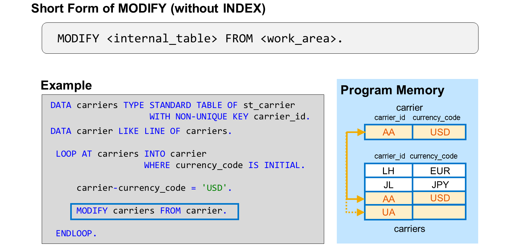

Il est fréquent de devoir modifier le contenu de plusieurs lignes d'une table interne, voire de toutes. Pour ce faire, implémentez une boucle sur la table, qui place chaque ligne à modifier successivement dans une **work area**. Dans cette boucle, vous modifiez d'abord le contenu de la **work area**, puis vous réécrivez les modifications dans la table interne à l'aide de l'instruction `MODIFY`.

> #### 🍧 Note
>
> Si vous ne réécrivez pas les modifications dans la table, elles seront perdues lorsque la work area sera remplie avec les données de la ligne suivante.

Dans l'exemple, la boucle lit toutes les lignes de la table interne carriers pour lesquelles le champ `currency_code` n'est pas encore renseigné. C'est le cas des deux dernières lignes. Pour chacune de ces lignes, le programme remplace la valeur initiale du champ `currency_code` par la nouvelle valeur `USD`. Enfin, il utilise l'instruction `MODIFY` pour écraser la ligne actuelle avec les valeurs mises à jour.

Au lieu de spécifier explicitement l'index, l'exemple de code utilise une forme abrégée de l'instruction `MODIFY`, sans l'ajout d'`INDEX`. Cette forme abrégée n'est autorisée qu'entre `LOOP` et `ENDLOOP`. C'est seulement à ce moment-là que le système peut implicitement mettre à jour la ligne en cours.

Si vous utilisez `MODIFY` sans `INDEX` en dehors de `LOOP…ENDLOOP`, le système ne sait pas quelle ligne modifier et génère une erreur d'exécution non détectable. Pour éviter de telles erreurs d'exécution, veillez à ne pas ignorer l'avertissement associé lors de la vérification de la syntaxe !

## 🌸 COMPLEX INTERNAL TABLES IN ABAP SQL

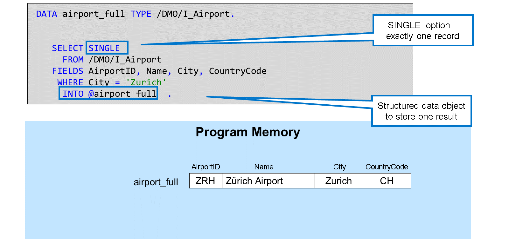

L'instruction SQL ABAP `SELECT` lit les données d'une table de base de données ou d'une vue `CDS`. Lorsque vous utilisez l'option `SINGLE`, un seul enregistrement est lu dans la base de données, même s'il existe d'autres données répondant aux conditions de la clause `WHERE`.

Comme vous l'avez vu précédemment, une façon d'obtenir ce résultat d'enregistrement unique est d'insérer une variable structurée après le mot-clé `INTO`.

Si vous utilisez `SELECT` sans `SINGLE`, vous indiquez que vous êtes intéressé par tous les enregistrements qui remplissent les conditions de la clause `WHERE`. Vous devez ensuite vous assurer que vous pouvez recevoir et stocker plusieurs enregistrements. La méthode la plus simple consiste à utiliser une table interne complexe comme cible de l'instruction `SELECT`. C'est possible, mais cela nécessite l'ajout de `TABLE` entre le mot-clé `INTO` et le nom de la table interne.

Dans cet exemple, nous souhaitons lire les trois aéroports de Londres, et non un seul. Par conséquent, nous omettons le mot-clé `SINGLE` après `SELECT`, ajoutons le mot-clé TABLE après `INTO` et utilisons la table interne `airports_full` comme cible de l'instruction `SELECT`.

L'exemple utilise une liste de champs explicite après `FIELDS` qui correspond aux colonnes de la table interne `airports_full`. Bien entendu, vous pouvez également utiliser `FIELDS *`, `INTO CORRESPONDING FIELDS OF TABLE` et des noms d'alias dans la liste de champs.

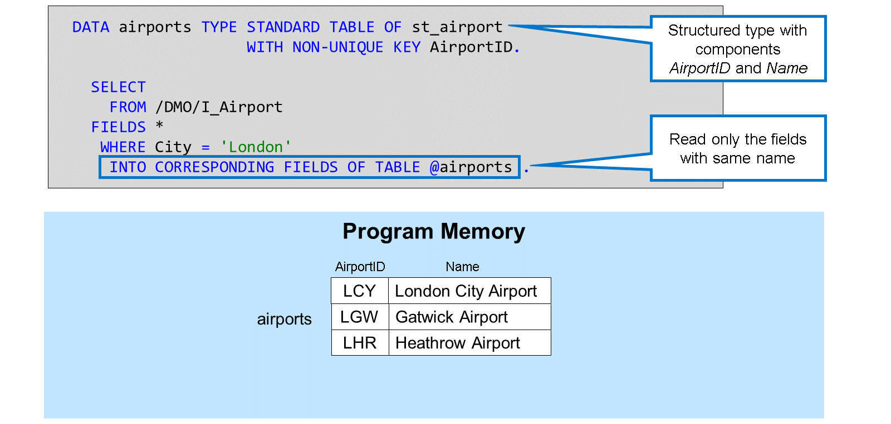

Cet exemple utilise `FIELDS *` au lieu d'une liste de champs explicite et `INTO CORRESPONDING FIELDS OF TABLE` au lieu de `INTO TABLE`.

Comme le type de ligne de la table interne `aéroports` ne contient que deux composants `AirportID` et `Name`, seuls les champs portant le même nom sont lus dans la base de données.

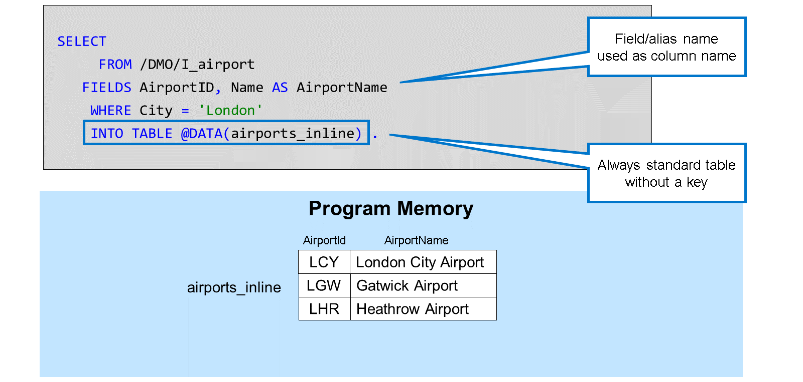

Si vous utilisez `DATA()` dans une instruction `SELECT` après l'ajout de `INTO TABLE`, vous déclarez une table interne en ligne. Le type de ligne de cette table interne est dérivé de la clause `FIELDS`. Pour les champs de table et les éléments de vue, un nom d'alias est facultatif. Pour les expressions de la clause `FIELDS`, un nom d'alias est obligatoire si la clause `INTO` contient une déclaration en ligne.

> #### 🍧 Note
>
> Les déclarations en ligne de tables internes ne sont prises en charge qu'après INTO TABLE. Vous ne pouvez pas utiliser de déclarations en ligne après INTO CORRESPONDING FIELDS OF TABLE.

Les tables internes déclarées en ligne sont toujours des tables standard sans clé. Vous ne pouvez pas déclarer de tables triées ou hachées à l'aide de déclarations en ligne. Cela peut entraîner des problèmes de performances si vous remplissez la table interne avec de nombreuses lignes et utilisez fréquemment l'accès par clé.

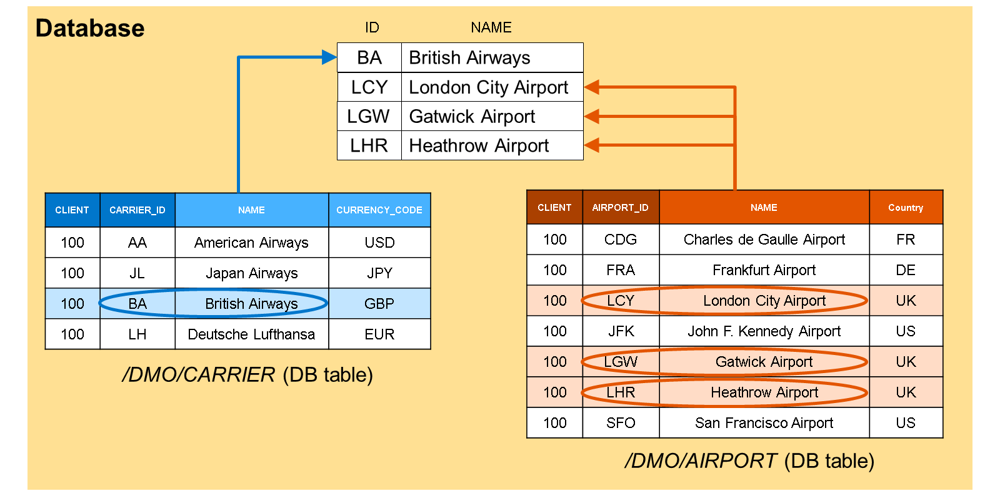

Lors de la lecture de plusieurs enregistrements dans une base de données, certaines techniques SQL spécifiques deviennent particulièrement intéressantes. L'une d'elles est la directive `UNION`, qui permet de combiner les résultats de plusieurs instructions `SELECT`.

La figure illustre la combinaison de deux résultats `SELECT `:

Le premier résultat `SELECT` lit l'`ID` et le `NAME` de tous les transporteurs dont le `CURRENCY_CODE` est égal à `GBP`. Le second `SELECT` lit l'`ID` et le `NAME` de tous les aéroports dont la `CITY` est égale à `Londres`. Le premier `SELECT` renvoie un enregistrement, le second trois. Au lieu d'extraire ces résultats séparément, ils sont combinés en un seul résultat de quatre enregistrements. Il est important de souligner que cette opération se déroule au sein de la base de données.

Cette technique requiert, bien sûr, que les deux résultats soient compatibles, c'est-à-dire qu'ils comportent le même nombre de champs et les mêmes noms. Il est avantageux, mais non indispensable, que les types de champs soient identiques.

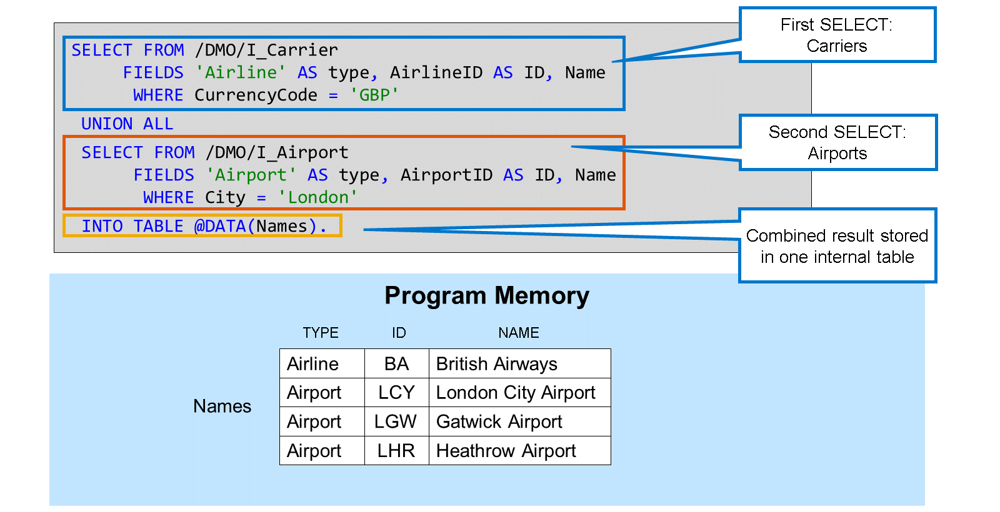

La syntaxe SQL ABAP de cet exemple se compose de deux instructions `SELECT`. Chaque instruction `SELECT` possède ses propres clauses `FROM`, `FIELDS` et `WHERE`, mais une seule clause `INTO` se trouve à la fin. Les deux instructions `SELECT` sont reliées par le mot-clé `UNION ALL`.

> #### 🍧 Note
>
> Avec UNION au lieu de UNION ALL, la base de données rechercherait et éliminerait les doublons avant de renvoyer le résultat. Nous utilisons UNION ALL pour éviter cette surcharge inutile.

Les deux listes de champs sont composées de trois éléments : le premier et le deuxième ont des alias identiques dans les deux clauses `FIELDS`. Le troisième champ n'a pas besoin d'alias, car son nom est identique dans les deux vues CDS.

> #### 🍧 Note
>
> Le premier élément de FIELDS est un texte littéral qui permet de distinguer les compagnies aériennes des aéroports dans le résultat combiné.
