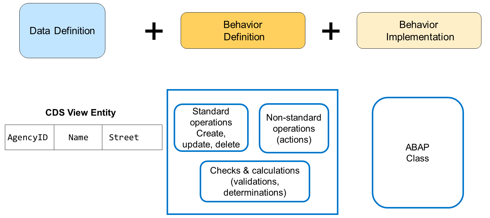
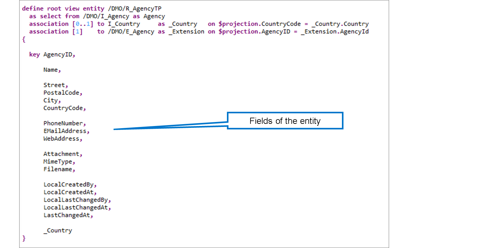
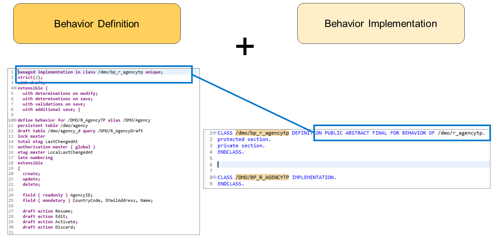
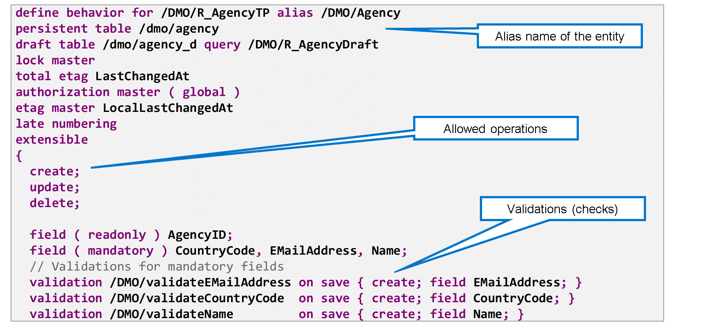
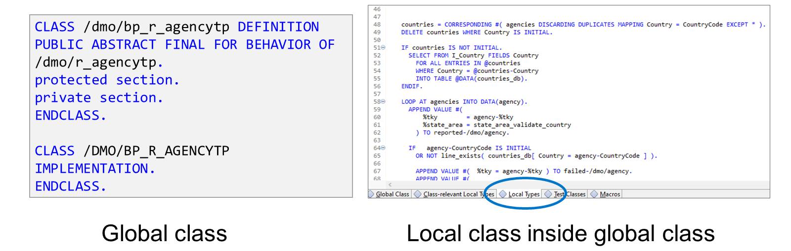
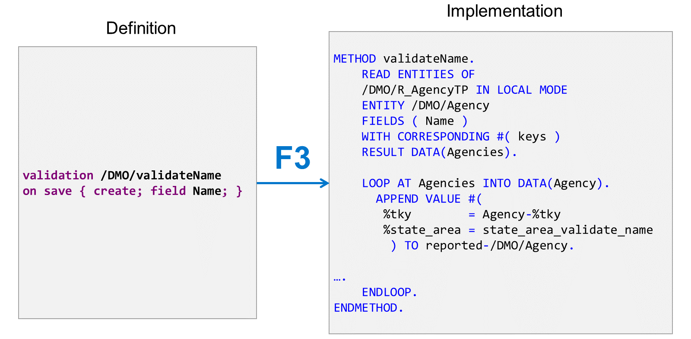
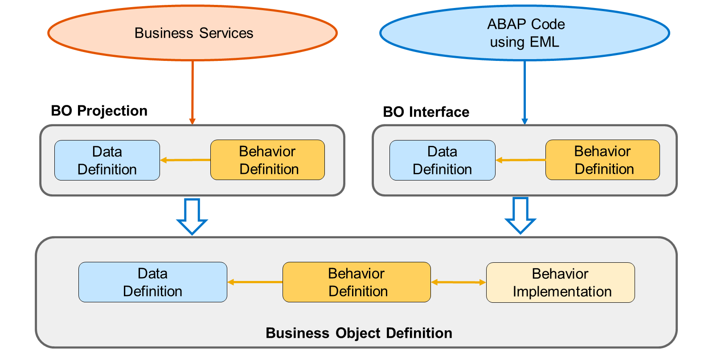

# 🌸 1 [ANALYZING A BUSINESS OBJECT](https://learning.sap.com/learning-journeys/acquire-core-abap-skills/analyzing-a-business-object_e13b47d7-3cba-4cb4-a1f0-158b19ecf3b4)

> 🌺 Objectifs
>
> - [ ] Vous serez capable d'analyser un **business object**

## 🌸 BUSINESS OBJECTS

Dans l'**ABAP RESTful application programming model**, un **business object** définit une entité particulière, telle qu'une agence de voyages. Sa définition comporte deux parties :

- une ou plusieurs **CDS views**, qui définissent la structure de l'objet, autrement dit les champs qu'il contient

- une **behavior definition**, qui décrit les **actions** possibles avec l'**business object**.

La **behavior definition** spécifie les opérations standard (création, mise à jour et suppression) autorisées. Elle peut également contenir la définition des **validations**, des **déterminations** et des **actions**.

- Les **validations** vérifient l'exactitude des données lors de la création ou de la mise à jour d'un enregistrement.

- Les **déterminations** modifient les instances d'objets métier en fonction de conditions de déclenchement.

- Les **actions** sont des opérations non standard permettant de fournir un comportement personnalisé, spécifique à la logique métier. L'approbation d'un bon de commande ou l'annulation d'un vol sont des activités implémentées sous forme d'**actions**.

### IMPLEMENTATION LOGIC

L'implémentation du comportement se compose d'une ou plusieurs classes ABAP. C'est là que les **validations**, les **déterminations** et les **actions** sont implémentées. Concernant les opérations standard, le modèle distingue deux scénarios d'implémentation :

- Dans le scénario d'implémentation **non géré**, la création, la mise à jour et la suppression sont implémentées dans l'implémentation du comportement.

- Dans le scénario d'implémentation **géré**, c'est l'environnement d'exécution qui s'en charge.

Les objets métier sont couramment utilisés pour fournir la logique transactionnelle des applications Fiori Elements ou des API Web. Cependant, vous pouvez également y accéder via le codage ABAP grâce au **langage EML** (Entity Manipulation Language). Il s’agit d’un ensemble d’instructions ABAP qui vous permet de créer, lire, mettre à jour et supprimer des données à l’aide d’objets métier.

> #### 🍧 Note
>
> EML peut également accéder aux données d'application depuis l'implémentation comportementale d'un **business object**.

Dans cette unité, vous créerez une classe utilisant un **business object** pour modifier les données d'une agence de voyages. L'entité de vue contient le champ clé `AgencyID` et divers autres champs contenant des informations sur l'agence de voyages.

### BEHAVIOR DEFINITION AND IMPLEMENTATION

Le comportement d'un **business object** se compose de deux parties :

#### 💮 **behavior definition** :

La **behavior definition** contient les informations sur les capacités de l'**business object**.

#### 💮 **behavior implementation** :

L'implémentation du comportement contient le code exécuté par le système. L'implémentation du comportement est une classe ABAP. Vous déclarez la classe dans la **behavior definition**, dans l'instruction `managed implementation in class <class> unique`. Le code de l'implémentation du comportement est contenu dans une classe locale de la classe globale que vous spécifiez.

Une **behavior definition** est un composant essentiel d'un **business object**. Elle décrit les opérations standard autorisées, par exemple la création, la mise à jour et la suppression. Elle définit également les vérifications (**validations**) effectuées lors de la création ou de la modification de données.

L'exemple présenté ici est la **behavior definition** de l'agence de voyages. Au début de la définition, vous pouvez voir le nom de la **CDS views** que nous venons d'examiner, ainsi qu'un alias. Ceci est important, car c'est ce nom d'alias qui permet d'accéder à l'entité via EML.

La **behavior definition** relie également l'entité CDS à la table de base de données où sont stockées les données. Dans ce cas, l'**business object** utilise deux tables : une pour les données actives et une pour les **Drafts** (données incomplètes et non vérifiées). Des informations pertinentes pour le verrouillage des données, les vérifications d'autorisation et le contrôle de concurrence sont également fournies. Nous n'allons pas approfondir ces informations ; il est simplement important de savoir que l'environnement d'exécution peut gérer ces problèmes. Vous pouvez également générer des entités CDS et des **Behavior definitions** basées sur la définition d'une table de base de données et, dans ce cas, le verrouillage, les contrôles d'autorisation et les contrôles de concurrence sont traités automatiquement.

La classe globale de l'implémentation du comportement (également appelée **behavior pool**) est simplement une définition de classe vide avec l'ajout spécial `FOR BEHAVIOR OF` suivi du nom de la **behavior definition**. L'implémentation réelle de la **behavior definition** est une classe locale au sein de la définition de classe globale. Vous y accédez en cliquant sur l'onglet **Local Types**.

L'implémentation du comportement contient du code spécifique à l'**business object**, par exemple l'implémentation des **validations**, des **déterminations** et des **actions**. La présence ou non de code pour les opérations standard (création, mise à jour, suppression et verrouillage) dépend des détails de la **behavior definition**. L'implémentation du comportement de notre **business object** ne contient pas de code pour les opérations standard, car l'**business object** utilise le type d'implémentation géré dans lequel l'environnement d'exécution gère les opérations standard.

Une **validation** est une vérification effectuée par l'environnement d'exécution lors de la modification de données. Dans ce cas, la **validation** est toujours effectuée lors de la création d'un nouvel enregistrement (déclencheur `create;`). Si un enregistrement existant est modifié, la validation n'est effectuée que si le champ Nom a été modifié (déclencheur `field Name;`).

Les validations sont définies dans la définition du comportement. À chaque validation correspond une méthode dans l'implémentation du comportement.

## 🌸 BO PROJECTIONS AND BO INTERFACES

Dans le modèle de programmation d'applications ABAP RESTful, il existe deux manières principales de consommer un **business object** :

- Par l'intermédiaire d'un **Business Service**, par exemple un service d'interface utilisateur OData pour une application SAP Fiori ;

- À partir du code ABAP, en utilisant l'**Entity Manipulation Language (EML)**.

Bien que techniquement possible, un **business object** ne doit pas être consommé directement. Les consommateurs doivent plutôt accéder aux projections du **business object** (BO Projections) et aux interfaces du **business object** (BO Interfaces) comme suit :

#### 💮 **BO Projection** :

Les services métier doivent toujours définir une projection spécifique de l'**business object**. Cette **BO Projection** spécifie le sous-ensemble de données et d'opérations de l'**business object** accessible via ce service. Une **BO Projection** peut également contenir la définition et l'implémentation de données et de comportements spécifiques au service.

> #### 🍧 Note
>
> Une **BO Projection** est basée soit directement sur l'**business object**, soit sur une interface BO.

#### 💮 **BO interface** :

Une interface d'**business object** offre un accès stable aux données et aux opérations d'un **business object**. Les **BO Interface** sont généralement disponibles pour être utilisées dans d'autres composants logiciels. Si une interface BO existe pour un **business object** donné, il est conseillé d'utiliser du code ABAP utilisant EML pour y accéder.

.png>)

Comme un **business object**, une **BO Projection** se compose de deux parties : une ou plusieurs entités de **CDS views** (définies dans les définitions de données) et une **Behavior definition**. Il en va de même pour les **BO Interface**. Elles se composent également d'une ou plusieurs **CDS views** et d'une **Behavior definition**.

Le moyen le plus simple d'identifier les **projections** et les **interfaces** est d'examiner leurs **Behavior definitions** : les **Behavior definitions** des projections commencent par le mot-clé `projection`, tandis que celles des interfaces commencent par le mot-clé `interface`.

Les **CDS views** des **BO Projections** et les **CDS views** des **BO Interface** sont toujours des **CDS Projection Views**. Cela signifie que leurs définitions contiennent l'ajout `as projection on` là où les définitions des **CDS views** ordinaires utilisent `as select from`. Dans les versions plus récentes, le cas d'utilisation d'une **Projection view** est spécifié à l'aide de l'ajout `provider contract` (contract du fournisseur) après le nom de l'entité de vue, comme suit :

- `provider contract transactional_interface` pour les **BO Interface**

- `provider contract transactional_query` pour les **BO Projections**

> #### 🍧 Hint
>
> Pour les développements SAP, la convention de nommage suivante s'applique :
>
> - <namespace>C\_<…> pour les projections BO
>
> - <namespace>I\_<…> pour les interfaces BO
>
> - <namespace>R\_<…> pour les définitions BO
