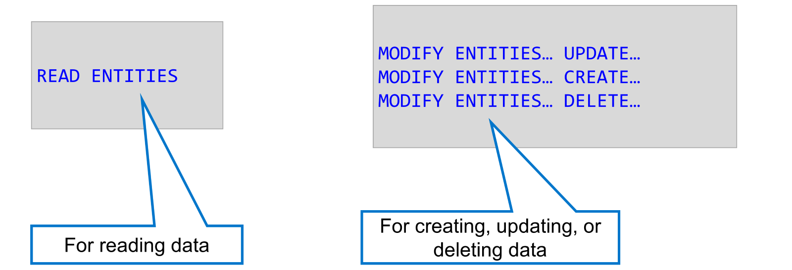
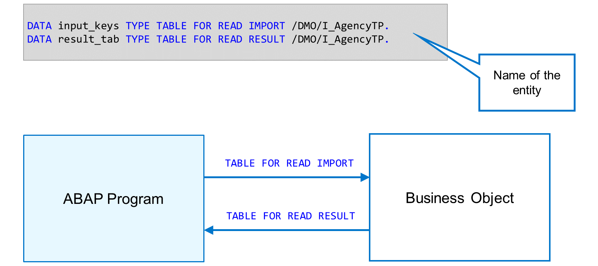
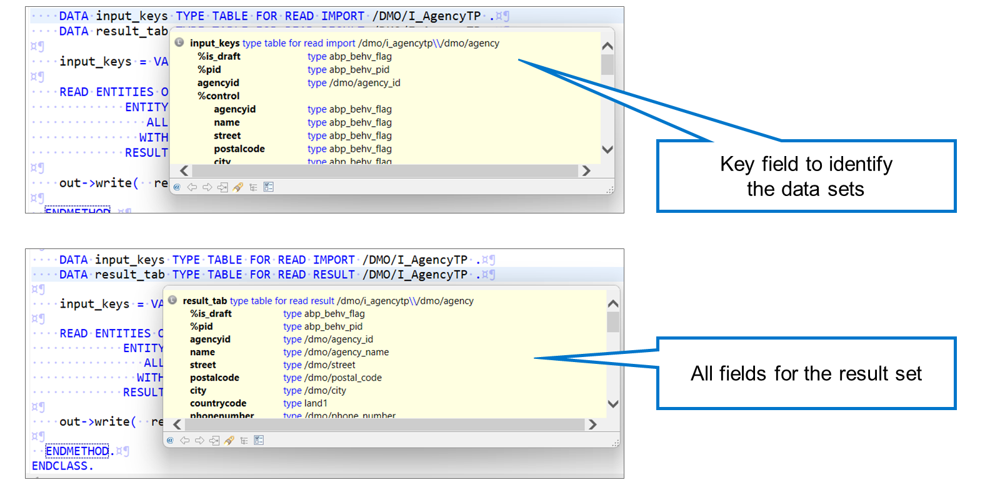
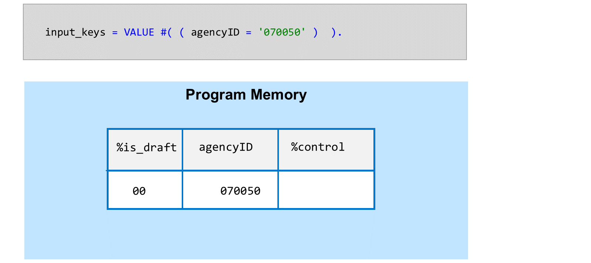
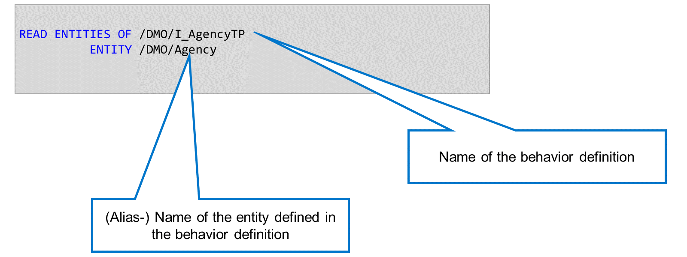
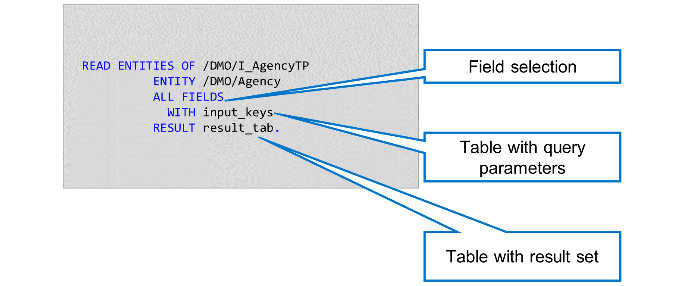
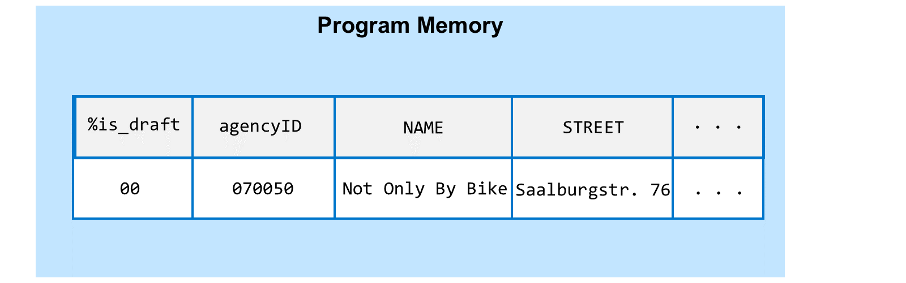
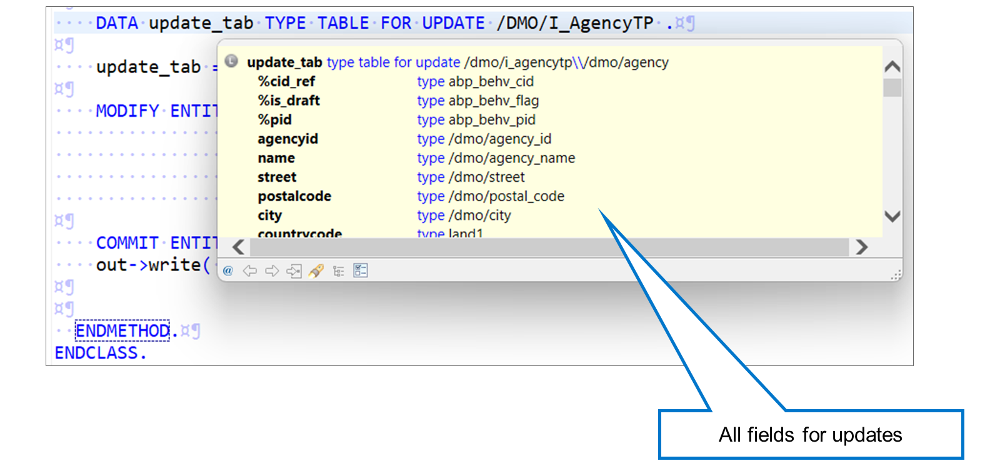
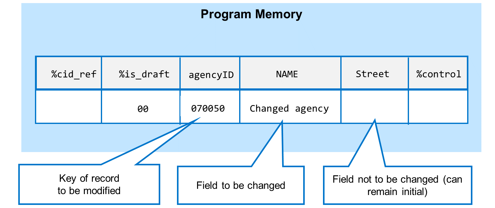
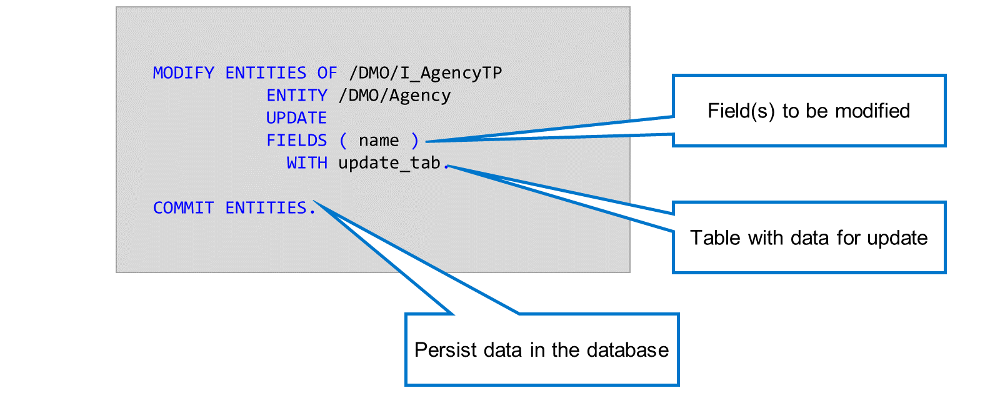

# 🌸 2 [USING THE ENTITY MANIPULATION LANGUAGE](link)

> 🌺 Objectifs
>
> - [ ] vous serez capable d'implémenter une instruction EML

## 🌸 ENTITY MANIPULATION LANGUAGE (EML)

EML est composé d'instructions permettant de manipuler les données d'un **Business Object**.

- L'instruction `READ ENTITIES` permet de lire les données.

- L'instruction `MODIFY ENTITIES`, avec les instructions `UPDATE`, `CREATE` ou `DELETE` correspondantes, est utilisée.

> #### 🍧 Note
>
> Vous ne pouvez utiliser les opérations CREATE, UPDATE et DELETE que si la définition de comportement de l'interface de le Business Object contient la directive use create, use update ou use delete correspondante. Toute tentative d'utilisation d'une opération interdite entraîne une erreur de syntaxe.

Pour lire les données d'un **Business Object**, utilisez l'instruction `READ ENTITIES`. Cette instruction comporte deux paramètres importants : une table interne contenant les clés des données à lire et une autre contenant les résultats de la requête.

Ces tables internes possèdent des types de données spécifiques appelés **derived behavior definition types**. Le système les crée automatiquement lorsqu'un développeur crée une **Behavior Definition**. Elles contiennent tout ou partie des `FIELDS` du **Business Object**, ainsi que d'autres `FIELDS` qui contrôlent le traitement d'une requête spécifique. Vous déclarez les tables internes à l'aide du nouvel ajout `TYPE TABLE FOR <operation>` dans l'instruction `DATA`.

Le type `TABLE FOR READ IMPORT` contient le ou les `FIELDS` clés du **Business Object**. La structure `%control` est une structure générée qui indique les `FIELDS` du **Business Object** réellement utilisés dans l'opération en cours. Dans notre exemple, le système remplit la structure automatiquement ; vous n'avez pas à vous en soucier.

Le type `TABLE FOR READ RESULT` contient tous les `FIELDS` du **Business Object**. Cette table contient le jeu de résultats après l'exécution de l'instruction read.

La table d'importation en lecture contient une colonne pour chaque champ clé du **Business Object**, ici, `agencyID`. Pour lire une agence spécifique, ajoutez une ligne à la table interne contenant sa clé. Outre le ou les `FIELDS` clés, la table contient les colonnes `%is_draft` et `%control`. Avec `%is_draft`, vous pouvez spécifier si vous souhaitez lire les données brouillon ou les données actives. La structure `%control` permet de spécifier les `FIELDS` à lire.

> #### 🍧 Note
>
> Dans notre exemple, nous lisons uniquement les données actives et la structure %control est renseignée par le framework, en fonction de la liste des `FIELDS` après l'ajout de FIELDS.

Lorsque vous traitez un **Business Object** à l'aide de l'instruction `READ ENTITIES OF` ou `MODIFY ENTITIES OF`, vous devez d'abord spécifier le nom de la définition de comportement. Ce nom est suivi du mot-clé `ENTITY` et du nom de l'entité avec laquelle vous souhaitez travailler. Si l'entité possède un alias, utilisez-le ici.

> #### 🍧 Note
>
> Vous ne pouvez pas utiliser l'alias après l'ajout de OF. En effet, techniquement, c'est à ce stade que vous spécifiez le nom de la définition de comportement, et non celui de l'entité.

L'instruction `READ ENTITIES` lit les données du **business Object** selon les clés transmises dans l'instruction additionnelle `WITH`. Elle renvoie le résultat dans la table interne de l'instruction additionnelle `RESULT`.

Dans cette instruction, vous pouvez également spécifier les `FIELDS` du **business Object** nécessaires. Dans cet exemple, nous avons utilisé l'instruction additionnelle `ALL FIELDS` pour renvoyer tous les `FIELDS`. Cependant, si vous n'avez besoin que d'un sous-ensemble de `FIELDS`, vous pouvez utiliser la variante `FIELDS (field1field2 …)` pour limiter la quantité de données lues.

> #### 🍧 Note
>
> Contrairement à une instruction SELECT, la liste des `FIELDS` n'est pas séparée par des virgules.

La table de résultats contient tous les champs du **Business Object**, ainsi que le champ de contrôle `%is_draft`. Si votre instruction `READ ENTITIES` contient la variante `ALL FIELDS`, le système fournit les valeurs de tous les champs. Si vous utilisez la variante `FIELDS ( f1 … fn )`, seuls les champs demandés seront renseignés.

> #### 🍧 Note
>
> Les champs clés sont toujours renseignés, même s'ils ne sont pas spécifiés dans la variante FIELDS ( f1 … fn ).

Pour mettre à jour des données, déclarez une table interne de type `TABLE FOR UPDATE`. Celle-ci contient tous les champs du **Business Object**, ainsi que la structure `%control`. Dans notre variante de l'instruction `MODIFY ENTITIES`, le système remplit automatiquement la structure `%control`.

L'instruction `MODIFY ENTITIES` met à jour les données du **transactional buffer**. Dans l'instruction `FIELDS`, vous spécifiez les champs à modifier. Dans l'instruction `WITH`, vous transmettez la table interne contenant les données à mettre à jour.

Lorsque vous utilisez EML en dehors du **Business Object**, vous devez utiliser l'instruction `COMMIT ENTITIES` pour déclencher la séquence de sauvegarde et conserver les données dans la base de données.

> #### 🍧 Note
>
> Plus loin dans ce cours, nous utiliserons EML dans l'implémentation du comportement du **Business Object**. Dans cette implémentation, il n'est ni nécessaire ni autorisé de déclencher la validation avec COMMIT ENTITIES.
