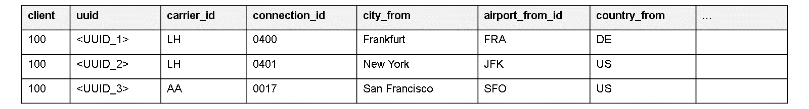
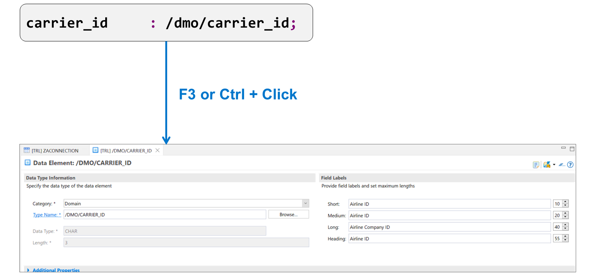

# 🌸 2 [EXPLORING THE ARCHITECTURE](https://learning.sap.com/learning-journeys/acquire-core-abap-skills/exploring-the-architecture-of-rap_cdfbb8b8-9d94-4c33-bc5d-3d29d8206724)

> 🌺 Objectifs
>
> - [ ] Create a database table
>
> - [ ] Generate the development objects for an OData UI service

## 🌸 CREATION OF THE DATA MODEL

### EXAMPLE DATA MODEL

Le **Data Model** de cet exemple est très simple : une seule table de base de données contient les informations relatives aux correspondances : la compagnie aérienne, le numéro de vol, l'aéroport de départ et la destination.

> #### 🍧 Note
>
> Les champs supplémentaires nécessaires à l'exécution pour gérer le contrôle de concurrence ne sont pas inclus dans la figure. Nous les examinerons plus loin.

### CREATING A DATABASE TABLE

[Référence - Link Vidéo](https://learning.sap.com/learning-journeys/acquire-core-abap-skills/exploring-the-architecture-of-rap_cdfbb8b8-9d94-4c33-bc5d-3d29d8206724)

### DEFINING BASIC TABLE ATTRIBUTES

[Référence - Link Vidéo](https://learning.sap.com/learning-journeys/acquire-core-abap-skills/exploring-the-architecture-of-rap_cdfbb8b8-9d94-4c33-bc5d-3d29d8206724)

### ADDING TABLE DEFINITION

[Référence - Link Vidéo](https://learning.sap.com/learning-journeys/acquire-core-abap-skills/exploring-the-architecture-of-rap_cdfbb8b8-9d94-4c33-bc5d-3d29d8206724)

Si vous n'utilisez pas de type de dictionnaire ABAP intégré pour spécifier le type d'une colonne de table, utilisez plutôt un élément de données. Les éléments de données sont des objets du dictionnaire ABAP qui définissent le type d'un champ unique, tel qu'un `UUID` ou un code de compagnie aérienne. Les éléments de données contiennent non seulement une description technique du type, mais aussi des informations sémantiques telles que les libellés de champ. Si vous utilisez des éléments de données pour définir les types de colonnes de table, le système peut utiliser automatiquement les libellés de champ dans l'interface utilisateur générée.

L'élément de données de l'illustration `Data Element` décrit le champ `airline`. Il s'agit d'un champ de type caractère de longueur 3 ; le système utilisera automatiquement les libellés de champ dans l'interface utilisateur générée.

.png>)

Pour créer un élément de données, sélectionnez [File] → [New] → [Other], puis saisissez [Data Element] dans le champ Texte du filtre. Saisissez le nom du package et celui de l'élément de données, puis cliquez sur [Next]. Sélectionnez une demande de transport et cliquez sur [Finish].

Vous devez ensuite spécifier un type de données pour l'élément de données. Il doit s'agir d'un domaine ; l'exemple réutilise le domaine existant `/DMO/CITY`. Notez que les deux éléments de données utilisent le même domaine. Cela signifie que si quelqu'un modifie ultérieurement la longueur du domaine, la modification s'applique à tous les éléments de données qui l'utilisent.

Enfin, saisissez les libellés de champ courts, moyens et longs, ainsi que le libellé des en-têtes de colonnes. Plus tard, lors de la génération de l'application Fiori Elements, le système utilisera automatiquement ces textes.

.png>)

Chaque table que vous définissez doit posséder une clé primaire. Il s'agit d'une séquence de champs au début de la description de la table, qui identifie chaque entrée de manière unique.

Le premier champ de la table (et donc également le premier champ de la définition de clé) doit être le champ client, et son type de données doit être abap.clnt. De plus, il est pratique pour notre exemple d'utiliser un `UUID` comme clé unique. Si vous utilisez l'élément de données `sysuuid_x16` pour spécifier le type de ce champ, vous pouvez laisser l'exécution attribuer automatiquement l'`UUID` lors de la création d'un nouvel enregistrement.

.png>)

Pour des raisons de traçabilité, il est recommandé de stocker certaines informations administratives avec les données, comme par exemple l'utilisateur ayant créé ou modifié les données, ainsi que les horodatages de création et de dernière modification. La table de base de données que vous créez doit contenir les champs illustrés dans la figure.

> #### 🍧 Note
>
> Ces champs sont obligatoires pour le générateur que nous utiliserons ultérieurement. Pour son bon fonctionnement, les champs doivent également être définis avec les types de données listés ici.

Les champs `fieldslocal_last_changed_at` et `last_changed_at` ne sont pas uniquement des champs administratifs. Dans le modèle de programmation d'applications RESTful ABAP, ils sont également utilisés pour le contrôle de concurrence.

Les applications RESTful étant sans état, la cohérence des données ne peut être assurée par des verrous exclusifs. Le modèle de programmation d'applications RESTful ABAP utilise une combinaison de verrous exclusifs et d'`ETags` pour éviter les incohérences de données. Un `ETag` est un champ dont la valeur change à chaque mise à jour d'un ensemble de données. En comparant la valeur du champ `ETag`, le framework peut garantir qu'un ensemble de données n'a pas été modifié depuis sa dernière lecture. Les horodatages de la dernière modification constituent des champs `ETag` parfaits.

.png>)

Lorsque vous activez une table de base de données dans ADT, le système crée la table physique correspondante dans la base de données. Vous pourrez ensuite générer automatiquement les objets supplémentaires nécessaires à votre application.

## 🌸 THE OBJECT GENERATOR

### GENERATING ADDITIONAL OBJECTS

Nous venons de définir une table de base de données pour stocker nos données, mais l'application que nous allons créer nécessite d'autres objets que cette table. Nous pouvons générer ces objets à l'aide d'un assistant dans ADT.

Les objets générés contiennent toutes les informations nécessaires pour fournir à une application fonctionnelle des fonctionnalités de création, de lecture, de mise à jour et de suppression. Nous ajusterons et étendrons ultérieurement certains de ces objets afin de modifier l'apparence de l'interface utilisateur et d'implémenter des vérifications et des calculs.

Regardez cette vidéo pour apprendre à générer des objets supplémentaires.

[Référence - Link Vidéo](https://learning.sap.com/learning-journeys/acquire-core-abap-skills/exploring-the-architecture-of-rap_cdfbb8b8-9d94-4c33-bc5d-3d29d8206724)

## 🌸 PREVIEW OF THE ODATA UI SERVICE

### PUBLISH AND PREVIEW THE SERVICE

À l'aide de votre table de base de données et du générateur d'objets, vous pouvez générer tous les objets nécessaires à une application Fiori Elements fonctionnelle. La seule étape manuelle consiste à publier le service.

.png>)

Vous devez publier le service avant de tester l'application. Pour cela, ouvrez la liaison du service et choisissez [Publish]. Une fois cette opération effectuée, l'entité que vous avez créée (ici, [Connexion]) apparaît dans la liste des entités. Sélectionnez-la et choisissez [Preview] pour tester l'application.

### TES THE APP

.png>)
