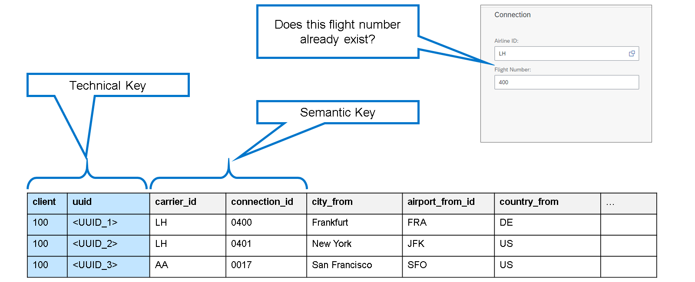
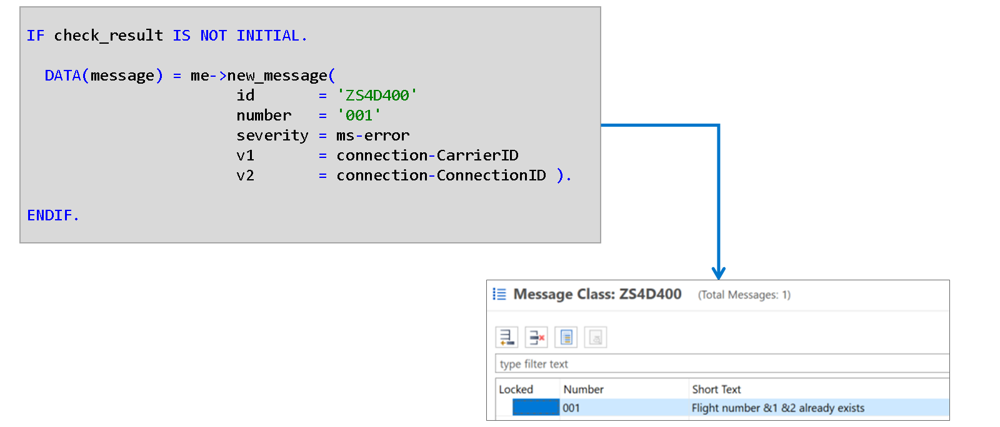
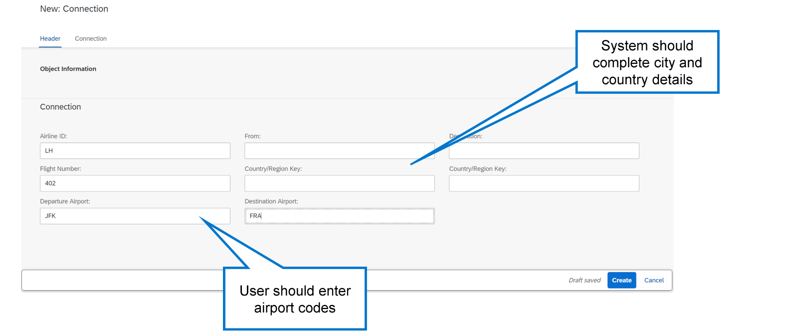

# 🌸 3 [ADDING ABAP LOGIC](x-lab/00-template.md)

> 🌺 Objectifs
>
> - [ ] Vous serez capable d'implémenter le comportement d'un **Business Object**

## 🌸 VALIDATIONS

### CHECKING THE SEMANTIC KEY



Dans le modèle de programmation d'applications ABAP RESTful, la clé d'une table de base de données est souvent composée du champ client et d'un champ UUID, dont la valeur est automatiquement attribuée par l'environnement d'exécution lors de la création d'une nouvelle instance de l'**Business Object**. Cette combinaison de champs suffit à garantir que le système identifie chaque enregistrement de la table de manière unique. Cependant, outre cette clé technique, notre objet possède également une clé sémantique : la combinaison de la compagnie aérienne et du numéro de vol, qui doit également être unique selon la logique métier. Afin de garantir l'unicité de cette combinaison de champs, vous devez implémenter votre propre vérification sous la forme d'une **validation**.

Les **validations** sont déclarées dans la **Behavior Definition** de la **CDS view entity** et implémentées dans la **behavior implementation class**.

### INPUT CHECKS IN THE APP

Outre la vérification de la clé sémantique, d'autres vérifications sont nécessaires. Par exemple, bien que l'application générée permette de créer, lire, mettre à jour et supprimer des données, elle ne comporte pas encore de contrôle de cohérence. Par conséquent, vous pouvez créer des correspondances pour des compagnies aériennes inexistantes ou dont les aéroports de départ et de destination sont identiques.

.png>)

Pour éviter que cela ne se produise, vous définissez d’autres validations dans la **Behavior Definition** et les implémentez dans la **behavior implementation class**.

### CREATING MESSAGE TEXTS

Avant de créer la validation, vous devez créer les textes à afficher. Pour ce faire, utilisez une classe de messages. Une classe de messages est un ensemble de 1 000 messages maximum appartenant à un domaine d'application particulier. Comme illustré dans la figure, chaque texte possède un numéro qui l'identifie de manière unique au sein de la classe.

.png>)

Pour créer une classe de message, procédez comme suit :

Choisissez [File] → [New] → [Other…] et saisissez « message » dans le champ de filtre.

Double-cliquez sur l'entrée [Message Class] dans la liste des résultats, puis saisissez un package, un nom et une description pour la nouvelle classe de message. Cliquez sur [Next].

Assignez la classe de message à une requête de transport et cliquez sur [Finish].

Les messages peuvent également contenir des espaces réservés, qui sont remplacés par des valeurs concrètes lors de leur affichage. Les espaces réservés sont indiqués par le symbole `&` suivi d'un nombre. Vous pouvez utiliser jusqu'à quatre espaces réservés par message.

### DEFINING THE VALIDATION

Pour définir une validation, ajoutez une déclaration de validation à la définition de comportement de votre **Business Object**. Dans cet exemple, la validation doit être effectuée chaque fois que l'utilisateur enregistre un enregistrement de données, soit lors de sa création, soit lors de sa modification ultérieure.

.png>)

Lorsque vous définissez la validation dans la **Behavior Definition**, un avertissement vous indique que la méthode correspondante n'existe pas. Utilisez une solution rapide (combinaison de touches [Ctrl] + [1]) pour ajouter la méthode à la **Behavior Implementation**. La **Behavior Implementation** est une classe locale au sein de votre **Behavior Pool**. La définition de méthode contient l'ajout `FOR VALIDATE ON SAVE`, qui l'identifie comme l'implémentation de la validation. Elle possède un paramètre d'importation `KEYS`. Il s'agit d'une table interne contenant les clés des objets créés ou modifiés. Ces informations permettent de lire les données saisies par l'utilisateur.

L'ajout `FOR Connection~CheckSemanticKey` lie la méthode à la validation `CheckSemanticKey` de la **Behavior Definition**. Ici, `Connection` est l'alias de l'entité de vue `Z_R_CONNECTION`.

.png>)

Lorsque vous définissez une validation, vous devez également créer son implémentation. Il s'agit d'une méthode du **Behavior Pool**. Le plus simple est d'utiliser une solution rapide. Positionnez le curseur sur le nom de la validation et appuyez sur [Ctrl] + [1]. ADT propose de créer la méthode. Double-cliquez sur la proposition pour créer la méthode.

### THE VALIDATION PROCESS

> #### 🍧 Note
>
> Certains exemples de code de cette section utilisent des instructions SELECT à l'intérieur de boucles. Ceci a été fait pour simplifier les exemples. Notez que les instructions SELECT dans les boucles peuvent entraîner des problèmes de performances et doivent être évitées.

.png>)

Lorsque le système déclenche une validation, il appelle l'implémentation correspondante. Le paramètre d'importation `KEYS` contient les clés des enregistrements de données modifiés. Ces clés permettent de lire les champs des enregistrements nécessaires à l'aide du langage EML (Entity Manipulation Language). EML est un ensemble d'instructions ABAP spécifique permettant d'accéder aux objets métier.

Une fois les données lues, vous pouvez effectuer les vérifications nécessaires. En cas d'échec, vous devrez générer un message d'erreur approprié et, surtout, indiquer au framework de ne pas enregistrer les modifications dans la base de données.

.png>)

La première tâche d'une validation consiste à lire la saisie utilisateur. Pour ce faire, utilisez l'instruction `READ ENTITIES` (langage de manipulation d'entités) EML. Les clés des nouveaux enregistrements de données sont transmises à la validation via les clés du paramètre d'importation.

Les champs nécessaires à la validation de la clé sémantique sont `CarrierID` pour la compagnie aérienne et `ConnectionID` pour le numéro de vol. Vous avez également besoin du champ `UUID`.

L'extrait de code utilise l'opérateur correspondant et une déclaration en ligne pour le jeu de résultats. Vous trouverez ci-dessous le code équivalent utilisant des variables explicitement définies, ce qui facilite la compréhension des types utilisés.

```eml
DATA read_keys   TYPE TABLE FOR READ IMPORT zs4d400_r_connection.
DATA connections TYPE TABLE FOR READ RESULT zs4d400_r_connection.

read_keys = CORRESPONDING #( keys ).

READ ENTITIES OF zs4d400_r_connection IN LOCAL MODE
       ENTITY Connection
       FIELDS ( uuid CarrierID ConnectionID )
         WITH read_keys
       RESULT connections.
```

Après avoir lu la saisie utilisateur, vous pouvez utiliser les valeurs `CarrierID` et `ConnectionID` pour vérifier si cette clé sémantique a déjà été utilisée dans un autre ensemble de données que celui que vous traitez actuellement. Puisque la combinaison de clés peut se trouver dans la table active ou dans la table de brouillon, vous devez rechercher dans les deux. La méthode la plus efficace consiste à utiliser une `UNION`.

.png>)

Le résultat de cette requête doit toujours être vide. Dans le cas contraire, d'autres enregistrements présentent la même combinaison d'identifiants de transporteur et de connexion. Cela signifie que l'enregistrement que l'utilisateur tente de créer est un doublon et doit être rejeté.



Si la combinaison de l'ID de l'opérateur et de l'ID de connexion existe déjà, une entrée sera présente dans la table `check_result`. Dans ce cas, vous devez émettre un message.

La première étape consiste à créer un objet message. Pour ce faire, utilisez l'auto-référence me et appelez la méthode `new_message()`. Les paramètres `ID`, `number` et `Severity` sont obligatoires.

- `ID` est le nom de la classe de message contenant le message ;

- `number` est le numéro du message.

- `Severity` classe le message comme message de réussite, d'information, d'avertissement ou d'erreur.

La **Behavior Implementation Class** contient une constante structurée ms dont les composants représentent les différents niveaux de gravité. Dans ce cas, vous avez besoin du niveau de gravité `ms-error`.

La méthode dispose également de paramètres d'importation facultatifs `v1`, `v2`, `v3` et `v4`. Vous les utilisez pour remplacer les espaces réservés par des valeurs concrètes. Dans cet exemple, l'espace réservé `&1` est remplacé par le code de la compagnie aérienne, et l'espace réservé `&2` par le numéro de vol.

Le résultat de l'appel de méthode est une référence d'objet. À l’étape suivante, vous transmettrez l’objet au runtime afin que le message d’erreur soit renvoyé au service OData et affiché dans l’aperçu de l’application.

.png>)

Pour que l'exécution affiche un message, vous devez le signaler à l'aide de la structure `reported`. Il s'agit d'un paramètre implicitement modifiable de toutes les méthodes de validation et d'une structure profonde. Elle contient un composant portant le nom d'alias de l'**Business Object**. Ce composant est une table interne.

Pour signaler le message, vous devez effectuer trois opérations :

1. Ajouter la clé de l'enregistrement concerné à la table interne. Pour ce faire, utilisez le groupe de champs %tky. Ce regroupement de champs permet d'indiquer le nom du groupe au lieu de traiter chaque champ individuellement.

2. Attacher l'objet message à la table. Pour ce faire, attribuez la référence de l'objet message au composant %msg de la table interne.

3. Lier le message au champ concerné. Cela permet de mettre en évidence le champ dans l'application et de faciliter la navigation de l'utilisateur. Pour ce faire, utilisez le composant %element de la table interne.

.png>)

Dans cet exemple, `reported_record` est une structure dont le type de ligne est celui de la table interne `reported-connection`. Le composant `%tky` est renseigné avec le contenu du groupe de champs `%tky` de l'enregistrement de données. Il s'agit de la ligne de structure utilisée comme **work area** pour la table interne contenant les données saisies par l'utilisateur. Ensuite, vous affectez l'objet message créé avec la méthode `new_message()` au composant `%msg`. Enfin, pour lier le message au champ `CarrierID`, utilisez la structure `%element`. `%element` est une structure et contient un composant pour chaque élément de l'entité de vue. Si vous définissez un composant sur `true`, le champ de saisie correspondant sera mis en surbrillance dans l'application. Pour ce faire, utilisez la constante structurée `if_abap_behv=>mk`. Le composant est alors activé pour les valeurs cochées/vraies et désactivé pour les valeurs décochées/fausses.

Vous ne pouvez pas utiliser les constantes globales `abap_true` et `abap_false` à ce stade, car leurs types de données ne sont pas compatibles.

.png>)

Outre l'émission du message, vous devez également indiquer au runtime de ne pas enregistrer les données incorrectes. Pour ce faire, utilisez la structure failed de la méthode de validation. Failed est un paramètre implicitement modifiable présent dans toutes les méthodes de validation.

Pour signaler un enregistrement comme ayant échoué, ajoutez son groupe de champs `%tky` au groupe de champs `%tky` de la table interne `failed-Connection`.

.png>)

La validation suivante vérifie que la compagnie aérienne saisie par l'utilisateur existe bien. La première étape consiste à lire la saisie utilisateur à l'aide de l'instruction EML `READ ENTITIES`. Cette fois, il suffit de lire le champ `CarrierID`.

.png>)

L'instruction `SELECT SINGLE` lit les données à l'aide de l'entité de vue CDS `/dmo/i_carrier` et vérifie si la compagnie aérienne donnée existe. Si c'est le cas, la valeur de la constante globale `abap_true` ('X') est placée dans le champ exists. Si exists est initial à l'instruction `SELECT`, vous devez générer un message, le signaler et ajouter l'enregistrement à la structure en échec, comme dans l'exemple précédent.

La validation finale vérifie que les aéroports d'origine et de destination sont différents. La première étape consiste à lire la saisie utilisateur à l'aide d'une instruction `READ ENTITIES`. Cette fois, les champs `AirportFromID` et `AirportToID` sont pertinents.

.png>)

.png>)

Si les aéroports de départ et d'arrivée sont identiques, vous devez émettre le message correspondant et renseigner les structures signalées et en échec. L'extrait de code indique le codage nécessaire à la création du message. Le codage pour renseigner les structures signalées et en échec est le même que dans les exemples précédents.

## 🌸 DETERMINATIONS

### DETERMINE CITIES BASED ON AIRPORT CODES

Dans l'exemple d'application, l'entité de correspondance contient un aéroport, une ville et un pays de départ, ainsi qu'un aéroport, une ville et un pays d'arrivée. Bien qu'il soit possible de forcer l'utilisateur à saisir toutes ces informations, il est préférable, pour l'expérience utilisateur et la cohérence des données, que l'utilisateur ne saisisse que les codes d'aéroport et que l'application lise les informations correspondantes sur la ville et le pays dans la base de données. Dans le modèle de programmation d'applications ABAP RESTful, vous pouvez effectuer ce type de tâche à l'aide d'une **detemination**.



Vous commencerez par mettre en œuvre la **detemination**. Vous apprendrez ensuite à désactiver la saisie des champs qui seront remplis automatiquement.

### DEFINING THE DETERMINATION

Vous définissez une **detemination** dans la **Behavior Definition** d'un **Business Object**. Cette **detemination**, appelée `getCities`, est appelée chaque fois que le **Business Object** est enregistré et qu'au moins un des champs `AirportFromID` et `AirportToID` est modifié. Vous pouvez utiliser un correctif rapide dans la **Behavior Definition** pour créer la méthode correspondante dans l'implémentation du comportement.

.png>)

### THE DETERMINATION PROCESS

.png>)

Lorsque le système déclenche une **detemination**, il appelle l'implémentation correspondante. Le paramètre d'importation `KEYS` contient les clés des enregistrements de données modifiés. Dans la méthode de **detemination**, vous utilisez EML pour lire les données en fonction des clés, exactement de la même manière que pour les validations. Cependant, dans une **detemination**, vous manipulez également les données dans la méthode et vous devez donc mettre à jour les données détenues par le framework à l'aide de l'instruction EML UPDATE.

> #### 🍧 Note
>
> Certains exemples de code de cette section utilisent des instructions SELECT à l'intérieur de boucles. Ceci a été fait pour simplifier les exemples. Notez que les instructions SELECT dans les boucles peuvent entraîner des problèmes de performances et doivent être évitées.

.png>)

Au début de la détermination, lisez les données saisies par l'utilisateur en format EML. Vous aurez besoin des champs `AirportFromID` et `AirportToID` pour compléter les informations sur la ville et le pays.

.png>)

Le modèle de données de démonstration fournit une entité de vue CDS `/dmo/i_airport` permettant de lire la ville et le pays d'un aéroport particulier. L'exemple utilise la variante de la clause `INTO`, dans laquelle vous spécifiez explicitement les champs de la structure à renseigner. N'oubliez pas que les modifications apportées aux données se trouvent dans la **work area** de la table interne et que vous devez les renvoyer à la table elle-même via l'instruction `MODIFY`.

.png>)

L'instruction `READ ENTITIES` renvoie une table interne de type dérivé `FOR READ RESULT`. Pour modifier les données du **buffer**, vous avez besoin d'une instruction `MODIFY ENTITIES`. Vous transmettez les données à modifier à cette instruction via une table interne de type dérivé `FOR UPDATE`. Les champs de données sont identiques dans les deux types, mais la table `FOR UPDATE` possède une structure supplémentaire appelée %control qui contient des informations administratives.

Vous ne pouvez pas transmettre la table des connexions à l'instruction `MODIFY ENTITIES`. Vous devez donc copier vos données dans une table interne de type approprié (`connections_upd`) avant d'effectuer la modification.

.png>)

Pour mettre à jour les données avec les champs renseignés lors de la détermination, utilisez l'instruction `MODIFY ENTITIES`. Elle spécifie les champs à mettre à jour dans la clause `FIELDS` et transmet les données à une table interne à l'aide de l'option `WITH`. Cette table doit avoir le type de données dérivé correct, soit `TYPE TABLE FOR UPDATE zsd4d400_r_connection` dans ce cas.

L'instruction `MODIFY ENTITIES` peut renvoyer des messages, reçus via la clause `REPORTED`. Vous propagez ensuite ces messages à votre propre **Business Object** en copiant le contenu de la table interne dans la structure `REPORTED` de la méthode de détermination.
