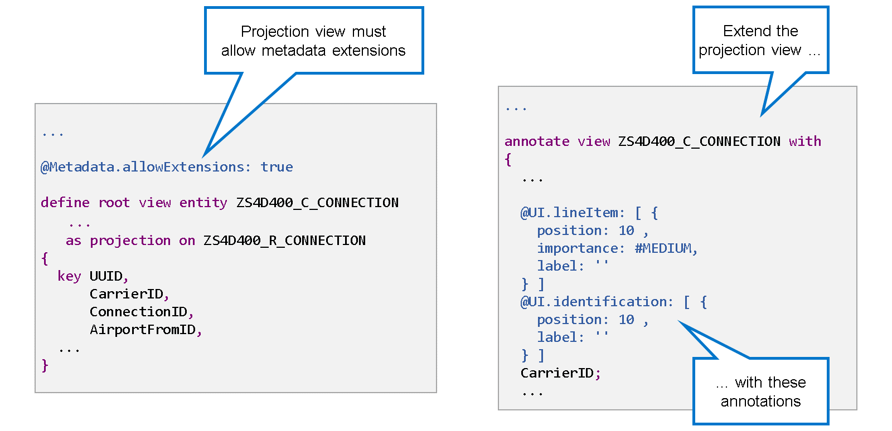
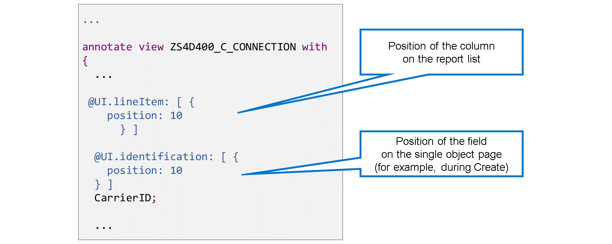

# 🌸 4 [IMPROVING THE USER EXPERIENCE](https://learning.sap.com/learning-journeys/acquire-core-abap-skills/improving-the-user-experience_d1088a29-1b1f-430b-ac0e-c21657567482)

> 🌺 Objectifs
>
> - [ ] Organiser les champs dans l'application
>
> - [ ] Fournir une aide à la saisie

## 🌸 UI ADJUSTMENT

### ARRANGING FIELDS IN THE UI

[Référence - Link Vidéo](https://learning.sap.com/learning-journeys/acquire-core-abap-skills/improving-the-user-experience_d1088a29-1b1f-430b-ac0e-c21657567482)

### MAKING FIELDS READ-ONLY

[Référence - Link Vidéo](https://learning.sap.com/learning-journeys/acquire-core-abap-skills/improving-the-user-experience_d1088a29-1b1f-430b-ac0e-c21657567482)

Une fois les champs en lecture seule, il est judicieux de les réorganiser. Pour ce faire, annotez les champs correspondants de la projection. Le plus souvent, cette opération est effectuée dans une extension de métadonnées.

Les extensions de métadonnées sont des objets de référentiel autonomes contenant les **annotations** d'une entité CDS spécifique. Leur objectif est de faciliter la compréhension de la définition de l'entité CDS et des **annotations** en les séparant. Dans le cas contraire, la définition du CDS deviendrait très longue et difficile à lire.

Si vous souhaitez utiliser une extension de métadonnées avec une vue CDS, celle-ci doit contenir l'**annotation** `@Metadata.allowExtensions: true`. Le générateur s'en charge et génère automatiquement une extension de métadonnées pour la vue de projection et l'**annotation** correspondante dans la vue de projection elle-même.

Il existe deux **UI annotations** importantes que vous devrez peut-être modifier dans l'extension de métadonnées. La première est `@UI.LineItem`. Il s'agit d'un tableau dans lequel vous définissez la position de l'attribut. Cela détermine la position de la colonne dans la page de liste des rapports de l'application.

La deuxième annotation est `@UI.identification`. Il s'agit également d'un tableau dans lequel vous définissez la position de l'attribut. Cela détermine la position du champ dans la page d'objet unique affichée lors de la création ou de la mise à jour.

### REARRANGING THE FIELDS

[Référence - Link Vidéo](https://learning.sap.com/learning-journeys/acquire-core-abap-skills/improving-the-user-experience_d1088a29-1b1f-430b-ac0e-c21657567482)

## 🌸 INPUT HELP

[Référence - Link Vidéo](https://learning.sap.com/learning-journeys/acquire-core-abap-skills/improving-the-user-experience_d1088a29-1b1f-430b-ac0e-c21657567482)
