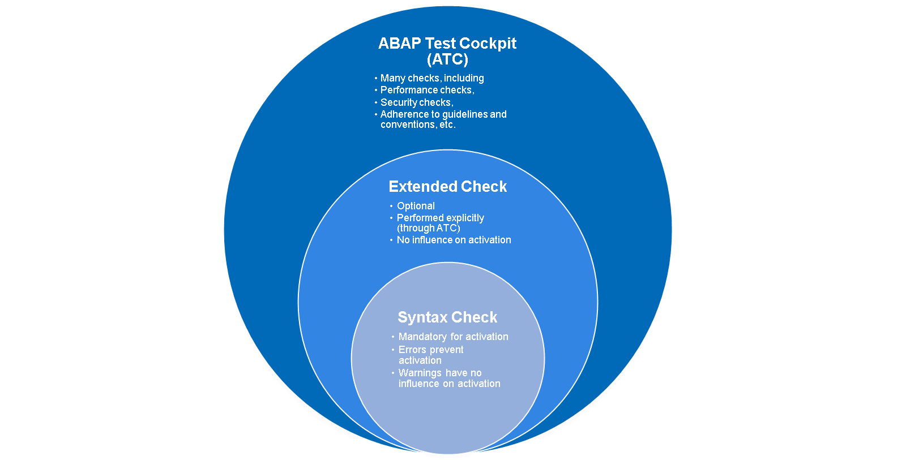
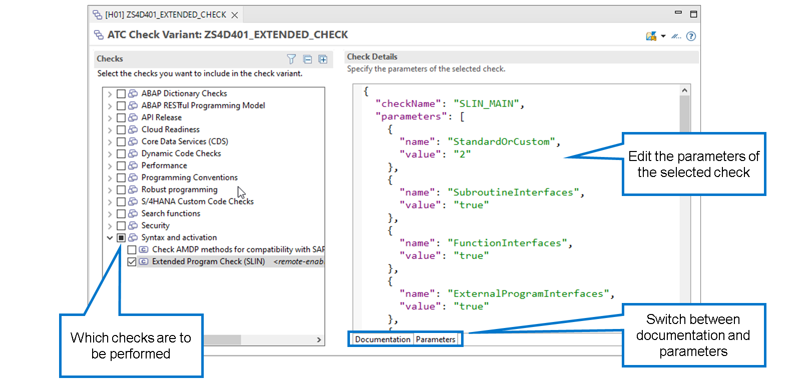
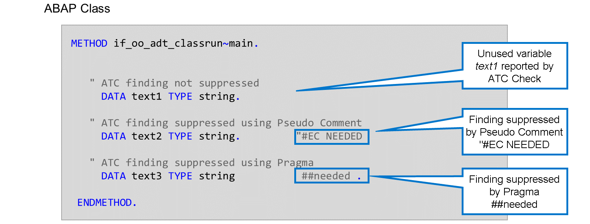

# 🌸 1 [IMPROVING CODE QUALITY USING ABAP TEST COCKPIT](https://learning.sap.com/learning-journeys/acquire-core-abap-skills/improving-code-quality-using-abap-test-cockpit_dd1d868f-a539-49ee-8e49-e57563131058)

> 🌺 Objectifs
>
> - [ ] Créer des variantes de vérification ATC
>
> - [ ] Effectuer des vérifications de code statiques avec ATC

## 🌸 STATIC CODE CHECKS

### SYNTAX CHECK - EXTENDED CHECK - ABAP TEST COCKPIT

### SYNTAX CHECK

Avant d'activer du code ABAP, une vérification de syntaxe est obligatoire. Si vous ne l'effectuez pas manuellement, l'environnement de développement l'effectuera implicitement lors de l'activation.

En cas d'erreurs de syntaxe, l'activation est impossible. À l'origine, la vérification de syntaxe ABAP ne signalait que les erreurs de syntaxe. Aujourd'hui, elle génère également des avertissements de syntaxe.

La principale différence entre les erreurs et les avertissements réside dans le fait que les avertissements n'empêchent pas l'activation. Cependant, il ne faut pas ignorer les avertissements à la légère. Cela peut entraîner de graves problèmes, notamment des problèmes de performances, des incohérences de données, voire des erreurs d'exécution.

### EXTENDED CHECK

Dès les débuts d'ABAP, des vérifications facultatives du code source ont complété les vérifications syntaxiques obligatoires. La vérification étendue n'est pas liée à l'activation et n'a aucune influence sur celle-ci. Les développeurs décident librement s'ils souhaitent invoquer la vérification étendue et comment ils traitent ses résultats.

> #### 🍧 Note
>
> Dans les outils de développement ABAP (ADT), la vérification étendue n'est pas un outil à part entière. Elle est uniquement disponible dans le cockpit de test ABAP.

### ABAP TEST COCKPIT

Lorsque **Extended Check** s'est avéré trop restrictif et peu flexible pour le développement ABAP moderne, il a été remplacé par **ABAP Test Cockpit (ATC)**. **ATC** offre une grande variété de contrôles, allant des contrôles de performance et de sécurité aux contrôles de conformité, en passant par les directives et les conventions de programmation. Afin de proposer également les fonctionnalités d'**Extended Check** dans le nouvel outil de contrôle, celui-ci est intégré à l'**ATC** comme l'un des nombreux contrôles.

## 🌸 ATC CHECK VARIANTS

### ATC CHECK VARIANTS

Chaque exécution d'un contrôle **ATC** est contrôlée par une variante de contrôle **ATC**. Cette variante détermine les contrôles à effectuer et fournit les valeurs de leurs paramètres.

Lors d'une vérification **ATC**, vous pouvez utiliser la variante de vérification globale par défaut de votre système ou spécifier la variante de vérification souhaitée. Il peut s'agir d'une variante de vérification existante ou d'une variante de vérification que vous avez créée vous-même.

D'un point de vue technique, les variantes de vérification **ATC** sont des objets de développement ABAP. Elles appartiennent à des packages de développement et peuvent être transférées vers d'autres systèmes.

## 🌸 HOW TO CREATE AN ATC CHECK VARIANT

[Référence - Link Vidéo](https://learning.sap.com/learning-journeys/acquire-core-abap-skills/improving-code-quality-using-abap-test-cockpit_dd1d868f-a539-49ee-8e49-e57563131058)

## 🌸 HOW TO RUN AN ATC CHECK AND ANALYZE THE RESULT

[Référence - Link Vidéo](https://learning.sap.com/learning-journeys/acquire-core-abap-skills/improving-code-quality-using-abap-test-cockpit_dd1d868f-a539-49ee-8e49-e57563131058)

## 🌸 PSEUDO COMMENTS AND PRAGMAS

### PSEUDO COMMENTS AND PRAGMAS

Toutes les découvertes **ATC** ne sont pas critiques et vous pourriez décider de les ignorer. D'autres pourraient se révéler être de fausses alertes après un examen plus approfondi. Par exemple, l'utilisation dynamique d'une variable, invisible pour la vérification statique du code, en est une.

**ATC** dispose de deux techniques pour supprimer les découvertes :

#### 💮 **Pseudo Comments** :

Vous pouvez supprimer certaines découvertes **ATC** en ajoutant un commentaire spécifique à la fin de la ligne de code source contenant la découverte. Dans l'exemple, le pseudo-commentaire `#EC NEEDED` est utilisé. EC signifie ici `Extended Check`.

Comme tout autre commentaire, un pseudo-commentaire n'est pas visible pour la vérification de syntaxe ABAP ni pour le compilateur ABAP. Nous l'appelons pseudo-commentaire, car il influence la vérification étendue et l'**ATC**.

#### 💮 **Pragmas** :

Vous pouvez supprimer d'autres résultats en ajoutant un mot-clé commençant par `##` à l'instruction ABAP. Ces mots-clés sont appelés **pragmas**. Il est très important que les **pragmas** soient placés à l'intérieur de l'instruction ABAP, et non après. Dans l'exemple, le pragma `##needed` est utilisé et placé avant le point qui termine l'instruction DATA.

> #### 🍧 Note
>
> Les pragmas étant visibles par la vérification syntaxique, ils permettent également de supprimer certains avertissements. Ceci n'est pas possible avec les pseudo-commentaires.

Pour savoir si vous pouvez supprimer un résultat **ATC** donné, consultez les détails du résultat dans la vue **ATC Problems**. Vous y trouverez également des informations sur la technique à utiliser.
