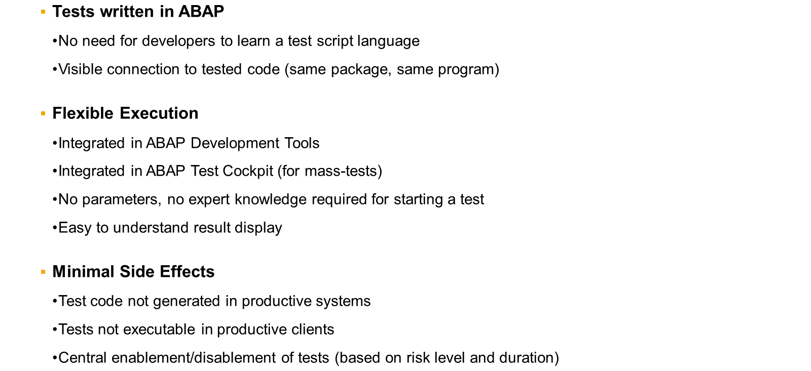
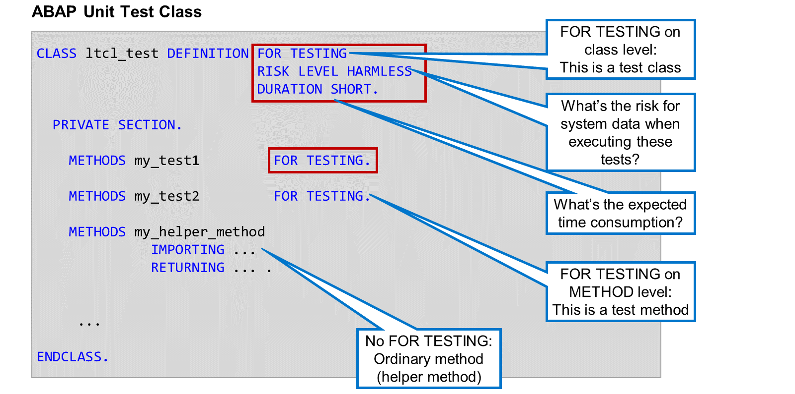
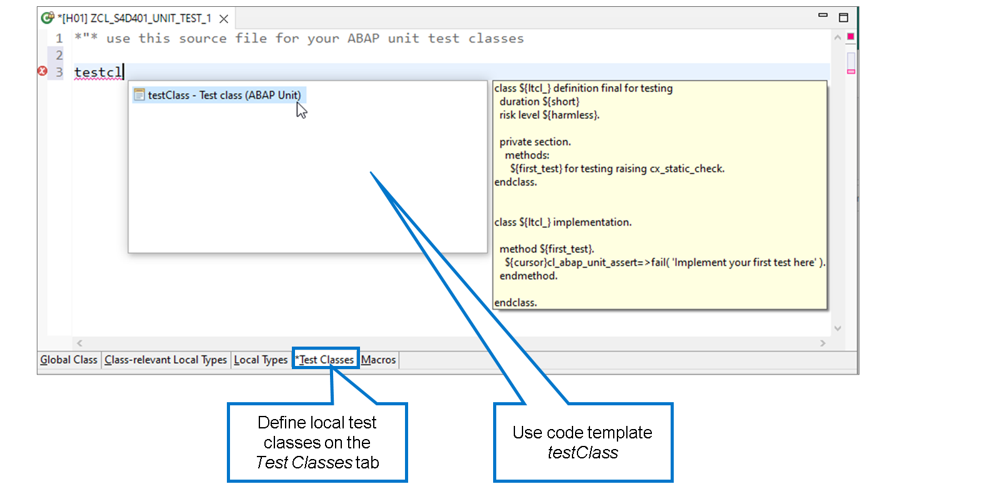
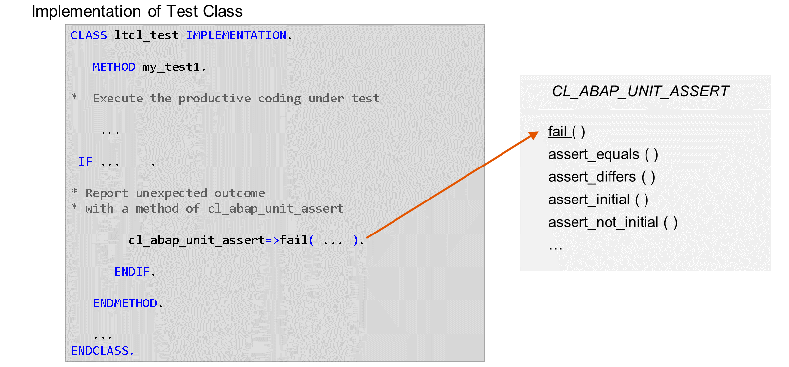
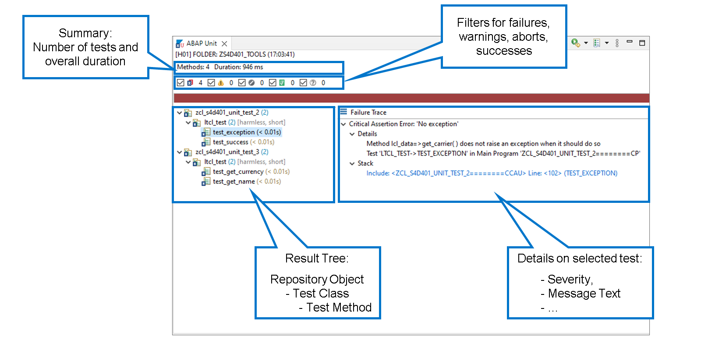
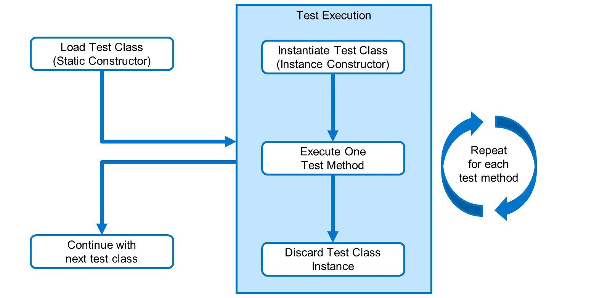
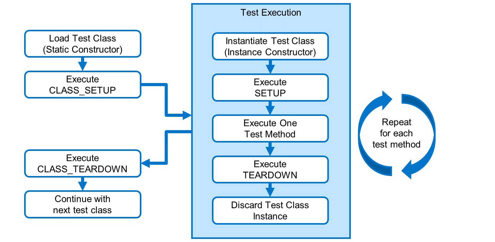
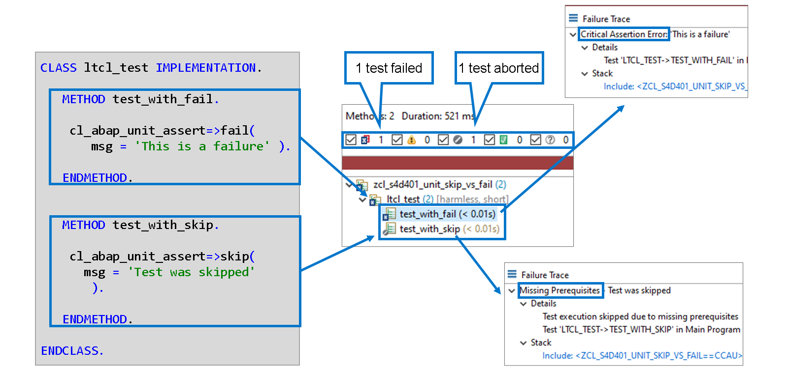

# 🌸 2 [IMPLEMENTING CODE TESTS WITH ABAP UNIT](https://learning.sap.com/learning-journeys/acquire-core-abap-skills/implementing-code-tests-with-abap-unit_b23c7a00-c2e8-406d-8969-b00db3f1fd87)

> 🌺 Objectifs
>
> - [ ] Implémenter une classe de test
>
> - [ ] Exécuter un test unitaire ABAP

## 🌸 ABAP UNIT

### MODULES TESTS

Chaque fois que les programmeurs écrivent ou modifient du code, il existe un risque important d'introduire des erreurs de programmation. Les tests sont donc un élément crucial de tout projet de développement.

En programmation moderne, le code est structuré en classes et méthodes réutilisables. Pour détecter et localiser les erreurs de programmation potentielles, un test approfondi de chaque unité de modularisation est nécessaire.

Prenons un exemple.

[Référence - Link Vidéo](https://learning.sap.com/learning-journeys/acquire-core-abap-skills/implementing-code-tests-with-abap-unit_b23c7a00-c2e8-406d-8969-b00db3f1fd87)

### ABAP UNIT- IMPLEMENT MODULE TESTS IN ABAP

ABAP Unit est une technique permettant d'implémenter des tests de modules avec le langage ABAP. Vous pouvez déclencher l'exécution des tests manuellement pendant le développement, mais aussi automatiquement à plus grande échelle et de manière régulière.

Les tests unitaires ABAP sont implémentés sous forme de méthodes de classes ABAP dédiées. Ces méthodes de test servent de scripts de test permettant d'exécuter le code testé et d'évaluer les résultats.

Continuons notre exemple.

[Référence - Link Vidéo](https://learning.sap.com/learning-journeys/acquire-core-abap-skills/implementing-code-tests-with-abap-unit_b23c7a00-c2e8-406d-8969-b00db3f1fd87)

Il est essentiel qu'une fois les tests en place, vous puissiez les exécuter à tout moment et aussi souvent que vous le souhaitez : avant la livraison initiale, après avoir appliqué des modifications au code de production, ou pour analyser les erreurs lorsqu'un utilisateur signale un problème. De plus, l'exécution des tests ne prend que quelques clics.

### IMPORTANT FEATURES OF ABAP UNIT

## 🌸 UNIT TEST CLASSES

L'ajout `FOR TESTING` dans la définition de classe distingue une classe de test d'une classe ABAP ordinaire. Cet ajout est disponible pour les classes locales et globales.

L'ajout `RISK LEVEL` permet d'attribuer un niveau de risque au test. En l'absence d'ajout, le niveau de risque `CRITICAL` est utilisé par défaut.

Les paramètres centraux au niveau client peuvent interdire l'exécution de tests présentant un certain niveau de risque.

Les valeurs de niveau de risque suivantes sont disponibles :

- `CRITICAL`

  Un test modifie les paramètres système ou les données de personnalisation.

- `DANGEROUS`

  Un test modifie les données persistantes.

- `HARMLESS`

  Un test ne modifie ni les paramètres système ni les données persistantes.

L'ajout `DURATION` spécifie le temps d'exécution prévu. Les paramètres centraux au niveau client permettent de définir des limites supérieures d'exécution pour les trois valeurs.

Les valeurs de durée suivantes sont disponibles :

- `SHORT`

  Un temps d'exécution imperceptible de quelques secondes est attendu.

- `MEDIUM`

  Un temps d'exécution notable d'environ une minute est attendu.

- `LONG`

  Un temps d'exécution très important, supérieur à une minute, est attendu.

Une classe de test peut avoir deux types de méthodes :

#### 💮 **Test Methods** :

Les méthodes de test sont définies avec l'ajout de `FOR TESTING` après leur nom. Chaque méthode de test représente un test. Le framework ABAP Unit effectue ce test en appelant la méthode de test correspondante. Les méthodes de test ne doivent pas avoir de paramètres.

#### 💮 **Helper Methods** :

Les méthodes d'assistance sont des méthodes ordinaires de la classe de test. Elles ne sont pas appelées par le framework ABAP Unit. Vous pouvez utiliser des méthodes d'assistance pour structurer le code de vos méthodes de test ou pour réutiliser la même fonctionnalité dans plusieurs méthodes de test. Les méthodes d'assistance peuvent avoir un nombre illimité de paramètres.

> #### 🍧 Note
>
> Le framework ABAP Unit est capable d'appeler toutes les méthodes de test, même si leur visibilité est définie sur PRIVATE. Il est recommandé de définir les méthodes de test dans la section privée de la classe de test afin de garantir qu'elles ne soient pas appelées directement dans le code.

Une classe de test doit contenir au moins une méthode de test et ne doit avoir aucun paramètre.

Lors de l'exécution des tests d'une classe de test, le framework ABAP Unit appelle tous les tests de cette classe dans un ordre indéterminé.

Si vous souhaitez définir des classes de test locales au sein d'une classe ABAP globale, un emplacement dédié est prévu à cet effet. Alors que les classes locales ordinaires sont définies dans l'onglet **Local Types**, les classes de test locales doivent être définies dans l'onglet **Test Classes**.

Comme illustré dans la figure, pour générer la définition et l'implémentation d'une classe de test locale, ADT propose le modèle de code testClass.

Dans la démonstration « Comment définir et implémenter une classe de test », vous découvrirez comment invoquer ce modèle de code.

## 🌸 UNIT TEST CLASSES

### SERVICE CLASS CL_ABAP_UNIT_ASSERT

En général, la mise en œuvre d'une méthode de test se déroule comme suit :

1. Exécuter le codage productif testé

2. Analyser le résultat

3. Signaler tout résultat inattendu à l'unité ABAP

Pour l'étape 3, le framework ABAP Unit fournit la classe de service globale `CL_ABAP_UNIT_ASSERT`. Les méthodes de test appellent les méthodes statiques de cette classe pour signaler les erreurs et influencer l'exécution des tests (par exemple, ignorer un ou plusieurs tests car les prérequis ne sont pas remplis).

- La méthode `fail()` signale une erreur inconditionnelle. Généralement, l'appel de cette méthode est entouré d'une structure de contrôle telle que `IF … ENDIF`. ou `TRY … ENDTRY` pour garantir qu'elle n'est atteinte que sous certaines conditions.

- Les méthodes commençant par `assert_` vérifient une attente donnée et signalent une erreur si cette attente n'est pas satisfaite.

  - La méthode `assert_equals()`, par exemple, compare le contenu de deux objets de données et signale une erreur s'ils diffèrent.

  - La méthode `assert_differs()` fait de même, mais signale une erreur si les objets de données ont le même contenu.

### PARAMETERS OF METHOD FAIL( )

[Référence - Link Vidéo](https://learning.sap.com/learning-journeys/acquire-core-abap-skills/implementing-code-tests-with-abap-unit_b23c7a00-c2e8-406d-8969-b00db3f1fd87)

### PARAMETERS OF ASSERT-METHODS

Toutes les méthodes d'assertion ont des paramètres d'importation facultatifs `MSG`, `LEVEL` et `QUIT`, qui ont toujours la même signification que dans la méthode `fail()`.

De plus, la plupart des méthodes d'assertion ont un paramètre d'importation `ACT` pour l'objet de données à vérifier.

Les méthodes de comparaison, comme `assert_equals()`, `assert_differs()`, etc., ont également un paramètre `EXP` pour la valeur attendue.

## 🌸 HOW TO DEFINE AND IMPLEMENT A TEST CLASS

[Référence - Link Vidéo](https://learning.sap.com/learning-journeys/acquire-core-abap-skills/implementing-code-tests-with-abap-unit_b23c7a00-c2e8-406d-8969-b00db3f1fd87)

## 🌸 UNIT TEST EXECUTION

Il existe deux manières d'exécuter des tests unitaires ABAP :

- les tests interactifs pendant le développement

- les tests de masse avec ABAP Test Cockpit.

[Référence - Link Vidéo](https://learning.sap.com/learning-journeys/acquire-core-abap-skills/implementing-code-tests-with-abap-unit_b23c7a00-c2e8-406d-8969-b00db3f1fd87)

### ABAP UNIT TEST RESULTS

Dans ADT, le dernier résultat du test unitaire ABAP est affiché dans la vue Unité ABAP.

Le résumé en haut affiche le nombre total de méthodes de test exécutées et la durée totale du test en millisecondes.

Utilisez les cases à cocher du résumé pour filtrer l'affichage des résultats : seuls les tests ayant échoué, les tests avec avertissement, les tests terminés avec succès, etc.

Le résultat s'affiche sous forme d'arborescence, avec les objets du référentiel en haut, par exemple la classe globale. Les nœuds du deuxième niveau représentent les classes de test locales, et les points de terminaison correspondent aux méthodes de test. Les icônes permettent de distinguer les tests réussis des tests échoués, etc.

Un clic gauche sélectionne la méthode de test et affiche les détails à droite. Dans l'exemple, vous pouvez voir la `SEVERITY` (Erreur d'assertion critique pour une gravité moyenne), la valeur du paramètre `MSG` (« Aucune exception ») et la valeur du paramètre `DETAILS` (le texte est développé sous « Détails »).

## 🌸 HOW TO RUN A UNIT TEST AND ANALYZE THE RESULT

[Référence - Link Vidéo](https://learning.sap.com/learning-journeys/acquire-core-abap-skills/implementing-code-tests-with-abap-unit_b23c7a00-c2e8-406d-8969-b00db3f1fd87)

## 🌸 TEST FIXTURES AND PREREQUISITES

### METHOS FOR TEST FIXTURES

Parfois, un test nécessite une configuration spécifique pour fonctionner correctement. Cette configuration est appelée **test fixture**. Une **test fixture** peut être composée de données de test, d'objets de test et de ressources.

Pour créer et supprimer des fixations, vous pouvez implémenter des méthodes supplémentaires dans une classe de test. Ces méthodes ont des noms prédéfinis et sont automatiquement appelées par l'environnement d'exécution ABAP lors de l'exécution du test.

Les méthodes de fixation suivantes existent :

#### 💮 **SETUP** :

Cette méthode d'instance est appelée avant chaque test de la classe de test. Utilisez-la pour les fixations que vous souhaitez recréer pour chaque test.

#### 💮 **TEARDOWN** :

Cette méthode d'instance est appelée après chaque test de la classe de test. Utilisez-la pour annuler les modifications apportées dans la méthode SETUP. L'utilisation de **TEARDOWN** est particulièrement importante si la méthode **SETUP** modifie des données persistantes (configuration système, personnalisation, données de base, etc.).

#### 💮 **CLASS_SETUP** :

Cette méthode statique est exécutée une fois avant le premier test de la classe de test. Utilisez cette méthode uniquement pour les montages chronophages et dont vous êtes certain que les paramètres ne sont pas modifiés par les méthodes de test.

#### 💮 **CLASS_TEARDOWN** :

Cette méthode statique est exécutée une fois après le dernier test de la classe de test. Utilisez-la pour annuler les modifications apportées dans la méthode CLASS_SETUP.

### FLOW LOGIC OF ABAP UNIT TEST

Ce graphique illustre le déroulement du programme `ABAP UNIT` pour une classe de test unique.

- Tout d'abord, la classe de test est chargée en mémoire. Si elle contient un constructeur statique (méthode statique `CLASS_CONSTRUCTOR`), cette méthode est exécutée normalement.

- Ensuite, les tests de cette classe de test sont exécutés. Chaque test commence par la création d'une instance de la classe de test. Si la classe de test contient un constructeur d'instance (méthode `CONSTRUCTOR`), celle-ci est exécutée normalement.

- Ensuite, le framework ABAP Unit appelle la méthode de test.

- Après le test, l'instance est supprimée.

Si la classe de test contient plusieurs méthodes de test, une nouvelle instance est créée pour chaque test.

Après la dernière méthode de test, le traitement de cette classe de test est terminé et le framework continue avec la classe de test suivante, le cas échéant.

### PHASE MODEL OF ABAP UNIT TEST

Ce graphique illustre le modèle de phase des tests unitaires ABAP, c'est-à-dire les moments où le framework appelle les méthodes de fixation.

- `CLASS_SETUP` est appelé une seule fois, après le constructeur statique et avant le premier test.

- `CLASS_TEARDOWN` est appelé avant que le framework ne commence le traitement de la classe de test suivante.

- `SETUP` est appelé après le constructeur d'instance et avant l'exécution du test.

- `TEARDOWN` est appelé avant que le framework ne supprime l'instance de la classe de test.

### REPORTING MISSING PREREQUISITES

Vous avez déjà appris à utiliser les méthodes de la classe de service `CL_ABAP_UNIT_ASSERT` pour signaler les échecs de tests.

Mais que faire en cas de prérequis manquant, par exemple des autorisations manquantes ? Ou si une méthode SETUP rencontre des difficultés lors de la préparation du test ?

C'est précisément pour ces situations que la classe `CL_ABAP_UNIT_ASSERT` contient une méthode `skip()` et plusieurs méthodes commençant par ASSUME\_.

Ces méthodes fonctionnent de manière assez similaire à `fail()` et aux méthodes assert, mais leur apparence est différente dans le résultat du test UNIT. Cela permet de distinguer plus facilement les erreurs de codage testées des erreurs de configuration système ou de conception du test.

Prenons un exemple :

La méthode `test_with_fail( )` appelle la méthode `cl_abap_unit_assert=>fail( )`. Cette méthode est comptabilisée comme un échec et la trace d'échec affiche `Critical Assertion Error` devant le message.

La méthode `test_with_skip( )` appelle la méthode `cl_abap_unit_assert=>skip( )`. Cette méthode est comptabilisée comme un test interrompu et la trace d'échec affiche `Missing Prerequisites` devant le message.

> #### 🍧 Note
>
> Les méthodes skip( ) et assume-methods ne contiennent pas les paramètres QUIT et LEVEL. En l'absence de prérequis, il est inutile de poursuivre le test et nous ne faisons pas de distinction entre les différents niveaux de gravité.
