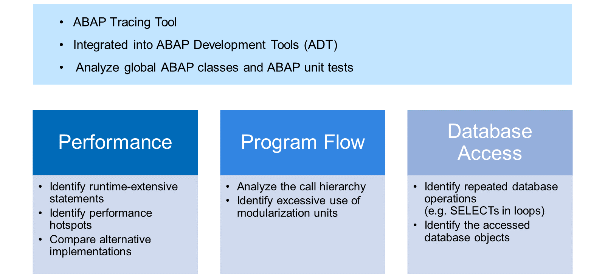
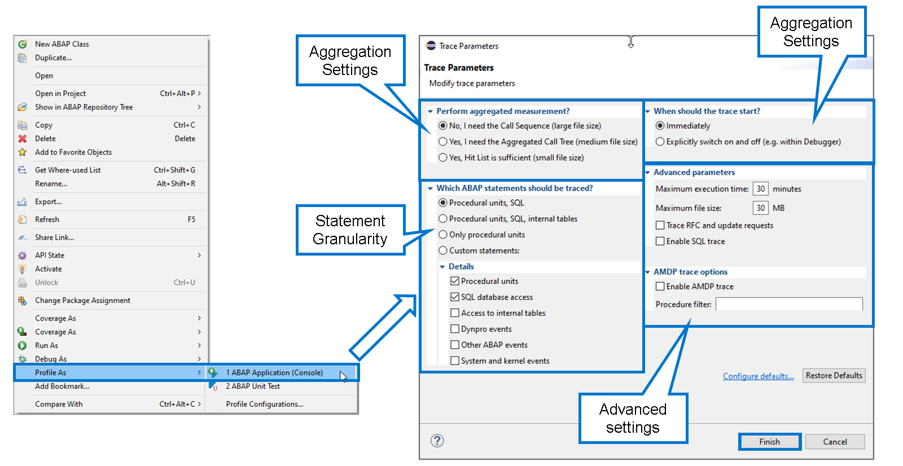
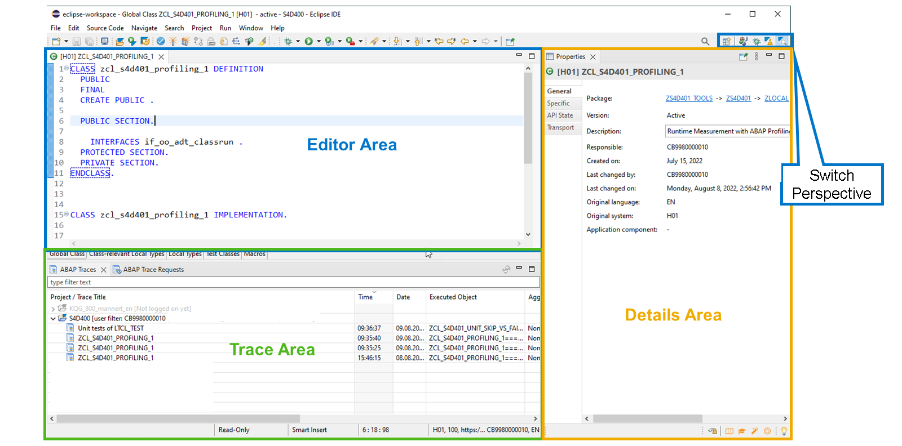
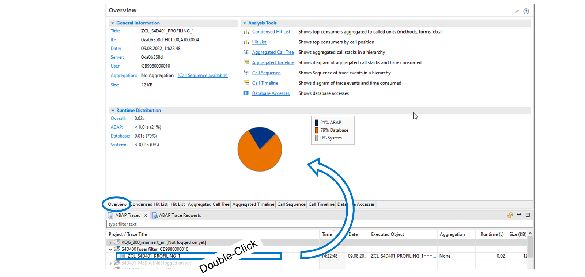
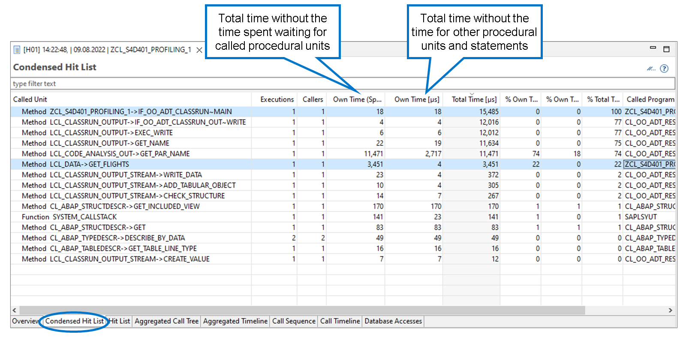
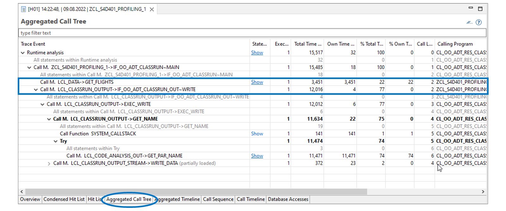
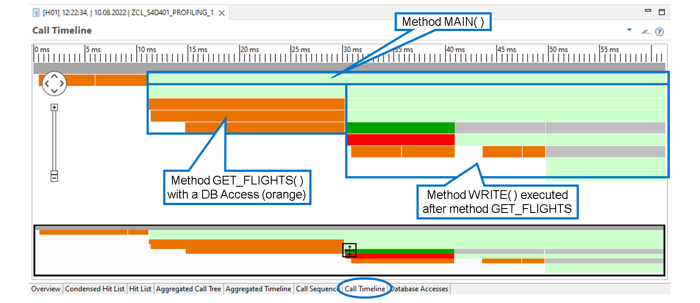
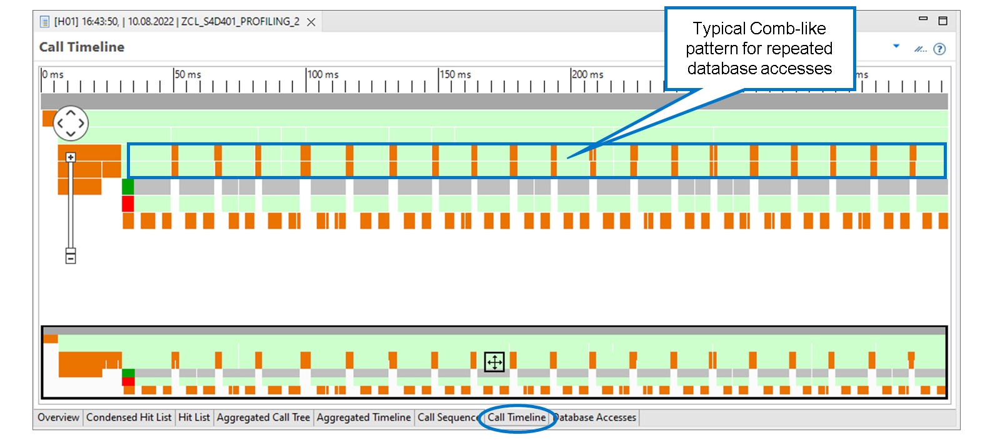
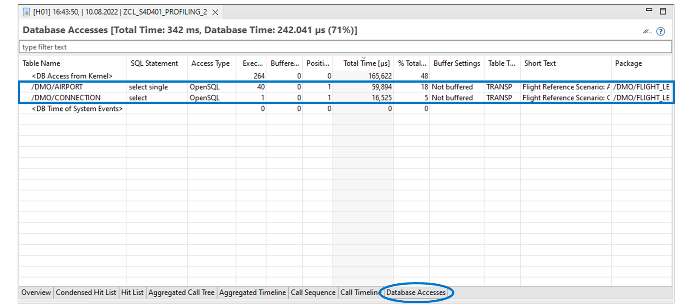

# 🌸 3 [MEASURING RUNTIME CONSUMPTION WITH ABAP PROFILING](link)

> 🌺 Objectifs
>
> - [ ] Profilage d'un programme ABAP
>
> - [ ] Détecter les lectures séquentielles grâce au profilage ABAP

## 🌸 THE ABAP PROFILER TOOL

Le profileur ABAP est un outil de traçage ABAP intégré aux outils de développement ABAP (ADT). Il est disponible pour tout code ABAP exécutable, par exemple les classes globales ou les tests unitaires ABAP.

À partir du traçage ABAP (résultats du profileur ABAP), vous pouvez :

#### 💮 **Analyze the Performance** :

- Identifier les instructions coûteuses en temps d'exécution

- Identifier les points critiques de performance sur lesquels concentrer vos efforts de refactorisation

- Comparer les performances de différentes implémentations pour choisir la conception la plus efficace

#### 💮 **Analyze the Program Flow** :

- Analyser la hiérarchie des appels dans votre application

- Identifier l'utilisation excessive ou inutile des unités de modularisation

#### 💮 **Analyze the Database Access** :

- Identifier les opérations répétées de la base de données, par exemple les instructions SELECT dans les boucles

- Identifier les objets de la base de données (tables et vues) auxquels votre application accède

## 🌸 ABAP PROFILER EXECUTION

Vous pouvez démarrer le profileur ABAP pour un programme ABAP individuel directement depuis l'éditeur de code source ABAP ou depuis l'explorateur de projets. Visionnez la démonstration « Comment profiler un programme ABAP et analyser le résultat » plus loin dans cette leçon pour découvrir comment procéder.

### TRACE PARAMETERS

Les paramètres de trace vous permettent d'influencer la taille et la granularité du résultat de la trace. Comme illustré dans la figure, les paramètres les plus importants sont :

### AGGEGATION SETTINGS

Cette section vous permet de spécifier la manière dont le profileur gère les exécutions répétées, par exemple les appels répétés d'une même méthode. Plus le profileur agrège, moins il nécessite d'espace de stockage pour le résultat de la trace. Certains outils d'analyse ne sont pas disponibles pour les résultats de trace agrégés.

Vous avez le choix entre trois options :

- Aucune agrégation, taille de fichier maximale, tous les outils disponibles ;

- Agrégation partielle (par instruction d'appel), taille de fichier moyenne, séquence d'appels non disponible ;

- Agrégation complète, taille de fichier minimale, arbre d'appels agrégé non disponible ;

### STATEMENT GRANULARITY

Cette section vous permet de spécifier la granularité de la mesure. Vous pouvez choisir parmi trois préréglages courants ou, en choisissant « Instructions personnalisées », saisir votre propre sélection sous « Détails ».

Votre choix influence la taille du fichier et la valeur informative du résultat de la trace.

Les préréglages suivants existent :

- Unités procédurales uniquement : fichier de petite taille, le temps d'exécution de toutes les instructions est attribué à l'unité procédurale environnante (méthode).

- Unités procédurales, SQL : fichier de taille moyenne, le temps d'exécution des accès à la base de données est tracé séparément et n'est pas attribué à l'unité procédurale environnante.

- Unités procédurales, SQL, tables internes : fichier de grande taille, le temps d'exécution des accès à la base de données et des opérations sur les tables internes est tracé séparément et n'est pas attribué à l'unité procédurale environnante.

### START OPTION

Dans cette section, vous pouvez choisir le moment de démarrage du suivi. Vous disposez des options suivantes :

- Immédiatement : l'exécution complète du programme est suivie.

- Activation et désactivation explicites : l'exécution du programme démarre avec le suivi désactivé. Lorsque le programme atteint un point d'arrêt, vous pouvez sélectionner « Activer/Désactiver le suivi ABAP » dans le menu contextuel du point d'arrêt.

## 🌸 THE ABAP PROFILING PERSPECTIVE

Le profilage d'un programme ABAP s'effectue idéalement dans la perspective du profilage ABAP. Visionnez la démonstration « Comment profiler un programme ABAP et analyser le résultat » plus loin dans cette leçon pour découvrir comment procéder.

Dans sa configuration standard, la perspective Profilage se compose de trois parties :

#### 💮 **Editor Area** :

La zone d'édition est identique à celle des perspectives ABAP et Débogueur. Lorsque vous ouvrez un résultat de trace, il s'affiche dans cette zone, dans un nouvel onglet.

#### 💮 **Trace Area** :

Par défaut, cette zone comprend les vues suivantes :

La vue Traces ABAP affiche les résultats de la trace, organisés par projet et filtrés par utilisateur.

La vue Requêtes de trace ABAP vous permet de gérer vos requêtes et d'en créer de nouvelles.

#### 💮 **Details Area** :

Par défaut, cette zone contient la vue Propriétés. Si, dans la zone Éditeur, le focus est placé sur un objet du référentiel, la vue Propriétés affiche ses métadonnées.

Lors de l'analyse d'un résultat de trace, la vue Propriétés permet d'afficher les propriétés d'une mesure d'exécution.

### THE TRACE OVERVIEW

Lorsque vous double-cliquez sur une entrée dans la vue Traces ABAP, le résultat de la trace ABAP s'ouvre dans un nouvel onglet dans la zone de l'éditeur.

Par défaut, l'onglet Aperçu est sélectionné. Il constitue le point de départ d'une analyse plus approfondie. L'aperçu des traces comprend les éléments suivants :

#### 💮 **General Information** :

Dans la section Informations générales, vous trouverez des informations administratives sur ce résultat de trace :

Quand la trace a-t-elle été créée ? Qui l'a créée ? Avec quels paramètres d'agrégation ? Et ainsi de suite.

#### 💮 **Runtime Distribution** :

La distribution du temps d'exécution vous fournit des informations sur la répartition du temps d'exécution tracé entre les composants ABAP suivants :

- ABAP : temps d'exécution consacré au traitement du code ABAP, hors programmes système ABAP.

- Dababase : temps d'exécution passé dans la base de données, à effectuer des opérations.

- Système : temps d'exécution consacré au traitement du code ABAP dans les programmes système.

#### 💮 **Analysis Tools** :

Cette section décrit brièvement les outils d'analyse intégrés à l'affichage des résultats de trace. Choisissez l'un des liens pour accéder à l'outil correspondant. Vous pouvez également naviguer via les onglets situés sous l'affichage **Overview**.

## 🌸 ABAP TRACE ANALYSIS TOOLS

### THE CONDENSED HIT LIST

La **Condensed Hit List** vous permet de trouver les unités procédurales les plus coûteuses, par exemple les méthodes.

Cette liste affiche les mesures d'exécution des événements de trace. Elle est dite condensée car elle se limite aux unités procédurales. Les accès à la base de données et autres événements de trace ne sont pas répertoriés ici.

> #### 🍧 Hint
>
> Si vous souhaitez consulter tous les événements de trace, consultez plutôt la liste des résultats.

La liste affiche les données sous forme agrégée. Chaque unité procédurale n'apparaît qu'une seule fois, quels que soient son nombre d'appels et le nombre d'emplacements différents. Les colonnes **Executions** et **Callers** affichent le nombre total d'exécutions et le nombre d'appels directs distincts pour cette unité.

La colonne **Total Time** affiche le temps d'exécution en microsecondes entre le début et la fin de l'appel. Si l'unité a été appelée plusieurs fois, la colonne affiche la somme des appels individuels. **Total Time** vous permet de visualiser la contribution totale des appels de procédure. Dans l'exemple, le programme a passé un total de `15 485 µs` à exécuter la méthode `MAIN()` et un total de `3 451 µs` à exécuter la méthode `GET_FLIGHTS()`.

La colonne **Own Time** (instructions ABAP spécifiées et non spécifiées) affiche le temps d'exécution en microsecondes, sans compter le temps d'attente des autres unités procédurales. Examinons de plus près la méthode `MAIN( )`. Bien que la durée totale soit de `15 485 µs`, la valeur de cette colonne n'est que de `18 µs`. Cela signifie que la méthode n'a pratiquement pas effectué de traitement, mais a passé la majeure partie de son temps à attendre les méthodes qu'elle a appelées.

La colonne **Own Time** (instructions ABAP spécifiées et non spécifiées) affiche le temps d'exécution en microsecondes, sans compter le temps d'attente, non seulement pour les unités procédurales appelées, mais aussi pour les instructions ABAP spécifiées dans les paramètres de trace. Dans l'exemple, la méthode `GT_FLIGHTS( )` n'appelle aucune autre méthode. Par conséquent, la valeur de **Own Time** (instructions ABAP spécifiées et non spécifiées) est identique à la durée totale. Cependant, la valeur de **Own Time** (instructions ABAP spécifiées et non spécifiées) n'est que de `4 µs`, car la méthode a passé la quasi-totalité de son temps à attendre un accès à la base de données.

### THE AGGREGATED CALL TREE

L'arbre d'appels agrégé vous permet d'analyser la séquence d'appel des unités procédurales.

Si l'appel d'une procédure est répété (par exemple, dans une boucle), il n'apparaît qu'une seule fois dans l'arbre d'appels agrégé. Le nombre dans la colonne Exécutions indique le nombre de répétitions.

> #### 🍧 Hint
>
> Si vous souhaitez un affichage non agrégé, reportez-vous plutôt à la section Séquence d'appels.

Dans l'exemple, la méthode `GET_FLIGHTS( )` a été appelée par la méthode `MAIN( )`, mais n'a appelé aucune autre unité procédurale. La méthode `WRITE( )` a également été appelée par la méthode `MAIN( )`, et a appelé la méthode `EXEC_WRITE( )`, qui a à son tour appelé la méthode `GET_NAME( )`, et ainsi de suite.

## 🌸 HOW TO PROFILE AN ABAP PROGRAM AND ANALYZE THE RESULT

[Référence - Link Vidéo](https://learning.sap.com/learning-journeys/acquire-core-abap-skills/measuring-runtime-consumption-with-abap-profiling_fc6058d7-e6bd-49b2-9c85-89f714176758)

## 🌸 TIMELINE TOOLS

### THE AGGREGATED TIMELINE

La chronologie des appels vous permet de visualiser la séquence d'appel et le temps consommé sous forme de diagramme.

Le diagramme se compose de deux parties : un aperçu de la trace complète en bas et un détail agrandi en haut. Une barre d'outils à gauche permet de zoomer et de déplacer le curseur.

La règle au-dessus du diagramme des détails indique le temps de gauche à droite. Chaque barre illustre un événement de trace avec son heure de début et de fin. Plus une barre est large, plus le temps consacré à cet événement est important.

Cliquez sur une barre pour afficher ses détails dans la section Détails de la perspective Profilage. Vous pouvez ainsi identifier l'événement de trace représenté par une barre.

Le diagramme utilise des couleurs pour distinguer les différents types d'événements de trace : gris (différentes nuances) pour les programmes système, vert (différentes nuances) pour les unités procédurales, orange pour l'accès à la base de données, etc.

> #### 🍧 Hint
>
> Ouvrez le menu contextuel n'importe où sur le diagramme pour afficher ou masquer la légende des couleurs. Dans notre exemple, nous avons masqué la légende pour simplifier le graphique.

Prenons un exemple :

#### 💮 **First row** :

La longue barre grise tout en haut représente l'analyse d'exécution.

#### 💮 **Second Row** :

Sur la deuxième ligne, nous voyons que l'analyse d'exécution effectue deux accès préparatoires à la base de données avant d'appeler la méthode `MAIN( )` de l'application.

#### 💮 **Third Row** :

Sur la troisième ligne, nous voyons que la méthode `MAIN( )` appelle deux méthodes : `GET_FLIGHTS( )` et `WRITE( )`.

#### 💮 **Fourth Row** :

La quatrième ligne révèle la structure des méthodes `GET_FLIGHTS( )` et `WRITE( )`. Nous pouvons voir que `GET_FLIGHTS( )` n'appelle aucune unité procédurale (pas de vert sous la barre représentant cette méthode), mais effectue un seul accès à la base de données (une barre orange). La méthode `WRITE()`, quant à elle, n'a d'autre fonction que d'appeler une autre méthode. Cette méthode est représentée par la barre verte située sous celle de la méthode `WRITE`.

### REPEATED DATABASE ACCESSES IN THE CALL TIMELINE

L'affichage graphique dans la chronologie des appels est un très bon moyen d'identifier les accès répétés à la base de données.

Prenons un exemple : le motif régulier en peigne des quatrième et cinquième lignes suggère une itération. La couleur orange indique clairement qu'il ne s'agit pas uniquement de codage ABAP, mais d'un accès répété à la base de données.

### DATABASE ACCESSES

L'outil Accès à la base de données vous permet de trouver les objets consultés et d'identifier les principaux utilisateurs parmi les accès. Il permet également d'identifier les sélections répétées dans la même table.

L'outil Accès à la base de données affiche uniquement les événements de trace liés à la base de données. Pour les accès répétés, le temps d'exécution est agrégé. Le nombre d'exécutions est indiqué dans la colonne « Exécutions ».

Dans l'exemple, deux tables ont été accédées : `/DMO/AIRPORT` et `/DMO/CONNECTION`. L'instruction `SELECT` lisant les données de `/DMO/CONNECTION` a pris `16 525 µs`, soit 5 % du temps d'exécution total, et les 40 exécutions d'une instruction `SELECT SINGLE` lisant les données de `/DMO/AIRPORT` ont consommé `59 894 µs`, soit 18 % du temps d'exécution total.

## 🌸 HOW TO DETEXT SEQUENTIAL SELECTS USING ABAP PROFILING

[Référence - Link Vidéo](https://learning.sap.com/learning-journeys/acquire-core-abap-skills/measuring-runtime-consumption-with-abap-profiling_fc6058d7-e6bd-49b2-9c85-89f714176758)
