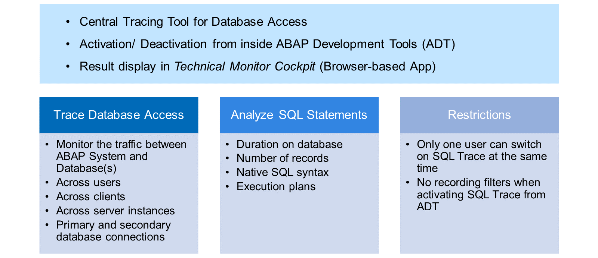

# 🌸 4 [ANALYZING DATABASE ACCESS WITH SQL TRACE](https://learning.sap.com/learning-journeys/acquire-core-abap-skills/analyzing-database-access-with-sql-trace_bb8cab9a-aacc-435f-9dfd-c9da376cec34)

> 🌺 Objectifs
>
> - [ ] Démarrer la trace SQL
>
> - [ ] Analyser les résultats de la trace SQL

## 🌸 THE SQL TRACE

La trace SQL permet de surveiller de manière centralisée l'ensemble du trafic entre le système ABAP et la base de données. Vous pouvez activer et désactiver la trace depuis les outils de développement ABAP. Cependant, pour analyser les résultats de la trace, vous devez démarrer Technical Monitor Cockpit, une application basée sur un navigateur.

La trace SQL ne se limite pas à un seul utilisateur, client ou serveur. Si plusieurs bases de données sont connectées au système, elle trace le trafic de toutes ces bases de données.

Dans le résultat de la trace, vous pouvez afficher des informations sur chaque instruction SQL, comme le temps passé sur la base de données ou le nombre d'enregistrements consultés. Vous pouvez également analyser la syntaxe SQL native, c'est-à-dire l'instruction telle qu'elle est parvenue à la base de données.

L'utilisation de la trace SQL est soumise à certaines restrictions. Un seul utilisateur peut activer la trace à la fois. De plus, l'activation de la trace depuis les outils de développement ABAP ne permet pas d'ajouter de filtres d'enregistrement.

## 🌸 SQL TRACE RESULTS

[Référence - Link Vidéo](https://learning.sap.com/learning-journeys/acquire-core-abap-skills/analyzing-database-access-with-sql-trace_bb8cab9a-aacc-435f-9dfd-c9da376cec34)
