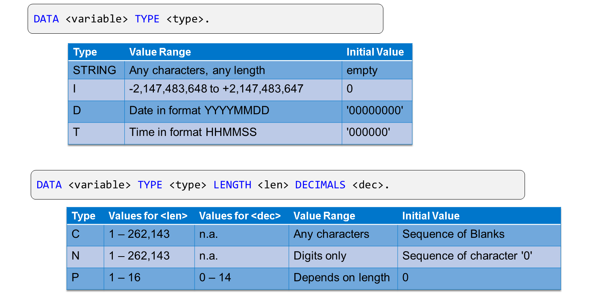
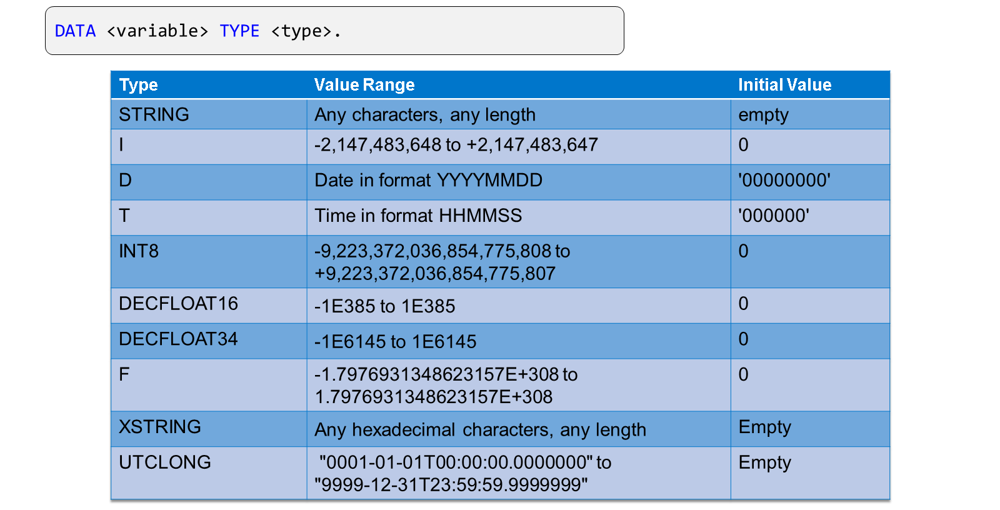
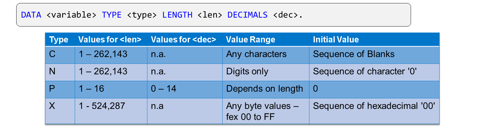
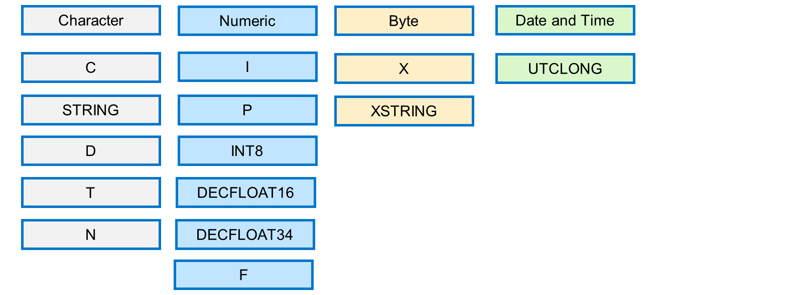

# 🌸 1 [CLASSIFYING TECHNICAL DATA TYPES IN ABAP](https://learning.sap.com/learning-journeys/acquire-core-abap-skills/classifying-technical-data-types-in-abap_ed59d255-3bb4-478c-b245-a1403d4252db)

> 🌺 Objectifs
>
> - [ ] Vous serez capable de classer les types de données techniques en ABAP

## 🌸 DATA TYPES IN ABAP

### RECAP - SOME PREDEFINED ABAP TYPES

Récapitulons rapidement les types ABAP prédéfinis que vous avez découverts plus tôt dans votre parcours d'apprentissage. Nous examinerons également d'autres types de données complètes et incomplètes.

La figure ci-dessus présente les types de données que vous avez découverts lors de votre précédent parcours d'apprentissage. Les types `STRING`, `I`, `D` et `T` sont dits **complete**, car leur longueur est indéterminée. Les types `C`, `N` et `P` sont dits **incomplete**. Lorsque vous déclarez une variable de l'un de ces types, vous devez spécifier sa longueur et, pour le type `P`, le nombre de décimales.

Outre les quatre types de données **complete** que vous connaissez déjà (`STRING`, `I`, `D` et `T`), il en existe six autres :

- `INT8` - Entier de 8 octets

- `DECFLOAT16` - Nombre décimal à virgule flottante de 16 chiffres

- `DECFLOAT34` - Nombre décimal à virgule flottante de 34 chiffres

- `F` - Nombre binaire à virgule flottante

- `XSTRING` - Séquence d'octets de n'importe quelle longueur

- `UTCLONG` - Horodatage

Outre les types `C`, `N` et `P`, ABAP dispose également d'un type `X` intégré pour les séquences d'octets. Ce type `X` est incomplet, ce qui signifie que vous devez spécifier une longueur lors de la déclaration de variables utilisant ce type.

### CLASSIFICATION OF DATA TYPES

Outre la distinction entre les types de données **complete** et **incomplete**, nous pouvons classer les types de données ABAP intégrés comme étant de type caractère, numérique, octet et date et heure. Cette distinction est importante, car certaines opérations ne sont autorisées que pour les champs de type caractère, et d'autres uniquement pour les champs numériques. Il est impossible de combiner des champs de type caractère et octet dans une même opération.

Lors du choix des types numériques, utilisez le type `I` pour les nombres entiers et le type `P` pour les nombres avec décimales. Vous pouvez utiliser le type `INT8` si la plage du type `I` est trop petite. De même, utilisez l'un des types `DECFLOAT` si la plage ou la précision du type `P` est insuffisante. Un nombre condensé peut comporter jusqu'à 14 décimales. Les types de données `DECFLOAT`, en particulier `DECFLOAT34`, offrent une précision nettement supérieure.

Le type `F` est destiné aux nombres binaires à virgule flottante. Des erreurs d'arrondi pouvant survenir lors de la conversion des nombres binaires au système décimal, évitez d'utiliser le type `F` pour vos calculs dans vos programmes. Cependant, les nombres à virgule flottante sont particulièrement importants lors de la lecture de données de la base de données avec SQL.

Pour les champs de date et d'heure, vous pouvez utiliser les types `D` et `T`. Le type `D` utilise le format `AAAAMMJJ` et le type `T` le format `HHMMSS`. Le type `T` est précis à la seconde près ; pour une précision supérieure, utilisez le type `UTCLONG`. Il s'agit d'un horodatage comprenant à la fois la date et l'heure et précis à 100 nanosecondes.
