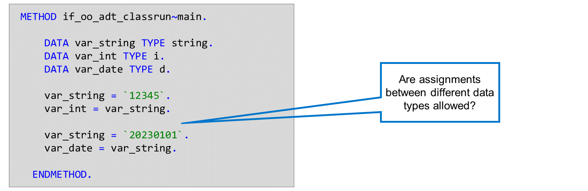
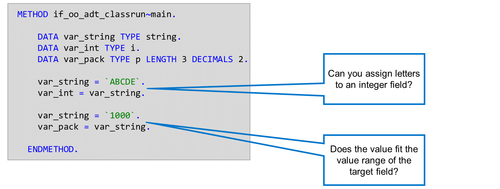
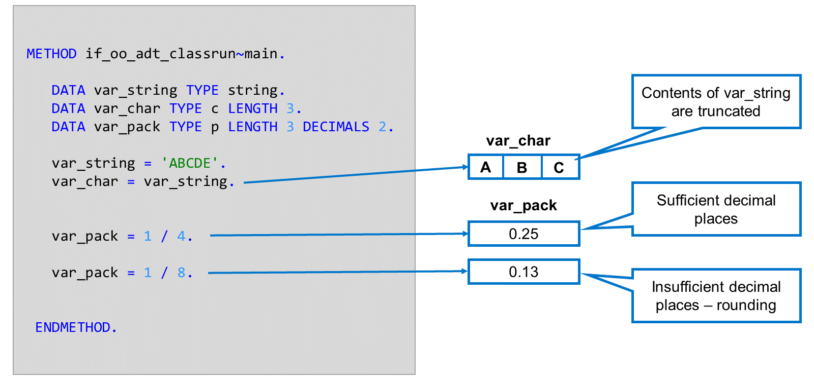
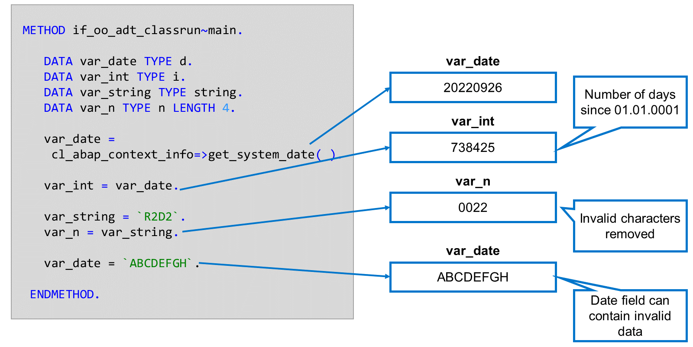
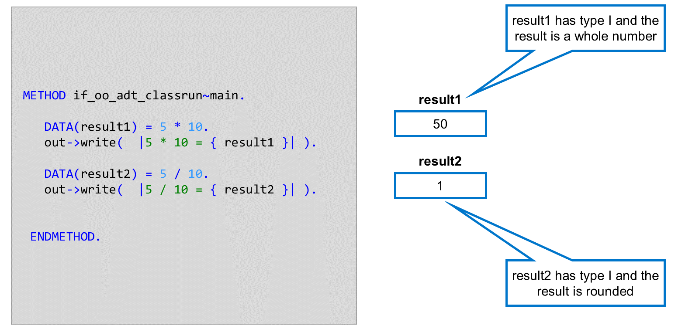

# 🌸 2 [AVOIDING THE PITFALLS OF TYPE CONVERSIONS](https://learning.sap.com/learning-journeys/acquire-core-abap-skills/avoiding-the-pitfalls-of-type-conversions_e1feca3f-d704-4cd4-aa4e-3072af1659c6)

> 🌺 Objectifs
>
> - [ ] Vous pourrez éviter les pièges des conversions de types

## 🌸 SUCCESSFUL ASSIGNMENTS

En ABAP, vous pouvez effectuer des affectations de valeurs entre des variables de différents types de données. ABAP tente alors de convertir la valeur du champ source dans le type du champ cible. La réussite de la conversion dépend de la compatibilité de la valeur du champ source avec le type de données du champ cible.

Dans le premier exemple, nous tentons d'affecter la valeur d'une chaîne à un champ entier. La valeur de la chaîne 12345 étant un entier valide, l'affectation est réussie. La deuxième affectation est également réussie.

## 🌸 UNSUCCESSFUL ASSIGNMENTS

Les conversions de type lors des affectations de valeurs ne sont pas toujours réussies. Il arrive que la valeur source soit incompatible avec le type du champ cible. Les deux affectations présentées ici génèrent des exceptions qui, si elles ne sont pas détectées, peuvent entraîner des erreurs d'exécution.

Lorsque nous essayons d'affecter la valeur `ABCDE` à un champ entier, le système détecte que le contenu de la chaîne ne peut pas être représenté par un nombre et déclenche l'exception `CX_SY_CONVERSION_NO_NUMBER`. Dans le deuxième exemple, nous essayons d'affecter la valeur `1000` à un nombre condensé de longueur 3 et 2 décimales. La variable comporte donc 5 chiffres, dont deux décimales, et sa valeur maximale est donc `999,99`. L'affectation provoque donc un dépassement de capacité arithmétique et le système renvoie l'exception `CX_SY_CONVERSION_OVERFLOW`.

### TRUNCATION AND ROUNDING

Certaines affectations entraînent une perte de données ou de précision. Par exemple, si vous affectez la valeur d'un champ de caractères à un champ plus court, la valeur sera tronquée. Dans cet exemple, nous avons tenté d'affecter 5 caractères à un champ de caractères de longueur 3. Dans ce cas, les quatrième et cinquième caractères sont perdus.

Si vous attribuez une valeur à un champ numérique et que le nombre de décimales du champ cible est insuffisant, le système utilisera l'arrondi arithmétique. Dans les deux exemples ci-dessus, un quart peut être représenté avec précision par `0,25`, mais un huitième (`0,125`) est arrondi à `0,13`.

## 🌸 UNEXPECTED RESULTS OF ASSIGNMENTS

Le résultat d'une affectation entre deux types de données différents peut parfois paraître inattendu. Par exemple, si vous affectez un champ de date à un champ d'entier, la valeur correspond au nombre de jours écoulés depuis le `01.01.0001`. De même, si vous affectez un champ d'heure à un entier, le résultat correspond au nombre de secondes écoulées depuis minuit.

Si vous affectez un champ de type caractère ou une chaîne à une variable de type `N`, le système ignore tous les caractères autres que des chiffres, harmonise les chiffres restants à droite et remplit les espaces restants avec des zéros non significatifs.

Un champ de date est, d'un point de vue technique, un champ de type caractère. Vous pouvez donc affecter des valeurs à des champs de date dans ABAP qui ne correspondent pas à une date valide (notez que cela ne se produit pas lorsque l'utilisateur saisit des dates via l'interface utilisateur, car la couche d'interface utilisateur valide la date).

### PITFALLS OF LINLINE DECLARATIONS

Lorsque vous utilisez des déclarations en ligne dans des expressions arithmétiques, le système dérive le type de la nouvelle variable du côté droit de l'expression. Les littéraux numériques 5 et 10 étant des entiers, les variables `result1` et `result2` sont également créées comme des entiers. Bien que le résultat de la multiplication soit correct, celui de la division est arrondi à 1.

## 🌸 CONVERSIONS OF FORCED TYPE

[Référence - Link Vidéo](https://learning.sap.com/learning-journeys/acquire-core-abap-skills/avoiding-the-pitfalls-of-type-conversions_e1feca3f-d704-4cd4-aa4e-3072af1659c6)

## 🌸 PREVENTION OF TRUNCATION AND ROUNDING

[Référence - Link Vidéo](https://learning.sap.com/learning-journeys/acquire-core-abap-skills/avoiding-the-pitfalls-of-type-conversions_e1feca3f-d704-4cd4-aa4e-3072af1659c6)
