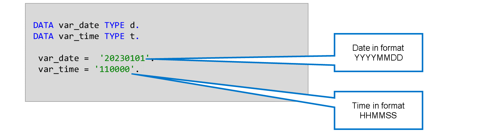
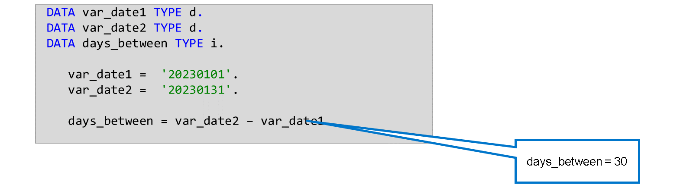
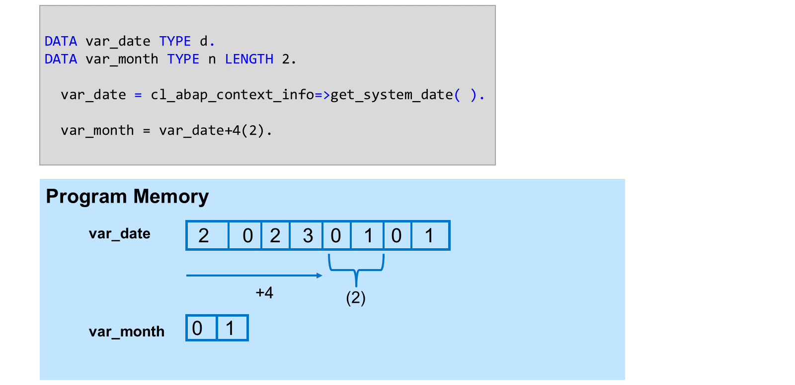

# 🌸 3 [CALCULATING WITH DATE TIMES TIMESTAMPS](https://learning.sap.com/learning-journeys/acquire-core-abap-skills/calculating-with-dates-times-and-timestamps_a393cf01-946e-487b-a690-0aab8fc49a39)

> 🌺 Objectifs
>
> - [ ] Vous pourrez calculer avec des dates, des heures et des horodatages

## 🌸 CALCULATIONS WITH DATES TIMES AND TIMESTAMPS

Les types ABAP intégrés `D` et `T` permettent de représenter respectivement un jour et une heure. Les dates sont toujours au format `AAAAMMJJ`, quel que soit le format de sortie de l'utilisateur. Les heures sont toujours au format `HHMMSS` au format 24 heures, quel que soit le format de sortie de l'utilisateur. La précision horaire est d'une seconde.

### SYSTEM INFORMATION FOR TIME AND DATE

La classe `cl_abap_context_info` fournit des méthodes permettant de connaître l'heure et la date actuelles.

Regardez la vidéo suivante pour en savoir plus.

[Référence - Link Vidéo](https://learning.sap.com/learning-journeys/acquire-core-abap-skills/calculating-with-dates-times-and-timestamps_a393cf01-946e-487b-a690-0aab8fc49a39)

### DATE TIME CALCULATIONS

En ABAP, vous pouvez effectuer des calculs de date directs, comme calculer la différence entre deux dates ou additionner et soustraire un nombre de jours à une date donnée. Pour effectuer ces calculs, ABAP convertit les dates en un entier (le nombre de jours écoulés depuis le `01.01.0001`) et additionne ou soustrait les valeurs correspondantes. Pour les calculs de temps, ABAP convertit le temps en nombre de secondes écoulées depuis minuit.

### USING OFFSET AND LENGTH WITH DATE FIELDS

ABAP stocke les dates au format `AAAAMMJJ`. Vous pouvez accéder à chaque composant de la date grâce à l'offset et à la longueur. Pour accéder au mois, par exemple, vous avez besoin des cinquième et sixième caractères du champ de date. Pour cela, spécifiez `var_date+4(2)`, qui indique au système d'entrer quatre caractères dans la date, puis les deux suivants. L'accès à l'année, au mois et au jour se fait alors comme suit :

- Année : var_date(4)

- Mois : var_date+4(2)

- Jour : var_date +6(2)

### USING TIMESTAMP FIELDS

Outre le type `D`, ABAP intègre le type de données `utclong`, qui représente un horodatage selon la norme **ISO-8601**. Ce type de données a une précision de 100 nanosecondes et suit le format `AAAA-MM-JJTHH:MM:SS.sssssssZ`, où `T` est le séparateur entre la date et l'heure, et `Z` désigne le fuseau horaire `Zulu` (`UTC`).

Regardez la vidéo suivante pour en savoir plus sur l'utilisation des champs d'horodatage.

[Référence - Link Vidéo](https://learning.sap.com/learning-journeys/acquire-core-abap-skills/calculating-with-dates-times-and-timestamps_a393cf01-946e-487b-a690-0aab8fc49a39)
