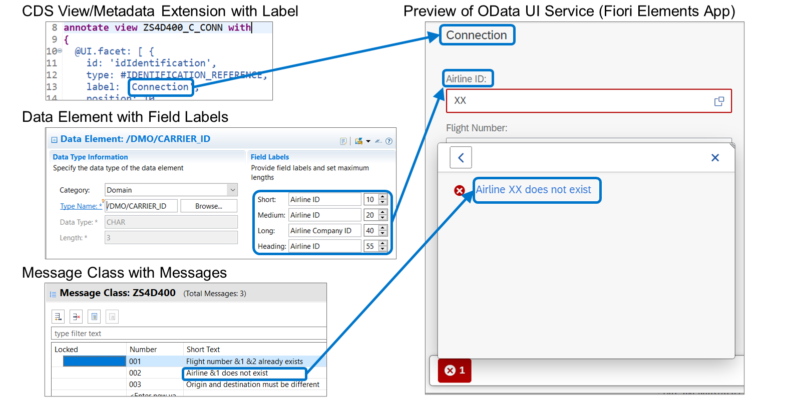
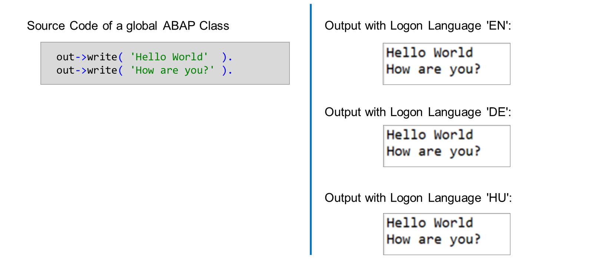
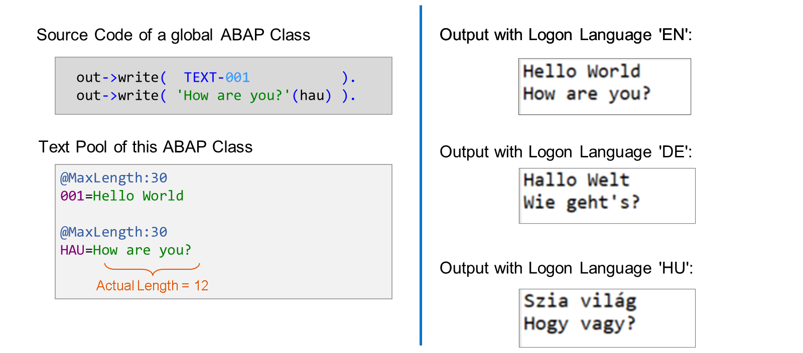

# 🌸 1 [USING TRANSLATABLE TEXT IN ABAP](https://learning.sap.com/learning-journeys/acquire-core-abap-skills/using-translatable-text-in-abap_c1dbd8fe-2280-48df-878d-d407fca9aed8)

> 🌺 Objectifs
>
> - [ ] Décrire le processus de traduction des développements ABAP
>
> - [ ] Utiliser des éléments de texte pour rendre les développements traduisibles

## 🌸 TRANSLATION OF ABAP DEVELOPMENTS

Certains objets de développement ABAP contiennent du texte pouvant être affiché sur l'interface utilisateur (IU) d'une application. Dans le modèle de programmation d'applications ABAP RESTful, par exemple, les textes suivants apparaissent sur l'IU :

- Étiquettes et en-têtes issus des annotations des définitions de données et des extensions de métadonnées

- Étiquettes issues des éléments de données

- Messages issus des classes de messages

Ces textes doivent être différents pour les utilisateurs finaux qui démarrent l'application avec différentes langues de connexion.

> #### 🍧 Note
>
> Dans les outils de développement ABAP, la langue d'origine d'un objet de développement est disponible dans l'onglet Propriétés, sous la vue Éditeur.

Bien entendu, on ne peut pas s'attendre à ce que le développeur fournisse les textes dans toutes les langues. Regardez cette vidéo pour découvrir comment le développement ABAP gère les différents langages.

[Référence - Link Vidéo](https://learning.sap.com/learning-journeys/acquire-core-abap-skills/using-translatable-text-in-abap_c1dbd8fe-2280-48df-878d-d407fca9aed8)

## 🌸 TEXT POOLS AND TEXT ELEMENTS

Comme indiqué précédemment, les textes dépendant de la langue dans les éléments de données, les définitions de données, les extensions de métadonnées, les classes de messages, etc., sont traduisibles par défaut. Mais qu'en est-il des textes du code source ABAP ? Sont-ils également traduisibles par défaut ?

La réponse est non, les littéraux ne sont pas traduisibles ! Leur contenu est toujours le même, quelle que soit la langue de connexion de l'utilisateur.

Si les littéraux contiennent du texte dépendant de la langue et si ce texte atteint l'interface utilisateur, vous devez à un moment donné remplacer les littéraux par des symboles de texte.

### TEXT SYMBOLS

Les symboles textuels, parfois appelés éléments de texte, sont stockés dans le pool de texte des classes ABAP globales.

Un symbole textuel est identifié par un identifiant à trois caractères, unique au sein du pool. L'identifiant d'un symbole textuel est composé de chiffres, de lettres ou d'une combinaison des deux. Les identifiants des symboles textuels ne sont pas sensibles à la casse. Dans l'éditeur de pool de texte, ils sont toujours affichés en majuscules.

Dans notre exemple, le pool de texte contient un symbole de texte 001 et un symbole de texte HAU.

> #### 🍧 Note
>
> Ne confondez pas les identifiants de texte et les identifiants de message. Pour les messages des classes de messages, seuls les chiffres sont autorisés.

Chaque symbole de texte définit un texte dans la langue d'origine de la classe ABAP. La limite technique de longueur du texte est de 255 caractères. Outre cette limite technique, une longueur sémantique maximale doit être définie pour chaque symbole de texte. Cette longueur maximale doit être comprise entre la longueur réelle et la limite technique.

Dans notre exemple, le symbole de texte HAU a une longueur réelle de 12 caractères et une longueur maximale de 30 caractères.

> #### 🍧 Caution
>
> La longueur maximale définit une limite stricte pour le traducteur. Elle doit être nettement supérieure à la longueur réelle afin d'éviter l'utilisation d'abréviations complexes dans les éléments de texte traduits.

Il existe deux façons d'accéder à un symbole textuel dans ABAP :

- Autonome, c'est-à-dire avec du texte suivi d'un trait d'union (hyphen) et de l'identifiant du texte.

- Attaché à un littéral textuel, c'est-à-dire avec l'identifiant entre parenthèses immédiatement après le littéral textuel.

Dans la deuxième variante, le littéral textuel est utilisé comme solution de secours. Si le symbole textuel existe dans le pool de texte actuellement chargé, son contenu est utilisé à la place du littéral ; sinon, c'est le littéral qui est utilisé.

> #### 🍧 Note
>
> Pour éviter toute confusion, le texte du symbole textuel et celui du littéral doivent toujours correspondre. La vérification étendue du programme (SLIN) dans ATC inclut une vérification des chaînes de caractères. Cette vérification génère un avertissement si le littéral et le symbole textuel sont différents.

Après la traduction des symboles textuels, l'environnement d'exécution ABAP utilise le texte correspondant à la langue de connexion de l'utilisateur.

## 🌸 HOW TO USE QUICK FIXES FOR TEXT SYMBOLS

Bien que vous puissiez modifier manuellement le pool de texte, il est beaucoup plus facile de créer et de gérer des symboles textuels à l'aide des correctifs rapides de l'éditeur ABAP. Regardez cette démonstration pour apprendre à utiliser les correctifs rapides pour les symboles textuels.

[Référence - Link Vidéo](https://learning.sap.com/learning-journeys/acquire-core-abap-skills/using-translatable-text-in-abap_c1dbd8fe-2280-48df-878d-d407fca9aed8)
