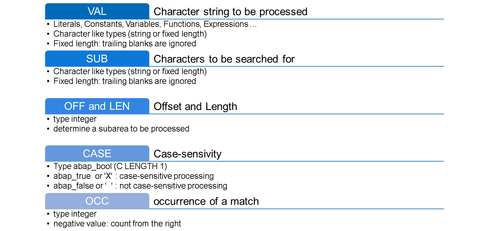
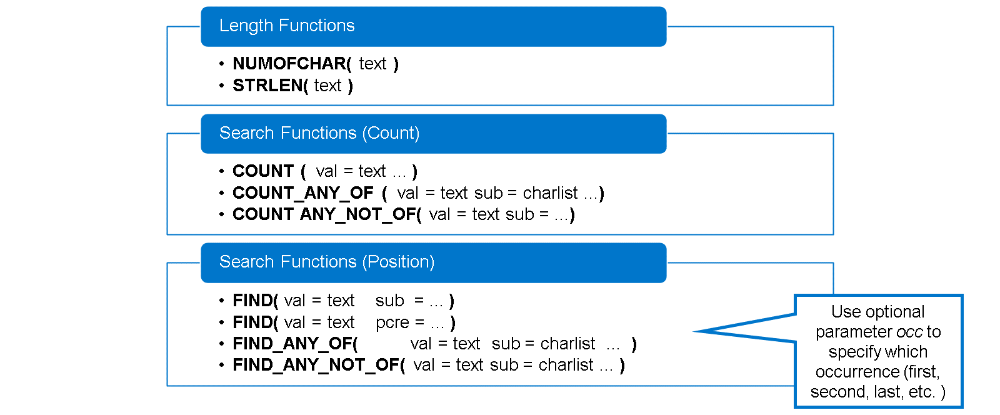
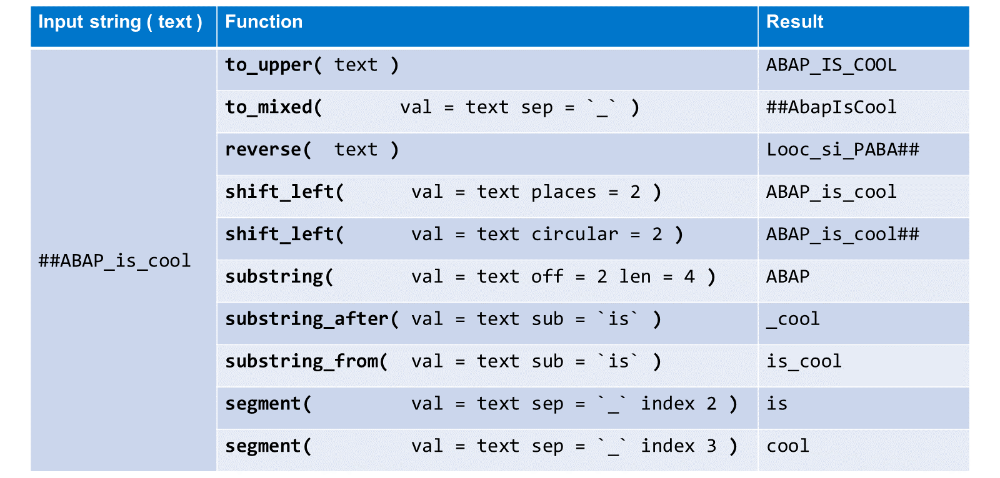
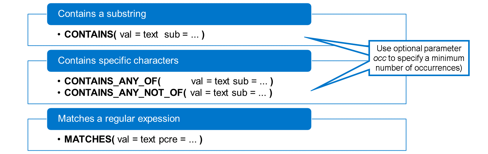
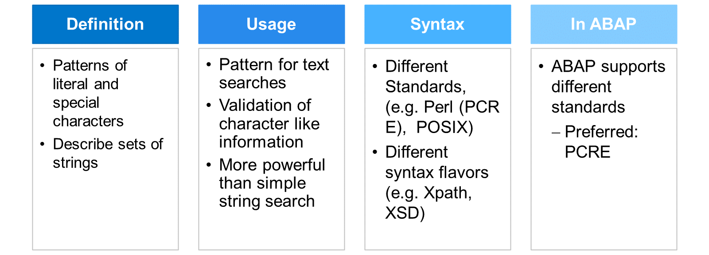
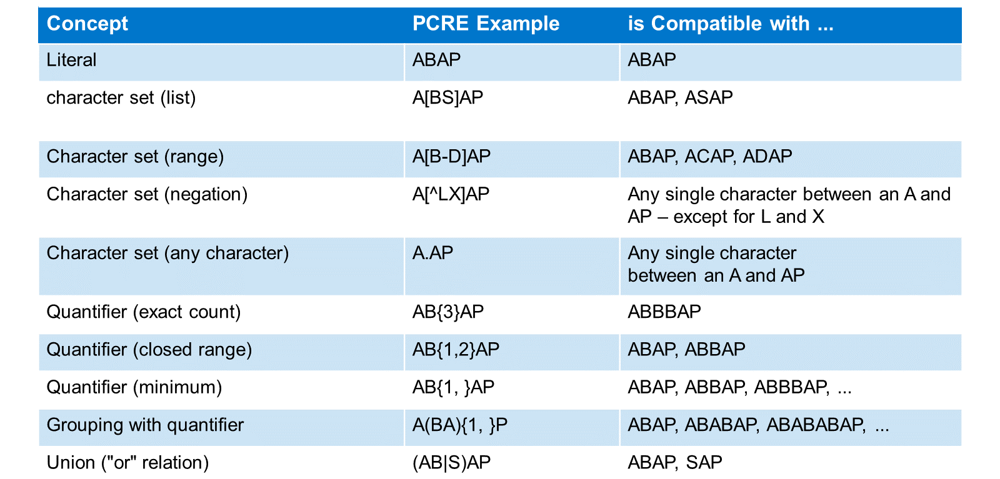
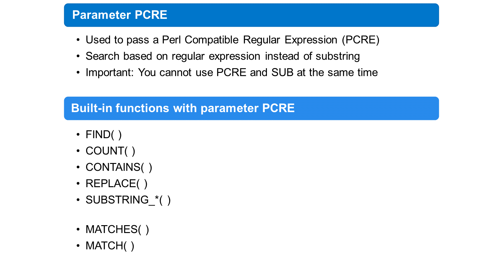

# 🌸 2 [PROCESSING STRINGS USING FUNCTIONS AND REGEX](https://learning.sap.com/learning-journeys/acquire-core-abap-skills/using-translatable-text-in-abap_c1dbd8fe-2280-48df-878d-d407fca9aed8)

> 🌺 Objectifs
>
> - [ ] Décrire les fonctions de chaîne intégrées à ABAP
>
> - [ ] Utiliser les fonctions de chaîne intégrées à ABAP
>
> - [ ] Expliquer l'utilisation des expressions régulières en ABAP

## 🌸 BUILT-IN STRING FUNCTIONS

Outre la concaténation de chaînes avec l'opérateur && et le formatage avec des modèles de chaînes, ABAP offre une grande variété de fonctions de chaînes intégrées. Selon le type de résultat, on distingue trois catégories de fonctions de chaînes :

[Référence - Link Vidéo](https://learning.sap.com/learning-journeys/acquire-core-abap-skills/processing-strings-using-functions-and-regular-expressions_abe828f3-4e84-45ce-9c39-0cf9eb2a9f2f)

> #### 🍧 Note
>
> Si l'entrée d'une fonction de chaîne intégrée comporte plusieurs paramètres, le nom du paramètre d'entrée principal est toujours val.

## 🌸 PARAMETERS OF STRING FUNCTIONS

Pour certaines fonctions de chaîne intégrées, l'entrée se compose d'un seul objet de données de type char. Ces fonctions n'utilisent pas de paramètres d'entrée. L'entrée est spécifiée directement entre parenthèses. La fonction NUMOFCHAR( ) est un bon exemple de ce type de fonction.

Les fonctions avec plusieurs entrées utilisent des paramètres portant des noms, et l'entrée est affectée à ces paramètres. De nombreux paramètres sont communs aux différentes fonctions de chaîne intégrées. Les paramètres les plus importants sont les suivants :

#### 💮 **VAL** :

Vous transmettez la chaîne de texte à traiter par la fonction au paramètre val. Vous pouvez également spécifier des appels de méthodes fonctionnelles, des expressions de table et des expressions de constructeur dont la valeur de retour est convertible en type chaîne. Seuls les types de données élémentaires peuvent être traités. Si un objet de données de type caractère de longueur fixe est spécifié, les espaces de fin sont ignorés. Les valeurs de retour non-caractères sont converties en type chaîne.

#### 💮 **SUB** :

Le paramètre sub permet de transmettre une chaîne de caractères dont les caractères doivent être recherchés ou insérés. Seuls les arguments de type élémentaire peuvent être spécifiés. Si un objet de données de type caractère de longueur fixe est spécifié, les espaces de fin sont ignorés.

#### 💮 **CASE** :

Par défaut, les recherches et les comparaisons dans les fonctions de chaîne sont sensibles à la casse. Cependant, cette valeur peut être remplacée si nécessaire par le paramètre case. Ce paramètre requiert la saisie d'un type abap_bool (C LENGTH 1) avec la valeur des constantes abap_true ('X') ou abap_false (' '). Si case contient la valeur abap_true, la recherche est sensible à la casse ; si elle contient la valeur abap_false, elle ne l'est pas.

#### 💮 **OCC** :

Dans les fonctions de chaîne où des recherches sont effectuées, le paramètre occ spécifie l'occurrence d'une correspondance. Si occ est positif, les occurrences sont comptées à partir de la gauche ; si occ est négatif, elles sont comptées à partir de la droite. Les valeurs 1, 2, .... indiquent la première, la deuxième, .... occurrences. Les valeurs -1, -2, .... indiquent la dernière, l'avant-dernière, .... occurrences. La valeur par défaut de occ est 1.

> #### 🍧 Note
>
> Sauf dans le cas de la fonction de remplacement replace, la valeur 0 génère l'exception CX_SY_STRG_PAR_VAL. Si replace est utilisé, la valeur 0 remplace toutes les occurrences.

#### 💮 **OFF and LEN** :

Le paramètre off permet de transmettre un décalage et le paramètre len une longueur. Dans les fonctions où off et len peuvent être transmis, ils déterminent la sous-zone dans laquelle une chaîne doit être traitée.

La valeur par défaut de off est généralement 0 et celle de len correspond à la longueur de la chaîne complète après le décalage.

> #### 🍧 Note
>
> Des combinaisons de valeurs inappropriées peuvent entraîner l'exception CX_SY_RANGE_OUT_OF_BOUNDS.

Examinons quelques exemples pour comprendre l'impact de ces paramètres :

[Référence - Link Vidéo](https://learning.sap.com/learning-journeys/acquire-core-abap-skills/processing-strings-using-functions-and-regular-expressions_abe828f3-4e84-45ce-9c39-0cf9eb2a9f2f)

## 🌸 DESCRIPTIONS FUNCTIONS

#### 💮 **Length functions** :

Les fonctions de longueur `NUMOFCHAR( )` et `STRLEN( )` constituent un groupe important de fonctions de description de chaînes de caractères. La plupart du temps, ces deux fonctions renvoient le même résultat. Il existe toutefois une exception : si l'argument est de type chaîne et contient un ou plusieurs espaces à la fin, le résultat de `STRLEN( )` inclut ces espaces, tandis que `NUMOFCHAR( )` les ignore. Pour les arguments de longueur fixe, par exemple de TYPE C ou N, les deux fonctions ignorent les espaces à la fin.

#### 💮 **Groups of search functions** :

Il existe deux groupes de fonctions de recherche de chaînes de caractères :

La fonction `COUNT( )` et les fonctions commençant par `COUNT_...( )` renvoient le nombre total d'occurrences d'un argument de recherche. La fonction `FIND( )` et les fonctions commençant par `FIND_( )` renvoient la position (décalage) d'une occurrence particulière d'un argument de recherche.

#### 💮 **Parameter sub in search functions** :

Les fonctions `COUNT( )` et `FIND( )` permettent de rechercher une sous-chaîne (paramètre optionnel sub) ou une expression régulière (paramètre optionnel pcre). Nous aborderons les expressions régulières plus loin dans ce cours.

Dans le cas des fonctions se terminant par `_ANY_OF`, le nom du paramètre sub est quelque peu trompeur. Ici, la valeur du paramètre sub n'est pas une sous-chaîne, mais une liste de caractères. Au lieu de rechercher la sous-chaîne, c'est-à-dire la combinaison exacte de caractères, ces fonctions évaluent les caractères individuellement et considèrent chaque caractère comme une correspondance faisant partie de la liste fournie. Les fonctions se terminant par `_ANY_NOT_OF` fonctionnent de manière similaire, mais ici, seuls les caractères différents de tous les caractères de la liste sont considérés comme une correspondance.

> #### 🍧 Note
>
> Comme pour la fonction FIND( ), vous pouvez utiliser le paramètre facultatif occ pour spécifier la découverte de sub à prendre en compte.

Consultez quelques exemples de fonctions de description.

[Référence - Link Vidéo](https://learning.sap.com/learning-journeys/acquire-core-abap-skills/processing-strings-using-functions-and-regular-expressions_abe828f3-4e84-45ce-9c39-0cf9eb2a9f2f)

## 🌸 PROCESSING FUNCTIONS

> #### 🍧 hINT
>
> Un bon cas d'utilisation de SEGMENT( ) est l'importation et le traitement de données au format CSV (valeurs séparées par colonnes).

Examinons quelques exemples pour illustrer le résultat de certaines fonctions de traitement de chaînes :

- Dans cet exemple, la chaîne d'entrée contient un mélange de lettres majuscules et minuscules. La fonction `TO_UPPER( )` les transforme toutes en majuscules.

- La fonction `TO_MIXED( )` traduit la chaîne en un mélange de lettres majuscules et minuscules. Elle recherche une chaîne de séparation, la supprime et transforme le premier caractère après le séparateur en majuscule. Tous les autres caractères sont convertis en minuscules. Notez que le paramètre sep est facultatif et que le trait de soulignement `_` est sa valeur par défaut.

- La fonction `REVERSE( )` renvoie les caractères dans l'ordre inverse.

- Le premier exemple de la fonction `SHIFT_LEFT( )` spécifie 2 positions pour le paramètre. Par conséquent, les deux premiers caractères (##) sont supprimés du résultat.

- Le deuxième exemple de la fonction `SHIFT_LEFT( )` spécifie 2 positions pour le paramètre. Par conséquent, les deux premiers caractères ne sont pas supprimés, mais déplacés à la fin.

- L'exemple de la fonction `SUBSTRING( )` extrait une sous-chaîne de longueur 4, commençant par un décalage de 2 caractères, ce qui signifie qu'elle renvoie les caractères aux positions 3, 4, 5 et 6.

- La fonction `SUBSTRING_AFTER( )` recherche la sous-chaîne « is » et renvoie tous les caractères après cette recherche.

- La fonction `SUBSTRING_FROM( )` effectue la même opération, mais le résultat contient également la sous-chaîne « is ».

- Le premier exemple de la fonction `SEGMENT( )` recherche toutes les occurrences de la chaîne de séparation, un trait de soulignement unique. Elle en trouve deux et divise la chaîne d'entrée en trois segments. Elle renvoie ensuite le deuxième segment.

- Le deuxième exemple effectue la même opération, mais renvoie le troisième segment. Notez que la chaîne de séparation elle-même ne fait pas partie du résultat.

## 🌸 PREDICATE FUNCTIONS

La fonction de prédicat `CONTAINS( )` est vraie si une sous-chaîne spécifiée apparaît au moins une fois dans la chaîne d'entrée. Autrement dit, si `CONTAINS( )` est vraie, la fonction `FIND( )` renvoie un résultat supérieur à 0.

La même relation existe entre les fonctions de prédicat `CONTAINS_ANY_OF( )` et `CONTAINS_ANY_NOT_OF( )`, et les fonctions de description correspondantes `FIND_ANY_OF` et `FIND_ANY_NOT_OF( )`.

`MATCHES( )` est une fonction de prédicat dédiée permettant de comparer la chaîne d'entrée complète à une expression régulière. Nous aborderons les expressions régulières dans la section suivante.

## 🌸 REGEX IN ABAP

Une expression régulière, ou Regex en abrégé, est un ensemble de caractères littéraux et spéciaux décrivant un ensemble de chaînes de caractères. Les expressions régulières sont souvent utilisées dans les recherches de texte, les opérations de recherche-remplacement ou pour valider le contenu de champs de type caractère. Une recherche utilisant une expression régulière est plus performante qu'une recherche sur une simple chaîne de caractères, car elle représente un nombre plus important (potentiellement infini) de chaînes de caractères et les recherche simultanément.

La syntaxe des expressions régulières est largement standardisée, mais il existe des différences entre les normes courantes telles que Perl ou POSIX et les différentes syntaxes telles que les expressions régulières XPath ou XSD.

En ABAP, la norme privilégiée est l'expression régulière compatible Perl (PCRE), mais ABAP prend également en charge d'autres normes et syntaxes.

> #### 🍧 Note
>
> Les exemples de ce cours suivent la norme PCRE. Pour les autres normes et syntaxes, consultez la documentation des mots-clés ABAP.

### EXAMPLE OF REGEX

Examinons quelques exemples d'expressions régulières :

- L'expression régulière la plus simple est un littéral.

- L'utilisation de crochets ([ ]) permet de spécifier un ensemble de caractères autorisés à une position donnée. Le premier exemple spécifie un jeu de caractères composé des deux caractères B et S. Par conséquent, la lettre B ou S est autorisée entre les deux lettres A.

- L'exemple suivant utilise un trait d'union (-) pour spécifier une plage de caractères autorisés. B-D définit un jeu de caractères incluant B, D et tous les caractères intermédiaires, dans un ordre lexical. Bien entendu, vous pouvez combiner des valeurs individuelles et plusieurs plages. [AL-NRX-Z], par exemple, définit un jeu de caractères composé des lettres A, L, M, N, R, X, Y et Z.

- L'exemple suivant utilise un signe ^ après le crochet ouvrant pour définir une liste d'exclusion plutôt qu'une liste positive. [^LX] exclut les caractères L et X, mais autorise tous les autres caractères.

- Pour spécifier un jeu de caractères incluant tous les caractères disponibles et n'en excluant aucun, les expressions régulières utilisent un seul point (.). Dans l'exemple, n'importe quel caractère est autorisé entre les deux A, mais ce caractère est obligatoire et un seul de ces caractères est autorisé.

- Pour plus de flexibilité, vous pouvez introduire des quantificateurs. Un quantificateur est une paire d'accolades ( {} ). Il indique la fréquence de répétition de l'élément à sa gauche. Dans l'exemple, le 3 dans le quantificateur signifie qu'exactement trois lettres B sont requises entre les deux A.

- Au lieu d'une valeur fixe, un quantificateur peut spécifier une valeur inférieure et une valeur supérieure pour la répétition. Dans l'exemple, au moins un B est requis entre les deux A, mais deux B sont également autorisés.

- L'omission de la valeur supérieure ne définit qu'un minimum. Dans l'exemple, il peut y avoir n'importe quel nombre de lettres B entre les deux A, mais il doit y en avoir au moins une.

- Avec des parenthèses ordinaires ( ), vous regroupez plusieurs éléments. Un bon cas d'utilisation est un groupe à gauche d'un quantificateur. Au lieu d'un seul caractère, le groupe entier est répété en fonction des nombres du quantificateur. Dans l'exemple, le groupe BA est répété entre les lettres A et P.

- Enfin, examinons l'opérateur d'union |. En dehors d'un groupe, il combine deux motifs et leur résultat. Dans l'exemple, nous utilisons l'opérateur d'union à l'intérieur d'un groupe. À gauche du littéral de fermeture AP, deux motifs sont autorisés : soit le littéral AB, soit la lettre S.

> #### 🍧 Note
>
> Ces exemples sont assez simples et visent à illustrer quelques concepts de base. De nombreux autres concepts existent et, en les combinant, vous pouvez créer des expressions extrêmement puissantes. Pour une vue d'ensemble, consultez la documentation ABAP, qui vous permettra d'accéder à d'autres sources d'information.

### BUILT-IN STRING FUNCTIONS AND REGEX

De nombreuses fonctions de chaîne intégrées proposent un paramètre pcre, notamment pour les recherches. Pcre est souvent une alternative au paramètre sub. Lorsque vous passez une séquence de caractères au paramètre pcre, au lieu du paramètre sub, la fonction interprète l'entrée comme une expression régulière compatible Perl (PCRE) et recherche les sous-chaînes correspondant à ce modèle. Si une fonction possède les deux paramètres sub et pcre, vous ne pouvez en fournir qu'un seul.

> #### 🍧 Note
>
> Dans la documentation ABAP, vous trouverez d'autres paramètres pour les expressions régulières. L'un d'eux, le paramètre regex, était utilisé pour les expressions régulières POSIX. Il est obsolète et ne doit pas être utilisé.

Des fonctions comme `FIND( )` et `COUNT( )` effectuent évidemment des recherches de sous-chaînes. Mais d'autres fonctions effectuent également des recherches. Par exemple, la fonction de prédicat `CONTAINS( )` et les fonctions de traitement `REPLACE( )`, `SUBSTRING_FROM( )`, `SUBSTRING_AFTER( )`, etc.

Il existe également des fonctions de chaîne intégrées qui ne fonctionnent qu'avec les expressions régulières. La fonction de prédicat `MATCHES( )` est vraie si la chaîne de caractères complète correspond à l'expression régulière. `MATCH( )` fonctionne de manière similaire à `FIND( )`. Elle recherche dans une chaîne de caractères une sous-chaîne correspondant à l'expression régulière. Cependant, là où `FIND( )` renvoie l'offset de la recherche, `MATCH( )` renvoie la sous-chaîne trouvée.

Cette vidéo illustre quelques exemples avec le paramètre PCRE.

[Référence - Link Vidéo](https://learning.sap.com/learning-journeys/acquire-core-abap-skills/processing-strings-using-functions-and-regular-expressions_abe828f3-4e84-45ce-9c39-0cf9eb2a9f2f)

> #### 🍧 Note
>
> La fonction matches( ) est un outil précis et élégant lorsque vous devez implémenter des validations complexes pour des champs de saisie de type caractère.
