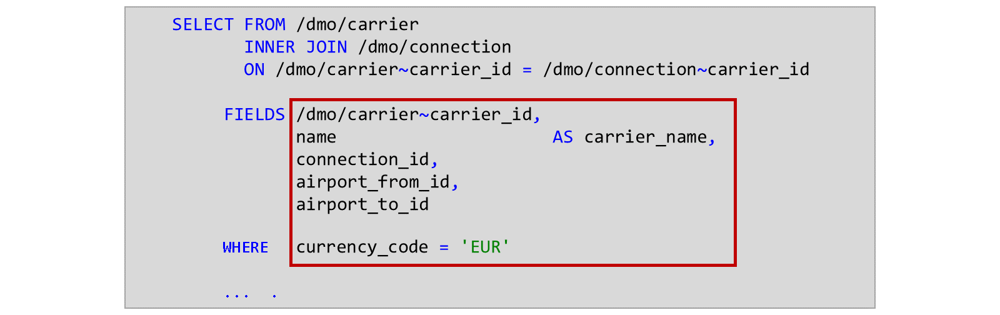
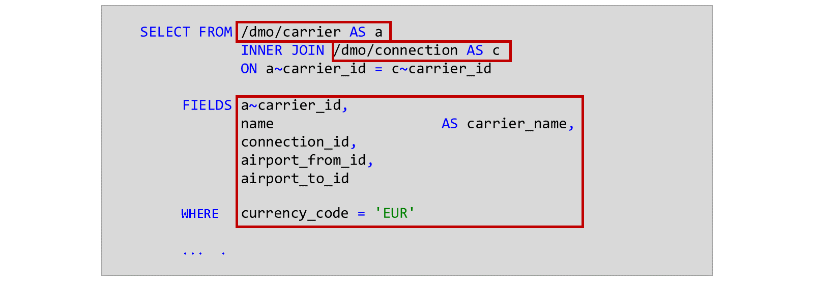
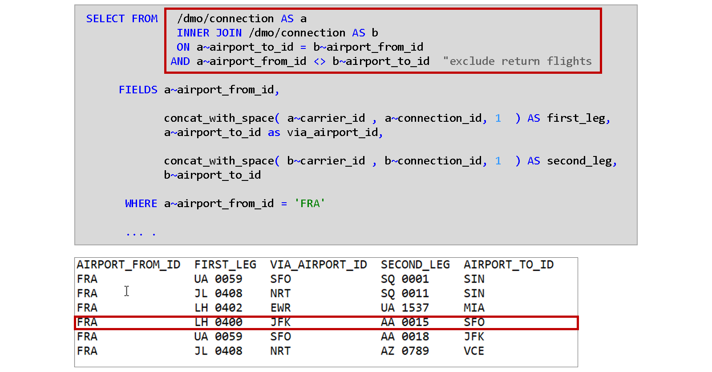
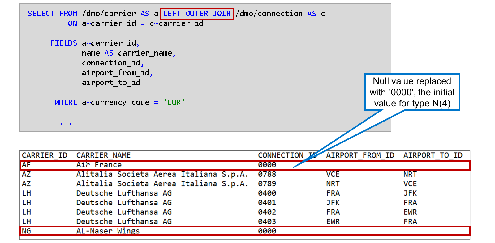
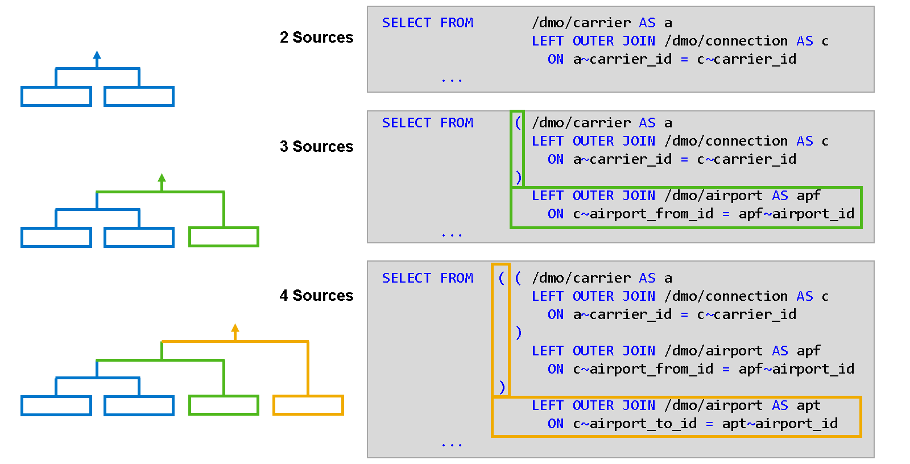
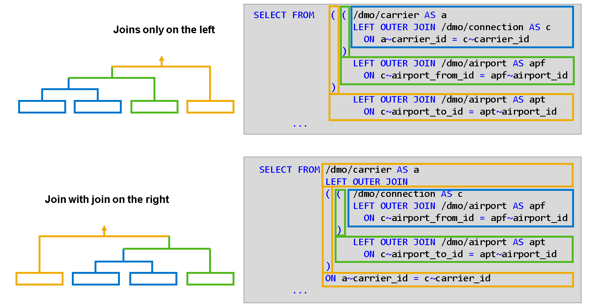
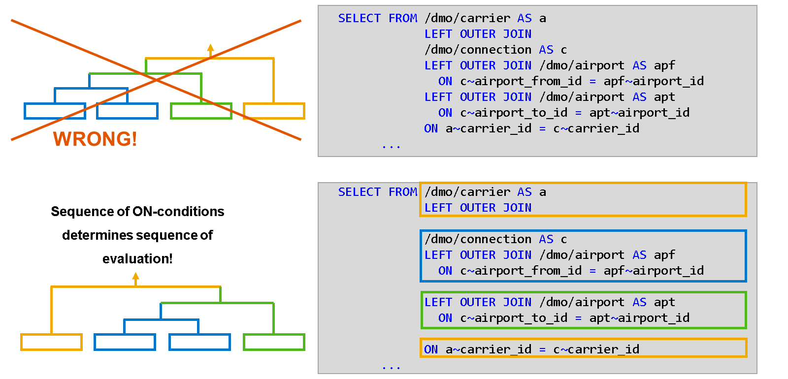

# 🌸 1 [IMPLEMENTING JOINS](https://learning.sap.com/learning-journeys/acquire-core-abap-skills/implementing-joins_a053e03d-f11e-4bee-8f63-5129b0590029)

> 🌺 Objectifs
>
> - [ ] Implémenter des jointures
>
> - [ ] Différenciation entre jointures internes et jointures externes
>
> - [ ] Implémenter des jointures imbriquées

## 🌸 THE BASICS AND SYNTAX OF JOINS

### DEFINITION OF A JOIN

Il est parfois nécessaire de combiner deux sources de données SQL en un seul jeu de résultats, composé de colonnes des deux sources. C'est ce qu'on appelle une jointure.

Par exemple, lors de la lecture des correspondances aériennes, il peut être nécessaire de consulter les informations sur la compagnie aérienne, comme son nom.

Les lignes du jeu de résultats sont déterminées par le type de jointure et les conditions de jointure entre les colonnes des sources de données. Les conditions de jointure commencent par le mot-clé ON et définissent les relations entre les colonnes des sources de données.

Le type de jointure est défini par le mot-clé correspondant. En ABAP SQL, les types de jointure pris en charge sont `INNER JOIN`, `LEFT OUTER JOIN` et `RIGHT OUTER JOIN`.

Nous aborderons prochainement les différents résultats de ces types de jointure. Mais examinons d'abord la syntaxe des jointures en ABAP SQL.

Cet exemple combine les données du transporteur (identifiant et nom du transporteur) et les données de connexion (identifiant de connexion, aéroport de départ et aéroport de destination) dans un seul ensemble de résultats. La source de données de gauche est la table de base de données `/DMO/CARRIER`, tandis que la table de base de données `/DMO/CONNECTION` sert de source de données de droite. Le mot clé INNER JOIN entre les deux noms de sources de données spécifie le type de jointure.

La condition de jointure après la requête ON exige que le contenu du champ CARRIER_ID de la table de base de données `/DMO/CARRIER` soit égal au contenu du champ `CARRIER_ID` de la table de base de données `/DMO/CONNECTION`.

Dans les conditions de jointure, ainsi que dans la liste des champs, la clause WHERE, etc., les colonnes des sources de données sont entièrement identifiées par le nom de la source de données et le nom de la colonne, séparés par le signe tilde `~`.

> #### 🍧 Note
>
> Vous connaissez peut-être le point ou le point (.) dans d'autres langages SQL. Ce signe a dû être remplacé par un autre dans ABAP SQL, car le point a déjà pour fonction de terminer l'instruction.

Il est possible d'accéder aux noms de colonnes sans le nom de la source de données. La condition préalable est que le nom de colonne n'existe que dans l'une des sources de données et que l'autre source de données ne contienne pas de colonne du même nom.

Dans l'exemple, seule la table de base de données `/DMO/CARRIER` contient les colonnes `NAME` et `CURRENCY_CODE`, tandis que les colonnes `CONNECTION_ID`, `AIRPORT_FROM_ID` et `AIRPORT_TO_ID` n'existent que dans la table de base de données `/DMO/CONNECTION`. Par conséquent, ces noms de colonnes sont uniques et ne doivent pas être précédés de `/DMO/CARRIER~` ou `/DMO/CONNECTION~`.

En revanche, les deux tables contiennent une colonne `CARRIER_ID`. Par conséquent, pour ce champ, `/DMO/CARRIER~` ou `/DMO/CONNECTION~` est obligatoire.

Il est recommandé d'utiliser des alias pour les noms des sources de données afin de raccourcir l'instruction et d'améliorer la lisibilité. Pour ce faire, ajoutez AS après le nom de la source de données. Dans l'exemple, l'alias `A` est utilisé pour la table de base de données `/DMO/CARRIER` et l'alias `C` pour la table de base de données `/DMO/CONNECTION`.

Si une source de données possède un alias, il est obligatoire d'utiliser cet alias à la place du nom de la source de données d'origine.

### REQUIRED ALIASES IN SELF-JOINS

Dans certaines situations, les alias de sources de données sont bien plus qu'une simple alternative syntaxique. Ils deviennent indispensables dans les instructions contenant plusieurs fois la même source de données.

Prenons un exemple. Prenons une table avec des correspondances aériennes (`DMO/CONNEXION`). Nous recherchons des destinations accessibles depuis l'aéroport international de `Francfort` (FRA). Cependant, au lieu de vols directs, nous recherchons des vols avec une correspondance.

La solution consiste à joindre la table `/DMO/CONNEXION` avec elle-même. La première condition de jointure exige que la deuxième correspondance (2e étape) parte de l'aéroport où se termine la première correspondance (1re étape). La deuxième condition de jointure, liée à la première par l'opérateur `AND`, exclut les combinaisons où la deuxième correspondance est un vol aller-retour direct vers l'aéroport de départ initial.

La ligne en surbrillance dans le résultat correspond à une correspondance avec le vol `LH 400` de `Francfort` (FRA) à `New York` (JFK), puis avec le vol `AA 0015` à `San Francisco` (SFO).

Il est assez évident qu'une telle **auto-jointure** ne fonctionnerait pas sans les noms d'alias a pour l'utilisation à gauche de `DMO/CONNECTION` et `b` pour l'utilisation à droite de `/DMO/CONNECTION`. Sans les différents alias, il ne serait pas possible de faire la distinction entre la première connexion et la deuxième connexion - ni dans la condition de jointure ni dans la liste de champs ou la clause `WHERE`.

> #### 🍧 Note
>
> Dans ce type d'auto-jointure, le nom d'alias est obligatoire devant chaque nom de colonne, car chaque nom de colonne existe dans les deux sources de données.

## 🌸 JOIN TYPES

Regardez les vidéos suivantes pour en savoir plus sur Inner Join, Right Outer Join et Left Outer Join.

[Référence - Link Vidéo](https://learning.sap.com/learning-journeys/acquire-core-abap-skills/implementing-joins_a053e03d-f11e-4bee-8f63-5129b0590029)

Cet exemple illustre le résultat d'une jointure externe gauche. Les deux lignes mises en évidence dans le jeu de résultats ne figureraient pas dans une jointure interne. Elles correspondent aux transporteurs qui n'ont pas de correspondances aériennes dans la table de base de données `/DMO/CONNECTION`.

Ces lignes contiennent uniquement des informations sur le transporteur, c'est-à-dire des informations provenant de la source de données de gauche, la table `/DMO/CARRIER`. Les colonnes qui contiennent habituellement des informations provenant de la source de données de droite, à savoir les colonnes `CONNECTION_ID`, `AIRPORT_FROM_ID` et `AIRPORT_TO_ID`, sont renseignées avec des valeurs initiales. Ces valeurs ont été saisies par l'environnement d'exécution ABAP au lieu des valeurs nulles renvoyées par la base de données.

> #### 🍧 Note
>
> Le type de la colonne CONNECTION_ID est basé sur le type N intégré d'ABAP. La valeur initiale de ce type n'est pas une série de blancs, mais une série de zéros.

## 🌸 NESTED JOINS

### JOIN OF MULTIPLE DATA SOURCES

En ABAP SQL, vous pouvez joindre plusieurs sources de données simultanément. Commençons par la jointure de deux sources de données, à savoir la jointure des transporteurs aériens et des correspondances aériennes, dont nous avons parlé précédemment.

Imaginons maintenant que nous souhaitons ajouter la table de base de données `/DMO/AIRPORT` pour lire le nom et la ville de l'aéroport de départ (`AIRPORT_FROM_ID`).

Pour joindre les trois sources de données, nous entourons d'abord la jointure existante de crochets. Cette première jointure sert désormais de source de données gauche pour la jointure suivante. Nous ajoutons le mot-clé de jointure (`INNER JOIN`, `LEFT OUTER JOIN`, `RIGHT OUTER JOIN`), la source de données droite (`/DMO/AIRPORT`), un alias (`AS apf`) et la condition de jointure pour la jointure supplémentaire (`ON c~airport_from_id = apf~airport_id`).

Imaginons maintenant que nous souhaitons ajouter à nouveau la table de base de données `/DMO/AIRPORT` pour lire également le nom et la ville de l'aéroport de destination (`AIRPORT_TO_ID`).

Pour implémenter cette jointure de quatre sources de données, nous répétons ce que nous avons fait pour la jointure de trois sources de données : nous entourons la jointure existante de trois sources de données avec une autre paire de crochets et ajoutons le mot-clé join, la bonne source de données et la condition de jointure.

> #### 🍧 Note
>
> Vous pouvez répéter cette opération jusqu'à atteindre le nombre maximal de sources de données pouvant être liées entre elles. Actuellement, jusqu'à 50 sources de données (49 jointures) sont autorisées dans une instruction SELECT.

### SEQUENCE OF JOINS

Dans l'exemple précédent, la source de données suivante était toujours ajoutée à droite de la jointure suivante. La source de données de gauche était soit une table de base de données, soit une jointure. La source de données de droite des trois jointures était une table de base de données.

Grâce aux crochets, il est également possible d'utiliser une jointure comme source de données droite d'une autre jointure. Dans l'exemple ci-dessous, nous commençons par une jointure de `/DMO/CONNECTION` et `/DMO/AIRPORT` (`AS apf`). Nous l'entourons de crochets et l'utilisons comme source de données gauche d'une jointure avec `/DMO/AIRPORT` (`AS apt`). Pour ajouter `/DMO/AIRLINE`, nous entourons la jointure existante d'une autre paire de crochets. Nous ajoutons ensuite la source de données gauche (`/DMO/CARRIER`) et le mot-clé join avant le crochet ouvrant, et la condition `ON` après le crochet fermant.

> #### 🍧 Note
>
> Dans notre exemple, les deux résultats sont identiques. Cependant, il existe des situations où le résultat peut dépendre de l'ordre dans lequel la base de données évalue les jointures.

### THE IMPORTANCE OF BRACKETS

D'un point de vue syntaxique, les crochets ne sont pas nécessaires. Cependant, pour des raisons de lisibilité, il est fortement recommandé de ne pas les omettre dans les jointures imbriquées. L'exemple suivant illustre ce point.

L'instruction `SELECT` contient une jointure de quatre tables de base de données, mais n'utilise pas de crochets. À première vue, on pourrait penser que la jointure de `/DMO/CARRIER` et `/DMO/CONNECTION` est évaluée en premier, car ces tables sont les premières à apparaître dans la clause FROM.

Mais cette conclusion est erronée !

Sans crochets, la séquence d'évaluation est déterminée par la séquence des conditions `ON` et non par la séquence des sources de données. En y regardant de plus près, on constate que la condition `ON` qui relie les tables `/DMO/CARRIER` (`alias a`) et `/DMO/CONNECTION` (`alias c`) est placée à la toute fin de la clause `FROM`. Cette jointure est donc la dernière à être évaluée.

> #### 🍧 Hint
>
> Utilisez toujours des crochets dans les jointures imbriquées pour éviter ce type de confusion.
